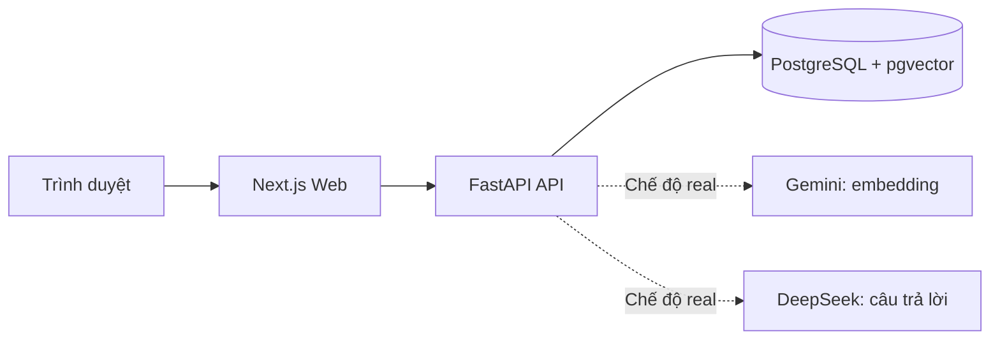

# InsightHub - SDLC with AI

**Starter cho ứng dụng khai thác tài liệu bằng AI, phục vụ thực hành phát triển phần mềm xuyên suốt SDLC.**

InsightHub cung cấp luồng tải tài liệu, tìm kiếm theo ngữ nghĩa và hỏi đáp có nguồn trích dẫn bằng Retrieval-Augmented Generation (RAG). Từ nền này, học viên phát triển sản phẩm cá nhân qua các giai đoạn phân tích yêu cầu, thiết kế, lập trình, kiểm thử, phát hành và bảo trì trong chương trình **B2B C07 - SDLC with AI**.

**Runtime nền:** `v1.0.0-rc.3` · **Requirements:** `1.0`, revision hướng dẫn 26/09/2026 · **Chủ dự án:** Đinh Xuân Công

[Hướng dẫn cài đặt](GETTING_STARTED.md) · [Yêu cầu bài tập](docs/learner_v1.0_20260923/01_Requirements_InsightHub.md) · [Kiến trúc](docs/Architecture_Starter_v1.md) · [API](docs/API_Contract_Starter_v1.md)

## Chức năng và phạm vi

### Chức năng có sẵn

- **Quản lý tài liệu:** tải tệp TXT, Markdown và PDF; xem trạng thái xử lý, nội dung nguồn, lịch sử thử lại và xóa tài liệu.
- **Xử lý và lập chỉ mục:** trích xuất văn bản, chia đoạn, tạo embedding và lưu vào PostgreSQL/pgvector; giữ tệp gốc, vị trí nguồn và mã băm SHA-256.
- **Hỏi đáp có căn cứ:** truy xuất trong tập tài liệu được chọn, tạo câu trả lời kèm trích dẫn và trả trạng thái `NoEvidence` khi không đủ căn cứ.
- **Kiểm soát tác vụ:** idempotency cho upload, retry, delete và chat; giới hạn thời gian xử lý; đối soát kết quả khi trình duyệt mất phản hồi.
- **Vận hành và kiểm chứng:** health check, readiness, log theo request, metrics, migration, bộ kiểm thử, công cụ đánh giá AI và diễn tập sao lưu/khôi phục.

### Phần học viên phát triển

| Nhóm chức năng | Kết quả cần xây dựng |
| --- | --- |
| Auth và Account | Đăng ký, xác minh email, đăng nhập mật khẩu/Google, liên kết danh tính, quản lý session, recovery, đổi mật khẩu và profile. |
| Transactional Email | Tích hợp đủ năm email: xác minh, reset mật khẩu, thông báo liên kết Google, hướng dẫn tài khoản Google và thông báo thay đổi mật khẩu. |
| Notebook | Tạo, liệt kê, mở, cập nhật và xóa; áp dụng ownership, giới hạn, pagination và version conflict. |
| Document | Tích hợp upload, trạng thái, retry, citation và xóa của Starter với Notebook, quyền và vòng đời dữ liệu. |
| Chat và Conversation | Hỏi đáp theo nguồn được phép; quản lý conversation và giữ lịch sử độc lập với operation TTL. |
| Note | Tạo, xem, sửa, xóa; lưu câu trả lời hoặc Summary thành bản sao độc lập có provenance. |
| Summary | Chọn nguồn/độ dài, tạo nội dung có căn cứ, lưu và mở lại, chuyển thành Note. |
| Quiz | Tạo đề, làm/nộp bài, chấm tại server, bảo vệ đáp án và lưu lịch sử lần làm. |
| AI Job và Output | Theo dõi tác vụ, xem/lọc/rename/regenerate/delete kết quả; kiểm quota, idempotency, deadline và nguồn bị xóa. |

Hai AI Tools bắt buộc là **Summary (Tóm tắt) và Quiz**, cùng các chức năng dùng chung trong bảng trên. Mindmap, Slide và Báo cáo chỉ được triển khai ở giai đoạn mở rộng cuối khi mentor cho phép. Học viên còn thực hiện UI/UX, test, release local/sandbox và một thay đổi sau phát hành; phạm vi có 151 AC áp dụng trong [bảng truy vết](docs/learner_v1.0_20260923/01_Requirements_InsightHub.md#pham-vi-truy-vet).

[Requirements](docs/learner_v1.0_20260923/01_Requirements_InsightHub.md) là tài liệu giao việc chính, gồm chức năng, 29 công việc, mười milestone, dữ liệu/API, rubric và evidence. [Ma trận tiến độ sản phẩm](docs/learner_v1.0_20260923/01_Requirements_InsightHub.md#ma-tran-chuc-nang) chỉ rõ mức hoàn thành từng nhóm: M3.1 chạy hành trình Auth - Notebook - Document - Chat; M3 hoàn thiện phạm vi; M4 kiểm tổng hợp; M5 phát hành R1 rồi thực hiện thay đổi R1.1. Mỗi milestone nối kết quả sản phẩm với cách áp dụng SDLC và AI.

Công ty cấp tài khoản Claude cho học viên làm công cụ phát triển chính. ChatGPT là lựa chọn bổ sung nếu học viên có tài khoản; mỗi người tự phân tích, kiểm chứng và giải thích quyết định.

Starter hiện dành cho môi trường phát triển local, chưa có xác thực và phân quyền đa người dùng. Cần hoàn thiện các phần này trước khi triển khai cho nhiều người dùng.

## Bắt đầu nhanh

### 1. Chuẩn bị môi trường

| Thành phần | Yêu cầu |
| --- | --- |
| Git | Tải mã nguồn và quản lý lịch sử thay đổi. |
| Docker Desktop | Có Docker Compose v2; đang chạy trước khi khởi động ứng dụng. |
| Tài nguyên | Khoảng 2 GiB RAM trống trở lên; cổng `3107` và `8107` chưa được sử dụng. |
| Kết nối mạng | Cần cho lần tải image và cài dependency đầu tiên. Luồng AI ở chế độ fixture không gọi dịch vụ bên ngoài. |
| Công cụ kiểm tra | Python 3.11+ và Make để chạy script/kiểm thử; Node.js 24.20.0 khi chạy browser E2E trên máy. |

Chạy ứng dụng bằng Docker không yêu cầu cài riêng Python hoặc Node.js trên máy.

### 2. Tải mã nguồn

Để xem và chạy Starter, clone repository bằng tài khoản đã được cấp quyền:

```sh
git clone https://github.com/congdinh2008/insighthub-sdlc-ai.git
cd insighthub-sdlc-ai
```

**Khi làm bài tập:** fork repository trước, sau đó clone fork cá nhân thay cho repository gốc. Giữ lịch sử Git và cấu hình remote `upstream` theo [hướng dẫn khởi tạo bài làm](GETTING_STARTED.md#fork-starter-và-khởi-tạo-bài-làm).

### 3. Cấu hình và khởi động

Tạo `.env` từ file mẫu ở lần chạy đầu. Nếu đã có `.env`, chỉnh file hiện tại và giữ các giá trị cần dùng.

```sh
cp .env.example .env
docker compose --env-file .env -p insighthub-c07-starter up --build -d --wait
```

Mặc định `RAG_MODE=fixture`: không cần API key, dùng dữ liệu và phản hồi kiểm thử để xác nhận luồng ứng dụng.

| Địa chỉ | Mục đích |
| --- | --- |
| [localhost:3107](http://localhost:3107) | Giao diện ứng dụng. |
| [localhost:8107/docs](http://localhost:8107/docs) | Tài liệu API tương tác. |
| [localhost:8107/readyz](http://localhost:8107/readyz) | Kiểm tra API và các điều kiện sẵn sàng. |
| [localhost:8107/system/profile](http://localhost:8107/system/profile) | Xem chế độ chạy, provider và cấu hình truy xuất đang áp dụng. |

### 4. Thử luồng đầu tiên

1. Mở giao diện Web, tải một tệp trong [`sample-docs/`](sample-docs/README.md).
2. Chờ tài liệu chuyển sang trạng thái sẵn sàng và chọn tài liệu làm nguồn.
3. Nhập câu hỏi, xem phản hồi và mở nguồn trích dẫn.
4. Nếu đã cài Python, chạy smoke test:

```sh
python3 scripts/smoke.py --api-url http://127.0.0.1:8107 --web-url http://127.0.0.1:3107
```

Phản hồi fixture có nhãn nhận diện và phục vụ kiểm tra kỹ thuật. Để đánh giá khả năng trả lời của mô hình, dùng chế độ AI thật cùng bộ đánh giá phù hợp.

### 5. Dừng ứng dụng

```sh
docker compose --env-file .env -p insighthub-c07-starter down
```

Lệnh này giữ dữ liệu trong Docker volume. Không thêm `-v` khi cần giữ tài liệu đã tải lên.

## Công nghệ và kiến trúc

| Lớp | Công nghệ | Vai trò |
| --- | --- | --- |
| Web | Next.js, React, TypeScript | Giao diện tài liệu, hỏi đáp và xem nguồn; chuyển tiếp yêu cầu tới API. |
| API | FastAPI, Python | Xử lý tài liệu, retrieval, giao tiếp AI và kiểm soát tác vụ. |
| Dữ liệu | PostgreSQL 16, pgvector | Lưu dữ liệu tài liệu, vector và trạng thái xử lý. |
| AI thật | DeepSeek, Gemini | DeepSeek sinh câu trả lời; Gemini tạo embedding. Reranker mặc định tắt. |
| Môi trường và kiểm thử | Docker Compose, unittest, Node test runner, Playwright, GitHub Actions | Chạy local và kiểm chứng các luồng kỹ thuật. |

Phiên bản dependency cụ thể được pin trong Dockerfile và các lockfile của repository.



Luồng nhập tài liệu xử lý đồng bộ: kiểm tra tệp, trích xuất, chia đoạn, tạo embedding và lưu dữ liệu. API trả `201 Created` sau khi xử lý thành công. Khi hỏi đáp, API truy xuất trong tập nguồn đã chọn, tạo câu trả lời và kiểm trích dẫn trước khi trả kết quả.

Xem [kiến trúc chi tiết](docs/Architecture_Starter_v1.md), [hợp đồng API của Starter](docs/API_Contract_Starter_v1.md) và [các quyết định kiến trúc](docs/adr/).

## Cấu hình AI

Dùng một file `.env` cho cấu hình local; bắt đầu từ [`.env.example`](.env.example).

| Biến | Mặc định | Ý nghĩa |
| --- | --- | --- |
| `RAG_MODE` | `fixture` | `fixture` để kiểm luồng offline; `real` để gọi dịch vụ AI. |
| `DEEPSEEK_API_KEY` | Trống | Khóa DeepSeek, cần cho cấu hình AI thật mặc định. |
| `GEMINI_API_KEY` | Trống | Khóa Gemini, cần cho cấu hình AI thật mặc định. |
| `API_PORT` | `8107` | Cổng API trên máy local. |
| `WEB_PORT` | `3107` | Cổng Web trên máy local. |

Để dùng AI thật, chỉnh ba biến sau trong `.env`:

```dotenv
RAG_MODE=real
DEEPSEEK_API_KEY=<your-deepseek-api-key>
GEMINI_API_KEY=<your-gemini-api-key>
```

Khởi động bằng tên Compose project và cổng riêng để dữ liệu embedding thật tách khỏi fixture:

```sh
API_PORT=8117 WEB_PORT=3117 docker compose --env-file .env -p insighthub-c07-real up --build -d --wait
```

Truy cập Web tại [localhost:3117](http://localhost:3117). API và runtime profile tương ứng ở cổng `8117`. Tải lại tài liệu vào môi trường này; vector tạo bằng fixture không dùng thay cho embedding thật. Khi dừng môi trường real, dùng cùng tên project `insighthub-c07-real`.

Ở chế độ real, nội dung tài liệu và câu hỏi dùng tạo embedding được gửi tới Gemini; câu hỏi và các đoạn nguồn được chọn được gửi tới DeepSeek. Chỉ dùng dữ liệu được phép xử lý, giữ khóa trong `.env` và không commit khóa vào Git. Chi tiết model, retrieval, reranker và đánh giá tại [Model Profiles](docs/Model_Profiles_And_Reranking.md) và [hướng dẫn evaluation](evaluation/README.md).

## Cấu trúc repository

```text
.
├── api/                         # FastAPI, xử lý tài liệu/RAG, migration và tests
├── web/                         # Next.js, giao diện, API proxy và tests
├── infra/                       # Khởi tạo database và cấu hình reranker tùy chọn
├── docs/
│   ├── adr/                     # Các quyết định kiến trúc
│   ├── learner_v1.0_20260923/    # Một Requirements, một SRS, một ZIP API/Schema
│   └── release/                 # Checklist, SBOM và bằng chứng kiểm theo phiên bản
├── evaluation/                  # Corpus và định nghĩa các lượt đánh giá AI
├── sample-docs/                 # Tài liệu mẫu để thử ứng dụng
├── scripts/                     # Smoke, evaluation, backup/restore và đóng gói
├── .github/workflows/           # Quy trình kiểm tra trên GitHub Actions
├── .env.example                # Cấu hình mẫu, không chứa khóa thật
├── docker-compose.yml          # Các dịch vụ và volume của môi trường local
├── Makefile                    # Các lệnh phát triển và kiểm tra
└── starter.manifest.json        # Metadata của phiên bản Starter
```

## Kiểm thử và kiểm tra thay đổi

Chạy các lệnh từ thư mục gốc repository.

**Backend, Web và công cụ hỗ trợ:** dùng Compose project kiểm thử riêng, giữ chế độ fixture.

```sh
make COMPOSE="docker compose --env-file .env.example -p insighthub-c07-check" test
```

Lệnh trên chạy backend unit/integration tests, Web typecheck/tests và tests cho công cụ hỗ trợ. Backend integration tests tạo schema riêng để kiểm tra.

**Smoke test:** chạy sau khi môi trường fixture ở `8107/3107` đã sẵn sàng.

```sh
make API_URL=http://127.0.0.1:8107 WEB_URL=http://127.0.0.1:3107 smoke
```

**Tính nhất quán của tài liệu và phiên bản:**

```sh
python3 scripts/check_project.py
git diff --check
```

[Workflow CI](.github/workflows/starter.yml) định nghĩa các bước kiểm ứng dụng, browser E2E, backup/restore, dependency audit và package trên push/PR. Kết quả CI cần xem theo đúng commit trên GitHub. Các lệnh E2E, đánh giá AI, sao lưu/khôi phục và đóng gói được hướng dẫn tại [Runbook](docs/Runbook_Starter_v1.md), [Getting Started](GETTING_STARTED.md) và [release checklist](docs/release/Starter_Readiness_v1.0.0.md).

## Giới hạn và lưu ý khi mở rộng

- Giới hạn mặc định: **10 MiB/tệp**, **100 trang PDF**, **200.000 ký tự trích xuất**; thời hạn xử lý ingestion **120 giây**, chat **60 giây**.
- Idempotency mặc định lưu trong **24 giờ** để đối soát tác vụ. Học viên cần thiết kế riêng việc lưu hội thoại, ghi chú và kết quả AI theo yêu cầu nghiệp vụ.
- Quyền sở hữu dữ liệu phải do server xác lập. Không tin `owner_id` từ client hoặc tự gán dữ liệu Starter cho tài khoản đăng ký đầu tiên.
- Thay đổi schema dùng forward migration. Khi thay model/dimension embedding, cần kế hoạch lập lại chỉ mục hoặc migration tương ứng.
- Bộ fixture kiểm hành vi phần mềm; đánh giá chất lượng nội dung AI cần chạy với provider thật và kiểm từng kết quả theo nguồn.

## Tài liệu dự án

| Nhu cầu | Tài liệu |
| --- | --- |
| Cài đặt, fork repository và chạy ứng dụng | [Getting Started](GETTING_STARTED.md) |
| Bắt đầu bài tập, xem lộ trình và cách nộp | [Requirements học viên 1.0](docs/learner_v1.0_20260923/01_Requirements_InsightHub.md) |
| Tra hành vi sản phẩm và tiêu chí chấp nhận | [SRS InsightHub v1.0](docs/learner_v1.0_20260923/02_SRS_InsightHub_v1.0.md) |
| Thiết kế dữ liệu, API và tích hợp phần mở rộng | [Hướng dẫn tích hợp](docs/learner_v1.0_20260923/01_Requirements_InsightHub.md#data-api) |
| Hiểu mã nguồn nền và giao tiếp hiện có | [Kiến trúc](docs/Architecture_Starter_v1.md), [API Starter](docs/API_Contract_Starter_v1.md) |
| Chọn cấu hình AI và kiểm chất lượng | [Model Profiles](docs/Model_Profiles_And_Reranking.md), [Evaluation](evaluation/README.md) |
| Vận hành, khôi phục và xử lý lỗi | [Runbook](docs/Runbook_Starter_v1.md) |

SRS và hợp đồng tham khảo trong bộ tài liệu học viên mô tả sản phẩm cần phát triển. Khi tích hợp, đối chiếu với API Starter hiện có và ghi rõ quyết định thay đổi trong bài làm.
