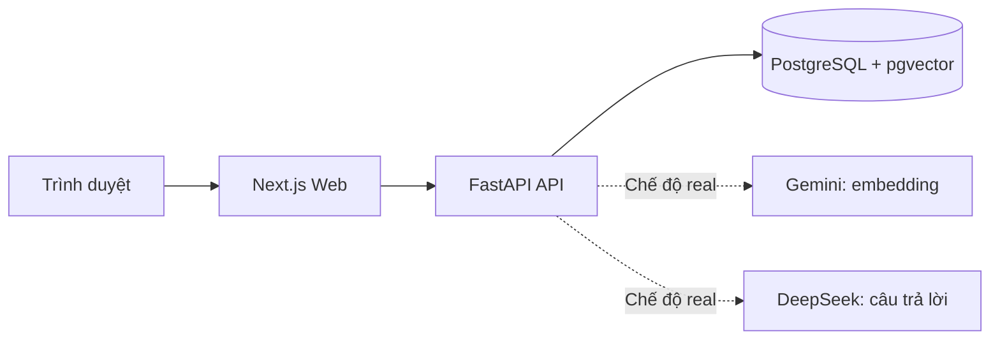

# InsightHub Starter

Starter cho ứng dụng khai thác tài liệu bằng AI, dùng làm Running Project của chương trình **B2B C07 SDLC with AI**. Starter có sẵn luồng tải tài liệu, tìm kiếm ngữ nghĩa và hỏi đáp có trích dẫn (RAG). Học viên phát triển thành sản phẩm hoàn chỉnh qua các pha phân tích yêu cầu, thiết kế, lập trình, kiểm thử, phát hành và bảo trì.

| Thông tin | Giá trị |
| --- | --- |
| Runtime | `v1.0.0-rc.3` |
| Starter revision | `learner-r1.3.2` |
| Đề bài | Requirements 1.5, SRS v1.1 |
| Chế độ mặc định | Fixture, chạy offline, không cần API key |
| Chủ dự án | Đinh Xuân Công |

## Tài liệu chính

| Bạn cần | Tài liệu |
| --- | --- |
| Cài đặt, fork và chạy ứng dụng | [Getting Started](GETTING_STARTED.md) |
| Đề bài, lộ trình, cách nộp, rubric | [Requirements](docs/learner/01_Requirements_InsightHub.md) |
| Hành vi sản phẩm và acceptance criteria | [SRS v1.1](docs/learner/02_SRS_InsightHub_v1.1.md) |
| Kiến trúc và API hiện có | [Architecture](docs/Architecture_Starter_v1.md), [API Contract](docs/API_Contract_Starter_v1.md), [ADR](docs/adr/) |
| Vận hành, sao lưu, khôi phục | [Runbook](docs/Runbook_Starter_v1.md) |
| Quy tắc cho coding agent | [AGENTS.md](AGENTS.md), [CLAUDE.md](CLAUDE.md) |

## Chức năng có sẵn

| Thành phần | Mô tả | Tài liệu |
| --- | --- | --- |
| Quản lý tài liệu | Tải TXT, Markdown, PDF có văn bản. Xem trạng thái, nội dung nguồn, lịch sử thử lại, xóa tài liệu | [API Contract](docs/API_Contract_Starter_v1.md) |
| Xử lý và lập chỉ mục | Trích xuất, chia đoạn, tạo embedding, lưu PostgreSQL và pgvector. Giữ file gốc, vị trí nguồn, mã băm SHA-256 | [Architecture](docs/Architecture_Starter_v1.md) |
| Hỏi đáp có căn cứ | Truy xuất trong tập nguồn được chọn, trả lời kèm trích dẫn, trả `NoEvidence` khi không đủ căn cứ | [Model Profiles](docs/Model_Profiles_And_Reranking.md) |
| Kiểm soát operation | Idempotency cho upload, retry, delete, chat. Giới hạn thời gian xử lý. Đối soát khi trình duyệt mất phản hồi | [ADR-003](docs/adr/ADR-003-Operation-Idempotency.md) |
| Auth scaffold | Better Auth email và mật khẩu, bảng phiên, `current_user` ở API, trang `/login` tối thiểu, hai tài khoản thử. Chưa có chính sách tài khoản | [Auth Integration Guide](docs/Auth_Integration_Guide.md) |
| AI Job scaffold | Job AI theo người dùng: idempotency, quota, deadline, publish fence, policy mặc định từ chối, giả lập lỗi provider | [AI Job Framework](docs/AI_Job_Framework.md) |
| Nền UI | Tailwind CSS v4, component theo quy ước shadcn/ui, app shell, token dùng chung với prototype HTML | [UI Foundation](docs/UI_Foundation.md) |
| MCP chỉ đọc | Role `insighthub_readonly` và server MCP cho Claude Code | [Getting Started](GETTING_STARTED.md#mcp-chi-doc) |
| Vận hành | Health check, readiness, log theo request, metrics Prometheus, migration, diễn tập sao lưu và khôi phục | [Runbook](docs/Runbook_Starter_v1.md) |

Các scaffold chỉ là cơ chế dùng chung, không làm acceptance criteria nào tự đạt. Endpoint tài liệu, chat và operation của Starter còn công khai. Học viên bảo vệ chúng bằng phiên và quyền ở Mốc 4 (M3.1).

## Phạm vi học viên phát triển

| Nhóm chức năng | Core (được chấm) | Extended (làm thêm) |
| --- | --- | --- |
| Auth và Account | Đăng ký, xác minh email, đăng nhập, phiên, đăng xuất | Khôi phục và đổi mật khẩu, hồ sơ, đăng nhập và liên kết Google |
| Transactional Email | EML-001 xác minh email | EML-002 đến EML-005 |
| Notebook | Tạo, liệt kê, mở, cập nhật, ownership, giới hạn, pagination | Xóa Notebook, version conflict |
| Document | Tích hợp upload, trạng thái, retry, citation, xóa với Notebook và quyền | Retry trên UI, trang chi tiết |
| Chat và Conversation | Hỏi đáp theo nguồn được phép, lịch sử conversation bền vững | Đổi tên, xóa conversation |
| Summary | Chọn nguồn và độ dài, nội dung có căn cứ, lưu và mở lại | Lưu thành Note |
| Quiz | Sinh đề, làm và nộp bài, chấm tại server, bảo vệ đáp án, lưu lần làm | |
| AI Job và Output | Policy, executor, Output của Summary và Quiz, fallback provider, usage | Xóa, đổi tên, tạo lại kết quả |
| Note | | Toàn bộ |

| Chỉ số | Giá trị |
| --- | --- |
| Acceptance criteria áp dụng | 153 (92 Core, 61 Extended), 12 ngoài phạm vi |
| Công việc học tập | 29 LR qua Mốc 0 đến Mốc 7 và Capstone |
| Tự học | Khoảng 59 giờ, 2 đến 2,5 giờ mỗi ngày |
| Ngoài phạm vi | Mindmap, Slide, Báo cáo |

Chi tiết phân tầng tại [Core và Extended](docs/learner/01_Requirements_InsightHub.md#core-extended). Mức hoàn thành từng nhóm theo Mốc tại [ma trận chức năng](docs/learner/01_Requirements_InsightHub.md#ma-tran-chuc-nang).

## Làm việc với AI

Claude (Claude App, Claude Code) là công cụ AI chính của khóa học. ChatGPT và Codex là lựa chọn bổ sung. Học viên tự phân tích, kiểm chứng và giải thích quyết định, dù dùng công cụ nào.

| Thành phần | Vị trí |
| --- | --- |
| Quy tắc agent, quyền `deny`, hook chặn đọc secret và bảo vệ test đã duyệt | `AGENTS.md`, `CLAUDE.md`, `.claude/` |
| Template context pack, AI Usage Charter, skill, subagent, checklist review | `docs/ai/templates/` |
| PR template (AI usage, DoD), issue template (tính năng, task giao agent, lỗi) | `.github/` |
| Traceability matrix 165 AC, mức rủi ro, lấy mẫu có seed | `trace/`, `scripts/trace_check.py`, `scripts/trace_sample.py` |
| Spec chain Specify, Plan, Tasks | `specs/` |
| Eval harness: golden set, grader bằng code, pass^k | `evaluation/harness/`, `make eval` |
| AI Delivery Log, báo cáo metric, AI-BOM | `docs/ai/delivery-log.csv`, `make delivery-report`, `make ai-bom` |
| Template test plan, release, vận hành | `docs/release/` |

Bản đồ thành phần theo Mốc tại [AI Engineering Kit](docs/ai/README.md). Rule và hook là lưới an toàn, không thay việc học viên đọc và duyệt từng lệnh.

## Bắt đầu nhanh

### 1. Chuẩn bị

| Thành phần | Yêu cầu |
| --- | --- |
| Docker | Docker Desktop, Docker Engine hoặc phương án tương thích có Docker Compose v2. Windows dùng [WSL2](GETTING_STARTED.md#windows-wsl2) |
| Tài nguyên | Khoảng 3 GiB RAM trống. Cổng `3107` và `8107` chưa dùng |
| Công cụ kiểm | Git, Python 3.11 trở lên, Make. Node.js 24.20.0 khi chạy browser E2E |
| Mạng | Cần cho lần tải image và dependency đầu tiên. Chế độ fixture không gọi dịch vụ bên ngoài |

### 2. Tải mã nguồn

Khi làm bài, fork repository trước rồi clone fork cá nhân, đặt remote `upstream` theo [hướng dẫn khởi tạo bài làm](GETTING_STARTED.md#fork-starter-và-khởi-tạo-bài-làm). Để chỉ xem và chạy thử:

```sh
git clone https://github.com/congdinh2008/insighthub-starter.git
cd insighthub-starter
```

### 3. Cấu hình và khởi động

```sh
cp .env.example .env
```

Đặt `BETTER_AUTH_SECRET` trong `.env` bằng chuỗi ngẫu nhiên tối thiểu 32 ký tự, ví dụ kết quả của `openssl rand -base64 32`. Sau đó khởi động:

```sh
docker compose --env-file .env -p insighthub-c07-starter up --build -d --wait
```

| Địa chỉ | Mục đích |
| --- | --- |
| [localhost:3107](http://localhost:3107) | Giao diện ứng dụng |
| [localhost:8107/docs](http://localhost:8107/docs) | Tài liệu API tương tác |
| [localhost:8107/readyz](http://localhost:8107/readyz) | Kiểm tra API sẵn sàng |
| [localhost:8107/system/profile](http://localhost:8107/system/profile) | Chế độ chạy, provider, cấu hình truy xuất |

### 4. Thử luồng đầu tiên

1. Mở giao diện, tải một file trong [`sample-docs/`](sample-docs/README.md).
2. Chờ tài liệu sẵn sàng và chọn làm nguồn.
3. Đặt câu hỏi, xem câu trả lời và mở nguồn trích dẫn.
4. Chạy smoke test:

```sh
python3 scripts/smoke.py --api-url http://127.0.0.1:8107 --web-url http://127.0.0.1:3107
```

Câu trả lời ở chế độ fixture có nhãn nhận diện, chỉ dùng để kiểm luồng kỹ thuật, không đánh giá chất lượng mô hình.

### 5. Dừng ứng dụng

```sh
docker compose --env-file .env -p insighthub-c07-starter down
```

Lệnh giữ dữ liệu trong Docker volume. Không thêm `-v` khi cần giữ tài liệu đã tải.

## Công nghệ và kiến trúc

| Lớp | Công nghệ | Vai trò |
| --- | --- | --- |
| Web | Next.js, React, TypeScript | Giao diện, chuyển tiếp yêu cầu tới API |
| API | FastAPI, Python | Xử lý tài liệu, retrieval, gọi AI, kiểm soát operation |
| Dữ liệu | PostgreSQL 16, pgvector | Tài liệu, vector, trạng thái xử lý |
| AI | DeepSeek, Gemini | DeepSeek sinh câu trả lời, Gemini tạo embedding. Reranker mặc định tắt |
| Kiểm thử | unittest, Node test runner, Playwright, GitHub Actions | Kiểm chứng tự động |


```mermaid
flowchart LR
    User[Trình duyệt] --> Web[Next.js Web]
    Web --> API[FastAPI API]
    API --> DB[(PostgreSQL + pgvector)]
    API -. Chế độ real .-> Embedding[Gemini: embedding]
    API -. Chế độ real .-> Generation[DeepSeek: câu trả lời]
```

Nhập tài liệu xử lý đồng bộ và trả `201 Created` khi thành công. Khi hỏi đáp, API truy xuất trong tập nguồn đã chọn, tạo câu trả lời và kiểm trích dẫn trước khi trả kết quả. Phiên bản dependency được pin trong Dockerfile và lockfile.

## Cấu hình AI

| Biến | Mặc định | Ý nghĩa |
| --- | --- | --- |
| `RAG_MODE` | `fixture` | `fixture` kiểm luồng offline, `real` gọi dịch vụ AI |
| `DEEPSEEK_API_KEY` | Trống | Khóa DeepSeek học viên tự mua, hoặc dùng provider khác theo [Model Profiles](docs/Model_Profiles_And_Reranking.md) |
| `GEMINI_API_KEY` | Trống | Khóa Gemini cho embedding mặc định |
| `API_PORT`, `WEB_PORT` | `8107`, `3107` | Cổng local |

Chạy AI thật trong project và cổng riêng để embedding thật tách khỏi dữ liệu fixture:

```sh
API_PORT=8117 WEB_PORT=3117 DB_PORT=5435 docker compose --env-file .env -p insighthub-c07-real up --build -d --wait
```

Ở chế độ real, nội dung tài liệu và câu hỏi được gửi tới provider bên ngoài. Đặt spending limit, chỉ giữ khóa trong `.env`, không commit, không dán khóa vào công cụ AI và chỉ dùng dữ liệu giả. Chi tiết tại [Model Profiles](docs/Model_Profiles_And_Reranking.md) và [Evaluation](evaluation/README.md).

## Email

| Cách | Dùng khi | Hướng dẫn |
| --- | --- | --- |
| Mailpit local (mặc định) | Phát triển và evidence EML-001. SMTP `127.0.0.1:1025`, giao diện `127.0.0.1:8025` | [Email local với Mailpit](GETTING_STARTED.md#email-local-với-mailpit-tùy-chọn) |
| Gmail riêng cho khóa học (tùy chọn) | Muốn kiểm thư tới hộp thư thật, dùng App Password | [Gửi thư thật bằng Gmail](GETTING_STARTED.md#gửi-thư-thật-bằng-gmail-tùy-chọn) |

## Cấu trúc repository

```text
.
├── api/                  FastAPI, xử lý tài liệu và RAG, migration, tests
├── web/                  Next.js, giao diện, API proxy, tests, E2E
├── design/prototype/     Nền token và CSS cho prototype HTML
├── infra/                Khởi tạo database, reranker tùy chọn
├── docs/
│   ├── adr/              Quyết định kiến trúc và template ADR
│   ├── ai/               AI Engineering Kit: bản đồ, review workflow, template, delivery log
│   ├── learner/          Requirements, SRS, gói API và Schema tham khảo
│   ├── release/          Template test plan, release, vận hành, SBOM
│   └── security/         Template threat model
├── evaluation/           Corpus, AEV-01, eval harness
├── specs/                Template Specify, Plan, Tasks
├── trace/                Traceability matrix AC
├── sample-docs/          Tài liệu mẫu để thử ứng dụng
├── scripts/              Smoke, đánh giá, sao lưu và khôi phục, trace, công cụ kiểm
├── tools/mcp/            Server MCP chỉ đọc
├── .claude/              Quyền, hook, danh sách test đã duyệt
├── .github/              Workflow CI, PR template, issue template
├── docker-compose.yml    Dịch vụ và volume local
└── Makefile              Lệnh phát triển và kiểm tra
```

## Kiểm thử và CI

| Mục đích | Lệnh |
| --- | --- |
| Backend, Web, công cụ (project test riêng) | `DB_PORT=5434 make COMPOSE="docker compose --env-file .env.example -p insighthub-c07-check" test` |
| Smoke trên stack fixture | `make API_URL=http://127.0.0.1:8107 WEB_URL=http://127.0.0.1:3107 smoke` |
| Browser E2E (Playwright Test) | `cd web && npm run test:pw` |
| Trace và tài liệu | `python3 scripts/trace_check.py`, `python3 scripts/check_project.py` |

Từ Mốc 4 (M3.1), khi endpoint yêu cầu đăng nhập, đặt `INSIGHTHUB_SESSION_COOKIE` bằng `scripts/session_cookie.py` trước khi chạy smoke, eval và AEV ([Runbook](docs/Runbook_Starter_v1.md#kiem-tra-sau-khi-bao-ve-endpoint)).

| Workflow | Khi chạy | Nội dung |
| --- | --- | --- |
| [App CI](.github/workflows/app-ci.yml) job `governance` | Push vào `main`, pull request | Kiểm trace, chặn sửa test đã duyệt thiếu trailer `Test-Change-Approved`, test công cụ và hook |
| [App CI](.github/workflows/app-ci.yml) job `application` | Push vào `main`, pull request | Build, test backend và web, smoke, `eval-fixture`, E2E, `npm audit` |

## Giới hạn mặc định

| Hạng mục | Giá trị |
| --- | --- |
| Kích thước file | 10 MiB |
| PDF | 100 trang |
| Văn bản trích xuất | 200.000 ký tự |
| Thời hạn xử lý | Ingestion 120 giây, chat 60 giây |
| Lưu bản ghi idempotency | 24 giờ |

Khi mở rộng:

- Quyền sở hữu dữ liệu do server xác lập. Không tin `owner_id` từ client và không tự gán dữ liệu Starter cho tài khoản đăng ký đầu tiên.
- Thay đổi schema bằng forward migration. Đổi model hoặc dimension embedding cần kế hoạch lập lại chỉ mục.
- Hội thoại, ghi chú và kết quả AI cần lưu riêng, không phụ thuộc thời hạn bản ghi operation.
- Fixture chỉ kiểm hành vi phần mềm. Chất lượng nội dung AI cần chạy với provider thật và kiểm từng kết quả theo nguồn.
