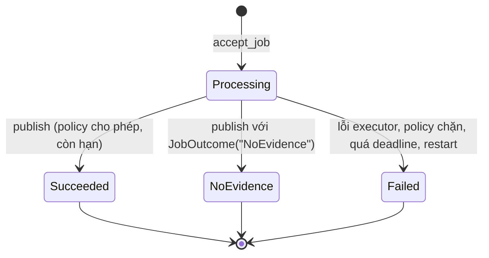

# AI Job Framework (learner-r1.3)

Cơ chế dùng chung cho hỏi đáp và công cụ AI: tiếp nhận có idempotency theo người dùng, giới hạn LIM-10, deadline LIM-11, giữ key LIM-12, publish fence BR-08 và BR-09, ghi usage. Quyết định thiết kế: [ADR-004](adr/ADR-004-AI-Job-Framework.md).

**Ranh giới:** Starter cấp cơ chế, không chứa nghiệp vụ. Không có prompt, schema đầu ra, bảng Output, Quiz attempt hay endpoint Summary và Quiz. Policy mặc định từ chối: chưa có policy của bạn thì job không đọc lại và không công bố được. Scaffold không làm AC nào tự đạt; mọi AC vẫn kết luận bằng test và evidence trên sản phẩm của bạn.

## 1. Thành phần

| Thành phần | File | Vai trò |
| --- | --- | --- |
| Bảng `ai_jobs` | `api/migrations/005_ai_jobs.sql` | Job theo người dùng, snapshot đầu vào, trạng thái, deadline, usage, `retry_of` |
| Module cơ chế | `api/app/core/ai_jobs.py` | `accept_job`, `run_job`, `publish`, `get_job`, `record_usage`, `normalize_source_ids`, `register_policy` |
| Đọc trạng thái | `api/app/routers/ai_jobs.py` | `GET /ai-jobs/{id}`, `GET /ai-jobs/by-key/{job_type}/{key}` (cần phiên, kiểm policy) |
| Envelope lỗi | `api/app/main.py`, `api/app/core/errors.py` | `code`, `message`, `request_id`, `fields[]`, `retry_after_seconds` và header `Retry-After` |
| Giả lập lỗi provider | `api/app/core/fault_injection.py` | `timeout`, `429`, `500`, `502`, `503`, `invalid_json` để test retry và fallback offline |
| Web | `web/lib/jobs.ts`, `web/lib/useJobStatus.ts`, `web/lib/jobs-server.ts`, `web/lib/api-error.ts`, `web/app/api/ai-jobs/` | Gửi job giữ key, polling trạng thái, proxy timeout 125 giây, đọc envelope lỗi |

## 2. Trạng thái



| `error_code` khi `Failed` | Nguyên nhân |
| --- | --- |
| `deadline_exceeded` | Quá 60 giây (chat) hoặc 120 giây (công cụ) kể từ lúc tiếp nhận |
| `interrupted` | API khởi động lại khi job đang chạy |
| `publish_blocked` | `policy.can_publish` trả `False` (nguồn, Notebook hoặc hội thoại đích không còn) |
| `provider_timeout`, `provider_rate_limited`, `provider_error`, `citation_validation_failed` | Lỗi từ provider hoặc kiểm đầu ra, giữ mã của `ServiceError` |
| `internal_error` | Exception không mong đợi trong executor (không log nội dung exception) |

## 3. Giới hạn áp dụng

| Quy tắc | Giá trị | Khi vi phạm |
| --- | --- | --- |
| Idempotency (mục 3.3.2) | `UNIQUE (user_id, job_type, idempotency_key)`, kiểm trước quota | Cùng dữ liệu: trả job cũ (`replay=True`). Khác dữ liệu: 409 `idempotency_conflict` |
| LIM-10 đang chạy | 1 job `Processing` mỗi người dùng | 429 `ai_job_running`, `Retry-After` là số giây tới deadline của job đang chạy |
| LIM-10 tần suất | 10 job mới trong 60 giây trượt | 429 `ai_rate_limited`, `Retry-After` là số giây tới khi có chỗ |
| LIM-11 | `chat` 60 giây, loại khác 120 giây, tính từ lúc tiếp nhận | Job chuyển `Failed`, kết quả đến sau không được lưu |
| LIM-12 | Key giữ 24 giờ | Hết hạn thì key được nhả (cột thành NULL), job và kết quả giữ nguyên |

Request bị từ chối ở bước quota không được ghi nên không tính lượt. "Cùng dữ liệu" là cùng `job_type`, `notebook_id` và `normalized_input` (so sánh JSON theo khóa đã sắp xếp).

## 4. Tích hợp vào endpoint của bạn

Ví dụ dưới dùng một executor giả `echo` để minh họa cơ chế, không phải Summary hay Quiz:

```python
from fastapi import APIRouter, Depends, Header
from app.core.ai_jobs import JobOutcome, accept_job, publish, record_usage, register_policy, run_job
from app.core.auth import CurrentUser, current_user

router = APIRouter()


class EchoPolicy:
    def can_read(self, conn, job):
        # Kiểm Notebook còn và thuộc job.user_id theo trạng thái HIỆN HÀNH, không dựa vào snapshot.
        return True

    def can_publish(self, conn, job):
        # Khóa dòng nguồn hoặc Notebook liên quan (SELECT ... FOR SHARE) rồi kiểm chưa bị xóa (BR-08, BR-09).
        return True


register_policy("echo", EchoPolicy())


def echo_executor(job):
    record_usage(job, {"provider": "fixture", "model": "echo", "attempt": 1, "outcome": "ok", "latency_ms": 0})
    return JobOutcome("Succeeded", {"text": job.input_snapshot["text"]})


def save_result(conn, job, outcome):
    # Ghi bảng kết quả CỦA BẠN trong cùng transaction với publish; trả id làm result_ref.
    return None


@router.post("/echo", status_code=202)
def create_echo(body: dict, idempotency_key: str = Header(alias="Idempotency-Key"),
                user: CurrentUser = Depends(current_user)):
    snapshot = {"text": str(body.get("text", ""))}            # chuẩn hóa và kiểm đầu vào nghiệp vụ trước
    job, replay = accept_job(user_id=user.id, job_type="echo", idempotency_key=idempotency_key,
                             normalized_input=snapshot)
    if replay:
        return job.public()
    outcome = run_job(job, echo_executor)
    return publish(job, outcome, write_result=save_result).public()
```

Việc của bạn khi tích hợp:

1. **Trước `accept_job`:** xác thực phiên, kiểm Notebook thuộc người dùng, chuẩn hóa đầu vào (dùng `normalize_source_ids` cho tập nguồn), áp giá trị mặc định, đưa model, `prompt_version`, phiên bản parser vào snapshot. Nguồn `Ready`, cùng Notebook, giới hạn ký tự theo IH-AI-002.
2. **Policy:** `can_read` và `can_publish` theo nghiệp vụ. Thao tác xóa nguồn hoặc Notebook phải khóa cùng dòng (`FOR UPDATE`) để chống race với `can_publish`.
3. **Executor:** gọi model, kiểm cấu trúc đầu ra, trả `JobOutcome("Succeeded")` hoặc `JobOutcome("NoEvidence")`. Ghi `record_usage` cho từng lần gọi model, kể cả lần lỗi và lần fallback (IH-AI-005-AC02). Áp trần token.
4. **Fallback (IH-AI-005-AC01):** retry có giới hạn đã có trong `providers.post_json`. Khi hết retry với provider chính, executor chuyển sang provider dự phòng trong deadline còn lại.
5. **Chat:** đưa Chat của Starter vào `ai_jobs` với `job_type="chat"` để LIM-10 tính chung.
6. **Thử lại sau thất bại:** gửi `retry_of=<id job Failed>` với key mới (BR-10).
7. **Notebook:** thêm khóa ngoại `ai_jobs.notebook_id` tới bảng Notebook bằng migration forward.

`record_usage` chỉ nhận các trường `provider`, `model`, `attempt`, `fallback`, `outcome`, `input_tokens`, `output_tokens`, `latency_ms`, `finish_reason`, `estimated_cost_usd`, `error_code` với giá trị đơn. Không có chỗ cho prompt, nội dung nguồn hay body của provider.

## 5. Phía web

| Việc | Dùng |
| --- | --- |
| Route tạo job | Trong route handler: `return forwardJobRequest(req, "/<đường dẫn API của bạn>")`. Bắt buộc `Idempotency-Key` từ client, timeout 125 giây, giữ `Retry-After` |
| Gửi từ trình duyệt | `startJob(jobType, url, body, { userId })`. Key lưu trước khi gửi, gắn người dùng, giữ khi mất kết nối, bỏ khi API trả lỗi xác định hoặc job kết thúc |
| Gửi lại sau mất kết nối | `startJob(jobType, url, null, { userId, pending })` với phần tử từ `pendingJobs(userId)`. Không sinh key mới |
| Đối soát khi chưa có id | `getJobByKey(jobType, key)` |
| Theo dõi khi tải lại trang | `const { job, error, done } = useJobStatus(jobId)` |
| Hiển thị lỗi | `parseApiError(status, body, headers)` trả `code`, `message`, `fields`, `retryAfterSeconds`. Chọn thông báo theo `code`; `Failed` và `NoEvidence` là hai thông báo khác nhau (IH-MSG-004) |

## 6. Kiểm thử

| Muốn kiểm | Cách |
| --- | --- |
| Retry có sẵn và lỗi công khai | `with inject_provider_faults({"deepseek": ["timeout", "503"]}):` rồi gọi adapter thật; không có request ra mạng |
| Fallback trong executor | Kế hoạch lỗi cho provider chính đủ số lần retry, kiểm executor chuyển provider dự phòng và `record_usage` có hai bản ghi |
| Nhánh fixture | Gọi `check_fixture_fault("<provider>")` ở đầu nhánh fixture của executor |
| Chạy thử thủ công | `AI_FIXTURE_FAULTS=deepseek:timeout` trong `.env`, chỉ có hiệu lực khi `RAG_MODE=fixture` |
| Đồng thời, quota, deadline, fence | Mẫu trong `api/tests/test_integration.py` (`test_ai_job_*`). Viết lại test AC trên endpoint tích hợp của bạn, test của Starter không thay evidence AC |

Lệnh: `make test-backend` (cần PostgreSQL), `cd web && npm test`.

## 7. Giới hạn đã biết

- Đồng bộ trong request: request giữ kết nối tới deadline. Không có queue, worker, streaming, circuit breaker.
- Khởi động lại API đánh dấu mọi job đang chạy là `interrupted`, giả định một tiến trình API.
- Chưa tích hợp Chat thì LIM-10 chưa tính chung hỏi đáp và công cụ.
- `GET /ai-jobs/...` trả 404 cho tới khi bạn đăng ký policy cho loại job đó.
