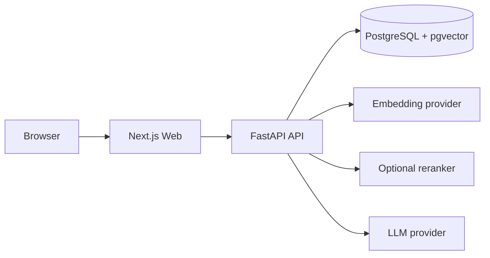

# Kiến trúc InsightHub Starter v1

## Runtime

Profile mặc định dùng fixture nội bộ nên E/L không có network call. Profile real yêu cầu cấu hình provider, model và credential tường minh.

## Luồng ingestion đồng bộ

1. Validate `Idempotency-Key`, tên, kích thước và byte signature.
2. Khóa operation key và SHA-256 để replay/dedup an toàn.
3. Tạo document, lưu original bytes và ingestion attempt.
4. Trích xuất theo page/section/paragraph, chuẩn hóa NFC và kiểm giới hạn.
5. Chunk theo từng source segment, tạo embedding và ghi vector atomically.
6. Chuyển `Ready` và trả HTTP 201. Lỗi chuyển `Failed`, giữ document/attempt để retry.

Deadline 120 giây được truyền qua ContextVar. Provider chỉ dùng ngân sách còn lại.

## Luồng chat

1. Validate operation key, câu hỏi và tập document ID.
2. Server kiểm toàn bộ nguồn đang `Ready`.
3. Giữ shared advisory lock cho nguồn; delete dùng exclusive lock cùng key.
4. Dense retrieval lấy candidate chỉ trong tập nguồn đã xác nhận.
5. Evidence threshold loại candidate yếu; reranker `none`, local TEI hoặc Cohere sắp xếp lại nếu được bật.
6. Diversity cap và context token budget tạo context cuối.
7. LLM trả JSON `Answered` hoặc `NoEvidence`; mỗi claim của `Answered` bắt buộc có citation ID hợp lệ.
8. Validator kiểm citation thuộc contexts và kiểm nguồn lần cuối trước công bố.
9. Kết quả và lỗi an toàn được lưu trong operation record để replay.

Không có silent fallback giữa các provider. Nếu reranker được bật mà lỗi, operation trả lỗi kỹ thuật thay vì âm thầm dùng dense order.

## Mô hình dữ liệu nền

| Bảng | Vai trò |
| --- | --- |
| `documents` | Identity, status, SHA-256, pipeline và embedding identity |
| `document_sources` | Original bytes, extracted text, extraction metadata |
| `source_segments` | Page/section/paragraph có locator ổn định |
| `chunks` | Chunk gắn segment và vector |
| `ingestion_attempts` | Chuỗi lần xử lý/retry và deadline |
| `operation_records` | Idempotency fingerprint, status, response và TTL |
| `embedding_index` | Một vector space có identity bất biến |
| `schema_migrations` | Phiên bản migration đã áp dụng |

## Invariants

- `Ready` luôn có ít nhất một chunk, checksum, pipeline và embedding identity.
- `Failed` không có chunk công bố.
- Upload, retry, delete và chat cùng operation key khác fingerprint trả 409.
- Cùng byte chưa xóa không tạo document thứ hai trong phạm vi starter local.
- Citation chỉ trỏ tới context đã retrieve từ document còn `Ready`.
- Mọi claim được công bố trong `Answered` có ít nhất một citation hợp lệ.
- Đổi embedding identity không tái dùng vector cũ.
