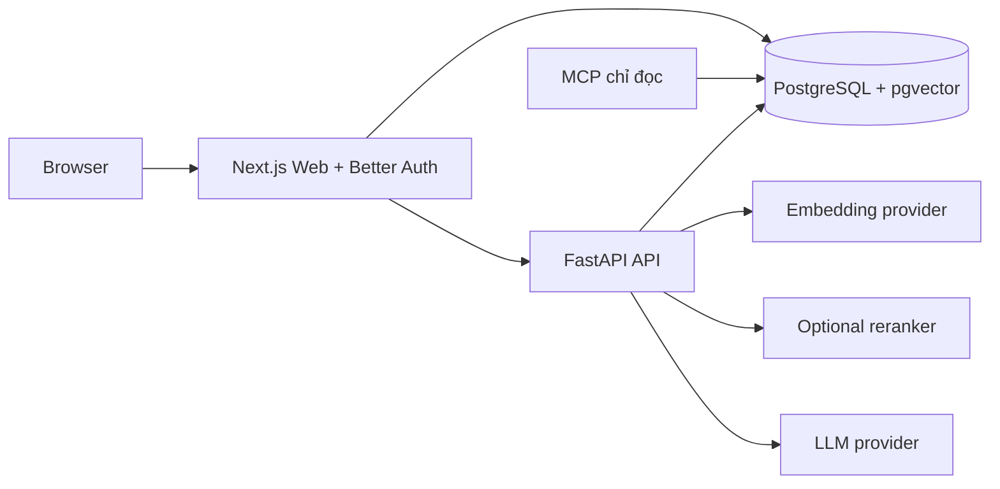

# Kiến trúc InsightHub Starter v1

## Runtime

```mermaid
flowchart LR
    B[Browser] --> W[Next.js Web + Better Auth]
    W --> P
    W --> A[FastAPI API]
    A --> P[(PostgreSQL + pgvector)]
    A --> E[Embedding provider]
    A --> R[Optional reranker]
    A --> L[LLM provider]
    M[MCP chỉ đọc] --> P
```

Từ `learner-r1.3`, Web chạy Better Auth (Auth scaffold) và ghi bảng `auth_*` trong cùng PostgreSQL; API đọc `auth_session` để xác định người dùng. MCP của Claude Code kết nối bằng role `insighthub_readonly` (chỉ `SELECT`, giao dịch chỉ đọc).

Profile mặc định dùng fixture nội bộ nên E/L không có network call. Profile real yêu cầu cấu hình provider, model và credential tường minh.

## Luồng ingestion đồng bộ

1. Validate `Idempotency-Key`, tên, kích thước và byte signature.
2. Khóa operation key và SHA-256 để replay/dedup an toàn.
3. Tạo document, lưu original bytes và ingestion attempt.
4. Trích xuất theo page/section/paragraph, chuẩn hóa NFC và kiểm giới hạn.
5. Chunk theo từng source segment, tạo embedding và ghi vector atomically.
6. Chuyển `Ready` và trả HTTP 201. Lỗi chuyển `Failed`, giữ document/attempt để retry.

Deadline 120 giây được truyền qua ContextVar. Provider chỉ dùng ngân sách còn lại.

## Luồng chat

1. Validate operation key, câu hỏi và tập document ID.
2. Server kiểm toàn bộ nguồn đang `Ready`.
3. Giữ shared advisory lock cho nguồn; delete dùng exclusive lock cùng key.
4. Dense retrieval lấy candidate chỉ trong tập nguồn đã xác nhận.
5. Evidence threshold loại candidate yếu; reranker `none`, local TEI hoặc Cohere sắp xếp lại nếu được bật.
6. Diversity cap và context token budget tạo context cuối.
7. LLM trả JSON `Answered` hoặc `NoEvidence`; mỗi claim của `Answered` bắt buộc có citation ID hợp lệ.
8. Validator kiểm citation thuộc contexts và kiểm nguồn lần cuối trước công bố.
9. Kết quả và lỗi an toàn được lưu trong operation record để replay.

Không có silent fallback giữa các provider. Nếu reranker được bật mà lỗi, operation trả lỗi kỹ thuật thay vì âm thầm dùng dense order.

## Mô hình dữ liệu nền

| Bảng | Vai trò |
| --- | --- |
| `documents` | Identity, status, SHA-256, pipeline và embedding identity |
| `document_sources` | Original bytes, extracted text, extraction metadata |
| `source_segments` | Page/section/paragraph có locator ổn định |
| `chunks` | Chunk gắn segment và vector |
| `ingestion_attempts` | Chuỗi lần xử lý/retry và deadline |
| `operation_records` | Idempotency fingerprint, status, response và TTL |
| `embedding_index` | Một vector space có identity bất biến |
| `schema_migrations` | Phiên bản migration đã áp dụng |
| `auth_user`, `auth_session`, `auth_account`, `auth_verification` | Auth scaffold (migration 004): người dùng, phiên, danh tính, mã xác minh của Better Auth |
| `ai_jobs` | AI Job scaffold (migration 005): job theo người dùng, snapshot đầu vào, deadline, usage ([AI Job Framework](AI_Job_Framework.md)) |

## Invariants

- `Ready` luôn có ít nhất một chunk, checksum, pipeline và embedding identity.
- `Failed` không có chunk công bố.
- Upload, retry, delete và chat cùng operation key khác fingerprint trả 409.
- Cùng byte chưa xóa không tạo document thứ hai trong phạm vi starter local.
- Citation chỉ trỏ tới context đã retrieve từ document còn `Ready`.
- Mọi claim được công bố trong `Answered` có ít nhất một citation hợp lệ.
- Đổi embedding identity không tái dùng vector cũ.

## Ranh giới mở rộng của bài học viên

Các invariant trên mô tả nền local dùng chung. `ready_document_ids(None)` lấy tài liệu Ready của thư viện nền; `operation_records` phục vụ replay có TTL, chưa thay lưu trữ Conversation/AI Output của bài làm. Starter có session (Auth scaffold) và cơ chế AI job theo người dùng (AI Job scaffold), nhưng chưa có Notebook, ownership hay policy để bảo vệ dữ liệu đa người dùng.

### Giả định một người dùng và việc phải làm khi tích hợp

Phần nền rc.3 được viết cho một người dùng. Các điểm dưới đây là lỗ hổng kế thừa có chủ đích, đưa vào fit-gap M1 và xử lý trong bài làm. Starter không sửa sẵn vì đây là nghiệp vụ của học viên.

| Điểm kế thừa | Hiện trạng | Rủi ro khi có nhiều người dùng | Việc của học viên |
| --- | --- | --- | --- |
| Endpoint và trang demo | `/documents`, `/chat`, `/operations`, trang `/` công khai để chạy M0.1 | Bất kỳ ai gọi được API đọc, xóa tài liệu | Bảo vệ bằng `current_user` và kiểm quyền theo Notebook ở M3.1 |
| Chống trùng tài liệu | Theo `content_sha256` toàn cục | Tải cùng tệp có thể lộ việc người khác đã có tài liệu đó (SRS mục 3.3.2) | Giới hạn chống trùng theo Notebook và người dùng |
| Idempotency key | `operation_records` duy nhất theo `(operation_type, operation_key)` toàn cục | Replay chéo người dùng nếu hai người dùng trùng key | Scope theo người dùng; Chat giữ `operation_records` (mã D8), không chuyển sang `ai_jobs` |
| Danh sách tài liệu | Không lọc theo chủ sở hữu | Người dùng B thấy tài liệu của A | Lọc theo Notebook thuộc người dùng trước khi trả và trước retrieval |
| Tập nguồn mặc định | `ready_document_ids(None)` lấy toàn bộ tài liệu Ready | Hỏi đáp trên tài liệu của người khác | Xác định Notebook và tập nguồn trước retrieval |
| Trạng thái client | Đã gắn người dùng (Auth scaffold) | | Giữ quy tắc khi thêm khóa mới |

Khi tích hợp, học viên xác lập người dùng từ session phía server, giới hạn tập nguồn theo Notebook và quyền trước retrieval, thiết kế migration và persistence nghiệp vụ độc lập với operation TTL. Đọc [Requirements mục 13.4](learner/01_Requirements_InsightHub.md#tich-hop-starter) để xác định điểm cần thay đổi và phép kiểm. Module legacy chỉ định cho bài Legacy Modernization là `validate_configuration` và `extract_source`, xem [Module legacy](Legacy_Modules.md); học viên được chọn module khác nếu nêu lý do. Giữ characterization test trước lần sửa đầu tiên. Starter cung cấp phần nền Auth scaffold, AI Job scaffold và nền UI ([Auth Integration Guide](Auth_Integration_Guide.md), [AI Job Framework](AI_Job_Framework.md), [UI Foundation](UI_Foundation.md)); không cung cấp nghiệp vụ Auth, Notebook hoặc AI Tool của bài tập.
