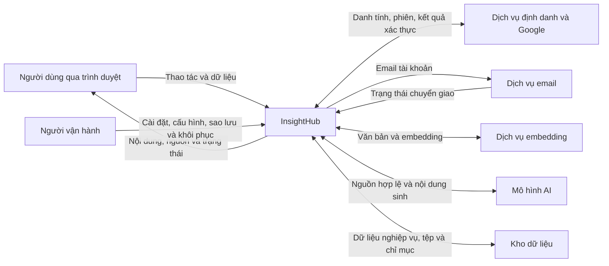

# Đặc tả yêu cầu phần mềm InsightHub

**Ứng dụng quản lý và khai thác tài liệu cá nhân bằng AI**

Phiên bản 1.0 Draft | 23/09/2026 | Tham chiếu khung SRS của ISO/IEC/IEEE 29148:2018

| Thuộc tính | Giá trị |
| --- | --- |
| Mã tài liệu | SRS-IH-001 |
| Phiên bản và trạng thái | 1.0 Draft - bản đặc tả đầu tiên, chờ rà soát và phê duyệt |
| Chủ sản phẩm và chủ tài liệu | Đinh Xuân Công |
| Sản phẩm được đặc tả | InsightHub R1, đầy đủ năm công cụ AI |
| Căn cứ xác định phạm vi | Mục tiêu OBJ-01..05, quy tắc BR-01..16 và giới hạn LIM-01..19 được trình bày trong tài liệu |
| Nội dung đặc tả | 72 mã yêu cầu/nhóm yêu cầu, 169 yêu cầu thành phần, 163 tiêu chí chấp nhận; dữ liệu logic, giao tiếp và kiểm chứng R1 |
| Tiêu chuẩn tham chiếu | ISO/IEC/IEEE 29148:2018, khung nội dung tài liệu đặc tả yêu cầu phần mềm |
| Hiệu lực sử dụng | Bản đặc tả dùng để rà soát. Chủ sản phẩm phê duyệt trước khi sử dụng làm căn cứ nghiệm thu |
| Đối tượng đọc | Chủ sản phẩm, chuyên viên phân tích nghiệp vụ, người thiết kế giao diện và trải nghiệm, lập trình viên, người kiểm thử và người vận hành |

InsightHub cho phép người dùng tổ chức tài liệu trong các Notebook riêng tư, hỏi đáp dựa trên tài liệu nguồn, quản lý ghi chú và tạo nội dung bằng công cụ AI. Tài liệu xác định hành vi và ràng buộc để thiết kế, triển khai, kiểm thử và nghiệm thu sản phẩm.

**Mindmap, Tóm tắt, Slide, Quiz và Báo cáo đều thuộc phạm vi bắt buộc của sản phẩm R1.**

## Mục lục

1. [Giới thiệu](#sec-1)
2. [Mô tả tổng thể](#sec-2)
3. [Yêu cầu chi tiết](#sec-3)
4. [Kiểm chứng và nghiệm thu](#sec-4)
5. [Quản lý yêu cầu và truy vết](#sec-5)
6. [Thông tin bổ trợ](#sec-6)

Tra cứu nhanh: [chức năng](#sec-3-4), [giao tiếp](#sec-3-3), [UI/UX](#sec-3-5), [hiệu năng](#sec-3-6), [dữ liệu](#sec-3-7), [bảo mật và độ tin cậy](#sec-3-10), [đánh giá chất lượng AI](#sec-4-2), [ma trận yêu cầu](#sec-5-3), [use case](#uc-catalog).

## 1. Giới thiệu

### 1.1. Mục đích và đối tượng sử dụng

Tài liệu đặc tả yêu cầu phần mềm (SRS) mô tả toàn bộ InsightHub R1, bao gồm quản lý tài khoản, Notebook, tài liệu, hỏi đáp bằng RAG, ghi chú, năm công cụ AI, giao diện và vận hành hệ thống. Chủ sản phẩm và nhóm dự án sử dụng tài liệu để thống nhất phạm vi, thiết kế giải pháp, triển khai chức năng và xây dựng các test case.

R1 hướng tới ứng dụng cá nhân chạy trong môi trường local hoặc sandbox có kiểm soát. Phạm vi, hành vi và ngưỡng nghiệm thu được xác định trong tài liệu này. Nhóm kỹ thuật kiểm tính khả thi của cấu hình và giới hạn theo mục 3.2.5 trước khi triển khai phần phụ thuộc.

### 1.2. Bối cảnh, mục tiêu và phạm vi sản phẩm

Người dùng thường lưu tài liệu rời rạc, mất thời gian đọc lại và phải chuyển qua nhiều công cụ để tìm thông tin, ghi chú hoặc tạo nội dung. InsightHub tổ chức tài liệu theo Notebook và cung cấp cùng một nơi để hỏi đáp, kiểm tra nguồn và tạo nội dung phục vụ học tập hoặc công việc.

| Mục tiêu | Kết quả có thể kiểm chứng |
| --- | --- |
| OBJ-01 Tổ chức tài liệu cá nhân | Người dùng tự tạo tài khoản, quản lý Notebook và khai thác dữ liệu của mình. |
| OBJ-02 Hỏi đáp có căn cứ | Câu trả lời truy xuất đúng Notebook, có nguồn kiểm tra và phân biệt thiếu căn cứ với lỗi. |
| OBJ-03 Tạo nội dung có ích | Cả Mindmap, Tóm tắt, Slide, Quiz và Báo cáo tạo được đầu ra đúng cấu trúc, lưu kết quả và mở lại để sử dụng. |
| OBJ-04 Trải nghiệm nhất quán | Các hành trình chính đáp ứng thiết kế Figma được duyệt, thao tác được trên hai kích thước viewport và trình duyệt theo LIM-16. |
| OBJ-05 Vận hành có thể kiểm chứng | Dữ liệu được bảo toàn sau khi khởi động lại; quyền truy cập, thông báo lỗi, kết quả kiểm thử và hướng dẫn bàn giao có thể đối chiếu với yêu cầu. |

#### 1.2.1. Trong phạm vi R1

R1 bao gồm các nhóm chức năng sau:

- Đăng ký và xác minh email; đăng nhập bằng email và mật khẩu hoặc bằng Google; khôi phục mật khẩu, quản lý phiên, hồ sơ cá nhân và quyền truy cập dữ liệu.
- Notebook riêng tư; nạp TXT, Markdown, PDF có văn bản; xem trạng thái, nội dung nguồn và xóa tài liệu.
- Chatbot RAG theo Notebook, tham chiếu nguồn, lịch sử hội thoại và ghi chú.
- Đầy đủ năm công cụ AI: Mindmap, Tóm tắt, Slide, Quiz và Báo cáo; quản lý kết quả đã sinh.
- Giao diện theo thiết kế Figma được duyệt, thích ứng với kích thước màn hình, thể hiện rõ trạng thái xử lý và đáp ứng yêu cầu tiếp cận cơ bản.
- Tích hợp dịch vụ định danh, email giao dịch, embedding và mô hình sinh nội dung; vận hành và kiểm chứng trong cấu hình R1.

#### 1.2.2. Ngoài phạm vi R1

R1 không bao gồm các chức năng sau:

- Chia sẻ Notebook, cộng tác nhiều người, quản lý tổ chức, không gian làm việc doanh nghiệp hoặc vai trò quản trị nghiệp vụ.
- Đăng nhập một lần cho doanh nghiệp (SSO), xác thực đa yếu tố (MFA) và thanh toán.
- Nhận dạng ký tự từ ảnh (OCR), xử lý âm thanh hoặc video, thu thập dữ liệu từ website và tìm kiếm trên web.
- AI agent tự thực hiện hành động trên hệ thống bên ngoài.
- Biên tập tự do bố cục Mindmap hoặc Slide; xuất nội dung thành tệp PPTX, DOCX hoặc PDF.
- Ngân hàng câu hỏi, cấp chứng chỉ và tích hợp hệ thống quản lý học tập (LMS).
- Trung tâm thông báo, bộ đếm chưa đọc, thông báo đẩy, SMS và email báo hoàn tất AI.
- Đổi email tài khoản, xóa tài khoản tự phục vụ, chia sẻ hoặc di chuyển tài nguyên sang Notebook khác; lưu nháp lựa chọn Quiz trước khi nộp và khôi phục nháp sau đóng trình duyệt.
- Ứng dụng cài đặt riêng cho thiết bị di động; hạ tầng sẵn sàng cao trên nhiều vùng và cam kết mức dịch vụ thương mại (SLA).
- Triển khai cloud, Kubernetes hoặc hạ tầng bằng mã; hàng đợi và worker chuyên biệt, kiểm thử tải quy mô lớn, hệ thống giám sát vận hành chuyên sâu.
- Sao lưu tự động theo lịch, cam kết thời gian hoặc mức mất dữ liệu khi phục hồi và khôi phục bản sao lưu cũ vào môi trường đang phục vụ người dùng. R1 chỉ yêu cầu sao lưu thủ công và kiểm chứng khôi phục trên môi trường riêng theo UC-09 và UC-16.

Lịch sử hỏi đáp được lưu để người dùng đọc lại. R1 xử lý mỗi câu hỏi độc lập trên nguồn đã chọn, không yêu cầu suy luận từ các lượt hội thoại trước. Người dùng có thể nhập lại đầy đủ ngữ cảnh trong câu hỏi.

### 1.3. Nguồn, tiêu chuẩn và tài liệu tham khảo

#### 1.3.1. Căn cứ đặc tả và tài liệu áp dụng

Mục tiêu sản phẩm tại 1.2 xác định nhu cầu cần đáp ứng. Các quy tắc nghiệp vụ tại 3.1, giới hạn tại 3.2 và yêu cầu chi tiết tại 3-4 xác định hành vi bắt buộc của InsightHub R1. Mỗi yêu cầu có tiêu chí chấp nhận và truy vết tới mục tiêu, use case hoặc kịch bản nghiệm thu liên quan. Chủ sản phẩm là đầu mối quyết định về phạm vi và thay đổi yêu cầu.

| Mã | Tài liệu | Cách sử dụng |
| --- | --- | --- |
| ST1 | [ISO/IEC/IEEE 29148:2018 - ISO](https://www.iso.org/standard/72089.html); [IEEE](https://standards.ieee.org/ieee/29148/6937/) | Chuẩn tham chiếu về kỹ nghệ yêu cầu và nội dung đặc tả |
| ST2 | [Bản xem trước tiêu chuẩn do SIST cung cấp](https://cdn.standards.iteh.ai/sist-preview/72089/62bb2ea1ef8b4f33a80d984f826267c1/ISO-IEC-IEEE-29148-2018.pdf), trang v | Tham chiếu các nhóm nội dung của đặc tả yêu cầu phần mềm tại mục 9.6 |
| TS1 | [Contract R1 v0.2](03_API_Schema_Reference_v1.0.zip) | Thiết kế giao tiếp API và cấu trúc dữ liệu cho năm công cụ; phải đáp ứng yêu cầu trong SRS |

Tài liệu sử dụng mô tả chính thức và mục lục công khai của ST1/ST2 để tổ chức nội dung. Việc tham chiếu khung nội dung không phải tuyên bố đã được đánh giá tuân thủ đầy đủ tiêu chuẩn.

Nếu tài liệu thiết kế hoặc kết quả kiểm có điểm không nhất quán với SRS, nhóm dự án ghi mã yêu cầu và tác động để chủ sản phẩm xử lý theo IH-REL-003. Không tự thay hành vi hoặc hạ ngưỡng bằng một lựa chọn thiết kế.

#### 1.3.2. Tài liệu tham khảo

Các tài liệu dưới đây được sử dụng để tham khảo cách đặc tả yêu cầu, use case, bảo mật và khả năng tiếp cận. Phạm vi bắt buộc của InsightHub được xác định bởi các yêu cầu trong SRS. Các nguồn đã được đối chiếu ngày 18/09/2026.

| Mã | Tài liệu | Nội dung tham khảo |
| --- | --- | --- |
| S1 | [NASA - How to Write a Good Requirement](https://www.nasa.gov/reference/appendix-c-how-to-write-a-good-requirement/) | Cách viết yêu cầu rõ nghĩa, nhất quán và kiểm chứng được. |
| S2 | [OWASP - Authentication Cheat Sheet](https://cheatsheetseries.owasp.org/cheatsheets/Authentication_Cheat_Sheet.html) | Bảo vệ mật khẩu, tái xác thực và phản hồi lỗi xác thực. |
| S3 | [OWASP - Forgot Password Cheat Sheet](https://cheatsheetseries.owasp.org/cheatsheets/Forgot_Password_Cheat_Sheet.html) | Khôi phục mật khẩu, liên kết dùng một lần và hạn chế tiết lộ thông tin tài khoản. |
| S4 | [OWASP - Authorization Cheat Sheet](https://cheatsheetseries.owasp.org/cheatsheets/Authorization_Cheat_Sheet.html) | Kiểm tra quyền truy cập cho từng request. |
| S5 | [W3C - WCAG 2.2](https://www.w3.org/TR/WCAG22/) | Các tiêu chí tương phản, bàn phím, focus, nhãn và thông báo lỗi được nêu trong IH-UX và IH-MSG. |
| S6 | [IBM Rational - Tips for writing good use cases](https://public.dhe.ibm.com/software/rational/web/whitepapers/RAW14023-USEN-00.pdf), James Heumann, tháng 5/2008 | Mô tả main flow, điều kiện phát sinh nhánh và cách tiếp tục hoặc kết thúc. |
| S7 | [Use-Case Foundation](https://www.ivarjacobson.com/publications/use-case-foundation), Ivar Jacobson và Alistair Cockburn | Mục tiêu actor, phạm vi hệ thống và các luồng tương tác. |
| S8 | [W3C - Understanding SC 4.1.3: Status Messages](https://www.w3.org/WAI/WCAG22/Understanding/status-messages.html) | Thông báo trạng thái có thể được công nghệ hỗ trợ nhận biết. |
| S9 | [W3C - Understanding SC 3.3.1: Error Identification](https://www.w3.org/WAI/WCAG22/Understanding/error-identification.html) | Xác định lỗi nhập liệu bằng văn bản. |
| S10 | [W3C - Understanding SC 3.3.3: Error Suggestion](https://www.w3.org/WAI/WCAG22/Understanding/error-suggestion.html) | Hướng dẫn sửa lỗi phù hợp với yêu cầu bảo vệ thông tin. |
| S11 | [GOV.UK Design System - Notification banner](https://design-system.service.gov.uk/components/notification-banner/) | Phân biệt thông báo toàn trang với phản hồi tại trường nhập liệu. |
| S12 | [OWASP - Session Management Cheat Sheet](https://cheatsheetseries.owasp.org/cheatsheets/Session_Management_Cheat_Sheet.html) | Bảo vệ và quản lý vòng đời phiên đăng nhập. |
| S13 | [OWASP - Cross-Site Request Forgery Prevention Cheat Sheet](https://cheatsheetseries.owasp.org/cheatsheets/Cross-Site_Request_Forgery_Prevention_Cheat_Sheet.html) | Ngăn yêu cầu giả mạo theo cơ chế xác thực được sử dụng. |

### 1.4. Quy ước mã và mức độ bắt buộc của yêu cầu

| Mã | Ý nghĩa |
| --- | --- |
| OBJ | Mục tiêu sản phẩm |
| BR | Quy tắc nghiệp vụ |
| UC / CF | Use case hệ thống / tình huống xử lý dùng chung |
| LIM | Giới hạn đầu vào và vận hành |
| IH-AUTH / NB / DOC / CHAT / NOTE | Yêu cầu chức năng tài khoản, Notebook, tài liệu, hỏi đáp, ghi chú |
| IH-AI / MM / SUM / SLD / QUIZ / RPT / OUT | Yêu cầu chung AI, năm công cụ và quản lý kết quả |
| IH-DATA / UX / MSG / INT / NFR / REL | Yêu cầu dữ liệu, trải nghiệm, thông báo, tích hợp, phi chức năng và bàn giao |
| MSG / EML | Thông báo giao diện hoặc vận hành / email giao dịch |
| AC / UAT / AEV | Tiêu chí chấp nhận của yêu cầu, kịch bản nghiệm thu, bộ đánh giá AI |

Từ “phải” xác định một yêu cầu bắt buộc. Mã IH gốc định danh yêu cầu chưa phân rã hoặc nhóm yêu cầu. Nhóm có các mã con `IH-...-R01`, `R02` chứa những yêu cầu bắt buộc riêng; phần “Phạm vi nhóm” chỉ tóm tắt. AC giữ vai trò tiêu chí tổng hợp, không đồng nghĩa một yêu cầu đơn nhất. Cách truy vết và tổng hợp kết quả theo mục 5.1. Quy tắc nghiệp vụ BR, giới hạn LIM và các đặc tả chi tiết tại mục 3.7, 3.5 và 3.3 được áp dụng cùng với yêu cầu IH liên quan. Các chức năng được liệt kê tại mục 1.2.2 nằm ngoài phạm vi nghiệm thu R1.

Mã yêu cầu được giữ ổn định giữa các phiên bản để phục vụ truy vết. Tiêu chí AC có thể được tách hoặc sửa khi thay đổi nội dung; bằng chứng kiểm thử phải ghi cả mã AC và phiên bản SRS. Mỗi thay đổi phải ghi rõ lý do, yêu cầu bị ảnh hưởng, tác động và các test case cần cập nhật theo IH-REL-003.

Quy ước nơi định nghĩa chính: mục 1.2 xác định phạm vi; BR xác định quy tắc nghiệp vụ; LIM xác định giá trị giới hạn; mục 3.2 xác định vòng đời; mục 3.7 xác định ý nghĩa dữ liệu và cấu trúc; mục 3.5 và 3.3 xác định thông báo và giao tiếp. UC mô tả việc áp dụng các quy tắc trong từng tình huống; AC xác định kết quả cần kiểm chứng. Các phần tham chiếu không tự tạo một giá trị hoặc ngoại lệ khác. Nếu phát hiện bất nhất, nhóm dự án ghi nhận vị trí và tác động để chủ sản phẩm giải quyết trước khi triển khai phần bị ảnh hưởng, không tự chọn cách hiểu dễ đạt hơn.

Trong tài liệu này, IH gốc và mã con R quản lý yêu cầu sản phẩm hoặc bàn giao; mã AC là đơn vị tổng hợp kết quả chấp nhận. Mỗi điều kiện trong AC phải có kết quả riêng, bao gồm từng biến thể trong bảng được dẫn. AC chỉ đạt khi tất cả điều kiện và yêu cầu thành phần liên quan đều đạt; phần chưa kiểm không được kết luận là đạt. BR, LIM, mô hình dữ liệu và quy tắc giao tiếp được dẫn trong yêu cầu có cùng hiệu lực nghiệp vụ với phần yêu cầu liên quan.

Mã AS xác định giả định cần kiểm; mã DP xác định phụ thuộc cần xác nhận. Thuộc tính và phương pháp kiểm chứng hỗ trợ quản lý yêu cầu; có kế hoạch kiểm chứng không đồng nghĩa đã thực hiện hoặc đạt kiểm thử.

### 1.5. Thuật ngữ

Tài liệu dùng tiếng Việt để mô tả nghiệp vụ và giữ thuật ngữ tiếng Anh phổ biến trong phân tích, thiết kế và kiểm thử phần mềm. Mỗi thuật ngữ có một cách gọi thống nhất và được giải nghĩa theo ngữ cảnh InsightHub trong các bảng dưới đây. Tên trường, mã trạng thái và mã yêu cầu được giữ nguyên để truy vết tới thiết kế và kiểm thử. Nội dung thông báo cho người dùng được viết bằng tiếng Việt rõ ràng, phù hợp với thao tác đang thực hiện.

| Thuật ngữ | Định nghĩa trong InsightHub |
| --- | --- |
| SRS (Software Requirements Specification) | Tài liệu đặc tả yêu cầu phần mềm, xác định hành vi, ràng buộc và điều kiện nghiệm thu sản phẩm. |
| R1 | Phiên bản sản phẩm thuộc phạm vi đặc tả và nghiệm thu của tài liệu này. |
| AI (Artificial Intelligence) | Trí tuệ nhân tạo. Trong InsightHub, AI hỗ trợ hỏi đáp và tạo nội dung từ tài liệu nguồn. |
| Notebook | Không gian riêng của một người dùng, chứa tài liệu, hội thoại, ghi chú và kết quả AI. |
| Tài liệu nguồn | Tệp người dùng tải vào Notebook và phần văn bản được trích xuất từ tệp. |
| Ingestion | Quá trình kiểm tra tệp, trích xuất văn bản, chia đoạn và lập chỉ mục để phục vụ truy xuất. |
| RAG (Retrieval-Augmented Generation) | Cơ chế truy xuất nội dung nguồn phù hợp và sử dụng nội dung đó làm căn cứ tạo câu trả lời. |
| Embedding | Biểu diễn số của đoạn văn bản, dùng để tìm nội dung có liên quan về ngữ nghĩa. |
| Citation (tham chiếu nguồn) | Thông tin xác định tài liệu và vị trí đoạn văn bản được dùng làm căn cứ cho câu trả lời hoặc kết quả AI. |
| Công cụ AI (AI Tool) | Chức năng tạo một loại nội dung xác định từ tài liệu đã chọn. R1 bắt buộc có đủ năm công cụ. |
| Mindmap / Slide / Quiz | Tên ba công cụ tương ứng với sơ đồ tư duy, bài trình chiếu và bộ câu hỏi trắc nghiệm. Hai công cụ còn lại là Tóm tắt và Báo cáo. |
| Artifact (kết quả AI) | Nội dung đã lưu của một lần chạy công cụ AI thành công, kèm loại công cụ, nguồn, cấu hình và thời điểm tạo. Không bao gồm câu trả lời hỏi đáp hoặc ghi chú. |
| Hồ sơ cá nhân | Thông tin tài khoản hiển thị cho người dùng, gồm tên, email, ảnh đại diện, phương thức đăng nhập và trạng thái xác minh. |
| Hồ sơ cấu hình nghiệm thu | Bản ghi môi trường triển khai, mô hình và nhà cung cấp, giới hạn xử lý, phiên bản Figma và bộ dữ liệu dùng để nghiệm thu. |
| Use case | Mô tả tương tác giữa actor và hệ thống để đạt một mục tiêu, gồm luồng chính và các nhánh có thể xảy ra. Mỗi use case được định danh bằng mã UC. |
| Actor | Vai trò của người dùng, người vận hành hoặc hệ thống bên ngoài khi tương tác với InsightHub. Thuật ngữ này chỉ vai trò tham gia, không đồng nghĩa với AI agent. |
| Scenario | Một trình tự tương tác cụ thể đi qua các bước và nhánh của use case, từ điều kiện ban đầu tới kết quả cuối cùng. Một use case có thể có nhiều scenario. |
| Test case | Đặc tả kiểm thử gồm điều kiện trước khi chạy, dữ liệu đầu vào, thao tác, kết quả kỳ vọng và trạng thái sau khi chạy. Test case trong hồ sơ kiểm chứng phải chỉ rõ yêu cầu hoặc AC được kiểm tra. |
| Trigger | Sự kiện hoặc thao tác bắt đầu một use case. |
| AC (Acceptance Criteria) | Tiêu chí chấp nhận cụ thể của từng yêu cầu. |
| UAT (User Acceptance Testing) | Hoạt động kiểm thử để xác nhận sản phẩm đáp ứng nhu cầu sử dụng và điều kiện chấp nhận. Các mã UAT tại mục 4.3 định danh kịch bản nghiệm thu tổng hợp; mỗi kịch bản có thể cần nhiều test case để kiểm tra đủ các điều kiện. |
| QA (Quality Assurance) | Vai trò bảo đảm chất lượng, quản lý việc kiểm thử và bằng chứng nghiệm thu trong dự án. |
| Test oracle | Căn cứ xác định kết quả đúng hoặc sai của một test case. Với AI, căn cứ có thể là đoạn nguồn, các ý bắt buộc và hành vi kỳ vọng. |
| Main flow | Luồng tương tác chính dẫn tới kết quả thành công của use case, không đi qua nhánh thay thế hoặc ngoại lệ. |
| Alternative flow | Nhánh tương tác hợp lệ khác với main flow, phát sinh khi actor chọn cách thực hiện khác hoặc gặp điều kiện nghiệp vụ khác. |
| Exception flow | Nhánh xử lý lỗi hoặc điều kiện khiến actor chưa thể hoàn thành mục tiêu. Nhánh phải nêu cách khắc phục, bước quay lại hoặc kết quả kết thúc. |
| Preconditions | Trạng thái của tài khoản, dữ liệu hoặc môi trường cần có trước khi bắt đầu use case. |
| Postconditions | Trạng thái của dữ liệu và hệ thống sau khi use case kết thúc. Nhãn “Postconditions khi thành công” mô tả kết quả khi mục tiêu đã đạt; trường hợp không thành công phải tuân theo nhánh tương ứng và minimal guarantees. |
| Minimal guarantees | Những điều hệ thống vẫn phải bảo toàn dù use case không thành công. |
| Idempotency key | Mã nhận diện một thao tác nghiệp vụ. Khi nhận lại cùng mã và cùng dữ liệu, hệ thống trả kết quả của thao tác đã tiếp nhận thay vì tạo thêm thao tác mới. |
| Request ID / mã tra cứu kỹ thuật | Mã giúp người vận hành tìm các sự kiện và lỗi liên quan trong nhật ký. Mã này không thay thế idempotency key dùng để kiểm soát yêu cầu gửi lặp. |
| Xóa logic (logical deletion) | Trạng thái mà tài nguyên không còn được truy cập hoặc sử dụng, dù việc xóa dữ liệu vật lý có thể chưa hoàn tất. |
| Xóa dữ liệu vật lý (physical deletion) | Loại bỏ nội dung khỏi cơ sở dữ liệu, kho tệp và chỉ mục theo thời hạn lưu giữ. |
| Tài nguyên | Đối tượng dữ liệu được quản lý và kiểm soát quyền truy cập, chẳng hạn Notebook, tài liệu, hội thoại, ghi chú hoặc kết quả AI. |
| UI / UX | Giao diện người dùng (User Interface) và trải nghiệm người dùng (User Experience). |
| API (Application Programming Interface) | Giao diện lập trình để các thành phần phần mềm trao đổi dữ liệu và thực hiện thao tác. |
| Token trong xác thực | Giá trị dùng để xác minh danh tính, phiên đăng nhập hoặc thao tác được cấp phép; khác đơn vị văn bản của mô hình AI. |
| Token của mô hình AI | Đơn vị mô hình dùng để xử lý văn bản và tính dung lượng ngữ cảnh. Số token phụ thuộc mô hình và nội dung; không quy đổi cố định từ số ký tự. |
| Callback URL | Địa chỉ của ứng dụng tiếp nhận phản hồi từ dịch vụ xác thực. |
| Client / server | Client là trình duyệt hoặc ứng dụng gửi request. Server là thành phần tiếp nhận, kiểm tra quyền và xử lý nghiệp vụ. |
| MiB / GiB | Đơn vị dung lượng nhị phân: 1 MiB = 1.048.576 byte; 1 GiB = 1.073.741.824 byte. |

Thuật ngữ dữ liệu và kiểm chứng:

| Thuật ngữ | Định nghĩa trong InsightHub |
| --- | --- |
| Schema | Đặc tả cấu trúc dữ liệu, gồm kiểu dữ liệu, trường bắt buộc và các ràng buộc. SRS phân biệt mô hình dữ liệu logic, schema của API và schema lưu trữ vật lý. |
| Cardinality | Số lượng đối tượng được phép tham gia ở mỗi phía của một quan hệ, gồm giới hạn tối thiểu và tối đa. Ví dụ, mỗi Notebook có đúng một chủ sở hữu. |
| Invariant | Điều kiện phải luôn đúng trong mọi trạng thái nghiệp vụ hợp lệ, chẳng hạn tài nguyên con phải thuộc đúng Notebook và chủ sở hữu. |
| Immutable | Đặc tính dữ liệu không được sửa sau mốc đã quy định, chẳng hạn nội dung Artifact sau khi được lưu thành công. Khác với invariant, thuật ngữ này mô tả khả năng thay đổi dữ liệu. |
| API contract | Đặc tả giao tiếp giữa client, server hoặc dịch vụ, gồm các thao tác, request, response, schema và quy tắc xử lý lỗi. Contract testing kiểm tra việc thực hiện có đáp ứng đặc tả này hay không. |
| Payload | Phần dữ liệu được gửi trong request hoặc response. Dữ liệu client tự khai không phải căn cứ cấp quyền. |
| Metadata | Dữ liệu quản lý như tên hiển thị, phiên bản và thời điểm; phân biệt nội dung AI bất biến. |
| Provenance | Quan hệ giữa nội dung với nguồn, cấu hình và lần xử lý đã tạo ra nó. |
| Input fingerprint | Giá trị so sánh đầu vào đã chuẩn hóa để phát hiện cùng idempotency key nhưng dữ liệu khác. |
| Replay | Gửi lại idempotency key đã dùng để nhận trạng thái/kết quả cũ; không tạo một lần xử lý mới. |
| Retry | Thực hiện lại xử lý sau lỗi; retry nội bộ giữ deadline, thử lại do người dùng sau lỗi tạo lần mới theo BR-10. |
| Commit | Hoàn tất giao dịch dữ liệu để ghi nhận thay đổi nhất quán trên server. SRS dùng thời điểm commit để xác định thứ tự xóa và công bố kết quả. |
| Snapshot | Dữ liệu tại một thời điểm được giữ để tái hiện nguồn và cấu hình; không thay thế việc kiểm tra quyền truy cập hiện tại. |
| ADR (Architecture Decision Record) | Ghi vấn đề, lựa chọn, lý do và hệ quả của một quyết định thiết kế. |
| NFC (Unicode Normalization Form C) | Dạng chuẩn hóa Unicode dùng để đếm ký tự theo LIM; không áp dụng biến đổi mật khẩu. |
| UTC (Coordinated Universal Time) | Chuẩn thời gian phối hợp quốc tế dùng khi lưu và đối chiếu thời điểm; giao diện có thể chuyển sang múi giờ của người dùng. |
| UTF-8 (Unicode Transformation Format, 8-bit) | Mã hóa văn bản đầu vào TXT/Markdown; khác số ký tự Unicode. |
| HTTP / HTTPS / JSON | Hypertext Transfer Protocol: giao thức trao đổi trên web; HTTPS là HTTP qua kết nối được bảo vệ; JavaScript Object Notation: định dạng dữ liệu JSON. |
| BA (Business Analyst) | Vai trò phân tích nghiệp vụ, làm rõ nhu cầu và đặc tả yêu cầu. |
| OpenAPI / JSON Schema | Hai định dạng mô tả giao tiếp HTTP và cấu trúc dữ liệu, dùng trong hồ sơ thiết kế REF-05; không phải công cụ bắt buộc do ISO quy định. |
| ID (Identifier) / URL (Uniform Resource Locator) | Định danh đối tượng / địa chỉ truy cập tài nguyên; biết ID hoặc URL không đồng nghĩa có quyền đọc. |
| TTL (Time to Live) | Thời gian hiệu lực hoặc lưu giữ của bản ghi kỹ thuật; TTL thao tác không là thời hạn dữ liệu nghiệp vụ. |
| CSRF (Cross-Site Request Forgery) | Giả mạo yêu cầu từ trang khác để lợi dụng phiên người dùng; yêu cầu bảo vệ theo IH-NFR-011. |
| MIME (Multipurpose Internet Mail Extensions) | Cách khai báo loại nội dung; máy chủ còn phải kiểm byte/nội dung thật của tệp. |
| DB (Database) / FK (Foreign Key) | Cơ sở dữ liệu / khóa ngoại; là thuật ngữ thiết kế lưu trữ, không bắt buộc một cấu trúc dữ liệu vật lý cụ thể trong SRS. |
| ETag (Entity Tag) | Mã phiên bản của một biểu diễn HTTP dùng để phát hiện dữ liệu cũ; nếu chọn dùng, phải thống nhất với phiên bản nghiệp vụ. |
| IP (Internet Protocol) | Giao thức mạng; địa chỉ IP được dùng trong khóa rate limit theo chính sách, không thay định danh tài khoản. |
| CPU / RAM | Central Processing Unit: bộ xử lý; Random Access Memory: bộ nhớ; thông số cấu hình cần ghi khi đo hiệu năng. |
| HTML / CSS | HyperText Markup Language: ngôn ngữ đánh dấu giao diện; Cascading Style Sheets: quy tắc trình bày giao diện. Nội dung AI không được tự thực thi như mã giao diện. |
| WCAG / ASVS | Web Content Accessibility Guidelines: hướng dẫn khả năng tiếp cận; Application Security Verification Standard: chuẩn kiểm chứng bảo mật ứng dụng của OWASP. Phạm vi chọn áp dụng nêu ở 3.9. |
| SMS (Short Message Service) | Tin nhắn di động; không thuộc chức năng thông báo R1. |

Thuật ngữ về giao tiếp và xử lý:

| Thuật ngữ | Định nghĩa trong InsightHub |
| --- | --- |
| Request / response | Request là yêu cầu xử lý gửi tới API hoặc dịch vụ; response là phản hồi tương ứng. “Yêu cầu phần mềm” trong SRS có nghĩa riêng, được định danh bằng mã IH. |
| Rate limit | Giới hạn số lần thao tác trong một khoảng thời gian, áp dụng theo tài khoản, IP hoặc người dùng. |
| Sliding window | Khoảng thời gian tính lùi từ lúc kiểm tra request. Sự kiện quá cũ tự hết hiệu lực; bộ đếm không reset theo phút hoặc giờ lịch. |
| Quota | Hạn mức được phép sử dụng. Tại mục 3.2.6, quota đã sử dụng là số sự kiện được tính trong sliding window. |
| Concurrency limit | Số tác vụ tối đa được chạy đồng thời trong một phạm vi. R1 áp dụng theo người dùng cho hỏi đáp và năm công cụ AI. |
| Deadline | Thời điểm muộn nhất tác vụ phải hoàn tất. Deadline được xác định từ lúc tiếp nhận và giới hạn LIM-11; không được gia hạn khi retry nội bộ hoặc khởi động lại dịch vụ. |
| Timeout | Sự kiện hết thời gian chờ của một thao tác hoặc lời gọi dịch vụ. Timeout của một lần gọi không cho phép vượt deadline của toàn tác vụ. |
| Atomicity / race condition | Atomicity là tính nguyên tử: các cập nhật liên quan cùng được ghi nhận hoặc không cập nhật. Race condition là lỗi có thể xảy ra khi kết quả phụ thuộc thứ tự thực thi đồng thời chưa được kiểm soát. |
| Prompt / output parser | Prompt là nội dung chỉ dẫn và ngữ cảnh gửi tới mô hình. Output parser phân tích đầu ra của mô hình thành cấu trúc mà ứng dụng xử lý; phân tích được không đồng nghĩa nội dung đúng. |
| Viewport / focus | Viewport là vùng trình duyệt hiển thị trang. Focus xác định phần tử đang nhận thao tác bàn phím. |
| Health check / readiness check | Health check kiểm tra tình trạng hoạt động của dịch vụ; readiness check xác định dịch vụ đã đủ điều kiện tiếp nhận request hay chưa. |
| Polling | Client gửi request định kỳ để đọc trạng thái mới nhất. Polling không phải hoạt động chủ động của người dùng để gia hạn phiên. |
| Queue / worker | Queue lưu các tác vụ chờ xử lý; worker thực thi tác vụ. SRS xác định hành vi cần đáp ứng, không bắt buộc một dịch vụ queue hoặc worker riêng. |
| Session | Phiên đăng nhập gắn với tài khoản đã xác thực, có phạm vi quyền và thời hạn hiệu lực. |
| Prototype | Bản mẫu để kiểm tra bố cục và luồng tương tác trước hoặc trong quá trình triển khai. |
| Tombstone | Dữ liệu tối thiểu đánh dấu tài nguyên đã xóa, phục vụ chặn truy cập hoặc kết quả đến muộn; không được dùng để trả lại nội dung đã xóa. |

## 2. Mô tả tổng thể

### 2.1. Phạm vi trách nhiệm của hệ thống và dịch vụ tích hợp

| Thành phần | Trách nhiệm và ranh giới |
| --- | --- |
| Ứng dụng InsightHub | Kiểm soát quyền dữ liệu, nghiệp vụ Notebook, tài liệu, hỏi đáp, ghi chú, năm công cụ, giao diện và dữ liệu được lưu bền vững. |
| Dịch vụ định danh và Google | Xác thực thông tin đăng nhập, danh tính Google, các liên kết xác minh email hoặc đặt lại mật khẩu theo cấu hình được kiểm chứng. |
| Dịch vụ email | Chuyển các email tài khoản EML-001 đến EML-005. Phản hồi công khai không tiết lộ sự tồn tại tài khoản; lỗi gửi phải có trạng thái để đối soát và cách thử lại. |
| Embedding và mô hình AI | Xử lý nội dung trong phạm vi nguồn hợp lệ. Sự cố, hạn mức sử dụng và hết thời gian chờ không được biến thành câu trả lời thiếu căn cứ. |
| Kho dữ liệu | Lưu dữ liệu nghiệp vụ, tệp, văn bản, chỉ mục và kết quả; bảo đảm cách ly quyền và phục hồi theo yêu cầu. |

Việc lựa chọn thư viện xác thực, mô hình AI, nền tảng giao diện và cách thực thi tác vụ thuộc thiết kế giải pháp. Nhóm triển khai được sử dụng dịch vụ và thư viện sẵn có; SRS không yêu cầu tự xây dựng dịch vụ định danh, hệ thống gửi thư hoặc nền tảng xử lý tác vụ riêng. Các lựa chọn phải đáp ứng hành vi và giới hạn được đặc tả.

Sơ đồ mô tả ranh giới trách nhiệm và dữ liệu trao đổi; không ấn định cách chia service hoặc công nghệ triển khai.

### 2.2. Tổng quan chức năng

| Nhóm chức năng | Kết quả người dùng hoặc người vận hành nhận được | Đặc tả |
| --- | --- | --- |
| Tài khoản | Danh tính được xác minh, phiên hợp lệ và hồ sơ được quản lý | IH-AUTH-001..010 |
| Notebook và nguồn | Không gian riêng, nguồn có trạng thái và quyền rõ ràng | IH-NB-001..004; IH-DOC-001..006 |
| Hỏi đáp và ghi chú | Câu trả lời có căn cứ, lịch sử và ghi chú đọc lại được | IH-CHAT-001..005; IH-NOTE-001..002 |
| Năm công cụ AI | Mindmap, Tóm tắt, Slide, Quiz, Báo cáo dùng được và mở lại được | IH-AI; IH-MM; IH-SUM; IH-SLD; IH-QUIZ; IH-RPT; IH-OUT |
| Trải nghiệm và thông báo | Luồng thao tác rõ ràng, lỗi và trạng thái có thể nhận biết | IH-UX; IH-MSG |
| Vận hành và bàn giao | Tích hợp dịch vụ được kiểm thử và có bằng chứng kiểm chứng, dữ liệu bền vững, môi trường tái lập được | IH-DATA; IH-INT; IH-NFR; IH-REL |

Chi tiết từng yêu cầu nằm ở mục 3 và 4.4. Các dòng tổng quan không thay tiêu chí chấp nhận của từng mã IH.

### 2.3. Đặc điểm người dùng và actor

Người dùng chính là cá nhân cần đọc, hỏi đáp, hệ thống hóa kiến thức hoặc tạo nội dung từ tài liệu của mình. Hành trình điển hình là tạo tài khoản, tạo Notebook, tải nguồn, kiểm tra trạng thái, hỏi đáp hoặc tạo nội dung rồi kiểm tra căn cứ và lưu kết quả. Người vận hành chịu trách nhiệm môi trường kỹ thuật; không có vai trò duyệt tài liệu hoặc quản lý người dùng qua giao diện nghiệp vụ trong R1.

Bảng sau xác định các bên tương tác với InsightHub và phạm vi thao tác của từng bên. Quyền truy cập dữ liệu nghiệp vụ phụ thuộc tài khoản, phiên đăng nhập và quyền sở hữu Notebook.

| Actor | Thao tác được phép | Giới hạn quyền truy cập |
| --- | --- | --- |
| Người chưa đăng nhập | Đăng ký, đăng nhập; yêu cầu xác minh email hoặc khôi phục mật khẩu. | Không được đọc hoặc thay đổi dữ liệu trong Notebook. |
| Người dùng có tài khoản chờ xác minh email | Phiên hạn chế cho xem trạng thái xác minh, gửi lại email và đăng xuất. Luồng khôi phục công khai UC-02 vẫn được phép, áp dụng UC-02.A4. | Không được truy cập Notebook và dữ liệu nghiệp vụ trước khi đủ điều kiện chuyển Active. |
| Người dùng có tài khoản đã xác minh và phiên đăng nhập hợp lệ | Quản lý hồ sơ cá nhân và các tài nguyên thuộc sở hữu của mình. | Không được truy cập dữ liệu của người khác qua giao diện, API, đường dẫn trực tiếp hoặc kết quả do AI tạo. |
| Dịch vụ bên ngoài được tích hợp | Xử lý tác vụ do InsightHub gửi, trong phạm vi dữ liệu cần thiết cho tác vụ. | Không có phiên đăng nhập của người dùng và không được truy cập giao diện ứng dụng. |
| Người vận hành hệ thống | Triển khai, cấu hình, kiểm tra tình trạng hoạt động, sao lưu và khôi phục qua công cụ vận hành. | R1 không cung cấp giao diện quản trị nghiệp vụ hoặc chức năng duyệt nội dung cho vai trò này. |

Mỗi Notebook có đúng một chủ sở hữu; một người dùng có thể sở hữu nhiều Notebook. Tài liệu, hội thoại, ghi chú và kết quả AI tuân theo quyền truy cập của Notebook chứa chúng. Máy chủ phải kiểm tra quyền tại thời điểm xử lý mọi thao tác đọc, ghi, tải xuống hoặc truy xuất nguồn.

Đặc điểm phục vụ thiết kế: người dùng cuối thao tác với tệp, trình duyệt và email; thao tác thông thường không yêu cầu nhập lệnh kỹ thuật. Người vận hành sử dụng hướng dẫn cài đặt và phục hồi. Mức thành thạo thực tế, nhu cầu công nghệ hỗ trợ và ngữ cảnh sử dụng cần được kiểm với đại diện người dùng; đây là giả định thiết kế AS-03, chưa phải kết quả nghiên cứu người dùng.

### 2.4. Môi trường và giới hạn tổng thể

R1 chạy trong môi trường local hoặc sandbox có kiểm soát. Phạm vi trình duyệt, hai kích thước viewport và bộ dữ liệu kiểm chứng được quy định tại LIM-14/LIM-16; chưa có cam kết hỗ trợ mọi nền tảng, tính sẵn sàng cao hoặc SLA thương mại.

Các giới hạn tài khoản, dung lượng, số nguồn, thời gian, hạn mức và lưu giữ được định nghĩa một lần tại mục 3.2. Dịch vụ bên ngoài phải được lựa chọn và kiểm chứng với các giới hạn đó. Cấu hình máy, phiên bản phần mềm và mô hình được ghi trong hồ sơ nghiệm thu, không suy từ cấu hình máy phát triển.

### 2.5. Giả định và phụ thuộc

Giả định R1 được truy cập qua trình duyệt có kết nối Internet, người dùng có email nhận thư và tài khoản Google nếu chọn phương thức đó. Môi trường tích hợp có dịch vụ xác thực, email và AI đủ khả năng đáp ứng giới hạn đã nêu. Người dùng chỉ tải tài liệu được phép xử lý; giao diện phải nêu rõ nội dung được gửi tới dịch vụ AI theo phạm vi nguồn để người dùng quyết định trước khi tải và khai thác. Ứng dụng phải công bố tên nhà cung cấp, phạm vi dữ liệu chuyển giao và chính sách xử lý dữ liệu theo cấu hình triển khai, được kiểm chứng bằng IH-INT-002-AC03. Bộ dữ liệu R1 dùng tài liệu công khai, dữ liệu giả lập hoặc tài liệu đã được phép xử lý với các nhà cung cấp được chọn; không mặc định cho phép đưa dữ liệu mật hoặc dữ liệu cá nhân của bên thứ ba vào môi trường thử nghiệm.

| Mã | Giả định hoặc phụ thuộc | Nếu không đúng | Cách xác nhận và thời điểm |
| --- | --- | --- | --- |
| AS-01 | Người dùng có trình duyệt, Internet và email nhận thư; có Google nếu dùng phương thức đó | Không hoàn thành được luồng tài khoản tương ứng | Kiểm UC-01, UC-02, UC-10 và UC-11 và điều kiện môi trường trước UAT |
| AS-02 | Nguồn được phép xử lý; TXT/MD UTF-8 hoặc PDF có văn bản đáp ứng LIM-03 và LIM-04 | Không tiếp nhận hoặc không có đủ nguồn để thực hiện chức năng | Kiểm bộ nguồn, quyền sử dụng và biên dữ liệu trước khi kiểm quá trình tiếp nhận tài liệu và đánh giá AI |
| AS-03 | Người dùng thao tác được với trình duyệt, tệp và email; giao diện đáp ứng nhu cầu tiếp cận cơ bản đã đặc tả | Luồng thiết kế có thể không phù hợp người dùng đích | Chủ sản phẩm và người thiết kế xác nhận qua quan sát người dùng thực hiện hành trình sử dụng theo 3.5.6 và REF-11; UAT-15 và UAT-18 kiểm hành vi sản phẩm; hồ sơ quan sát người dùng được ghi riêng |
| DP-01 | Dịch vụ định danh, Google và email hỗ trợ các hành vi tài khoản được đặc tả | Không được thay bằng luồng bỏ xác minh hoặc giảm bảo vệ phiên | Kỹ thuật kiểm khả năng và luồng rủi ro theo mục 4.4.3 trước khi tích hợp chức năng xác thực |
| DP-02 | Cấu hình tạo embedding và sinh nội dung đáp ứng nguồn, cấu trúc và thời hạn | Không được ngầm rút nguồn hoặc hạ ngưỡng nghiệm thu | Thử đầu vào gần LIM-05; ghi token, thời gian và lỗi theo mục 3.2.5 |
| DP-03 | Có thiết kế Figma được chọn và bộ dữ liệu và đáp án đối chiếu có phiên bản | Chưa đủ căn cứ kết luận UI hoặc chất lượng nội dung đạt | Hoàn thiện hồ sơ ở mục 4.4.2/4.4.3 trước đối chiếu nghiệm thu |
| DP-04 | Có môi trường khôi phục riêng và người kiểm tái lập | Chưa chứng minh bảo toàn dữ liệu và khả năng bàn giao | Kiểm UC-09, UC-15 và UC-16 trên đúng bản phát hành |

AS/DP xác định các điều kiện cần kiểm để thiết kế, triển khai và nghiệm thu. Các dòng này không cho phép bỏ yêu cầu khi phụ thuộc chưa sẵn sàng. Thông tin người thực hiện và kết quả được lưu cùng hồ sơ kiểm chứng hiện có.

### 2.6. Phân bổ yêu cầu và phạm vi phát hành

Toàn bộ 72 mã IH gốc, các yêu cầu thành phần và 163 AC được phân bổ cho sản phẩm R1. Các mục ngoài phạm vi tại 1.2.2 không được coi là đã cam kết cho một phiên bản tương lai. Nếu hoãn yêu cầu bắt buộc, phải ghi phiên bản/phạm vi mới và quyết định theo IH-REL-003.

Các phạm vi triển khai một phần phải có danh mục yêu cầu áp dụng riêng; hoàn thành một phần không đồng nghĩa đáp ứng toàn bộ SRS R1.

## 3. Yêu cầu chi tiết

Mỗi nhóm dưới đây có một vị trí định nghĩa chính. Chức năng được mô tả ở 3.4; quy tắc dùng chung ở 3.1/3.2; dữ liệu ở 3.7; giao tiếp ở 3.3; trải nghiệm ở 3.5; hiệu năng ở 3.6; các thuộc tính chất lượng còn lại ở 3.10. Cùng một yêu cầu có thể liên quan nhiều khía cạnh nhưng chỉ có một bản nội dung theo mã IH.

### 3.1. Quy tắc nghiệp vụ

Các quy tắc sau áp dụng thống nhất cho giao diện, API, xử lý nền và các dịch vụ tích hợp.

#### BR-01: Quyền sở hữu và kiểm soát truy cập

Hệ thống xác định chủ sở hữu từ phiên đăng nhập hợp lệ. Thông tin do trình duyệt hoặc client gửi không được dùng để tự cấp quyền hoặc thay đổi chủ sở hữu. R1 không hỗ trợ chuyển quyền sở hữu Notebook.

#### BR-02: Tính duy nhất của địa chỉ email

Hệ thống loại bỏ khoảng trắng ở đầu và cuối địa chỉ email, sau đó so sánh địa chỉ không phân biệt chữ hoa, chữ thường. Hệ thống không tự loại bỏ dấu chấm hoặc phần địa chỉ sau dấu cộng. Mỗi địa chỉ email đã chuẩn hóa chỉ được gắn với một tài khoản InsightHub; mã định danh do nhà cung cấp xác thực cấp được lưu riêng.

#### BR-03: Điều kiện liên kết danh tính đăng nhập

Danh tính Google phải được máy chủ kiểm chứng bằng định danh nhà cung cấp và email đã xác minh. Trùng chuỗi email không đủ để liên kết hai phương thức đăng nhập.

- Nếu email đã gắn với tài khoản `Active` có mật khẩu, người dùng phải xác nhận mật khẩu hiện tại trong giao dịch liên kết theo LIM-19. Nếu không nhớ mật khẩu, thực hiện UC-02 rồi bắt đầu lại UC-11. Chỉ liên kết khi cả danh tính Google và bằng chứng kiểm soát tài khoản hiện hữu còn hợp lệ.
- Nếu email trùng tài khoản `PendingVerification`, không kích hoạt và giữ nguyên mật khẩu cũ chỉ dựa trên phản hồi Google hoặc liên kết xác minh email. Người dùng phải hoàn tất UC-02 để thiết lập mật khẩu mới qua email, vô hiệu mật khẩu, phiên và liên kết xác thực cũ của tài khoản. Sau đó bắt đầu lại UC-11 và xác nhận mật khẩu mới trước khi liên kết. Quy tắc này bảo vệ trường hợp tài khoản đã được người khác đăng ký trước bằng email của chủ tài khoản thực.
- Sau khi liên kết thành công, gửi email thông báo EML-003. Email này không cấp quyền và không có liên kết để xác nhận hoặc tự động hoàn tất việc liên kết.

Danh tính Google đã liên kết được nhận diện bằng định danh nhà cung cấp. Thay đổi email do Google trả về không tự đổi email ứng dụng hoặc chuyển Notebook sang tài khoản khác. R1 không hỗ trợ hợp nhất hai tài khoản có dữ liệu riêng.

#### BR-04: Điều kiện sử dụng tài liệu làm nguồn

Hỏi đáp và công cụ AI chỉ được sử dụng tài liệu ở trạng thái `Ready`, chưa bị xóa và thuộc Notebook đang hoạt động do người gửi yêu cầu sở hữu.

#### BR-05: Phạm vi tài liệu được sử dụng

Khi người dùng chưa chọn phạm vi nguồn, hỏi đáp sử dụng toàn bộ tài liệu `Ready` trong Notebook. Với công cụ AI, người dùng phải chọn rõ từ 1 đến 3 tài liệu theo LIM-05. Hệ thống không được tự mở rộng phạm vi sang tài liệu khác.

#### BR-06: Kiểm soát nội dung và chỉ dẫn không đáng tin cậy

Hệ thống phải xử lý văn bản tài liệu, câu hỏi và đầu ra của mô hình như dữ liệu đầu vào không đáng tin cậy. Chỉ dẫn nằm trong các nội dung này không được làm thay đổi quyền truy cập, tiết lộ thông tin bí mật, kích hoạt công cụ bên ngoài hoặc mở rộng phạm vi nguồn.

#### BR-07: Tính hợp lệ của tham chiếu nguồn

Mỗi tham chiếu nguồn phải xác định được tài liệu và vị trí văn bản thuộc danh sách nguồn của request. Hệ thống sử dụng định danh tài liệu để phân biệt các nguồn; tên tệp không được dùng thay cho định danh.

#### BR-08: Xóa tài liệu nguồn

Hai mốc sau xác định thứ tự xử lý trên server:

- `T_delete`: thời điểm giao dịch xóa logic được **commit**. Từ mốc này, tài liệu không còn được dùng cho yêu cầu mới.
- `T_publish`: thời điểm giao dịch lưu kết quả hợp lệ được **commit**, sau khi kiểm tra quyền, nguồn và deadline.

Thời điểm người dùng bấm nút hoặc trình duyệt nhận response không thay thế hai mốc commit trên. Hệ thống phải xử lý ba trường hợp:

| Thứ tự sự kiện | Hành vi bắt buộc |
| --- | --- |
| Xóa nguồn trước khi commit kết quả | Tác vụ phải kết thúc với lỗi phù hợp; không lưu hoặc công bố kết quả thành công từ nguồn đã xóa. Response đến muộn từ nhà cung cấp không được tái tạo nguồn hoặc kết quả. Hệ thống yêu cầu hủy xử lý nếu dịch vụ hỗ trợ; việc chặn kết quả vẫn bắt buộc dù nhà cung cấp có hủy được hay không. |
| Commit kết quả trước khi xóa nguồn | Giữ nội dung hội thoại và kết quả AI đã lưu. Tham chiếu phải thể hiện nguồn đã xóa và không trả lại đoạn trích nguồn. Người dùng có thể xóa nội dung lịch sử bằng chức năng tương ứng. |
| Kết quả đã commit trước khi xóa, nhưng response đến sau khi client biết nguồn đã xóa | Client phải kiểm tra lại phiên, quyền và trạng thái hiện hành. Nếu người dùng còn quyền, chỉ hiển thị kết quả dưới dạng lịch sử với nguồn không còn khả dụng. Không khôi phục nguồn đã xóa hoặc đưa kết quả của phiên khác vào giao diện hiện tại. |

Việc kiểm tra điều kiện và commit kết quả phải ngăn **race condition**: nguồn bị xóa sau bước kiểm tra nhưng trước bước lưu, khiến kết quả không hợp lệ vẫn được công bố. Nhóm kỹ thuật lựa chọn cơ chế giao dịch, khóa hoặc kiểm tra phiên bản và phải kiểm chứng các trường hợp đồng thời nêu trên.

Thao tác xóa vẫn phải đáp ứng giới hạn thời gian và hiệu năng tương ứng. Hệ thống chỉ được báo xóa thành công sau khi commit thao tác xóa logic; đưa yêu cầu vào hàng đợi chưa đủ để báo thành công.

#### BR-09: Xóa Notebook

Xóa Notebook làm mất khả năng truy cập mọi tài nguyên con ngay khi giao dịch xóa logic được commit. Tác vụ đang chạy không được tái tạo dữ liệu dưới Notebook đã xóa. Ba trường hợp về thứ tự commit và nhận response tại BR-08 phải được kiểm với quyền hiện hành của toàn bộ tài nguyên trong Notebook; lịch sử thuộc Notebook đã xóa không còn được truy cập dù đã lưu trước đó. Không có thùng rác trong R1.

#### BR-10: Xử lý yêu cầu gửi lặp và thao tác thử lại

Khi nhận lại yêu cầu có cùng idempotency key và cùng dữ liệu, hệ thống phải trả kết quả của thao tác đã tiếp nhận, không tạo thêm tài liệu, lượt hỏi đáp hoặc kết quả AI. Khi người dùng thử lại một thao tác đã thất bại, hệ thống tạo lần xử lý mới và lưu quan hệ với lần trước. Thao tác **Tạo lại** từ một kết quả AI đã lưu phải tạo kết quả mới và giữ nguyên bản cũ.

#### BR-11: Bảo toàn nội dung và nguồn của kết quả đã lưu

Hệ thống phải lưu nội dung, cấu hình và thông tin tài liệu nguồn cùng với kết quả AI tại thời điểm tạo. Việc thêm tài liệu, đổi tên Notebook hoặc thay mô hình không được tự làm thay đổi kết quả đã lưu. Hệ thống chỉ đánh dấu tác vụ thành công sau khi đầu ra đáp ứng cấu trúc và các ràng buộc của công cụ.

#### BR-12: Kiểm soát xung đột khi cập nhật dữ liệu

Khi cập nhật ghi chú hoặc metadata của tài nguyên, hệ thống phải kiểm tra phiên bản dữ liệu người dùng đang sửa. Nếu phiên bản này cũ hơn bản trên máy chủ, hệ thống phải từ chối cập nhật, thông báo xung đột và cho phép tải lại bản hiện hành. Hệ thống không được tự ghi đè thay đổi đã được lưu từ phiên khác.

#### BR-13: Căn cứ của câu trả lời và nội dung AI

Mỗi phát biểu về dữ kiện được trình bày là lấy từ nguồn phải có nội dung nguồn hỗ trợ. Không được tạo số liệu, sự kiện hoặc kết luận thực tế không có trong nguồn để đáp ứng độ dài hay cấu trúc đầu ra. Phần suy luận, tổng hợp hoặc đề xuất được phép khi được phân biệt rõ với dữ kiện, nêu căn cứ và giới hạn; việc gắn nhãn không hợp thức hóa một dữ kiện bịa đặt. Mọi phát biểu không được nguồn hỗ trợ được phát hiện trong bộ nghiệm thu phải được xử lý là không đạt theo mục 4.2.2.

#### BR-14: Quy tắc chấm điểm Quiz

Hệ thống tính điểm bằng số câu trả lời đúng chia cho tổng số câu của Quiz, quy đổi thành phần trăm và làm tròn đến một chữ số thập phân. Câu chưa trả lời được tính là sai. Đáp án và giải thích chỉ được hiển thị sau khi người dùng nộp bài.

#### BR-15: Kiểm tra và thông báo giới hạn xử lý

Ứng dụng phải thông báo giới hạn trước khi thực hiện; khi vượt giới hạn phải từ chối có lý do. Không được tự cắt bớt nội dung tài liệu mà không thông báo, rồi trình bày kết quả như đã xử lý toàn bộ tài liệu.

#### BR-16: Ngôn ngữ giao diện và nội dung

Giao diện và đầu ra AI mặc định là tiếng Việt; nhận tài liệu tiếng Việt và tiếng Anh. Thuật ngữ, tên riêng và số liệu nguồn phải được bảo toàn khi diễn đạt.

### 3.2. Giới hạn xử lý và vòng đời dữ liệu

Bảng dưới quy định giới hạn đầu vào, thời hạn xử lý và mục tiêu vận hành của R1. Mọi thay đổi làm giảm khả năng đáp ứng hoặc nới điều kiện nghiệm thu phải được quản lý theo IH-REL-003.

| Mã và đối tượng | Giá trị và quy tắc |
| --- | --- |
| LIM-01 Tài khoản | Email tối đa 254 ký tự; tên hiển thị 1-80 ký tự; mật khẩu 15-128 ký tự Unicode, cho phép khoảng trắng, không cắt hoặc loại khoảng trắng ở đầu và cuối mật khẩu. |
| LIM-02 Notebook | Tối đa 20 Notebook đang hoạt động/người dùng; tên 1-120 ký tự; mô tả tối đa 1.000 ký tự. |
| LIM-03 Tệp | TXT/MD UTF-8 hoặc PDF có lớp văn bản; tối đa 10 MiB/tệp, PDF tối đa 100 trang; không nhận tệp mã hóa hoặc PDF chỉ có ảnh. |
| LIM-04 Kho tài liệu | Tối đa 20 tài liệu chưa xóa/Notebook; tối đa 200.000 ký tự văn bản trích xuất/tài liệu. Tệp `Failed` vẫn chiếm một vị trí cho tới khi xóa. |
| LIM-05 Đầu vào công cụ AI | 1-3 tài liệu `Ready` cùng Notebook; tổng tối đa 60.000 ký tự văn bản trích xuất; hướng dẫn bổ sung tối đa 1.000 ký tự. |
| LIM-06 Hỏi đáp và ghi chú | Câu hỏi 1-2.000 ký tự; tên hội thoại tối đa 120 ký tự; ghi chú có tiêu đề 1-120 ký tự và nội dung tối đa 20.000 ký tự. |
| LIM-07 Phiên | Phiên hết hạn sau 2 giờ không hoạt động hoặc tối đa 24 giờ từ lần đăng nhập/tái xác thực. Sau đổi hoặc đặt lại mật khẩu, phiên cũ bị thu hồi trong tối đa 60 giây. |
| LIM-08 Liên kết tài khoản | Liên kết đặt lại mật khẩu dùng một lần, hiệu lực tối đa 60 phút; liên kết xác minh email dùng một lần, hiệu lực tối đa 24 giờ. EML-003 là email thông báo, không phát hành liên kết xác thực. |
| LIM-09 Chống lạm dụng | Sliding window 15 phút: tổng tối đa 5 lần đăng nhập/tái xác thực bằng mật khẩu sai theo tài khoản và 20 lần theo IP. Sliding window 60 phút: tối đa 3 yêu cầu gửi email do người dùng kích hoạt theo tài khoản và 20 theo IP. Điều kiện đếm, ranh giới và thời gian được thử lại tại mục 3.2.6; không khóa tài khoản vĩnh viễn. |
| LIM-10 Tác vụ AI | Mỗi người dùng có tối đa 1 tác vụ AI đang chạy; tối đa 10 yêu cầu AI mới được tiếp nhận trong sliding window 60 giây theo mục 3.2.6. Gửi lại cùng thao tác và request bị từ chối trước khi tiếp nhận không tính thành yêu cầu mới. |
| LIM-11 Thời hạn xử lý | Tiếp nhận và xử lý tài liệu: tối đa 120 giây/tệp. Hỏi đáp: tối đa 60 giây/lượt. Công cụ AI: tối đa 120 giây/lần. Tác vụ quá hạn phải chuyển sang `Failed`; không được công bố kết quả đến sau thời hạn. |
| LIM-12 Gửi lặp | Idempotency key được giữ tối thiểu 24 giờ cho tải lên, hỏi đáp và công cụ AI. Cùng idempotency key nhưng khác dữ liệu phải báo xung đột. |
| LIM-13 Xóa dữ liệu | Ngăn truy cập tài nguyên đã xóa ngay từ thời điểm commit thao tác xóa theo BR-08 và BR-09; xóa vật lý tệp, nội dung trích xuất và chỉ mục trong tối đa 24 giờ. Sao lưu giữ tối đa 7 ngày, chỉ được đọc bởi người vận hành và khôi phục trong môi trường riêng để kiểm chứng. |
| LIM-14 Môi trường kiểm chứng | Một môi trường local hoặc sandbox; ghi cấu hình thực tế của máy, dịch vụ và phiên bản. Dùng 2 tài khoản, mỗi tài khoản có ít nhất 1 Notebook với 3 tài liệu TXT, MD và PDF có văn bản; bộ nguồn có tiếng Việt và tiếng Anh. Kiểm chứng nghiệp vụ tuần tự; các tình huống gửi đồng thời được kiểm riêng ở UAT-20. |
| LIM-15 Thời gian phản hồi | Với 10 thao tác nghiệp vụ không gọi AI được chọn trước theo mục 3.6.3, mỗi thao tác phải phản hồi trong tối đa 3 giây và không có lỗi kỹ thuật. Tài liệu, RAG và công cụ AI tuân theo thời hạn LIM-11; ghi thời gian ngay trong các lần kiểm chứng chức năng và chất lượng, không yêu cầu một đợt đo tải riêng. |
| LIM-16 Trình duyệt và kích thước | Một phiên bản ổn định của Chrome hoặc Edge được ghi rõ trong hồ sơ nghiệm thu; kiểm tra ở kích thước 1440 × 900 và 390 × 844 pixel CSS trên cùng trình duyệt. Đây là phạm vi kiểm chứng giao diện thích ứng; không xác lập hỗ trợ mọi trình duyệt hoặc hệ điều hành di động. |
| LIM-17 Kết quả AI | Tên kết quả AI 1-120 ký tự. Mindmap 10-30 nút, 2-4 cấp; Tóm tắt 150-250 hoặc 400-600 từ; Slide 5-8 trang; Quiz 5 hoặc 10 câu; Báo cáo 600-1.000 từ. |
| LIM-18 Lưu nhật ký | Nhật ký kỹ thuật giữ 30 ngày; không chứa mật khẩu, token, liên kết xác thực, toàn văn tài liệu hoặc prompt có nội dung nguồn. |
| LIM-19 Tái xác thực | Bằng chứng xác nhận mật khẩu dùng cho đổi mật khẩu hoặc liên kết Google chỉ có hiệu lực trong đúng giao dịch và tài khoản tương ứng, tối đa 5 phút và dùng một lần. Phiên đăng nhập thông thường không thay thế bằng chứng này. |

MiB = 1.048.576 byte. Ký tự được đếm theo điểm mã Unicode (code point) sau khi chuẩn hóa văn bản NFC, riêng mật khẩu giữ nguyên chuỗi nhập. “Từ” trong giới hạn nội dung AI là một đơn vị tách bằng khoảng trắng, chỉ tính phần nội dung, không tính danh sách tham chiếu nguồn.

#### 3.2.1. Vòng đời tài liệu

| Trạng thái | Ý nghĩa | Chuyển tiếp hợp lệ |
| --- | --- | --- |
| `Processing` | Tệp đã được tiếp nhận và đang được kiểm tra, trích xuất văn bản hoặc lập chỉ mục. Chưa được sử dụng làm nguồn truy xuất. | `Ready`, `Failed` hoặc `Deleted`. |
| `Ready` | Văn bản và chỉ mục đã sẵn sàng, toàn bộ xử lý thành công. | `Deleted`. Muốn thay nội dung phải tải lên tài liệu mới. |
| `Failed` | Quá trình xử lý gặp lỗi hoặc vượt thời hạn. Hệ thống cung cấp mã lỗi và hướng dẫn bước tiếp theo. | `Processing` khi thử lại; `Deleted`. |
| `Deleted` | Đã xóa logic, không còn được truy cập hoặc dùng làm nguồn. | Kết thúc. Xóa dữ liệu vật lý theo LIM-13. |

#### 3.2.2. Trạng thái tác vụ AI, kết quả và dữ liệu liên quan

| Đối tượng | Trạng thái và hành vi |
| --- | --- |
| Tác vụ hỏi đáp hoặc công cụ AI | `Processing` → `Succeeded`, `NoEvidence` hoặc `Failed`. Nếu nguồn hoặc Notebook bị xóa, quyền không còn hợp lệ hoặc tác vụ quá hạn trước khi commit kết quả, tác vụ phải kết thúc `Failed` kèm mã lỗi phù hợp. Kết quả đã được commit thành công trước khi xóa nguồn giữ trạng thái lịch sử theo BR-08; xóa Notebook ngăn truy cập theo BR-09. |
| Câu trả lời | `Answered` phải có nội dung và tham chiếu nguồn hợp lệ. `NoEvidence` là kết quả nghiệp vụ không có câu trả lời khẳng định. `Failed` hiển thị lỗi, không ghi thành câu trả lời hợp lệ. |
| Kết quả AI | Chỉ `Succeeded` mới tạo kết quả AI. `NoEvidence` hoặc `Failed` giữ bản ghi tác vụ, không tạo sản phẩm nội dung thành công. |
| Notebook | `Active` → `Deleted`; ngăn truy cập các tài nguyên con tại thời điểm xóa thành công. |
| Ghi chú | Lưu bản hiện hành và số phiên bản để chống ghi đè; xóa là kết thúc, không có lịch sử phiên bản cho người dùng. |

#### 3.2.3. Quy ước tên trạng thái

Tên trạng thái dưới đây là định danh dùng trong đặc tả và giao tiếp kỹ thuật. Giao diện phải hiển thị thông điệp tiếng Việt tương ứng.

| Định danh | Ý nghĩa |
| --- | --- |
| `PendingVerification` | Tài khoản đang chờ xác minh email. |
| `Active` | Tài khoản hoặc Notebook đang hoạt động. |
| `Processing` | Tài liệu hoặc tác vụ đang được xử lý. |
| `Ready` | Tài liệu đã xử lý thành công và được phép sử dụng làm nguồn. |
| `Succeeded` | Tác vụ AI đã tạo kết quả hợp lệ và hoàn tất thành công. |
| `Answered` | Lượt hỏi đáp đã có câu trả lời kèm tham chiếu nguồn hợp lệ. |
| `NoEvidence` | Nguồn không đủ căn cứ để trả lời hoặc tạo nội dung theo yêu cầu; không phải lỗi kỹ thuật. |
| `Failed` | Xử lý thất bại do lỗi, hết thời hạn hoặc điều kiện truy cập không còn hợp lệ. |
| `Deleted` | Tài nguyên đã bị xóa logic và không còn được truy cập. |

#### 3.2.4. Trạng thái tài khoản, phiên đăng nhập và liên kết xác thực

| Đối tượng | Sự kiện hợp lệ | Trạng thái và điều kiện sau xử lý |
| --- | --- | --- |
| Tài khoản mới bằng email | Đăng ký hợp lệ, email chưa có tài khoản. | Tạo `PendingVerification`; chỉ dùng các luồng xác minh, khôi phục mật khẩu hoặc đăng xuất; không dùng dữ liệu Notebook. |
| Tài khoản chờ xác minh | Xác minh đăng ký qua UC-01 hoặc hoàn tất đặt lại mật khẩu qua UC-02.A4. | UC-01 kích hoạt đăng ký thông thường. Nhánh xử lý email trùng khi đăng nhập Google bắt buộc theo BR-03: UC-02.A4 thay mật khẩu cũ, vô hiệu phiên và liên kết cũ rồi chuyển `Active`; chưa liên kết Google hoặc cấp phiên. |
| Tài khoản Google mới | Danh tính và email đã được Google xác minh; không còn xung đột danh tính chưa được giải quyết. | Tạo `Active`, cấp phiên sau khi kiểm chứng; trường hợp trùng email phải tuân thủ BR-03. |
| Phiên hạn chế chờ xác minh | Đúng thông tin đăng nhập nhưng tài khoản chưa `Active`. | Chỉ cho xem trạng thái xác minh, gửi lại hoặc đăng xuất; không cấp quyền nghiệp vụ. Không chặn luồng khôi phục công khai UC-02.A4 chỉ vì đang có phiên hạn chế. |
| Phiên truy cập | Đăng nhập thành công tài khoản `Active`. | Có hiệu lực đến khi hết hạn hoặc thu hồi theo LIM-07. Việc giữ phiên hạn chế và phiên truy cập phải phân biệt được ở phía máy chủ. |
| Liên kết xác minh email hoặc đặt lại mật khẩu | Mở liên kết hợp lệ và hoàn thành hành động tương ứng. | Chỉ dùng một lần cho đúng mục đích; liên kết hết hạn hoặc đã sử dụng không được làm thay đổi dữ liệu. Gửi lại theo mục 3.5.4. |

Trong R1, đổi mật khẩu và liên kết Google yêu cầu xác nhận mật khẩu hiện tại theo LIM-19; tài khoản chỉ dùng Google không có chức năng đổi mật khẩu ứng dụng. Khôi phục mật khẩu dùng liên kết hợp lệ làm bằng chứng kiểm soát email. Xác nhận xóa dữ liệu không yêu cầu nhập lại mật khẩu. Khi tiếp nhận tài khoản chờ xác minh qua nhánh BR-03, phải vô hiệu thông tin xác thực cũ trước khi tài khoản có thể truy cập dữ liệu; liên kết xác minh hoặc khôi phục cũ không được mở lại quyền sau bước này.

R1 không có trạng thái khóa tài khoản vĩnh viễn hoặc vai trò quản trị tài khoản trong ứng dụng. Các trường hợp tài khoản dịch vụ bị nhà cung cấp đình chỉ phải được từ chối truy cập và xử lý như sự cố tích hợp, không bỏ qua kiểm chứng danh tính.

#### 3.2.5. Căn cứ lựa chọn giới hạn và điều kiện xác nhận

Các giá trị trong LIM xác định giới hạn và ngưỡng nghiệm thu R1. Nhóm kỹ thuật phải kiểm khả năng đáp ứng trên cấu hình triển khai; các giá trị này không phải số đo hiệu năng hoặc cam kết sẵn có của nhà cung cấp. Bảng này xác định lý do chọn và bằng chứng cần có; dữ liệu đo chi tiết được lưu cùng hồ sơ kỹ thuật, không chép lại vào SRS.

| Nhóm giới hạn | Căn cứ lựa chọn | Bằng chứng và người xác nhận |
| --- | --- | --- |
| LIM-01, LIM-07 đến LIM-09, LIM-19 | Bảo vệ tài khoản và xác định rõ đầu vào, thời hạn, thu hồi phiên và chống lạm dụng. Đây là chính sách sản phẩm; không coi giá trị mặc định của thư viện là đã đáp ứng. | Nhóm kỹ thuật đối chiếu khả năng dịch vụ xác thực và kiểm các luồng công khai, liên kết Google, hết hạn và thu hồi trước khi tích hợp chức năng xác thực. Chủ sản phẩm quyết định nếu cần đổi chính sách. |
| LIM-02 đến LIM-06, LIM-17 | Giới hạn quy mô ứng dụng cá nhân và đầu ra có thể đọc, kiểm tra trong một phiên sử dụng; tránh nhận đầu vào vượt khả năng xử lý. | Nhóm kỹ thuật kiểm bộ tệp hợp lệ, biên đầu vào và cấu trúc đầu ra. Trước khi phát triển công cụ AI, thử một đầu vào sát LIM-05 bằng mô hình dự kiến, ghi ngôn ngữ, số token thực tế, giới hạn ngữ cảnh, thời gian và mức sử dụng dịch vụ. Không quy đổi cố định ký tự sang token. |
| LIM-10 đến LIM-12 | Một tác vụ AI/người dùng để hạn chế chi phí và tránh thao tác trùng; thời hạn hữu hạn để giao diện có kết quả hoặc hướng thử lại rõ ràng. | Kiểm cơ chế đồng thời và gửi lặp bằng kiểm thử tự động; dùng mô hình thực cho luồng thành công, giả lập cho quá hạn. Nhóm kỹ thuật xác nhận trước khi hoàn tất tích hợp. |
| LIM-13, LIM-18 | Xóa có thời hạn, giới hạn dữ liệu còn trong bản sao lưu và giữ đủ nhật ký cho việc đối soát của R1. | Người vận hành ghi cách dọn dữ liệu, sao lưu thủ công và xóa bản hết hạn; có một lần khôi phục riêng và kiểm tra nhật ký trước bàn giao. Không yêu cầu hệ thống lập lịch riêng. |
| LIM-14 đến LIM-16 | Cấu hình kiểm chứng nhỏ, có hai chủ sở hữu để kiểm cách ly; hai kích thước màn hình để kiểm giao diện thích ứng. Ngưỡng 3 giây là tiêu chí nghiệm thu, cần được kiểm bằng phép đo. | Ghi cấu hình máy, trình duyệt, dữ liệu và kết quả UAT-15, UAT-17. Chủ sản phẩm xác nhận phạm vi kiểm chứng trước nghiệm thu. |

Nhóm kỹ thuật phải xác nhận cấu hình nhà cung cấp, phép thử đầu vào AI và điều kiện kiểm giao diện theo mục 4.4.3. Nếu thử nghiệm cho thấy giới hạn không khả thi, nhóm dự án điều chỉnh giải pháp hoặc trình thay đổi theo IH-REL-003 trước khi triển khai phụ thuộc; không chờ đến nghiệm thu mới giảm ngưỡng.

#### 3.2.6. Rate limit và giới hạn xử lý đồng thời

InsightHub áp dụng hai loại giới hạn độc lập. **Rate limit** giới hạn số lần thao tác trong một khoảng thời gian; **concurrency limit** giới hạn số tác vụ được chạy đồng thời. Với rate limit, **quota đã sử dụng** là số lần được tính trong khoảng thời gian đang xét.

**Các giới hạn áp dụng**

| Nhóm thao tác | Rate limit | Phạm vi tính | Căn cứ |
| --- | --- | --- | --- |
| Đăng nhập và tái xác thực bằng mật khẩu | Tối đa 5 lần sai trong 15 phút theo tài khoản; tối đa 20 lần sai trong 15 phút theo IP. | Đăng nhập và tái xác thực dùng chung bộ đếm. Cả hai giới hạn theo tài khoản và IP đều có hiệu lực. | LIM-09 |
| Người dùng yêu cầu gửi email tài khoản | Tối đa 3 request trong 60 phút theo tài khoản; tối đa 20 request trong 60 phút theo IP. | Đăng ký, gửi lại email xác minh và khôi phục mật khẩu dùng chung bộ đếm. | LIM-09 |
| Hỏi đáp và năm công cụ AI | Tối đa 10 request mới được tiếp nhận trong 60 giây. | Tính chung theo người dùng cho hỏi đáp và cả năm công cụ. | LIM-10 |

Ngoài rate limit, mỗi người dùng chỉ được có **1 tác vụ AI đang chạy** theo LIM-10. Giới hạn concurrency này áp dụng chung cho hỏi đáp và năm công cụ; tác vụ tạo embedding khi tiếp nhận tài liệu không nằm trong giới hạn đó, theo mục 3.3.2.

**Sliding window: cách xác định khoảng thời gian cần đếm**

Các rate limit trên dùng **sliding window**, tức khoảng thời gian được tính lùi từ thời điểm server kiểm tra request. Bộ đếm không reset khi chuyển sang phút hoặc giờ mới.

Gọi `t` là thời điểm server kiểm tra và `W` là độ dài window. Server chỉ đếm sự kiện có thời điểm trong khoảng `(t - W, t]`. Sự kiện đúng tại mốc `t - W` đã hết hiệu lực và không còn được tính.

Ví dụ: một tài khoản có 5 lần xác thực sai lần lượt lúc 10:00, 10:01, 10:02, 10:03 và 10:04. Lần thử lúc 10:05 bị chặn. Đến đúng 10:15, lần sai lúc 10:00 hết hiệu lực, còn 4 lần trong window; tài khoản được thử tiếp nếu bộ đếm theo IP cũng dưới ngưỡng. Ví dụ giả định không có thêm lần sai nào ngoài các mốc đã nêu.

**Thời điểm tính một lần thao tác vào quota**

1. **Đăng nhập và tái xác thực bằng mật khẩu:** chỉ tăng bộ đếm sau khi đã kiểm tra và kết luận thông tin xác thực sai. Khi một trong hai bộ đếm đạt ngưỡng, server chặn lần thử tiếp theo trước khi kiểm tra mật khẩu. Request bị chặn không tăng bộ đếm; đăng nhập thành công không tăng bộ đếm và không xóa các lần sai còn trong window. Request có định dạng hợp lệ nhưng email chưa có tài khoản vẫn được tính là một lần sai.
2. **Yêu cầu gửi email:** tính một lần khi request hợp lệ được tiếp nhận vào luồng xử lý, trước khi gửi email. Lần này vẫn được tính nếu gửi thất bại hoặc email không có tài khoản phù hợp. Request sai định dạng hoặc bị chặn trước khi tiếp nhận không được tính. Email thông báo EML-003, EML-005 và việc retry gửi email cho cùng một sự kiện không tiêu thụ quota yêu cầu gửi email mới. Số lần retry gửi vẫn phải có giới hạn trong cấu hình vận hành theo mục 3.5.4.
3. **Hỏi đáp và công cụ AI:** chỉ tính một lần khi request mới có dữ liệu và quyền hợp lệ, được lưu thành tác vụ và được tiếp nhận trong giới hạn concurrency. Request bị từ chối do dữ liệu, quyền, rate limit hoặc đang có tác vụ chạy không được tính. Tác vụ đã được tiếp nhận vẫn tiêu thụ quota nếu sau đó kết thúc `Failed` hoặc `NoEvidence`. Retry nội bộ không tính thêm; người dùng thử lại sau lỗi bằng idempotency key mới được tính là request mới khi được tiếp nhận.

**Idempotency và xử lý đồng thời**

Trước khi tính quota AI, server phải kiểm tra **idempotency key** theo mục 3.3.2. Cùng key và cùng dữ liệu trả về trạng thái hiện hành của thao tác đã tiếp nhận; cùng key nhưng khác dữ liệu trả lỗi xung đột. Cả hai trường hợp đều không tạo thêm tác vụ hoặc tăng bộ đếm AI.

Việc kiểm tra và cập nhật bộ đếm phải bảo đảm tính nguyên tử (**atomicity**), kể cả khi nhiều request đến đồng thời. Với AI, tiếp nhận request, lưu idempotency key, tăng bộ đếm và ghi nhận tác vụ đang chạy phải nhất quán theo mục 3.3.2. Nếu chỉ còn đủ quota cho một request, hoặc hai request cùng yêu cầu bắt đầu khi chưa có tác vụ chạy, server chỉ được tiếp nhận số lượng nằm trong các giới hạn còn lại.

Khi tác vụ kết thúc, người dùng có thể bắt đầu tác vụ khác nếu còn quota trong sliding window. Kết thúc tác vụ chỉ giải phóng khả năng chạy đồng thời; **không hoàn lại lượt đã tính vào rate limit**.

**Phạm vi bộ đếm và bảo vệ thông tin tài khoản**

- Bộ đếm theo tài khoản sử dụng email đã chuẩn hóa theo BR-02. Email có tài khoản và email chưa có tài khoản phải chịu cùng cơ chế đếm và cùng quy tắc phản hồi công khai.
- Địa chỉ IP lấy từ kết nối hoặc proxy tin cậy đã cấu hình. Server không được dùng địa chỉ IP do client tự khai mà chưa xác thực nguồn.
- Server phải tránh làm lộ sự tồn tại của tài khoản qua cấu trúc phản hồi, mã lỗi, thời gian chờ hoặc nhánh xử lý nhanh cho email chưa đăng ký.

**Phản hồi khi bị chặn**

| Nguyên nhân | Phản hồi bắt buộc |
| --- | --- |
| Đạt rate limit | Cho biết thời gian chờ tối thiểu đến khi tất cả bộ đếm liên quan cho phép thử tiếp, làm tròn lên đơn vị giây. Server kiểm tra lại giới hạn khi nhận request tiếp theo. |
| Đang có tác vụ AI chạy | Nêu rõ đang có tác vụ chạy và cung cấp định danh tác vụ thuộc quyền người dùng để xem trạng thái. Không đưa thời điểm hoàn tất khi hệ thống chưa xác định được. |

**Các trường hợp kiểm chứng**

| Trường hợp | Kết quả kỳ vọng |
| --- | --- |
| Bộ đếm đạt ngưỡng `N`; tất cả `N` sự kiện xảy ra tại `t0`. | Request tiếp theo bị chặn trước `t0 + W`. Tại đúng `t0 + W`, các sự kiện này không còn được tính. Các giới hạn khác, gồm concurrency của AI, vẫn phải được kiểm tra. |
| Đã tiếp nhận 10 request AI trong window 60 giây; mọi tác vụ đều đã kết thúc. | Request AI mới vẫn bị chặn bởi rate limit. Chuyển sang phút mới không reset bộ đếm. |
| Hai request mới đến đồng thời khi chỉ còn đủ quota cho một request, hoặc cùng yêu cầu bắt đầu tác vụ AI. | Chỉ số request nằm trong cả rate limit và concurrency limit được tiếp nhận. Request bị từ chối không tăng bộ đếm. |
| Gửi lại cùng idempotency key và cùng dữ liệu. | Trả trạng thái hiện hành của thao tác đã tiếp nhận; không tạo tác vụ hoặc tiêu thụ thêm quota. |
| Gửi lại cùng idempotency key nhưng khác payload. | Trả lỗi xung đột; không tạo tác vụ hoặc tiêu thụ thêm quota. |
| Request AI có dữ liệu đầu vào không hợp lệ. | Trả lỗi dữ liệu; không tạo tác vụ hoặc tiêu thụ quota. |
| Yêu cầu gửi email hợp lệ được tiếp nhận, với email có hoặc chưa có tài khoản; dịch vụ gửi email có thể thất bại. | Đều tính một lần vào bộ đếm. Gửi thất bại không hoàn lại lượt; phản hồi công khai không tiết lộ tài khoản có tồn tại hay không. |

Các trường hợp trên là căn cứ kiểm UAT-01, UAT-03, UAT-19, UAT-20 và các AC liên quan. Nhóm kỹ thuật phải đối chiếu khả năng của dịch vụ theo DP-01 và DP-02 trước khi tích hợp. Cơ chế lưu trữ hoặc khóa thuộc quyết định thiết kế, nhưng phải cho kết quả đúng các quy tắc này.

### 3.3. Yêu cầu tích hợp

Các điểm tích hợp phải xác định rõ dữ liệu trao đổi, điều kiện hợp lệ và cách xử lý lỗi.

Phạm vi giao tiếp bên ngoài gồm:

| Loại giao tiếp | Phạm vi R1 | Nơi đặc tả hoặc quyết định |
| --- | --- | --- |
| Người dùng | Trình duyệt, màn hình nghiệp vụ, thông báo và email tài khoản | Mục 3.5; UI-01..08, MSG, EML và LIM-16 |
| Phần mềm/dịch vụ | API, dịch vụ định danh, Google, email, tạo embedding, sinh nội dung và lưu trữ | Bảng tích hợp dưới đây; IH-INT-001..004 |
| Giao tiếp qua mạng | Kết nối trình duyệt/API và dịch vụ; bảo vệ phiên, đối soát mất phản hồi, giới hạn thời gian | IH-NFR-001/011 và mục 3.3.1/3.3.2; giao thức/endpoint cụ thể trong API contract |
| Phần cứng | R1 không yêu cầu thiết bị ngoại vi chuyên dụng hoặc giao thức phần cứng riêng | Cấu hình máy thực tế ghi theo LIM-14; không tự đặt mức RAM/CPU tối thiểu chưa được kiểm |

Cấu hình theo nơi triển khai gồm địa chỉ ứng dụng/callback, dịch vụ định danh/email/AI, kho dữ liệu, bí mật và phiên bản liên quan theo IH-INT-002 và mục 4.4.2. Điều kiện mạng, tài nguyên máy và giới hạn nhà cung cấp được ghi trong hồ sơ đo; nếu không đáp ứng, xử lý theo DP-01 và DP-02 và IH-REL-003.

| Điểm tích hợp | Đầu vào và đầu ra | Xử lý lỗi |
| --- | --- | --- |
| Trình duyệt và API | Danh tính phiên, dữ liệu nghiệp vụ, tệp; trả dữ liệu, trạng thái và idempotency key. | Phân biệt lỗi xác thực, quyền, dữ liệu, xung đột, rate limit và lỗi dịch vụ; có request ID. |
| Google và dịch vụ xác thực | Kết quả xác thực trả về qua callback, token, định danh nhà cung cấp và email đã xác minh. | Từ chối phản hồi giả, token sai bên nhận hoặc bên phát hành, token hết hạn, phát lại trái phép và chuyển hướng tới địa chỉ chưa được cấu hình. |
| Email giao dịch | Địa chỉ nhận và mục đích EML-001 đến EML-005, sự kiện gửi và trạng thái chuyển giao. | Không cung cấp token cho client ngoài luồng nhận email; áp dụng giới hạn gửi và cho thử lại khi lỗi. |
| Embedding và chỉ mục | Văn bản hợp lệ, định danh và phạm vi tài liệu; đầu ra là dữ liệu chỉ mục và kết quả truy xuất. | Tài liệu không được chuyển sang `Ready` nếu mô hình, số chiều vector hoặc chỉ mục không hợp lệ. Không trộn chỉ mục không tương thích. |
| Mô hình sinh nội dung | Nội dung nguồn hợp lệ, yêu cầu và cấu hình công cụ; đầu ra là văn bản hoặc dữ liệu có cấu trúc. | Kiểm tra cấu trúc, thời hạn và tham chiếu nguồn. Phân biệt hết hạn mức, hết thời gian chờ và `NoEvidence`; không thực thi lệnh từ đầu ra. |
| Lưu tệp và kết quả | Tệp gốc, văn bản trích xuất, kết quả AI và thông tin nguồn. | Đường dẫn tải tệp không được bỏ qua kiểm tra quyền. Mọi yêu cầu tải nguồn hoặc kết quả phải được kiểm tra quyền tại thời điểm xử lý. |

#### IH-INT-001: Đặc tả và quản lý phiên bản giao tiếp tích hợp

**Phạm vi nhóm:** Đặc tả và quản lý phiên bản giao tiếp tích hợp.

**Yêu cầu thành phần:**

| Mã con | Yêu cầu bắt buộc | AC đối chiếu |
| --- | --- | --- |
| IH-INT-001-R01 | API contract phải đặc tả dữ liệu và hành vi của mọi thao tác công khai trong R1. | IH-INT-001-AC01 |
| IH-INT-001-R02 | Client phải xử lý từng nhóm lỗi theo mã ổn định đã đặc tả. | IH-INT-001-AC02 |

**Tiêu chí chấp nhận:**

- **IH-INT-001-AC01:** Tài liệu API ghi xác thực, quyền, giới hạn và mã lỗi cho tài khoản, Notebook, tài liệu, hỏi đáp, ghi chú, năm công cụ và kết quả AI.
- **IH-INT-001-AC02:** Contract testing phải xác nhận các trường bắt buộc và mã lỗi. Client phải xử lý được các nhóm lỗi: chưa xác thực (`Unauthorized`), không có quyền hoặc không tìm thấy (`Forbidden`/`NotFound`), dữ liệu không hợp lệ (`Validation`), xung đột (`Conflict`), vượt rate limit (`RateLimited`), lỗi nhà cung cấp (`ProviderError`) và hết thời gian chờ (`Timeout`).

**Truy vết:** [Use case UC-01](#uc-01); [Use case UC-02](#uc-02); [Use case UC-03](#uc-03); [Use case UC-04](#uc-04); [Use case UC-05](#uc-05); [Use case UC-06](#uc-06); [Use case UC-07](#uc-07); [Use case UC-08](#uc-08); [Use case UC-10](#uc-10); [Use case UC-11](#uc-11); [Use case UC-12](#uc-12); [Use case UC-13](#uc-13); [Use case UC-14](#uc-14); [Use case UC-15](#uc-15); [Nghiệm thu UAT-16](#sec-4-3)

**Kiểm chứng:** Kiểm thử và kiểm tra hồ sơ. [Căn cứ và thuộc tính yêu cầu](#attr-ih-int-001).

#### IH-INT-002: Quản lý cấu hình dịch vụ tích hợp

**Phạm vi nhóm:** Quản lý cấu hình dịch vụ tích hợp.

**Yêu cầu thành phần:**

| Mã con | Yêu cầu bắt buộc | AC đối chiếu |
| --- | --- | --- |
| IH-INT-002-R01 | Hệ thống phải lấy cấu hình dịch vụ từ cấu hình triển khai thay vì giá trị viết cứng trong mã nguồn. | IH-INT-002-AC01 |
| IH-INT-002-R02 | Hệ thống phải bảo vệ bí mật tích hợp khỏi mã nguồn và dữ liệu công khai. | IH-INT-002-AC01, IH-INT-002-AC02 |
| IH-INT-002-R03 | Môi trường phải báo chưa sẵn sàng khi thiếu cấu hình bắt buộc. | IH-INT-002-AC02 |
| IH-INT-002-R04 | Giao diện phải cung cấp thông tin xử lý dữ liệu khớp cấu hình trước khi người dùng xác nhận tải tài liệu hoặc gọi AI. | IH-INT-002-AC03 |

**Tiêu chí chấp nhận:**

- **IH-INT-002-AC01:** Cấu hình xác định nhà cung cấp, mô hình embedding và sinh nội dung, định danh ứng dụng xác thực, callback hợp lệ, dịch vụ email và thời hạn xử lý; bí mật chỉ được cung cấp qua cơ chế cấu hình bảo mật.
- **IH-INT-002-AC02:** Thiếu cấu hình bắt buộc làm môi trường báo chưa sẵn sàng; thông báo và nhật ký không tiết lộ bí mật. Khả năng đáp ứng giới hạn đầu vào và đầu ra của nhà cung cấp được ghi bằng phép thử tại mục 3.2.5.
- **IH-INT-002-AC03:** Trước khi người dùng xác nhận tải tài liệu hoặc gọi AI, giao diện cung cấp thông tin xử lý dữ liệu có thể đọc được: tên nhà cung cấp thực tế, phần dữ liệu gửi đi, mục đích, giới hạn xóa/lưu giữ tại ứng dụng và liên kết chính sách của dịch vụ. Thông tin khớp cấu hình triển khai và loại dữ liệu được phép tại mục 2.5; không tuyên bố xóa ở ứng dụng đồng nghĩa đã xóa mọi bản sao tại nhà cung cấp. Không yêu cầu một hệ thống quản lý chấp thuận riêng.

**Truy vết:** [Use case UC-04](#uc-04); [Use case UC-05](#uc-05); [Use case UC-07](#uc-07); [Use case UC-15](#uc-15); [Nghiệm thu UAT-06](#sec-4-3); [Nghiệm thu UAT-11](#sec-4-3); [Nghiệm thu UAT-15](#sec-4-3); [Nghiệm thu UAT-16](#sec-4-3); [Giới hạn LIM-03](#sec-3-2); [Giới hạn LIM-05](#sec-3-2); [Giới hạn LIM-11](#sec-3-2); [Giới hạn LIM-13](#sec-3-2)

**Kiểm chứng:** Kiểm thử và kiểm tra hồ sơ. [Căn cứ và thuộc tính yêu cầu](#attr-ih-int-002).

#### IH-INT-003: Kiểm chứng tích hợp bằng dịch vụ thực

**Phạm vi nhóm:** Kiểm chứng tích hợp bằng dịch vụ thực.

**Yêu cầu thành phần:**

| Mã con | Yêu cầu bắt buộc | AC đối chiếu |
| --- | --- | --- |
| IH-INT-003-R01 | Hồ sơ nghiệm thu phải chứa bằng chứng dịch vụ thực cho từng luồng tích hợp bắt buộc. | IH-INT-003-AC01 |
| IH-INT-003-R02 | Hồ sơ kiểm phải nhận diện rõ bằng chứng dùng dữ liệu hoặc dịch vụ giả lập. | IH-INT-003-AC02 |

**Tiêu chí chấp nhận:**

- **IH-INT-003-AC01:** Hồ sơ nghiệm thu phải có bằng chứng đăng nhập Google, gửi email xác minh, đặt lại mật khẩu và sử dụng mô hình thực cho RAG cùng cả năm công cụ AI. Mỗi bằng chứng ghi ngày thực hiện, cấu hình và kết quả.
- **IH-INT-003-AC02:** Dữ liệu hoặc dịch vụ giả lập dùng trong kiểm thử hồi quy hay giả lập lỗi phải được ghi rõ. Kết quả giả lập không thay thế bằng chứng tích hợp dịch vụ thực.

**Truy vết:** [Use case UC-01](#uc-01); [Use case UC-02](#uc-02); [Use case UC-05](#uc-05); [Use case UC-07](#uc-07); [Use case UC-10](#uc-10); [Use case UC-11](#uc-11); [Use case UC-13](#uc-13); [Use case UC-15](#uc-15); [Nghiệm thu UAT-01](#sec-4-3); [Nghiệm thu UAT-02](#sec-4-3); [Nghiệm thu UAT-03](#sec-4-3); [Nghiệm thu UAT-11](#sec-4-3); [Nghiệm thu UAT-16](#sec-4-3)

**Kiểm chứng:** Kiểm thử và kiểm tra hồ sơ. [Căn cứ và thuộc tính yêu cầu](#attr-ih-int-003).

#### 3.3.1. Đặc tả giao tiếp giữa client và API

Bảng này xác định năng lực giao tiếp bắt buộc. Nhóm triển khai quyết định đường dẫn, phương thức HTTP, cách truyền phiên và định dạng cụ thể trong đặc tả API có quản lý phiên bản. API contract phải cụ thể hóa đầy đủ các hành vi trong bảng dưới đây để các thành phần có thể tích hợp và kiểm thử nhất quán.

| Nhóm thao tác | Đầu vào cần xác định | Phản hồi cần xác định | Kiểm soát bắt buộc |
| --- | --- | --- | --- |
| Tài khoản | Dữ liệu được xác định trong UC-01, UC-02 và UC-10 đến UC-14; kết quả xác thực Google hoặc bằng chứng liên kết danh tính theo từng luồng. | Trạng thái được phép công khai, bước tiếp theo và thông tin phiên hoặc hồ sơ khi người dùng có quyền. | Phản hồi công khai không tiết lộ sự tồn tại của tài khoản. Hệ thống kiểm tra bằng chứng xác thực và rate limit. |
| Danh sách tài nguyên | Ngữ cảnh Notebook, loại kết quả cần lọc và tham số phân trang. | Danh sách tài nguyên, thông tin để lấy trang tiếp theo và thứ tự hiển thị ổn định. | Hệ thống chỉ trả dữ liệu thuộc quyền truy cập. Danh sách rỗng là kết quả hợp lệ; lỗi tải dữ liệu phải được báo riêng. |
| Tạo và cập nhật tài nguyên | Nội dung Notebook, ghi chú, tên hội thoại hoặc tên kết quả AI; định danh và phiên bản hiện hành khi cập nhật. | Dữ liệu đã lưu cùng phiên bản mới, hoặc lỗi nhập liệu hay xung đột. | Hệ thống phát hiện cập nhật từ phiên bản cũ và xác định chủ sở hữu từ phiên đăng nhập. Thao tác không được tự chuyển tài nguyên sang Notebook khác. |
| Tài liệu | Tệp, Notebook và idempotency key khi tải lên; định danh tài liệu khi đọc, xử lý lại hoặc xóa. | Định danh, trạng thái, metadata và nguyên nhân lỗi được phép công khai; văn bản và vị trí nguồn khi người dùng có quyền đọc. | Hệ thống kiểm tra nội dung tệp, tệp trùng byte, giới hạn và trạng thái xử lý. |
| Hỏi đáp và công cụ AI | Notebook, hội thoại nếu là hỏi đáp, danh sách nguồn, câu hỏi hoặc cấu hình công cụ và idempotency key. | Định danh tác vụ hoặc lượt hỏi đáp, trạng thái và mã tra cứu. Hệ thống chỉ trả kết quả đã đáp ứng điều kiện hợp lệ. | Hệ thống kiểm tra lại quyền, nguồn và giới hạn. Tác vụ đã được tiếp nhận phải cho phép truy vấn trạng thái sau khi kết nối bị gián đoạn. |
| Đọc trạng thái | Định danh tác vụ, lượt hỏi đáp, tài liệu hoặc idempotency key của người dùng. | Trạng thái đã lưu, thời điểm cập nhật, kết quả được phép đọc hoặc thông báo lỗi an toàn. | Hệ thống phải kiểm tra quyền dù người gửi có định danh tác vụ. Thao tác đọc trạng thái không được tạo tác vụ mới. |
| Xem nguồn hoặc tải báo cáo | Định danh tài nguyên, vị trí tham chiếu hoặc định danh kết quả AI. | Văn bản tại đúng vị trí tham chiếu, hoặc nội dung Markdown khớp với báo cáo đã lưu. | Hệ thống kiểm tra quyền tại thời điểm xử lý. Nguồn đã xóa không được trả đoạn trích; liên kết tải xuống không được bỏ qua xác thực. |
| Làm và nộp Quiz | Định danh Quiz, định danh lần làm và các lựa chọn của người dùng khi nộp. | Trước khi nộp: câu hỏi và các phương án lựa chọn. Sau khi nộp: lựa chọn đã lưu, điểm, đáp án và giải thích. | Máy chủ chấm điểm và kiểm tra mỗi lựa chọn thuộc đúng câu hỏi, mỗi câu hỏi thuộc đúng Quiz. Nộp lặp không được tạo kết quả chấm điểm thứ hai. |
| Xóa tài nguyên | Định danh tài nguyên thuộc quyền; người dùng đã xác nhận phạm vi xóa trên giao diện. | Xác nhận xóa logic hoặc thông báo lỗi; trạng thái nhất quán khi yêu cầu được gửi lại. | Máy chủ phải kiểm tra quyền truy cập; cờ xác nhận từ giao diện không được dùng thay cho bước kiểm tra này. |

Mỗi phản hồi lỗi phải có mã ổn định cho ứng dụng xử lý, thông điệp an toàn hoặc mã thông báo, mã tra cứu và lỗi theo trường nếu áp dụng. Response bị chặn bởi rate limit phải nêu thời gian chờ trước khi thử lại; xung đột có cách đọc phiên bản hiện hành, không tự trả nội dung ngoài quyền. API không được yêu cầu giao diện phân tích chuỗi tiếng Việt để suy ra loại lỗi. Nhóm `NotFound`/`Forbidden` phải có phản hồi công khai tương đương khi phân biệt chúng có thể tiết lộ tài nguyên người khác.

`NoEvidence` là trạng thái kết quả nghiệp vụ, không được ánh xạ thành lỗi nhà cung cấp hoặc lỗi HTTP chung. Nếu giao thức truyền từng phần được sử dụng, phần chưa kiểm chứng phải được nhận diện là nội dung tạm; chỉ kết quả đã qua kiểm tra mới được lưu và công bố thành câu trả lời hợp lệ. R1 không bắt buộc truyền từng phần.

#### 3.3.2. Deadline, idempotency và xử lý đồng thời

**Deadline của tác vụ**

- Với tài liệu, thời hạn LIM-11 bắt đầu khi server nhận đủ tệp và chấp nhận tác vụ; thời gian upload qua mạng được ghi riêng. Với hỏi đáp và công cụ AI, thời hạn bắt đầu khi server nhận đủ request hợp lệ.
- Thời gian chờ trong queue, gọi dịch vụ, retry nội bộ, kiểm tra đầu ra và lưu kết quả đều phải nằm trong cùng deadline. Retry nội bộ không được tính lại thời hạn từ đầu.
- LIM-10 cho phép mỗi người dùng có tối đa một tác vụ AI đang chạy, tính chung cho hỏi đáp và cả năm công cụ. Tác vụ tạo embedding khi tiếp nhận tài liệu không thuộc giới hạn concurrency này. Kiểm hai request đồng thời tại UAT-20 phải xác nhận quy tắc đó; R1 không yêu cầu kiểm tải nhiều người dùng.

**Tiếp nhận request và lưu trạng thái**

Server phải lưu tác vụ, idempotency key, bộ đếm rate limit và trạng thái chạy đồng thời một cách nhất quán. Hai request đến cùng lúc không được làm vượt rate limit hoặc concurrency limit. Kiểm tra idempotency phải diễn ra trước khi tính request là một lần sử dụng AI mới.

Idempotency key có hiệu lực theo LIM-12, tính từ thời điểm request được tiếp nhận. Trong thời hạn này, cùng người dùng, loại thao tác và key phải dẫn tới cùng định danh thao tác và trạng thái hiện hành. Notebook, đối tượng đích, tập nguồn và cấu hình được dùng để phát hiện cùng key nhưng khác dữ liệu. Key không được tái sử dụng cho một hành động mới.

**Chuẩn hóa đầu vào và nhận diện request gửi lại**

Server phải lưu riêng đầu vào đã chuẩn hóa và snapshot của lần tiếp nhận đầu tiên. Snapshot gồm các giá trị mặc định đã áp dụng, tập ID nguồn, cấu hình thực thi, phiên bản mô hình, prompt và output parser. Các quy tắc so sánh đầu vào gồm:

| Thành phần | Cách so sánh khi gửi lại request |
| --- | --- |
| Danh sách nguồn | Danh sách được xử lý như một tập ID. ID lặp bị từ chối; đổi thứ tự các ID không tạo request khác. Sắp xếp ID trước khi tạo input fingerprint. |
| Tùy chọn có giá trị mặc định | Bỏ tùy chọn và gửi rõ đúng giá trị mặc định đã lưu ở lần đầu được xem là tương đương. Gửi giá trị khác là xung đột. |
| Phạm vi nguồn của hỏi đáp | Không chỉ định nguồn và gửi một danh sách nguồn cụ thể là hai cách chỉ định khác nhau. Khi không chỉ định, dùng tập tài liệu `Ready` tại lần tiếp nhận đầu. Tài liệu được thêm sau đó không tham gia request cũ. |
| Cấu hình thực thi | Dùng snapshot đã lưu để đối chiếu. Không lấy mô hình, prompt, giá trị mặc định hoặc tập nguồn hiện tại để tính lại thao tác cũ. |

Sau khi xác thực và kiểm tra quyền, server đối chiếu idempotency key với đầu vào đã chuẩn hóa. Cùng key và cùng dữ liệu trả trạng thái hiện hành của thao tác đã nhận; cùng key nhưng khác dữ liệu trả lỗi xung đột. Quy tắc áp dụng cho tiếp nhận và xử lý tài liệu, hỏi đáp và cả năm công cụ AI.

**Mất kết nối, thử lại và thay đổi quyền**

- Khi mất kết nối và chưa biết thao tác có thành công hay không, client phải truy vấn trạng thái hoặc gửi lại cùng idempotency key. Client không được tự tạo key mới để lặp thao tác thay đổi dữ liệu.
- Người dùng thử lại một tác vụ đã xác định là thất bại sẽ tạo lần xử lý mới, liên kết với lần thất bại. Chức năng **Tạo lại** từ kết quả thành công tạo kết quả độc lập và giữ nguyên bản cũ.
- Hết phiên hoặc rời trang không tự hủy tác vụ server đã tiếp nhận. Server không được trả kết quả cho client chưa xác thực lại. Nếu Notebook, hội thoại đích hoặc nguồn bị xóa làm mất điều kiện xử lý, server phải chặn công bố theo BR-08 và BR-09.
- Trước khi trả dữ liệu của thao tác gửi lại, server phải kiểm tra phiên, quyền và trạng thái tài nguyên hiện tại. Snapshot không cho phép đọc đoạn trích đã xóa, tái tạo tài nguyên đã xóa hoặc công bố kết quả đã mất điều kiện hợp lệ.
- TTL của bản ghi idempotency độc lập với thời hạn lưu dữ liệu nghiệp vụ. Hết TTL không làm mất tài liệu, lượt hỏi đáp hoặc kết quả AI đã lưu.
- Tài liệu `Ready` không được sửa nội dung tại chỗ. Hai người dùng tải cùng tệp không được chia sẻ quyền đọc hoặc suy ra sự tồn tại của tài liệu của nhau; cơ chế tối ưu lưu trữ, nếu có, phải giữ ranh giới này.

#### 3.3.3. Yêu cầu kiểm chứng giao tiếp và trạng thái tác vụ

##### IH-INT-004: Tiếp nhận yêu cầu và đối soát trạng thái tác vụ

**Phạm vi nhóm:** Tiếp nhận yêu cầu và đối soát trạng thái tác vụ.

**Yêu cầu thành phần:**

| Mã con | Yêu cầu bắt buộc | AC đối chiếu |
| --- | --- | --- |
| IH-INT-004-R01 | API phải cung cấp dữ liệu, phản hồi và mã lỗi cho từng nhóm thao tác tại mục 3.3.1. | IH-INT-004-AC01 |
| IH-INT-004-R02 | Ứng dụng phải đối soát được trạng thái thao tác đã nhận khi phản hồi mạng bị mất. | IH-INT-004-AC01 |
| IH-INT-004-R03 | Máy chủ phải tiếp nhận đồng thời đúng hạn mức và quy tắc ghi nhận tại mục 3.3.2. | IH-INT-004-AC02 |
| IH-INT-004-R04 | Máy chủ phải từ chối cùng idempotency key với nội dung khác bằng lỗi xung đột. | IH-INT-004-AC02 |
| IH-INT-004-R05 | Máy chủ phải từ chối giao kết quả cho client có phiên hết hiệu lực. | IH-INT-004-AC02 |
| IH-INT-004-R06 | Máy chủ phải chặn công bố vào hội thoại đã xóa. | IH-INT-004-AC02 |
| IH-INT-004-R07 | Máy chủ phải áp dụng đúng BR-08 khi nguồn bị xóa. | IH-INT-004-AC02 |
| IH-INT-004-R08 | Máy chủ phải áp dụng đúng BR-09 khi Notebook bị xóa. | IH-INT-004-AC02 |
| IH-INT-004-R09 | Máy chủ phải tính hàng chờ và retry nội bộ trong deadline chung. | IH-INT-004-AC02 |

**Tiêu chí chấp nhận:**

- **IH-INT-004-AC01:** Contract testing bao phủ đầy đủ nhóm thao tác, dữ liệu bắt buộc, lỗi, phân trang và đọc trạng thái. Mất phản hồi sau khi đã nhận tác vụ phải đối soát được bằng định danh tác vụ hoặc idempotency key; gửi lại không tạo tác vụ hoặc kết quả mới ngoài ý muốn.
- **IH-INT-004-AC02:** Kiểm thử hai yêu cầu đồng thời, cùng idempotency key nhưng khác dữ liệu, hết phiên, xóa hội thoại/nguồn/Notebook và hết thời hạn xác nhận đúng quy tắc tại mục 3.3.2. Nhật ký thời điểm chứng minh thời gian xếp hàng và retry nội bộ nằm trong thời hạn chung.

**Truy vết:** [Use case UC-03](#uc-03); [Use case UC-04](#uc-04); [Use case UC-05](#uc-05); [Use case UC-06](#uc-06); [Use case UC-07](#uc-07); [Use case UC-08](#uc-08); [Use case UC-14](#uc-14); [Use case UC-15](#uc-15); [Nghiệm thu UAT-07](#sec-4-3); [Nghiệm thu UAT-09](#sec-4-3); [Nghiệm thu UAT-12](#sec-4-3); [Nghiệm thu UAT-16](#sec-4-3); [Nghiệm thu UAT-17](#sec-4-3); [Nghiệm thu UAT-20](#sec-4-3); [Quy tắc BR-08](#sec-3-1); [Quy tắc BR-09](#sec-3-1); [Quy tắc BR-10](#sec-3-1); [Giới hạn LIM-10](#sec-3-2); [Giới hạn LIM-11](#sec-3-2); [Giới hạn LIM-12](#sec-3-2)

**Kiểm chứng:** Kiểm thử và kiểm tra hồ sơ. [Căn cứ và thuộc tính yêu cầu](#attr-ih-int-004).

### 3.4. Yêu cầu chức năng

Tất cả yêu cầu trong mục này là bắt buộc cho sản phẩm R1. Các điều kiện BR và LIM áp dụng xuyên suốt; mỗi AC mang mã riêng để truy vết tới test case.

#### 3.4.1. Tài khoản và xác thực

##### IH-AUTH-001: Đăng ký tài khoản bằng email và mật khẩu

**Yêu cầu:** Hệ thống phải cho phép người chưa đăng nhập tạo tài khoản bằng email, tên hiển thị, mật khẩu và xác nhận mật khẩu.

**Tiêu chí chấp nhận:**

- **IH-AUTH-001-AC01:** Khi email chưa được đăng ký và dữ liệu hợp lệ, hệ thống tạo đúng một tài khoản ở trạng thái `PendingVerification`, gửi email xác minh và hướng dẫn bước tiếp theo. Tài khoản chưa được truy cập dữ liệu nghiệp vụ.
- **IH-AUTH-001-AC02:** Email sai định dạng, mật khẩu ngoài LIM-01 hoặc xác nhận không khớp phải bị từ chối. Đăng ký lặp không tạo tài khoản thứ hai và không cấp phiên cho tài khoản đã có.

**Truy vết:** [Use case UC-01](#uc-01); [Nghiệm thu UAT-01](#sec-4-3); [Quy tắc BR-02](#sec-3-1); [Giới hạn LIM-01](#sec-3-2)

**Kiểm chứng:** Kiểm thử và kiểm tra hồ sơ. [Căn cứ và thuộc tính yêu cầu](#attr-ih-auth-001).

##### IH-AUTH-002: Xác minh email

**Yêu cầu:** Hệ thống phải kích hoạt tài khoản đăng ký bằng email và mật khẩu sau khi xác minh quyền kiểm soát email.

**Tiêu chí chấp nhận:**

- **IH-AUTH-002-AC01:** Liên kết xác minh hợp lệ chuyển tài khoản sang trạng thái `Active`. Với liên kết sai, hết hạn hoặc đã sử dụng, hệ thống không kích hoạt tài khoản và hướng dẫn gửi liên kết mới.
- **IH-AUTH-002-AC02:** Gửi lại email xác minh tuân thủ LIM-09. Phiên hạn chế của tài khoản `PendingVerification` chỉ cho xem trạng thái xác minh, gửi lại email và đăng xuất; không cấp quyền truy cập dữ liệu Notebook. Luồng khôi phục mật khẩu công khai UC-02 vẫn được phép và xử lý tài khoản chờ xác minh theo UC-02.A4.

**Truy vết:** [Use case UC-01](#uc-01); [Use case UC-02](#uc-02); [Nghiệm thu UAT-01](#sec-4-3); [Nghiệm thu UAT-03](#sec-4-3); [Giới hạn LIM-08](#sec-3-2); [Giới hạn LIM-09](#sec-3-2)

**Kiểm chứng:** Kiểm thử và kiểm tra hồ sơ. [Căn cứ và thuộc tính yêu cầu](#attr-ih-auth-002).

##### IH-AUTH-003: Đăng nhập bằng email và mật khẩu

**Yêu cầu:** Hệ thống phải xác thực thông tin đăng nhập bằng email và mật khẩu, sau đó tạo phiên cho tài khoản ở trạng thái `Active`.

**Tiêu chí chấp nhận:**

- **IH-AUTH-003-AC01:** Sau khi đăng nhập thành công, hệ thống mở danh sách Notebook của đúng người dùng. Trường hợp sai email hoặc sai mật khẩu đều hiển thị cùng một thông báo đăng nhập thất bại.
- **IH-AUTH-003-AC02:** Khi bộ đếm thử xác thực sai đạt điều kiện chặn tại LIM-09 và mục 3.2.6, máy chủ phải từ chối lần thử tiếp theo theo sliding window. Đăng nhập thành công không xóa các lần sai còn trong sliding window. Gọi API trực tiếp và thao tác qua giao diện chịu cùng quy tắc.

**Truy vết:** [Use case UC-10](#uc-10); [Nghiệm thu UAT-01](#sec-4-3); [Quy tắc BR-02](#sec-3-1); [Giới hạn LIM-09](#sec-3-2)

**Kiểm chứng:** Kiểm thử và kiểm tra hồ sơ. [Căn cứ và thuộc tính yêu cầu](#attr-ih-auth-003).

##### IH-AUTH-004: Đăng nhập bằng Google

**Yêu cầu:** Hệ thống phải hỗ trợ xác thực bằng Google và ánh xạ danh tính đã được nhà cung cấp xác minh vào tài khoản ứng dụng.

**Tiêu chí chấp nhận:**

- **IH-AUTH-004-AC01:** Khi Google xác thực thành công một danh tính mới có email đã xác minh, hệ thống tạo tài khoản ở trạng thái `Active`. Các lần đăng nhập tiếp theo phải truy cập đúng tài khoản đó và giữ nguyên dữ liệu.
- **IH-AUTH-004-AC02:** Khi người dùng hủy đăng nhập, phản hồi xác thực không hợp lệ, token không hợp lệ hoặc email chưa được xác minh, hệ thống không được tạo phiên hay hoàn tất việc tạo tài khoản ứng dụng.

**Truy vết:** [Use case UC-11](#uc-11); [Nghiệm thu UAT-02](#sec-4-3); [Quy tắc BR-02](#sec-3-1); [Quy tắc BR-03](#sec-3-1)

**Kiểm chứng:** Kiểm thử và kiểm tra hồ sơ. [Căn cứ và thuộc tính yêu cầu](#attr-ih-auth-004).

##### IH-AUTH-005: Liên kết danh tính có cùng địa chỉ email

**Yêu cầu:** Hệ thống phải yêu cầu xác minh quyền kiểm soát tài khoản hiện hữu trước khi liên kết danh tính Google có cùng địa chỉ email.

**Tiêu chí chấp nhận:**

- **IH-AUTH-005-AC01:** Với tài khoản `Active`, chỉ liên kết sau khi phản hồi Google hợp lệ và mật khẩu hiện tại được xác nhận trong đúng giao dịch theo LIM-19. Hai phương thức sau liên kết dẫn tới cùng tài khoản và dữ liệu.
- **IH-AUTH-005-AC02:** Xác nhận thất bại, bằng chứng hết hạn hoặc sửa email/định danh trong yêu cầu API không tạo liên kết hay cấp phiên; các liên kết và dữ liệu cũ được giữ nguyên.
- **IH-AUTH-005-AC03:** Với tài khoản `PendingVerification` đã được tạo bằng một mật khẩu trước đó, phải hoàn tất UC-02.A4 rồi bắt đầu lại Google và xác nhận mật khẩu mới. Mật khẩu, phiên hạn chế và liên kết cũ không còn dùng được trước khi cấp quyền nghiệp vụ; xác minh email đơn thuần không thay thế bước này.
- **IH-AUTH-005-AC04:** EML-003 được tạo sau khi liên kết thành công; lỗi chuyển giao email không làm mất liên kết hoặc yêu cầu người dùng liên kết lại.

**Truy vết:** [Use case UC-11](#uc-11); [Use case UC-02](#uc-02); [Nghiệm thu UAT-02](#sec-4-3); [Nghiệm thu UAT-03](#sec-4-3); [Quy tắc BR-02](#sec-3-1); [Quy tắc BR-03](#sec-3-1); [Giới hạn LIM-07](#sec-3-2); [Giới hạn LIM-08](#sec-3-2); [Giới hạn LIM-19](#sec-3-2)

**Kiểm chứng:** Kiểm thử và kiểm tra hồ sơ. [Căn cứ và thuộc tính yêu cầu](#attr-ih-auth-005).

##### IH-AUTH-006: Yêu cầu khôi phục mật khẩu

**Yêu cầu:** Hệ thống phải tiếp nhận yêu cầu khôi phục mật khẩu và gửi hướng dẫn khôi phục tới email phù hợp.

**Tiêu chí chấp nhận:**

- **IH-AUTH-006-AC01:** Giao diện hiển thị cùng một thông báo cho email có tài khoản và email chưa có tài khoản. Nếu tài khoản có mật khẩu, hệ thống gửi liên kết đặt lại mật khẩu. Nếu tài khoản chỉ đăng nhập bằng Google, hệ thống gửi hướng dẫn đăng nhập Google và không tự thêm phương thức đăng nhập bằng mật khẩu.
- **IH-AUTH-006-AC02:** Việc gửi email phải tuân theo LIM-09. Khi dịch vụ gửi email gặp lỗi, người dùng có thể thử lại; hệ thống không được đổi mật khẩu hoặc khóa tài khoản vĩnh viễn do lỗi gửi thư.

**Truy vết:** [Use case UC-02](#uc-02); [Nghiệm thu UAT-03](#sec-4-3); [Giới hạn LIM-08](#sec-3-2); [Giới hạn LIM-09](#sec-3-2)

**Kiểm chứng:** Kiểm thử và kiểm tra hồ sơ. [Căn cứ và thuộc tính yêu cầu](#attr-ih-auth-006).

##### IH-AUTH-007: Đặt lại mật khẩu

**Yêu cầu:** Hệ thống phải cho phép người dùng đặt mật khẩu mới khi có liên kết đặt lại mật khẩu hợp lệ.

**Tiêu chí chấp nhận:**

- **IH-AUTH-007-AC01:** Khi liên kết hợp lệ và mật khẩu mới đáp ứng LIM-01, hệ thống cập nhật mật khẩu, thu hồi phiên cũ theo LIM-07 và yêu cầu đăng nhập lại.
- **IH-AUTH-007-AC02:** Liên kết sai, hết hạn hoặc đã dùng không đổi mật khẩu. Sau khi đặt lại thành công, mật khẩu cũ và liên kết đã dùng đều bị từ chối.
- **IH-AUTH-007-AC03:** Với tài khoản `PendingVerification`, đặt lại thành công phải vô hiệu toàn bộ phiên hạn chế, liên kết xác minh và khôi phục cũ trước khi chuyển `Active`. Không tự cấp phiên hoặc liên kết Google; nếu bước vô hiệu không hoàn tất, tiếp tục chặn quyền nghiệp vụ theo UC-02.A4.

**Truy vết:** [Use case UC-02](#uc-02); [Nghiệm thu UAT-03](#sec-4-3); [Giới hạn LIM-01](#sec-3-2); [Giới hạn LIM-07](#sec-3-2); [Giới hạn LIM-08](#sec-3-2)

**Kiểm chứng:** Kiểm thử và kiểm tra hồ sơ. [Căn cứ và thuộc tính yêu cầu](#attr-ih-auth-007).

##### IH-AUTH-008: Quản lý phiên đăng nhập và đăng xuất

**Phạm vi nhóm:** Quản lý phiên đăng nhập và đăng xuất.

**Yêu cầu thành phần:**

| Mã con | Yêu cầu bắt buộc | AC đối chiếu |
| --- | --- | --- |
| IH-AUTH-008-R01 | Máy chủ phải duy trì hiệu lực phiên theo LIM-07. | IH-AUTH-008-AC01 |
| IH-AUTH-008-R02 | Máy chủ phải từ chối request mới dùng phiên đã đăng xuất. | IH-AUTH-008-AC02 |
| IH-AUTH-008-R03 | Client phải xóa dữ liệu cá nhân khỏi bộ nhớ giao diện khi phiên kết thúc. | IH-AUTH-008-AC01 |
| IH-AUTH-008-R04 | Client phải chặn kết quả AI đến muộn khi chưa tái xác thực và kiểm quyền. | IH-AUTH-008-AC02 |

**Tiêu chí chấp nhận:**

- **IH-AUTH-008-AC01:** Khi tải lại trang trong phiên còn hiệu lực, hệ thống giữ đúng tài khoản đang đăng nhập. Khi phiên hết hạn hoặc người dùng đăng xuất, hệ thống chuyển về màn hình đăng nhập và xóa dữ liệu cá nhân khỏi bộ nhớ giao diện.
- **IH-AUTH-008-AC02:** Request mới dùng phiên đã đăng xuất phải bị từ chối; kết quả AI hoàn tất sau khi phiên hết hiệu lực không được chuyển tới phía client chưa tái xác thực.

**Truy vết:** [Use case UC-01](#uc-01); [Use case UC-02](#uc-02); [Use case UC-10](#uc-10); [Use case UC-11](#uc-11); [Use case UC-13](#uc-13); [Use case UC-14](#uc-14); [Nghiệm thu UAT-04](#sec-4-3); [Giới hạn LIM-07](#sec-3-2)

**Kiểm chứng:** Kiểm thử và kiểm tra hồ sơ. [Căn cứ và thuộc tính yêu cầu](#attr-ih-auth-008).

##### IH-AUTH-009: Xem và cập nhật hồ sơ cá nhân

**Phạm vi nhóm:** Xem và cập nhật hồ sơ cá nhân.

**Yêu cầu thành phần:**

| Mã con | Yêu cầu bắt buộc | AC đối chiếu |
| --- | --- | --- |
| IH-AUTH-009-R01 | Giao diện hồ sơ phải hiển thị các thông tin tài khoản được phép đọc. | IH-AUTH-009-AC01 |
| IH-AUTH-009-R02 | Hệ thống phải lưu tên hiển thị hợp lệ để mở lại sau đăng nhập. | IH-AUTH-009-AC01 |
| IH-AUTH-009-R03 | Hệ thống phải áp dụng lựa chọn ảnh đại diện trong phạm vi R1. | IH-AUTH-009-AC02 |

**Tiêu chí chấp nhận:**

- **IH-AUTH-009-AC01:** Hồ sơ cá nhân hiển thị email, tên hiển thị, phương thức đăng nhập và trạng thái xác minh. Thay đổi tên đáp ứng LIM-01 phải được lưu và hiển thị đúng sau khi đăng nhập lại.
- **IH-AUTH-009-AC02:** Hệ thống cung cấp ảnh đại diện mặc định và hiển thị ảnh đại diện Google nếu có. Người dùng được chọn lại ảnh mặc định. Trong R1, chức năng sửa hồ sơ không cho đổi email, tải ảnh lên hoặc thay đổi nhà cung cấp xác thực.

**Truy vết:** [Use case UC-12](#uc-12); [Nghiệm thu UAT-04](#sec-4-3); [Giới hạn LIM-01](#sec-3-2)

**Kiểm chứng:** Kiểm thử và kiểm tra hồ sơ. [Căn cứ và thuộc tính yêu cầu](#attr-ih-auth-009).

##### IH-AUTH-010: Đổi mật khẩu

**Yêu cầu:** Hệ thống phải cho tài khoản có mật khẩu đổi mật khẩu sau khi tái xác thực.

**Tiêu chí chấp nhận:**

- **IH-AUTH-010-AC01:** Sau khi tái xác thực thành công, nếu mật khẩu mới hợp lệ, hệ thống cập nhật mật khẩu, thu hồi các phiên cũ theo LIM-07 và yêu cầu đăng nhập lại.
- **IH-AUTH-010-AC02:** Tái xác thực sai không thay đổi tài khoản; tài khoản chỉ dùng Google không hiển thị chức năng đổi mật khẩu của ứng dụng.

**Truy vết:** [Use case UC-13](#uc-13); [Nghiệm thu UAT-03](#sec-4-3); [Giới hạn LIM-01](#sec-3-2); [Giới hạn LIM-07](#sec-3-2)

**Kiểm chứng:** Kiểm thử và kiểm tra hồ sơ. [Căn cứ và thuộc tính yêu cầu](#attr-ih-auth-010).

#### 3.4.2. Quản lý Notebook

##### IH-NB-001: Tạo và xem danh sách Notebook

**Phạm vi nhóm:** Tạo và xem danh sách Notebook.

**Yêu cầu thành phần:**

| Mã con | Yêu cầu bắt buộc | AC đối chiếu |
| --- | --- | --- |
| IH-NB-001-R01 | Hệ thống phải tạo Notebook hợp lệ có chủ sở hữu xác định từ phiên. | IH-NB-001-AC01, IH-NB-001-AC02 |
| IH-NB-001-R02 | Hệ thống phải trả danh sách Notebook thuộc người dùng theo quy tắc phân trang và thứ tự. | IH-NB-001-AC01, IH-NB-001-AC02 |

**Tiêu chí chấp nhận:**

- **IH-NB-001-AC01:** Notebook được tạo thành công phải có định danh riêng và chủ sở hữu xác định từ phiên đăng nhập. Danh sách có phân trang và mặc định sắp xếp theo thời điểm cập nhật mới nhất.
- **IH-NB-001-AC02:** Hệ thống từ chối tên rỗng, tên vượt giới hạn hoặc yêu cầu tạo Notebook thứ 21 đang hoạt động. Danh sách không được trả về thông tin của Notebook thuộc tài khoản khác.

**Truy vết:** [Use case UC-03](#uc-03); [Nghiệm thu UAT-05](#sec-4-3); [Quy tắc BR-01](#sec-3-1); [Giới hạn LIM-02](#sec-3-2)

**Kiểm chứng:** Kiểm thử. [Căn cứ và thuộc tính yêu cầu](#attr-ih-nb-001).

##### IH-NB-002: Mở và cập nhật Notebook

**Phạm vi nhóm:** Mở và cập nhật Notebook.

**Yêu cầu thành phần:**

| Mã con | Yêu cầu bắt buộc | AC đối chiếu |
| --- | --- | --- |
| IH-NB-002-R01 | Hệ thống phải hiển thị các tài nguyên thuộc đúng Notebook được mở. | IH-NB-002-AC01 |
| IH-NB-002-R02 | Hệ thống phải lưu tên hoặc mô tả Notebook hợp lệ mà không đổi định danh hoặc nội dung AI đã lưu. | IH-NB-002-AC01, IH-NB-002-AC02 |
| IH-NB-002-R03 | Hệ thống phải từ chối cập nhật Notebook bằng phiên bản cũ. | IH-NB-002-AC02 |

**Tiêu chí chấp nhận:**

- **IH-NB-002-AC01:** Màn hình Notebook hiển thị đúng tài liệu, hội thoại, ghi chú và kết quả AI thuộc Notebook đó. Thay đổi hợp lệ đối với tên hoặc mô tả phải được lưu.
- **IH-NB-002-AC02:** Request dùng phiên bản cũ nhận thông báo xung đột; sửa tên không đổi định danh nguồn hoặc nội dung kết quả AI đã sinh.

**Truy vết:** [Use case UC-03](#uc-03); [Nghiệm thu UAT-05](#sec-4-3); [Quy tắc BR-11](#sec-3-1); [Quy tắc BR-12](#sec-3-1)

**Kiểm chứng:** Kiểm thử. [Căn cứ và thuộc tính yêu cầu](#attr-ih-nb-002).

##### IH-NB-003: Xóa Notebook

**Yêu cầu:** Hệ thống phải cho chủ sở hữu xóa Notebook sau khi xác nhận phạm vi dữ liệu sẽ bị xóa.

**Tiêu chí chấp nhận:**

- **IH-NB-003-AC01:** Thông báo xác nhận phải nêu rõ tài liệu, hội thoại, ghi chú và kết quả AI trong Notebook sẽ bị xóa. Nếu người dùng hủy thao tác, toàn bộ dữ liệu được giữ nguyên.
- **IH-NB-003-AC02:** Sau khi xóa thành công, không thể truy cập Notebook và tài nguyên con qua đường dẫn hoặc API; tác vụ đang chạy không tạo lại dữ liệu. Xóa dữ liệu vật lý theo LIM-13.

**Truy vết:** [Use case UC-03](#uc-03); [Nghiệm thu UAT-12](#sec-4-3); [Quy tắc BR-09](#sec-3-1); [Giới hạn LIM-13](#sec-3-2)

**Kiểm chứng:** Kiểm thử. [Căn cứ và thuộc tính yêu cầu](#attr-ih-nb-003).

##### IH-NB-004: Kiểm soát quyền truy cập tài nguyên

**Yêu cầu:** Hệ thống phải kiểm tra quyền sở hữu đối với mọi thao tác trên Notebook và tài nguyên con.

**Tiêu chí chấp nhận:**

- **IH-NB-004-AC01:** Hai tài khoản thử đọc, sửa, xóa, tải xuống, hỏi đáp và sinh nội dung trên tài nguyên của nhau đều bị từ chối mà không lộ nội dung hoặc metadata.
- **IH-NB-004-AC02:** Thay `owner_id`, `notebook_id` hoặc `document_id` trong request không cấp thêm quyền; truy xuất chỉ mục, bộ nhớ đệm và liên kết nguồn chịu cùng giới hạn.

**Truy vết:** [Use case UC-03](#uc-03) đến [Use case UC-08](#uc-08); [Nghiệm thu UAT-13](#sec-4-3); [Quy tắc BR-01](#sec-3-1); [Quy tắc BR-04](#sec-3-1)

**Kiểm chứng:** Kiểm thử. [Căn cứ và thuộc tính yêu cầu](#attr-ih-nb-004).

#### 3.4.3. Tiếp nhận và quản lý tài liệu

##### IH-DOC-001: Tiếp nhận và kiểm tra tệp

**Yêu cầu:** Hệ thống phải nhận tài liệu thuộc các định dạng và giới hạn R1 trong Notebook của người dùng.

**Tiêu chí chấp nhận:**

- **IH-DOC-001-AC01:** Khi tiếp nhận tệp hợp lệ, hệ thống tạo bản ghi ở trạng thái `Processing` và lưu tên, kích thước, định dạng tệp. Việc xác định định dạng phải kiểm tra nội dung tệp, không chỉ dựa vào phần mở rộng.
- **IH-DOC-001-AC02:** Tệp sai loại, vượt LIM-03 hoặc LIM-04, PDF chỉ có ảnh, PDF được mã hóa, tệp rỗng hoặc không trích được văn bản phải bị từ chối hoặc chuyển `Failed` có lý do.

**Truy vết:** [Use case UC-04](#uc-04); [Nghiệm thu UAT-06](#sec-4-3); [Giới hạn LIM-03](#sec-3-2); [Giới hạn LIM-04](#sec-3-2)

**Kiểm chứng:** Kiểm thử và kiểm tra hồ sơ. [Căn cứ và thuộc tính yêu cầu](#attr-ih-doc-001).

##### IH-DOC-002: Trích xuất văn bản và lập chỉ mục tài liệu

**Yêu cầu:** Hệ thống phải chuẩn bị văn bản và chỉ mục đầy đủ trước khi đưa tài liệu sang `Ready`.

**Tiêu chí chấp nhận:**

- **IH-DOC-002-AC01:** Tài liệu `Ready` có văn bản và vị trí nguồn có thể kiểm tra; có thể tìm kiếm và hỏi đáp về nội dung của tài liệu sau xử lý.
- **IH-DOC-002-AC02:** Lỗi trích xuất văn bản, tạo embedding hoặc lưu chỉ mục không được làm tài liệu chuyển sang `Ready`. Chỉ mục chưa hoàn tất không được sử dụng để truy xuất.

**Truy vết:** [Use case UC-04](#uc-04); [Nghiệm thu UAT-06](#sec-4-3); [Quy tắc BR-04](#sec-3-1); [Giới hạn LIM-11](#sec-3-2)

**Kiểm chứng:** Kiểm thử và kiểm tra hồ sơ. [Căn cứ và thuộc tính yêu cầu](#attr-ih-doc-002).

##### IH-DOC-003: Theo dõi trạng thái và xử lý lại tài liệu

**Phạm vi nhóm:** Theo dõi trạng thái và xử lý lại tài liệu.

**Yêu cầu thành phần:**

| Mã con | Yêu cầu bắt buộc | AC đối chiếu |
| --- | --- | --- |
| IH-DOC-003-R01 | Giao diện phải hiển thị trạng thái tài liệu hiện hành cùng thông tin lỗi được phép đọc. | IH-DOC-003-AC01 |
| IH-DOC-003-R02 | Hệ thống phải tạo lần xử lý mới cho cùng tài liệu Failed khi người dùng thử lại hợp lệ. | IH-DOC-003-AC02 |
| IH-DOC-003-R03 | Hệ thống phải kết thúc lần xử lý tài liệu quá hạn theo LIM-11. | IH-DOC-003-AC02 |

**Tiêu chí chấp nhận:**

- **IH-DOC-003-AC01:** Danh sách tài liệu hiển thị đúng trạng thái `Processing`, `Ready` hoặc `Failed`, kể cả sau khi tải lại trang. Tài liệu `Failed` phải có lý do lỗi và thao tác thử lại hoặc xóa.
- **IH-DOC-003-AC02:** Thử lại tạo lần xử lý mới cho cùng tài liệu, không tạo trùng các đoạn văn bản hoặc tài liệu; quá LIM-11 chuyển `Failed` và loại kết quả muộn.

**Truy vết:** [Use case UC-04](#uc-04); [Nghiệm thu UAT-07](#sec-4-3); [Quy tắc BR-10](#sec-3-1); [Giới hạn LIM-11](#sec-3-2)

**Kiểm chứng:** Kiểm thử và kiểm tra hồ sơ. [Căn cứ và thuộc tính yêu cầu](#attr-ih-doc-003).

##### IH-DOC-004: Xử lý tệp trùng và yêu cầu tải lên gửi lặp

**Phạm vi nhóm:** Xử lý tệp trùng và yêu cầu tải lên gửi lặp.

**Yêu cầu thành phần:**

| Mã con | Yêu cầu bắt buộc | AC đối chiếu |
| --- | --- | --- |
| IH-DOC-004-R01 | Hệ thống phải nhận diện tệp trùng byte trong cùng Notebook để không tạo bản ghi tài liệu thứ hai. | IH-DOC-004-AC01 |
| IH-DOC-004-R02 | Hệ thống phải đối soát yêu cầu tải lên cùng idempotency key theo LIM-12. | IH-DOC-004-AC02 |
| IH-DOC-004-R03 | Hệ thống phải coi tệp ở Notebook khác là nguồn độc lập về quyền. | IH-DOC-004-AC02 |

**Tiêu chí chấp nhận:**

- **IH-DOC-004-AC01:** Nếu tệp tải lên trùng toàn bộ nội dung byte với một tài liệu chưa xóa trong cùng Notebook, hệ thống trả về tài liệu đã có hoặc thông báo trùng kèm liên kết mở tài liệu. Không tạo bản ghi tài liệu thứ hai.
- **IH-DOC-004-AC02:** Yêu cầu tải lên gửi lại cùng idempotency key phải trả cùng kết quả theo LIM-12. Cùng một tệp ở Notebook khác được xem là nguồn độc lập; không tiết lộ việc tệp đó tồn tại trong tài khoản của người khác.

**Truy vết:** [Use case UC-04](#uc-04); [Nghiệm thu UAT-07](#sec-4-3); [Quy tắc BR-10](#sec-3-1); [Giới hạn LIM-12](#sec-3-2)

**Kiểm chứng:** Kiểm thử và kiểm tra hồ sơ. [Căn cứ và thuộc tính yêu cầu](#attr-ih-doc-004).

##### IH-DOC-005: Xem nội dung tài liệu và vị trí tham chiếu

**Phạm vi nhóm:** Xem nội dung tài liệu và vị trí tham chiếu.

**Yêu cầu thành phần:**

| Mã con | Yêu cầu bắt buộc | AC đối chiếu |
| --- | --- | --- |
| IH-DOC-005-R01 | Hệ thống phải cho chủ sở hữu đọc metadata và văn bản trích xuất của tài liệu. | IH-DOC-005-AC01 |
| IH-DOC-005-R02 | Hệ thống phải mở đúng vị trí văn bản khi người dùng truy cập tham chiếu nguồn hợp lệ. | IH-DOC-005-AC02 |
| IH-DOC-005-R03 | Hệ thống phải chặn phục vụ đoạn trích khi nguồn đã xóa. | IH-DOC-005-AC02 |

**Tiêu chí chấp nhận:**

- **IH-DOC-005-AC01:** Hiển thị tên tệp, định dạng, thời điểm tải, trạng thái và văn bản; PDF có số trang, TXT/MD có chỉ số đoạn hoặc tiêu đề để định vị.
- **IH-DOC-005-AC02:** Khi mở tham chiếu nguồn, hệ thống hiển thị đúng tài liệu và đoạn văn bản liên quan. Nếu tài liệu nguồn đã bị xóa, hệ thống thông báo nguồn không còn khả dụng và không cung cấp nội dung từ bản lưu trong bộ nhớ đệm.

**Truy vết:** [Use case UC-04](#uc-04); [Use case UC-05](#uc-05); [Use case UC-07](#uc-07); [Nghiệm thu UAT-06](#sec-4-3); [Nghiệm thu UAT-08](#sec-4-3); [Nghiệm thu UAT-12](#sec-4-3); [Quy tắc BR-07](#sec-3-1); [Quy tắc BR-08](#sec-3-1)

**Kiểm chứng:** Kiểm thử và kiểm tra hồ sơ. [Căn cứ và thuộc tính yêu cầu](#attr-ih-doc-005).

##### IH-DOC-006: Xóa tài liệu

**Yêu cầu:** Hệ thống phải cho chủ sở hữu xóa tài liệu và loại nguồn khỏi hoạt động khai thác.

**Tiêu chí chấp nhận:**

- **IH-DOC-006-AC01:** Tại thời điểm giao dịch xóa logic được commit (`T_delete`), tài liệu bị loại khỏi tập nguồn của yêu cầu mới và danh sách hoạt động. Tác vụ dùng tài liệu này chưa commit kết quả phải kết thúc `Failed` và không công bố nội dung thành công. Kết quả đã được commit trước `T_delete` và phản hồi đến muộn tuân theo BR-08; không đổi kết quả lịch sử đó thành thất bại chỉ vì nguồn bị xóa sau.
- **IH-DOC-006-AC02:** Kết quả đã lưu trước lúc xóa giữ nguyên nhưng báo nguồn đã xóa; tệp, văn bản và chỉ mục được xóa theo LIM-13. Xóa tài liệu không tự xóa ghi chú độc lập.

**Truy vết:** [Use case UC-04](#uc-04); [Use case UC-08](#uc-08); [Nghiệm thu UAT-12](#sec-4-3); [Quy tắc BR-08](#sec-3-1); [Giới hạn LIM-13](#sec-3-2)

**Kiểm chứng:** Kiểm thử và kiểm tra hồ sơ. [Căn cứ và thuộc tính yêu cầu](#attr-ih-doc-006).

#### 3.4.4. Hỏi đáp từ tài liệu bằng RAG

##### IH-CHAT-001: Gửi câu hỏi và chọn tài liệu nguồn

**Yêu cầu:** Hệ thống phải cho người dùng đặt câu hỏi trong một Notebook với phạm vi nguồn xác định.

**Tiêu chí chấp nhận:**

- **IH-CHAT-001-AC01:** Mặc định, hệ thống sử dụng các tài liệu `Ready` trong Notebook; người dùng có thể chọn một tập con. Hệ thống phải lưu câu hỏi, phạm vi nguồn và thời điểm gửi.
- **IH-CHAT-001-AC02:** Câu hỏi rỗng, quá LIM-06, nguồn khác Notebook, nguồn không `Ready` hoặc tập nguồn rỗng bị từ chối trước khi gọi mô hình.

**Truy vết:** [Use case UC-05](#uc-05); [Nghiệm thu UAT-08](#sec-4-3); [Quy tắc BR-04](#sec-3-1); [Quy tắc BR-05](#sec-3-1); [Giới hạn LIM-06](#sec-3-2)

**Kiểm chứng:** Kiểm thử và phân tích. [Căn cứ và thuộc tính yêu cầu](#attr-ih-chat-001).

##### IH-CHAT-002: Tạo câu trả lời kèm tham chiếu nguồn

**Yêu cầu:** Hệ thống phải tạo câu trả lời từ nội dung truy xuất phù hợp thuộc tập nguồn hợp lệ.

**Tiêu chí chấp nhận:**

- **IH-CHAT-002-AC01:** Câu trả lời ở trạng thái `Answered` phải có nội dung và tham chiếu xác định đúng tài liệu, vị trí nguồn. Các phát biểu trong câu trả lời phải được đối chiếu với đoạn nguồn theo AEV-01.
- **IH-CHAT-002-AC02:** Tham chiếu nguồn không thuộc tập nguồn hoặc không tồn tại không được công bố như tham chiếu nguồn hợp lệ; nếu không sửa được trong thời hạn xử lý, trả lỗi tạo kết quả thay vì `Answered`.

**Truy vết:** [Use case UC-05](#uc-05); [Nghiệm thu UAT-08](#sec-4-3); [Quy tắc BR-07](#sec-3-1); [Quy tắc BR-13](#sec-3-1); AEV-01

**Kiểm chứng:** Kiểm thử và phân tích. [Căn cứ và thuộc tính yêu cầu](#attr-ih-chat-002).

##### IH-CHAT-003: Phân biệt kết quả thiếu căn cứ với lỗi xử lý

**Phạm vi nhóm:** Phân biệt kết quả thiếu căn cứ với lỗi xử lý.

**Yêu cầu thành phần:**

| Mã con | Yêu cầu bắt buộc | AC đối chiếu |
| --- | --- | --- |
| IH-CHAT-003-R01 | Hệ thống phải ghi NoEvidence khi tập nguồn không đủ căn cứ trả lời câu hỏi. | IH-CHAT-003-AC01 |
| IH-CHAT-003-R02 | Hệ thống phải ghi Failed khi tác vụ gặp lỗi kỹ thuật hoặc mất điều kiện xử lý. | IH-CHAT-003-AC02 |

**Tiêu chí chấp nhận:**

- **IH-CHAT-003-AC01:** Khi nguồn không đủ trả lời, lưu `NoEvidence` và thông báo người dùng bổ sung tài liệu hoặc làm rõ câu hỏi; không tự trả lời bằng tri thức ngoài nguồn.
- **IH-CHAT-003-AC02:** Khi nhà cung cấp gặp lỗi, hết hạn mức sử dụng, vượt thời gian chờ hoặc mất quyền truy cập, hệ thống ghi trạng thái `Failed`, mã lỗi và hướng xử lý phù hợp. Không được ghi lỗi kỹ thuật thành `NoEvidence`.

**Truy vết:** [Use case UC-05](#uc-05); [Nghiệm thu UAT-09](#sec-4-3); [Quy tắc BR-13](#sec-3-1); [Giới hạn LIM-11](#sec-3-2)

**Kiểm chứng:** Kiểm thử và phân tích. [Căn cứ và thuộc tính yêu cầu](#attr-ih-chat-003).

##### IH-CHAT-004: Quản lý hội thoại

**Phạm vi nhóm:** Quản lý hội thoại.

**Yêu cầu thành phần:**

| Mã con | Yêu cầu bắt buộc | AC đối chiếu |
| --- | --- | --- |
| IH-CHAT-004-R01 | Hệ thống phải cho chủ sở hữu tạo hội thoại trong Notebook. | IH-CHAT-004-AC01 |
| IH-CHAT-004-R02 | Hệ thống phải trả danh sách và lịch sử hội thoại thuộc quyền theo thứ tự đã đặc tả. | IH-CHAT-004-AC01, IH-CHAT-004-AC05 |
| IH-CHAT-004-R03 | Hệ thống phải lưu mỗi lượt với dữ liệu và trạng thái theo mục 3.7. | IH-CHAT-004-AC02 |
| IH-CHAT-004-R04 | Hệ thống phải cập nhật tên hội thoại theo cơ chế phiên bản BR-12. | IH-CHAT-004-AC03, IH-CHAT-004-AC05 |
| IH-CHAT-004-R05 | Hệ thống phải xóa hội thoại cùng các lượt mà vẫn giữ ghi chú độc lập. | IH-CHAT-004-AC04, IH-CHAT-004-AC05 |
| IH-CHAT-004-R06 | Giao diện phải nêu rõ mỗi câu hỏi được xử lý độc lập với lịch sử. | IH-CHAT-004-AC02 |

**Tiêu chí chấp nhận:**

- **IH-CHAT-004-AC01:** Người dùng tạo được hội thoại và xem danh sách trong Notebook thuộc quyền; lịch sử các lượt hiển thị theo thứ tự tạo, giữ nguyên sau tải lại hoặc khởi động lại dịch vụ.
- **IH-CHAT-004-AC02:** Mỗi lượt lưu câu hỏi, kết quả, trạng thái, nguồn và thời điểm theo mục 3.7. Giao diện nêu mỗi câu hỏi được xử lý độc lập, không dùng ngữ cảnh từ các lượt trước.
- **IH-CHAT-004-AC03:** Đổi tên hợp lệ cập nhật đúng hội thoại và phiên bản; xung đột không ghi đè bản mới theo BR-12.
- **IH-CHAT-004-AC04:** Xác nhận xóa loại hội thoại và các lượt khỏi truy cập; hủy xác nhận giữ dữ liệu. Ghi chú đã sao chép không bị xóa theo.
- **IH-CHAT-004-AC05:** Khi nguồn cuối cùng đã bị xóa, chủ sở hữu vẫn xem, đổi tên và xóa được hội thoại. Tham chiếu nguồn có thông báo không còn khả dụng; gửi câu hỏi mới với tập nguồn rỗng bị từ chối.

**Truy vết:** [Use case UC-05](#uc-05); [Nghiệm thu UAT-08](#sec-4-3); [Nghiệm thu UAT-12](#sec-4-3); [Quy tắc BR-08](#sec-3-1); [Quy tắc BR-12](#sec-3-1)

**Kiểm chứng:** Kiểm thử và phân tích. [Căn cứ và thuộc tính yêu cầu](#attr-ih-chat-004).

##### IH-CHAT-005: Kiểm soát gửi lặp, thử lại và điều kiện công bố câu trả lời

**Phạm vi nhóm:** Kiểm soát gửi lặp, thử lại và điều kiện công bố câu trả lời.

**Yêu cầu thành phần:**

| Mã con | Yêu cầu bắt buộc | AC đối chiếu |
| --- | --- | --- |
| IH-CHAT-005-R01 | Hệ thống phải trả đúng lượt đã tiếp nhận khi nhận lại yêu cầu có cùng idempotency key. | IH-CHAT-005-AC01 |
| IH-CHAT-005-R02 | Hệ thống phải tạo lượt mới liên kết lượt lỗi khi người dùng thử lại hợp lệ. | IH-CHAT-005-AC01 |
| IH-CHAT-005-R03 | Hệ thống phải chặn công bố câu trả lời không còn đủ quyền hoặc nguồn theo BR-08 và BR-09. | IH-CHAT-005-AC02 |

**Tiêu chí chấp nhận:**

- **IH-CHAT-005-AC01:** Nhấn gửi lặp cùng idempotency key không tạo nhiều lượt; thử lại sau lỗi tạo định danh mới và giữ quan hệ với lượt đã lỗi.
- **IH-CHAT-005-AC02:** Nguồn hoặc Notebook bị xóa trước khi công bố kết quả làm request thất bại; không trả nội dung từ tập nguồn đã mất hiệu lực.

**Truy vết:** [Use case UC-05](#uc-05); [Nghiệm thu UAT-09](#sec-4-3); [Nghiệm thu UAT-12](#sec-4-3); [Quy tắc BR-08](#sec-3-1); [Quy tắc BR-09](#sec-3-1); [Quy tắc BR-10](#sec-3-1)

**Kiểm chứng:** Kiểm thử và phân tích. [Căn cứ và thuộc tính yêu cầu](#attr-ih-chat-005).

#### 3.4.5. Quản lý ghi chú

##### IH-NOTE-001: Quản lý ghi chú

**Phạm vi nhóm:** Quản lý ghi chú.

**Yêu cầu thành phần:**

| Mã con | Yêu cầu bắt buộc | AC đối chiếu |
| --- | --- | --- |
| IH-NOTE-001-R01 | Hệ thống phải tạo ghi chú hợp lệ trong Notebook thuộc quyền. | IH-NOTE-001-AC01 |
| IH-NOTE-001-R02 | Hệ thống phải trả danh sách ghi chú thuộc quyền. | IH-NOTE-001-AC01 |
| IH-NOTE-001-R03 | Hệ thống phải mở lại nội dung ghi chú đã lưu. | IH-NOTE-001-AC01 |
| IH-NOTE-001-R04 | Máy chủ phải từ chối dữ liệu ghi chú vi phạm LIM-06. | IH-NOTE-001-AC02 |
| IH-NOTE-001-R05 | Giao diện phải giữ dữ liệu nhập hợp lệ để người dùng sửa lỗi ghi chú. | IH-NOTE-001-AC02 |
| IH-NOTE-001-R06 | Hệ thống phải cập nhật ghi chú theo phiên bản hiện hành. | IH-NOTE-001-AC03 |
| IH-NOTE-001-R07 | Hệ thống phải từ chối cập nhật ghi chú bằng phiên bản cũ. | IH-NOTE-001-AC03 |
| IH-NOTE-001-R08 | Hệ thống phải xóa ghi chú được xác nhận mà không xóa tài nguyên gốc. | IH-NOTE-001-AC04 |

**Tiêu chí chấp nhận:**

- **IH-NOTE-001-AC01:** Tạo ghi chú hợp lệ lưu tiêu đề, nội dung, thời điểm và phiên bản; xem danh sách và mở lại giữ đúng nội dung sau tải lại trang.
- **IH-NOTE-001-AC02:** Dữ liệu vượt LIM-06 bị máy chủ từ chối; giao diện hiển thị lỗi tại trường và giữ phần nhập hợp lệ để sửa.
- **IH-NOTE-001-AC03:** Sửa ghi chú ở phiên bản hiện hành lưu nội dung mới và tăng phiên bản. Cập nhật bằng phiên bản cũ bị từ chối và có hướng dẫn tải lại, không ghi đè bản mới.
- **IH-NOTE-001-AC04:** Xác nhận xóa làm ghi chú không còn trong danh sách hoặc đọc được qua API; hủy xác nhận giữ nguyên. Xóa ghi chú không xóa nguồn hoặc kết quả đã sao chép.

**Truy vết:** [Use case UC-06](#uc-06); [Nghiệm thu UAT-10](#sec-4-3); [Quy tắc BR-12](#sec-3-1); [Giới hạn LIM-06](#sec-3-2)

**Kiểm chứng:** Kiểm thử. [Căn cứ và thuộc tính yêu cầu](#attr-ih-note-001).

##### IH-NOTE-002: Lưu câu trả lời thành ghi chú

**Phạm vi nhóm:** Lưu câu trả lời thành ghi chú.

**Yêu cầu thành phần:**

| Mã con | Yêu cầu bắt buộc | AC đối chiếu |
| --- | --- | --- |
| IH-NOTE-002-R01 | Hệ thống phải tạo ghi chú độc lập có xuất xứ khi sao chép câu trả lời Answered hợp lệ. | IH-NOTE-002-AC01 |
| IH-NOTE-002-R02 | Hệ thống phải giữ ghi chú đã sao chép khi hội thoại hoặc nguồn gốc bị xóa. | IH-NOTE-002-AC02 |
| IH-NOTE-002-R03 | Giao diện phải chặn thao tác sao chép câu trả lời Failed hoặc NoEvidence thành ghi chú. | IH-NOTE-002-AC02 |

**Tiêu chí chấp nhận:**

- **IH-NOTE-002-AC01:** Ghi chú mới chứa bản sao nội dung, liên kết lượt hỏi đáp và các tham chiếu nguồn; người dùng được sửa nội dung mà không sửa câu trả lời gốc.
- **IH-NOTE-002-AC02:** Xóa hội thoại hoặc tài liệu nguồn không làm mất ghi chú đã lưu. Khi nguồn xuất xứ không còn, hệ thống hiển thị trạng thái tương ứng. Không cung cấp thao tác lưu câu trả lời cho kết quả ở trạng thái `Failed` hoặc `NoEvidence`.

**Truy vết:** [Use case UC-06](#uc-06); [Nghiệm thu UAT-10](#sec-4-3); [Nghiệm thu UAT-12](#sec-4-3); [Quy tắc BR-08](#sec-3-1); [Quy tắc BR-11](#sec-3-1)

**Kiểm chứng:** Kiểm thử. [Căn cứ và thuộc tính yêu cầu](#attr-ih-note-002).

#### 3.4.6. Yêu cầu chung đối với công cụ AI

##### IH-AI-001: Cung cấp đầy đủ năm công cụ AI

**Yêu cầu:** Hệ thống phải cung cấp đầy đủ Mindmap, Tóm tắt, Slide, Quiz và Báo cáo trong Notebook.

**Tiêu chí chấp nhận:**

- **IH-AI-001-AC01:** Cả năm công cụ đều có thao tác mở, mô tả kết quả và màn hình cấu hình. Mỗi công cụ phải xử lý được đầu vào hợp lệ bằng mô hình AI thực.
- **IH-AI-001-AC02:** Giao diện mẫu, nút bấm chưa có xử lý hoặc kết quả trả sẵn không được xem là công cụ hoàn chỉnh. Cả năm nhóm yêu cầu IH-MM, IH-SUM, IH-SLD, IH-QUIZ và IH-RPT đều phải đạt.

**Truy vết:** [Use case UC-07](#uc-07); [Nghiệm thu UAT-11](#sec-4-3); OBJ-03

**Kiểm chứng:** Kiểm thử và phân tích. [Căn cứ và thuộc tính yêu cầu](#attr-ih-ai-001).

##### IH-AI-002: Chọn tài liệu nguồn và kiểm tra cấu hình công cụ

**Yêu cầu:** Hệ thống phải yêu cầu người dùng chọn nguồn hợp lệ và cấu hình trước khi chạy công cụ AI.

**Tiêu chí chấp nhận:**

- **IH-AI-002-AC01:** Hiển thị tên tài liệu đã chọn và cấu hình công cụ; 1-3 nguồn `Ready` cùng Notebook được xử lý theo LIM-05.
- **IH-AI-002-AC02:** Nguồn quá giới hạn, không hợp lệ hoặc không đủ căn cứ không được cắt ngầm; trả lỗi đầu vào hoặc `NoEvidence` đúng nguyên nhân.

**Truy vết:** [Use case UC-07](#uc-07); [Nghiệm thu UAT-11](#sec-4-3); [Quy tắc BR-04](#sec-3-1); [Quy tắc BR-05](#sec-3-1); [Quy tắc BR-15](#sec-3-1); [Giới hạn LIM-05](#sec-3-2)

**Kiểm chứng:** Kiểm thử và phân tích. [Căn cứ và thuộc tính yêu cầu](#attr-ih-ai-002).

##### IH-AI-003: Xử lý tác vụ và lưu kết quả AI hợp lệ

**Phạm vi nhóm:** Xử lý tác vụ và lưu kết quả AI hợp lệ.

**Yêu cầu thành phần:**

| Mã con | Yêu cầu bắt buộc | AC đối chiếu |
| --- | --- | --- |
| IH-AI-003-R01 | Hệ thống phải lưu trạng thái tác vụ AI theo vòng đời mục 3.2.2. | IH-AI-003-AC01 |
| IH-AI-003-R02 | Hệ thống phải kiểm đầu ra theo mục 3.7.4 trước khi commit kết quả AI thành công. | IH-AI-003-AC01, IH-AI-003-AC02 |
| IH-AI-003-R03 | Hệ thống phải chuyển Failed khi không tạo được đầu ra hợp lệ trong deadline. | IH-AI-003-AC02 |

**Tiêu chí chấp nhận:**

- **IH-AI-003-AC01:** Tác vụ hiển thị trạng thái `Processing`, sau đó kết thúc bằng `Succeeded`, `NoEvidence` hoặc `Failed`. Trước khi lưu kết quả `Succeeded`, hệ thống phải kiểm tra cấu trúc theo từng công cụ và lưu đầy đủ nội dung, nguồn, cấu hình cùng thông tin về quá trình tạo nội dung.
- **IH-AI-003-AC02:** Nếu hết thời hạn xử lý mà đầu ra vẫn sai cấu trúc hoặc không đáp ứng ràng buộc, tác vụ phải chuyển sang `Failed`. Không lưu chuỗi thông báo lỗi hoặc đầu ra thô chưa hợp lệ như một kết quả AI thành công.

**Truy vết:** [Use case UC-07](#uc-07); [Nghiệm thu UAT-11](#sec-4-3); [Nghiệm thu UAT-14](#sec-4-3); [Quy tắc BR-11](#sec-3-1); [Giới hạn LIM-11](#sec-3-2)

**Kiểm chứng:** Kiểm thử và phân tích. [Căn cứ và thuộc tính yêu cầu](#attr-ih-ai-003).

##### IH-AI-004: Lưu và truy cập nguồn của nội dung AI

**Phạm vi nhóm:** Lưu và truy cập nguồn của nội dung AI.

**Yêu cầu thành phần:**

| Mã con | Yêu cầu bắt buộc | AC đối chiếu |
| --- | --- | --- |
| IH-AI-004-R01 | Hệ thống phải lưu provenance và tham chiếu của từng phần nội dung chính khi tạo Artifact. | IH-AI-004-AC01 |
| IH-AI-004-R02 | Hệ thống phải kiểm định danh và quyền nguồn trước khi cho mở tham chiếu. | IH-AI-004-AC02 |
| IH-AI-004-R03 | Hệ thống phải đánh dấu tham chiếu unavailable khi nguồn bị xóa sau lúc lưu Artifact. | IH-AI-004-AC02 |

**Tiêu chí chấp nhận:**

- **IH-AI-004-AC01:** Kết quả AI có danh sách tài liệu đã dùng; mỗi phần nội dung chính có tham chiếu nguồn theo vị trí: nhánh Mindmap, ý chính Tóm tắt, slide nội dung, câu Quiz và phần Báo cáo.
- **IH-AI-004-AC02:** Máy chủ phải kiểm tra định danh nguồn. Nếu tài liệu nguồn bị xóa sau khi kết quả AI đã được lưu, tham chiếu đó chuyển sang trạng thái không còn khả dụng; không được tự thay bằng nguồn khác.

**Truy vết:** [Use case UC-07](#uc-07); [Use case UC-08](#uc-08); [Nghiệm thu UAT-11](#sec-4-3); [Nghiệm thu UAT-12](#sec-4-3); [Quy tắc BR-07](#sec-3-1); [Quy tắc BR-08](#sec-3-1); [Quy tắc BR-13](#sec-3-1)

**Kiểm chứng:** Kiểm thử và phân tích. [Căn cứ và thuộc tính yêu cầu](#attr-ih-ai-004).

#### 3.4.7. Tạo sơ đồ tư duy (Mindmap)

##### IH-MM-001: Tạo sơ đồ tư duy

**Yêu cầu:** Hệ thống phải tạo Mindmap thể hiện các ý chính và quan hệ phân cấp trong tài liệu đã chọn.

**Tiêu chí chấp nhận:**

- **IH-MM-001-AC01:** Đầu ra có một chủ đề gốc, tổng 10-30 nút trong 2-4 cấp, không có vòng lặp; các nhánh chính thể hiện nội dung nguồn và có tham chiếu nguồn.
- **IH-MM-001-AC02:** Nguồn không đủ ý để tạo sơ đồ có giá trị phải trả `NoEvidence`; không lặp hoặc thêm thông tin không có căn cứ để đủ số nút.

**Truy vết:** [Use case UC-07](#uc-07); [Nghiệm thu UAT-11](#sec-4-3); [Giới hạn LIM-17](#sec-3-2); AEV-02

**Kiểm chứng:** Kiểm thử, Phân tích, Trình diễn. [Căn cứ và thuộc tính yêu cầu](#attr-ih-mm-001).

##### IH-MM-002: Xem và sử dụng Mindmap

**Phạm vi nhóm:** Xem và sử dụng Mindmap.

**Yêu cầu thành phần:**

| Mã con | Yêu cầu bắt buộc | AC đối chiếu |
| --- | --- | --- |
| IH-MM-002-R01 | Giao diện Mindmap phải cho mở rộng và thu gọn nhánh. | IH-MM-002-AC01 |
| IH-MM-002-R02 | Giao diện Mindmap phải cho thay đổi tỷ lệ và đưa sơ đồ về khung nhìn. | IH-MM-002-AC01 |
| IH-MM-002-R03 | Giao diện Mindmap phải cho đọc đầy đủ nhãn dài. | IH-MM-002-AC01 |
| IH-MM-002-R04 | Giao diện phải mở lại đúng cấu trúc Mindmap đã lưu. | IH-MM-002-AC02 |
| IH-MM-002-R05 | Giao diện phải cho đọc đủ cây tại kích thước viewport nhỏ của LIM-16 bằng điều hướng hoặc chế độ cây. | IH-MM-002-AC02 |

**Tiêu chí chấp nhận:**

- **IH-MM-002-AC01:** Người dùng có thể mở rộng hoặc thu gọn nhánh, phóng to, thu nhỏ và đưa toàn bộ sơ đồ về khung nhìn. Giao diện phải cung cấp cách đọc đầy đủ các nhãn dài.
- **IH-MM-002-AC02:** Mở lại kết quả AI hiển thị đúng cấu trúc đã lưu; trên kích thước viewport nhỏ theo LIM-16 có thao tác điều hướng hoặc chế độ cây đọc được mà không làm mất nút.

**Truy vết:** [Use case UC-08](#uc-08); [Nghiệm thu UAT-11](#sec-4-3); [Nghiệm thu UAT-15](#sec-4-3); IH-UX-002

**Kiểm chứng:** Kiểm thử, Phân tích, Trình diễn. [Căn cứ và thuộc tính yêu cầu](#attr-ih-mm-002).

#### 3.4.8. Tạo bản tóm tắt

##### IH-SUM-001: Tạo bản tóm tắt

**Yêu cầu:** Hệ thống phải tạo bản tóm tắt ngắn hoặc chi tiết từ tài liệu được chọn.

**Tiêu chí chấp nhận:**

- **IH-SUM-001-AC01:** Người dùng chọn ngắn 150-250 từ hoặc chi tiết 400-600 từ; kết quả có tổng quan, các ý chính và điểm cần chú ý, kèm tham chiếu nguồn.
- **IH-SUM-001-AC02:** Tóm tắt nhiều tài liệu phải phản ánh các nguồn đã chọn và nêu mâu thuẫn nếu có; nguồn không đủ nội dung phải trả `NoEvidence`, không bổ sung thông tin ngoài tài liệu nguồn để đạt độ dài yêu cầu.

**Truy vết:** [Use case UC-07](#uc-07); [Nghiệm thu UAT-11](#sec-4-3); [Quy tắc BR-13](#sec-3-1); [Giới hạn LIM-17](#sec-3-2); AEV-03

**Kiểm chứng:** Kiểm thử và phân tích. [Căn cứ và thuộc tính yêu cầu](#attr-ih-sum-001).

##### IH-SUM-002: Xem bản tóm tắt và lưu thành ghi chú

**Phạm vi nhóm:** Xem bản tóm tắt và lưu thành ghi chú.

**Yêu cầu thành phần:**

| Mã con | Yêu cầu bắt buộc | AC đối chiếu |
| --- | --- | --- |
| IH-SUM-002-R01 | Giao diện phải hiển thị bản tóm tắt theo cấu trúc và mức độ đã chọn. | IH-SUM-002-AC01 |
| IH-SUM-002-R02 | Hệ thống phải tạo ghi chú độc lập có xuất xứ khi người dùng lưu bản tóm tắt. | IH-SUM-002-AC01, IH-SUM-002-AC02 |
| IH-SUM-002-R03 | Hệ thống phải giữ nguyên bản tóm tắt đã lưu khi ghi chú sao chép được sửa. | IH-SUM-002-AC02 |

**Tiêu chí chấp nhận:**

- **IH-SUM-002-AC01:** Bản tóm tắt hiển thị rõ cấu trúc và mức độ chi tiết đã chọn. Thao tác lưu thành ghi chú tạo bản sao độc lập, kèm liên kết tới kết quả AI gốc và các tham chiếu nguồn.
- **IH-SUM-002-AC02:** Sửa ghi chú không sửa kết quả AI; mở lại kết quả AI giữ nội dung gốc và nguồn tương ứng.

**Truy vết:** [Use case UC-08](#uc-08); [Use case UC-06](#uc-06); [Nghiệm thu UAT-10](#sec-4-3); [Nghiệm thu UAT-11](#sec-4-3); IH-NOTE-001

**Kiểm chứng:** Kiểm thử và phân tích. [Căn cứ và thuộc tính yêu cầu](#attr-ih-sum-002).

#### 3.4.9. Tạo bài trình chiếu (Slide)

##### IH-SLD-001: Tạo bài trình chiếu

**Yêu cầu:** Hệ thống phải tạo bộ slide trình bày nội dung tài liệu theo chủ đề người dùng yêu cầu.

**Tiêu chí chấp nhận:**

- **IH-SLD-001-AC01:** Người dùng chọn 5-8 slide; kết quả có slide tiêu đề, các slide nội dung và slide kết luận, đúng số đã chọn. Mỗi slide nội dung có tiêu đề, 3-5 ý ngắn và tham chiếu nguồn.
- **IH-SLD-001-AC02:** Các slide phải có mạch trình bày nhất quán. Mã lệnh do mô hình tạo không được thực thi trong trình duyệt. Nếu nguồn không đủ căn cứ để tạo nội dung theo yêu cầu, hệ thống trả `NoEvidence`.

**Truy vết:** [Use case UC-07](#uc-07); [Nghiệm thu UAT-11](#sec-4-3); [Quy tắc BR-06](#sec-3-1); [Giới hạn LIM-17](#sec-3-2); AEV-04

**Kiểm chứng:** Kiểm thử, Phân tích, Trình diễn. [Căn cứ và thuộc tính yêu cầu](#attr-ih-sld-001).

##### IH-SLD-002: Xem, trình chiếu và mở lại bài trình chiếu

**Phạm vi nhóm:** Xem, trình chiếu và mở lại bài trình chiếu.

**Yêu cầu thành phần:**

| Mã con | Yêu cầu bắt buộc | AC đối chiếu |
| --- | --- | --- |
| IH-SLD-002-R01 | Giao diện phải cho xem tuần tự các trang Slide với số trang hiện tại. | IH-SLD-002-AC01 |
| IH-SLD-002-R02 | Giao diện phải cung cấp chế độ trình chiếu điều khiển được bằng bàn phím. | IH-SLD-002-AC01 |
| IH-SLD-002-R03 | Giao diện phải hiển thị đủ nội dung Slide trong khung hiển thị. | IH-SLD-002-AC01 |
| IH-SLD-002-R04 | Hệ thống phải mở lại đúng bộ Slide đã lưu. | IH-SLD-002-AC02 |

**Tiêu chí chấp nhận:**

- **IH-SLD-002-AC01:** Giao diện cung cấp thao tác chuyển trang trước, trang sau, số trang hiện tại và chế độ trình chiếu. Người dùng có thể điều khiển bằng bàn phím trên máy tính; nội dung không bị cắt trong khung hiển thị.
- **IH-SLD-002-AC02:** Mở lại kết quả AI giữ thứ tự, số lượng, nội dung và tham chiếu nguồn. R1 không yêu cầu chỉnh bố cục tự do hoặc tải tệp PowerPoint.

**Truy vết:** [Use case UC-08](#uc-08); [Nghiệm thu UAT-11](#sec-4-3); [Nghiệm thu UAT-15](#sec-4-3); IH-UX-002; IH-UX-003

**Kiểm chứng:** Kiểm thử, Phân tích, Trình diễn. [Căn cứ và thuộc tính yêu cầu](#attr-ih-sld-002).

#### 3.4.10. Tạo bộ câu hỏi trắc nghiệm (Quiz)

##### IH-QUIZ-001: Tạo bộ câu hỏi trắc nghiệm

**Yêu cầu:** Hệ thống phải tạo Quiz gồm 5 hoặc 10 câu hỏi từ tài liệu đã chọn.

**Tiêu chí chấp nhận:**

- **IH-QUIZ-001-AC01:** Mỗi câu có nội dung, 4 lựa chọn khác nhau, đúng một đáp án đúng, giải thích và tham chiếu nguồn; không trùng câu hỏi trong cùng bộ.
- **IH-QUIZ-001-AC02:** Đáp án được giải thích bằng nguồn; câu hỏi mơ hồ hoặc không đủ căn cứ không được tính là đầu ra đạt. Không đủ nội dung tạo số câu đã chọn phải trả `NoEvidence`.

**Truy vết:** [Use case UC-07](#uc-07); [Nghiệm thu UAT-11](#sec-4-3); [Giới hạn LIM-17](#sec-3-2); AEV-05

**Kiểm chứng:** Kiểm thử và phân tích. [Căn cứ và thuộc tính yêu cầu](#attr-ih-quiz-001).

##### IH-QUIZ-002: Làm Quiz và xem kết quả chấm điểm

**Phạm vi nhóm:** Làm Quiz và xem kết quả chấm điểm.

**Yêu cầu thành phần:**

| Mã con | Yêu cầu bắt buộc | AC đối chiếu |
| --- | --- | --- |
| IH-QUIZ-002-R01 | API và giao diện làm bài phải chỉ cung cấp câu hỏi và lựa chọn trước khi nộp. | IH-QUIZ-002-AC01 |
| IH-QUIZ-002-R02 | Máy chủ phải chấm điểm lần làm Quiz theo BR-14 khi nhận bài nộp hợp lệ. | IH-QUIZ-002-AC01 |
| IH-QUIZ-002-R03 | Hệ thống phải lưu và mở lại đúng kết quả của mỗi lần đã nộp. | IH-QUIZ-002-AC02 |
| IH-QUIZ-002-R04 | Hệ thống phải tạo lần làm mới khi người dùng làm lại mà không sửa đề hoặc điểm cũ. | IH-QUIZ-002-AC02 |

**Tiêu chí chấp nhận:**

- **IH-QUIZ-002-AC01:** Trước khi nộp, chỉ hiển thị câu hỏi và lựa chọn; khi nộp hiển thị số câu đúng, điểm theo BR-14, đáp án và giải thích từng câu.
- **IH-QUIZ-002-AC02:** Thao tác làm lại tạo một lần làm bài mới, không sửa đề hoặc điểm của lần trước. Kết quả mỗi lần đã nộp phải được lưu và có thể mở lại cùng bộ câu hỏi tương ứng.

**Truy vết:** [Use case UC-08](#uc-08); [Nghiệm thu UAT-11](#sec-4-3); [Quy tắc BR-14](#sec-3-1)

**Kiểm chứng:** Kiểm thử và phân tích. [Căn cứ và thuộc tính yêu cầu](#attr-ih-quiz-002).

#### 3.4.11. Tạo báo cáo

##### IH-RPT-001: Tạo báo cáo theo mục tiêu

**Yêu cầu:** Hệ thống phải tạo báo cáo tổng hợp từ tài liệu đã chọn, theo mục tiêu do người dùng nhập.

**Tiêu chí chấp nhận:**

- **IH-RPT-001-AC01:** Người dùng nhập mục tiêu 1-1.000 ký tự; báo cáo 600-1.000 từ có tiêu đề, mục tiêu, phạm vi nguồn, tổng quan, phân tích và kết luận; các phần có tham chiếu nguồn.
- **IH-RPT-001-AC02:** Báo cáo phải phân biệt dữ kiện trong nguồn với nhận định hoặc đề xuất do AI tổng hợp, đồng thời nêu mâu thuẫn hoặc thông tin còn thiếu. Không tự thêm số liệu, sử dụng nghiên cứu trên web hoặc đưa ra kết luận vượt quá căn cứ của nguồn.

**Truy vết:** [Use case UC-07](#uc-07); [Nghiệm thu UAT-11](#sec-4-3); [Quy tắc BR-13](#sec-3-1); [Giới hạn LIM-05](#sec-3-2); [Giới hạn LIM-17](#sec-3-2); AEV-06

**Kiểm chứng:** Kiểm thử và phân tích. [Căn cứ và thuộc tính yêu cầu](#attr-ih-rpt-001).

##### IH-RPT-002: Xem và tải báo cáo Markdown

**Phạm vi nhóm:** Xem và tải báo cáo Markdown.

**Yêu cầu thành phần:**

| Mã con | Yêu cầu bắt buộc | AC đối chiếu |
| --- | --- | --- |
| IH-RPT-002-R01 | Giao diện phải hiển thị nội dung Báo cáo và thông tin nguồn đã lưu. | IH-RPT-002-AC01 |
| IH-RPT-002-R02 | Hệ thống phải xuất Báo cáo dưới dạng Markdown UTF-8 đúng nội dung đã lưu. | IH-RPT-002-AC01 |
| IH-RPT-002-R03 | Hệ thống phải kiểm quyền chủ sở hữu tại thời điểm tải Báo cáo. | IH-RPT-002-AC02 |
| IH-RPT-002-R04 | Tệp Báo cáo phải loại thông tin bí mật và đường dẫn nội bộ. | IH-RPT-002-AC02 |

**Tiêu chí chấp nhận:**

- **IH-RPT-002-AC01:** Màn hình kết quả hiển thị các phần báo cáo và danh sách nguồn. Người dùng có thể tải tệp `.md` mã hóa UTF-8 gồm nội dung và thông tin nguồn; tiếng Việt phải hiển thị đúng dấu.
- **IH-RPT-002-AC02:** Chỉ chủ sở hữu tải được báo cáo; tệp xuất ghi định danh và tên nguồn, không chứa token, đường dẫn tệp nội bộ hoặc liên kết truy cập bí mật.

**Truy vết:** [Use case UC-08](#uc-08); [Nghiệm thu UAT-11](#sec-4-3); [Nghiệm thu UAT-13](#sec-4-3); [Quy tắc BR-01](#sec-3-1); [Quy tắc BR-07](#sec-3-1)

**Kiểm chứng:** Kiểm thử và phân tích. [Căn cứ và thuộc tính yêu cầu](#attr-ih-rpt-002).

#### 3.4.12. Quản lý kết quả AI

##### IH-OUT-001: Xem danh sách và nội dung kết quả AI

**Phạm vi nhóm:** Xem danh sách và nội dung kết quả AI.

**Yêu cầu thành phần:**

| Mã con | Yêu cầu bắt buộc | AC đối chiếu |
| --- | --- | --- |
| IH-OUT-001-R01 | Hệ thống phải trả danh sách kết quả thuộc Notebook theo thứ tự và thông tin đã đặc tả. | IH-OUT-001-AC01, IH-OUT-001-AC02 |
| IH-OUT-001-R02 | Giao diện phải cho lọc danh sách kết quả theo loại công cụ. | IH-OUT-001-AC01 |
| IH-OUT-001-R03 | Giao diện phải mở kết quả bằng bộ hiển thị tương ứng với loại công cụ. | IH-OUT-001-AC01 |
| IH-OUT-001-R04 | Hệ thống phải giữ kết quả đã lưu qua tải lại trang hoặc đăng nhập lại. | IH-OUT-001-AC02 |

**Tiêu chí chấp nhận:**

- **IH-OUT-001-AC01:** Danh sách hiển thị tên kết quả, loại công cụ, thời điểm tạo và nguồn; mặc định sắp xếp kết quả mới nhất trước. Người dùng có thể lọc theo từng loại trong năm công cụ và mở kết quả bằng giao diện hiển thị tương ứng.
- **IH-OUT-001-AC02:** Tải lại trang hoặc đăng nhập lại không mất kết quả AI đã lưu; kết quả của Notebook hoặc tài khoản khác không xuất hiện trong danh sách.

**Truy vết:** [Use case UC-08](#uc-08); [Nghiệm thu UAT-11](#sec-4-3); [Nghiệm thu UAT-13](#sec-4-3); [Quy tắc BR-01](#sec-3-1); [Quy tắc BR-11](#sec-3-1)

**Kiểm chứng:** Kiểm thử và trình diễn. [Căn cứ và thuộc tính yêu cầu](#attr-ih-out-001).

##### IH-OUT-002: Đổi tên và tạo lại kết quả AI

**Phạm vi nhóm:** Đổi tên và tạo lại kết quả AI.

**Yêu cầu thành phần:**

| Mã con | Yêu cầu bắt buộc | AC đối chiếu |
| --- | --- | --- |
| IH-OUT-002-R01 | Hệ thống phải cập nhật tên kết quả hợp lệ mà không sửa nội dung Artifact. | IH-OUT-002-AC01 |
| IH-OUT-002-R02 | Hệ thống phải tạo Artifact mới có liên kết gốc khi người dùng tạo lại hợp lệ. | IH-OUT-002-AC01 |
| IH-OUT-002-R03 | Giao diện phải yêu cầu người dùng xác nhận lại nguồn hợp lệ và cấu hình trước khi tạo lại. | IH-OUT-002-AC01, IH-OUT-002-AC02 |
| IH-OUT-002-R04 | Hệ thống phải giữ Artifact cũ khi tác vụ tạo lại thất bại. | IH-OUT-002-AC02 |

**Tiêu chí chấp nhận:**

- **IH-OUT-002-AC01:** Đổi tên theo LIM-17 chỉ cập nhật thông tin tên, không thay đổi nội dung. Khi chọn **Tạo lại**, người dùng phải xem lại nguồn và cấu hình; hệ thống tạo kết quả AI mới có liên kết với bản trước.
- **IH-OUT-002-AC02:** Nguồn cũ đã xóa hoặc không đủ điều kiện phải yêu cầu chọn nguồn hợp lệ; lỗi tạo lại không xóa hoặc thay nội dung kết quả AI cũ.

**Truy vết:** [Use case UC-08](#uc-08); [Nghiệm thu UAT-11](#sec-4-3); [Nghiệm thu UAT-12](#sec-4-3); [Quy tắc BR-10](#sec-3-1); [Quy tắc BR-11](#sec-3-1); [Quy tắc BR-12](#sec-3-1)

**Kiểm chứng:** Kiểm thử và trình diễn. [Căn cứ và thuộc tính yêu cầu](#attr-ih-out-002).

##### IH-OUT-003: Xóa kết quả AI

**Yêu cầu:** Hệ thống phải cho chủ sở hữu xóa kết quả AI sau khi xác nhận.

**Tiêu chí chấp nhận:**

- **IH-OUT-003-AC01:** Sau khi xóa thành công, kết quả AI không còn trong danh sách và không thể đọc hoặc tải qua đường dẫn trực tiếp. Các lần làm Quiz gắn với kết quả đó cũng phải bị xóa.
- **IH-OUT-003-AC02:** Xóa kết quả AI không xóa tài liệu nguồn hoặc ghi chú đã được sao chép từ kết quả AI; xóa lặp trả kết quả nhất quán.

**Truy vết:** [Use case UC-08](#uc-08); [Nghiệm thu UAT-12](#sec-4-3); [Quy tắc BR-09](#sec-3-1)

**Kiểm chứng:** Kiểm thử và trình diễn. [Căn cứ và thuộc tính yêu cầu](#attr-ih-out-003).

### 3.5. Giao diện, trải nghiệm và thông báo

Giao diện sản phẩm phải được thiết kế và triển khai theo phiên bản Figma đã được chủ sản phẩm phê duyệt. SRS xác định hành vi, màn hình và yêu cầu sử dụng; thiết kế chi tiết là tài liệu liên kết có phiên bản, không thay đổi quy tắc nghiệp vụ của SRS.

| Mã màn hình | Nội dung tối thiểu |
| --- | --- |
| UI-01 Tài khoản | Đăng ký, đăng nhập bằng email và mật khẩu hoặc bằng Google; chờ xác minh email, yêu cầu khôi phục mật khẩu và đặt mật khẩu mới. |
| UI-02 Hồ sơ cá nhân | Thông tin tài khoản, phương thức đăng nhập, sửa tên, chọn ảnh đại diện mặc định, đổi mật khẩu và đăng xuất. |
| UI-03 Danh sách Notebook | Danh sách có phân trang; tạo, sửa tên và mô tả, xác nhận xóa và trạng thái chưa có Notebook. |
| UI-04 Notebook | Tài liệu nguồn, hỏi đáp và lịch sử, ghi chú, năm công cụ AI và danh sách kết quả; luôn hiển thị rõ Notebook đang làm việc. |
| UI-05 Tài liệu nguồn | Trạng thái xử lý, thông tin tài liệu, văn bản trích xuất, vị trí tham chiếu, thông báo lỗi và thao tác thử lại hoặc xóa. |
| UI-06 Cấu hình công cụ AI | Loại công cụ, nguồn đã chọn, cấu hình riêng, giới hạn đầu vào và trạng thái thực thi. |
| UI-07 Kết quả AI | Giao diện hiển thị riêng cho từng công cụ; tên, nguồn, mở lại, tạo lại và xóa kết quả. Có thao tác làm Quiz, trình chiếu Slide và tải báo cáo. |
| UI-08 Ghi chú | Danh sách, tạo, sửa, xuất xứ và xác nhận xóa. |

#### IH-UX-001: Tuân thủ thiết kế Figma

**Yêu cầu:** Giao diện phải đáp ứng các màn hình, hành trình và trạng thái của phiên bản thiết kế Figma đã được duyệt.

**Tiêu chí chấp nhận:**

- **IH-UX-001-AC01:** Hồ sơ cấu hình nghiệm thu phải ghi liên kết Figma, phiên bản, ngày chốt và danh sách màn hình, thành phần giao diện. Việc đối chiếu phải bao phủ bố cục, kiểu chữ, màu sắc, khoảng cách và hành vi tương tác.
- **IH-UX-001-AC02:** Sai khác ảnh hưởng luồng hoặc thành phần chính phải được sửa hoặc ghi nhận thay đổi thiết kế được duyệt; không nghiệm thu chỉ bằng việc có tệp Figma.

**Truy vết:** [Use case UC-01](#uc-01); [Use case UC-02](#uc-02); [Use case UC-03](#uc-03); [Use case UC-04](#uc-04); [Use case UC-05](#uc-05); [Use case UC-06](#uc-06); [Use case UC-07](#uc-07); [Use case UC-08](#uc-08); [Use case UC-10](#uc-10); [Use case UC-11](#uc-11); [Use case UC-12](#uc-12); [Use case UC-13](#uc-13); [Use case UC-14](#uc-14); [Nghiệm thu UAT-15](#sec-4-3)

**Kiểm chứng:** Trình diễn và kiểm tra hồ sơ. [Căn cứ và thuộc tính yêu cầu](#attr-ih-ux-001).

#### IH-UX-002: Hiển thị thích ứng và điều hướng giao diện

**Yêu cầu:** Hệ thống phải cho phép người dùng hoàn thành các hành trình chính trên các kích thước và trình duyệt trong LIM-16.

**Tiêu chí chấp nhận:**

- **IH-UX-002-AC01:** Đăng nhập, tạo Notebook, tải lên, hỏi đáp, chạy từng công cụ và mở kết quả thực hiện được trên hai kích thước viewport và trình duyệt tại LIM-16; không tràn ngang toàn trang. Phép kiểm này không xác lập hỗ trợ mọi thiết bị hoặc hệ điều hành di động.
- **IH-UX-002-AC02:** Giao diện có điều hướng rõ ràng giữa nguồn tài liệu, hỏi đáp, ghi chú và các công cụ AI. Sơ đồ và bài trình chiếu có vùng điều hướng riêng. Khi chuyển Notebook, hệ thống không được giữ nhầm nguồn hoặc câu trả lời đang chọn từ Notebook trước.

**Truy vết:** [Use case UC-01](#uc-01); [Use case UC-02](#uc-02); [Use case UC-03](#uc-03); [Use case UC-04](#uc-04); [Use case UC-05](#uc-05); [Use case UC-06](#uc-06); [Use case UC-07](#uc-07); [Use case UC-08](#uc-08); [Use case UC-10](#uc-10); [Use case UC-11](#uc-11); [Use case UC-12](#uc-12); [Use case UC-13](#uc-13); [Use case UC-14](#uc-14); [Nghiệm thu UAT-15](#sec-4-3); [Giới hạn LIM-16](#sec-3-2)

**Kiểm chứng:** Trình diễn và kiểm tra hồ sơ. [Căn cứ và thuộc tính yêu cầu](#attr-ih-ux-002).

#### IH-UX-003: Khả năng tiếp cận cơ bản

**Phạm vi nhóm:** Khả năng tiếp cận cơ bản.

**Yêu cầu thành phần:**

| Mã con | Yêu cầu bắt buộc | AC đối chiếu |
| --- | --- | --- |
| IH-UX-003-R01 | Giao diện phải cho hoàn thành các main flow bằng bàn phím theo loại điều khiển. | IH-UX-003-AC01 |
| IH-UX-003-R02 | Giao diện phải hiển thị rõ vị trí focus và quản lý việc chuyển focus khi mở, đóng hộp thoại hoặc điều hướng. | IH-UX-003-AC01 |
| IH-UX-003-R03 | Giao diện phải gắn nhãn và thông báo lỗi vào đúng trường nhập. | IH-UX-003-AC01 |
| IH-UX-003-R04 | Văn bản phải đáp ứng ngưỡng tương phản đã đặc tả. | IH-UX-003-AC02 |
| IH-UX-003-R05 | Giao diện phải truyền đạt trạng thái bằng phương tiện ngoài màu sắc. | IH-UX-003-AC02 |
| IH-UX-003-R06 | Nút chỉ có biểu tượng phải có tên mà công nghệ hỗ trợ đọc được. | IH-UX-003-AC02 |

**Tiêu chí chấp nhận:**

- **IH-UX-003-AC01:** Người dùng thực hiện được các main flow hoàn toàn bằng bàn phím với phím tương ứng của điều khiển, gồm Tab/Shift+Tab, Enter, Escape và Space/phím mũi tên khi điều khiển sử dụng các phím đó. Thứ tự chuyển focus phải theo luồng thao tác và vị trí focus phải được hiển thị rõ. Khi mở hộp thoại, focus vào điều khiển phù hợp trong hộp thoại và không đi vào nội dung nền; khi đóng, focus trở về điều khiển đã mở hoặc đích hợp lệ tương đương. Mỗi trường nhập liệu có nhãn và thông báo lỗi gắn đúng trường.
- **IH-UX-003-AC02:** Văn bản thường có tỷ lệ tương phản tối thiểu 4,5:1; văn bản cỡ lớn tối thiểu 3:1. Không được chỉ dùng màu sắc để truyền đạt trạng thái. Nút chỉ có biểu tượng phải có tên mà công nghệ hỗ trợ có thể đọc được.

**Truy vết:** [Use case UC-01](#uc-01); [Use case UC-02](#uc-02); [Use case UC-03](#uc-03); [Use case UC-04](#uc-04); [Use case UC-05](#uc-05); [Use case UC-06](#uc-06); [Use case UC-07](#uc-07); [Use case UC-08](#uc-08); [Use case UC-10](#uc-10); [Use case UC-11](#uc-11); [Use case UC-12](#uc-12); [Use case UC-13](#uc-13); [Use case UC-14](#uc-14); [Nghiệm thu UAT-15](#sec-4-3)

**Kiểm chứng:** Trình diễn và kiểm tra hồ sơ. [Căn cứ và thuộc tính yêu cầu](#attr-ih-ux-003).

#### IH-UX-004: Hiển thị trạng thái và thông báo lỗi

**Phạm vi nhóm:** Hiển thị trạng thái và thông báo lỗi.

**Yêu cầu thành phần:**

| Mã con | Yêu cầu bắt buộc | AC đối chiếu |
| --- | --- | --- |
| IH-UX-004-R01 | Giao diện phải thể hiện trạng thái danh sách rỗng cùng hành động tiếp theo. | IH-UX-004-AC01 |
| IH-UX-004-R02 | Giao diện phải thể hiện thao tác đang chờ để tránh gửi trùng ngoài ý muốn. | IH-UX-004-AC01 |
| IH-UX-004-R03 | Giao diện phải yêu cầu xác nhận trước thao tác xóa theo phạm vi đã đặc tả. | IH-UX-004-AC01 |
| IH-UX-004-R04 | Giao diện phải cung cấp lỗi an toàn cùng hướng xử lý tương ứng. | IH-UX-004-AC02 |

**Tiêu chí chấp nhận:**

- **IH-UX-004-AC01:** Mọi danh sách có trạng thái rỗng và hành động tiếp theo; thao tác chờ có phản hồi, không cho gửi trùng ngoài ý muốn; xóa có xác nhận phù hợp.
- **IH-UX-004-AC02:** Thông báo lỗi không chứa thông tin truy vết lỗi nội bộ, khóa bí mật hoặc đường dẫn nội bộ; lỗi trường nhập cho phép sửa, lỗi dịch vụ cho phép thử lại, hết phiên yêu cầu đăng nhập lại.

**Truy vết:** [Use case UC-01](#uc-01); [Use case UC-02](#uc-02); [Use case UC-03](#uc-03); [Use case UC-04](#uc-04); [Use case UC-05](#uc-05); [Use case UC-06](#uc-06); [Use case UC-07](#uc-07); [Use case UC-08](#uc-08); [Use case UC-10](#uc-10); [Use case UC-11](#uc-11); [Use case UC-12](#uc-12); [Use case UC-13](#uc-13); [Use case UC-14](#uc-14); [Nghiệm thu UAT-07](#sec-4-3); [Nghiệm thu UAT-09](#sec-4-3); [Nghiệm thu UAT-14](#sec-4-3); [Nghiệm thu UAT-15](#sec-4-3)

**Kiểm chứng:** Trình diễn và kiểm tra hồ sơ. [Căn cứ và thuộc tính yêu cầu](#attr-ih-ux-004).

#### 3.5.1. Phạm vi và nguyên tắc hiển thị thông báo

R1 phải có thông báo tại nơi người dùng thao tác, trạng thái tác vụ có thể xem lại và email giao dịch tài khoản. R1 không yêu cầu trung tâm thông báo có biểu tượng chuông, bộ đếm chưa đọc, lịch sử đọc, thông báo đẩy, SMS hoặc email khi AI hoàn tất. Trạng thái tài liệu và tác vụ là dữ liệu nghiệp vụ, không phụ thuộc việc thông báo tạm thời còn hiển thị hay không.

Danh mục dưới đây xác định mã, điều kiện phát sinh, ý nghĩa và thao tác tiếp theo. Câu chữ là nội dung giao diện đề xuất để chủ sản phẩm rà soát cùng Figma. Sau khi chốt, thay đổi cách diễn đạt được quản lý trong thiết kế; thay đổi ý nghĩa, quyền, điều kiện hoặc hành động phải cập nhật SRS. Không hiển thị mã kỹ thuật cho người dùng thay cho một câu giải thích.

| Loại phản hồi | Vị trí và thời gian tồn tại | Hành vi bắt buộc |
| --- | --- | --- |
| Lỗi trường nhập | Cạnh trường hoặc nhóm nhập tương ứng; còn hiển thị tới khi sửa hợp lệ hoặc hủy biểu mẫu. | Nêu dữ liệu sai và cách sửa nếu có thể nêu mà không tiết lộ thông tin tài khoản. Giữ dữ liệu hợp lệ; liên kết lỗi với trường để công nghệ hỗ trợ đọc được. |
| Thông tin, thành công | Tại vùng kết quả hoặc thông báo tạm thời. | Chỉ báo thành công sau khi trạng thái được xác nhận. Nếu phản hồi tạm thời tự đóng, kết quả vẫn nhận biết được trong trang hoặc danh sách; không đặt thao tác bắt buộc duy nhất trong thông báo này. |
| Đang xử lý | Tại tài liệu, lượt hỏi đáp hoặc tác vụ; còn hiển thị đến trạng thái kết thúc. | Chỉ hiển thị tỷ lệ hoàn thành khi có dữ liệu tiến độ thực tế. Khi mở lại trang, đọc trạng thái hiện hành từ máy chủ. |
| Lỗi nghiệp vụ hoặc dịch vụ | Tại đối tượng hay biểu mẫu liên quan; giữ đến khi người dùng xử lý, đóng chủ động hoặc rời ngữ cảnh. | Nêu bước tiếp theo; lỗi cần xử lý không chỉ xuất hiện trong thông báo tự biến mất. Mã tra cứu kỹ thuật chỉ kèm khi hữu ích. |
| Xác nhận xóa | Hộp thoại trước thao tác thay đổi dữ liệu. | Nêu đối tượng, dữ liệu bị ảnh hưởng và khả năng khôi phục; có lựa chọn hủy. Đóng hộp thoại không đồng nghĩa đã xác nhận. |
| Email giao dịch | Hộp thư của địa chỉ tài khoản được phép nhận; thời hạn liên kết theo LIM-08. | Nội dung và trạng thái gửi tuân theo mục 3.5.4; không chứa mật khẩu hoặc nội dung Notebook. |
| Kết quả vận hành | Công cụ vận hành hoặc nhật ký có kiểm soát quyền. | Không hiển thị thông tin cấu hình, sao lưu hoặc lỗi nội bộ trong giao diện người dùng thông thường. |

Lỗi nhập liệu phải được hiển thị tại trường hoặc nhóm dữ liệu liên quan. Thông báo toàn trang chỉ được sử dụng khi thông tin ảnh hưởng đến toàn bộ trang hoặc dịch vụ. Các yêu cầu về khả năng tiếp cận được quy định tại IH-UX-003 và IH-MSG-002.

#### 3.5.2. Thông báo về tài khoản và thao tác dữ liệu

Các biến đặt trong `{...}` chỉ được thay bằng dữ liệu đã kiểm tra và người nhận có quyền xem. `{thoi_gian_cho}` lấy từ giới hạn thực tế; `{ly_do}` là câu giải thích đã ánh xạ từ mã lỗi, không lấy nguyên văn phản hồi nhà cung cấp. Tên tài nguyên phải được hiển thị như văn bản an toàn. Không đưa token, địa chỉ lưu tệp nội bộ, câu lệnh, toàn văn nguồn hoặc thông tin tài khoản khác vào biến.

| Mã | Điều kiện phát sinh và loại thông báo | Nội dung đề xuất | Hành động tiếp theo |
| --- | --- | --- | --- |
| MSG-AUTH-001 | Thông tin xác thực không hợp lệ khi đăng nhập hoặc đổi mật khẩu (UC-10, UC-13). Loại: lỗi. | Không thể xác thực bằng thông tin đã nhập. Vui lòng kiểm tra và thử lại. | Nhập lại; cung cấp khôi phục mật khẩu ở màn hình đăng nhập. |
| MSG-AUTH-002 | Hệ thống đã tiếp nhận yêu cầu đăng ký hoặc gửi lại email xác minh (UC-01). Loại: thông tin công khai. | Đã tiếp nhận yêu cầu. Nếu địa chỉ email đủ điều kiện, bạn sẽ nhận được hướng dẫn xác minh. Bạn cũng có thể đăng nhập hoặc khôi phục mật khẩu. | Kiểm tra hộp thư, gửi lại trong giới hạn hoặc chuyển luồng tài khoản. |
| MSG-AUTH-003 | Mật khẩu đăng nhập hợp lệ nhưng email chưa được xác minh (UC-10). Loại: thông tin. | Bạn cần xác minh email trước khi sử dụng Notebook. | Gửi lại thư theo giới hạn hoặc đăng xuất. |
| MSG-AUTH-004 | Hệ thống đã xác minh email thành công (UC-01). Loại: thành công. | Email đã được xác minh. Bạn có thể đăng nhập InsightHub. | Đăng nhập. |
| MSG-AUTH-005 | Liên kết xác minh email hoặc đặt lại mật khẩu không hợp lệ (UC-01, UC-02). Loại: lỗi. | Liên kết không hợp lệ, đã hết hạn hoặc đã được sử dụng. | Yêu cầu liên kết mới theo đúng luồng; không tiết lộ nguyên nhân chi tiết qua liên kết giả. |
| MSG-AUTH-006 | Số lần xác thực hoặc yêu cầu gửi email vượt giới hạn cho phép. Loại: cảnh báo. | Bạn đã vượt số lần thử cho phép. Vui lòng thử lại sau {thoi_gian_cho}. | Đợi; không hiển thị tình trạng tồn tại tài khoản. |
| MSG-AUTH-007 | Người dùng hủy đăng nhập tại Google (UC-11). Loại: thông tin. | Bạn đã hủy đăng nhập bằng Google. | Thử lại hoặc dùng phương thức đăng nhập khác. |
| MSG-AUTH-008 | Quá trình đăng nhập Google không hoàn tất do lỗi xác thực hoặc tích hợp (UC-11). Loại: lỗi. | Chưa thể hoàn tất đăng nhập bằng Google. Vui lòng thử lại. | Khởi tạo luồng mới; không dùng lại phản hồi lỗi. |
| MSG-AUTH-009 | Email Google trùng tài khoản chưa liên kết; cần chứng minh quyền kiểm soát tài khoản (UC-11). Loại: hướng dẫn xác thực. | Cần xác nhận quyền kiểm soát tài khoản InsightHub trước khi liên kết Google. | Với tài khoản đã xác minh, nhập mật khẩu hiện tại; nếu quên, đặt lại mật khẩu. Với tài khoản chờ xác minh, hoàn tất đặt lại mật khẩu trước rồi đăng nhập Google lại theo BR-03. |
| MSG-AUTH-010 | Hệ thống đã tiếp nhận yêu cầu khôi phục mật khẩu (UC-02). Loại: thông tin công khai. | Nếu địa chỉ email có tài khoản phù hợp, bạn sẽ nhận được hướng dẫn khôi phục quyền truy cập. | Kiểm tra hộp thư; gửi lại trong giới hạn. |
| MSG-AUTH-011 | Hệ thống đã đặt lại hoặc đổi mật khẩu thành công (UC-02, UC-13). Loại: thành công. | Mật khẩu đã được cập nhật. Vui lòng đăng nhập lại. | Đăng nhập bằng mật khẩu mới. |
| MSG-AUTH-012 | Phiên đăng nhập không còn hiệu lực khi người dùng thực hiện thao tác cần xác thực. Loại: cảnh báo. | Phiên đăng nhập đã kết thúc. Vui lòng đăng nhập lại để tiếp tục. | Đăng nhập; không tự gửi lại thao tác thay đổi dữ liệu. |
| MSG-AUTH-013 | Máy chủ đã xác nhận thu hồi phiên đăng nhập (UC-14). Loại: thành công. | Bạn đã đăng xuất. | Đăng nhập khi cần. |
| MSG-DATA-001 | Dữ liệu của một trường không đáp ứng quy tắc định dạng, giới hạn hoặc lựa chọn hợp lệ. Loại: lỗi tại trường. | {ten_truong}: {ly_do}. | Sửa trường được chỉ ra; lý do nêu định dạng, giới hạn hoặc lựa chọn hợp lệ. |
| MSG-DATA-002 | Hệ thống đã lưu thành công Notebook, ghi chú, tên kết quả AI hoặc hồ sơ cá nhân (UC-03, UC-06, UC-08, UC-12). Loại: thành công. | Đã lưu {loai_du_lieu}. | Tiếp tục hoặc mở dữ liệu đã lưu. |
| MSG-DATA-003 | Người dùng gửi cập nhật từ phiên bản dữ liệu cũ hơn bản hiện hành trên máy chủ. Loại: cảnh báo. | Dữ liệu đã thay đổi ở phiên khác. Vui lòng tải bản mới trước khi lưu lại. | Tải lại hoặc hủy; không ghi đè tự động. |
| MSG-DATA-004 | Người dùng yêu cầu xóa Notebook, trước khi hệ thống thực hiện thao tác (UC-03). Loại: xác nhận. | Xóa Notebook “{ten}” và toàn bộ tài liệu, hội thoại, ghi chú, kết quả AI cùng các lần làm Quiz bên trong? Thao tác không thể khôi phục trong ứng dụng. | Xóa Notebook hoặc hủy. |
| MSG-DATA-005 | Người dùng yêu cầu xóa tài liệu nguồn, trước khi hệ thống thực hiện thao tác (UC-04). Loại: xác nhận. | Xóa tài liệu “{ten}”? Tài liệu sẽ không còn dùng được cho hỏi đáp và công cụ AI. Nội dung hỏi đáp, ghi chú và kết quả đã lưu vẫn được giữ, nhưng nguồn này không còn mở được. | Xóa tài liệu hoặc hủy. |
| MSG-DATA-006 | Người dùng yêu cầu xóa kết quả AI, trước khi hệ thống thực hiện thao tác (UC-08). Loại: xác nhận. | Xóa kết quả “{ten}”? Các lần làm Quiz gắn với kết quả này cũng bị xóa. Tài liệu nguồn và ghi chú đã sao chép được giữ lại. | Xóa kết quả hoặc hủy; chỉ nêu phần Quiz khi áp dụng. |
| MSG-DATA-007 | Người dùng yêu cầu xóa hội thoại, trước khi hệ thống thực hiện thao tác (UC-05). Loại: xác nhận. | Xóa hội thoại “{ten}” và các lượt hỏi đáp bên trong? Ghi chú đã lưu từ hội thoại được giữ lại. | Xóa hội thoại hoặc hủy. |
| MSG-DATA-008 | Người dùng yêu cầu xóa ghi chú, trước khi hệ thống thực hiện thao tác (UC-06). Loại: xác nhận. | Xóa ghi chú “{ten}”? Thao tác không thể khôi phục trong ứng dụng. | Xóa ghi chú hoặc hủy. |
| MSG-DATA-009 | Máy chủ đã xác nhận thao tác xóa thành công. Loại: thành công. | Đã xóa {loai_du_lieu}. | Trở về danh sách phù hợp. |
| MSG-DATA-010 | Tài nguyên không tồn tại, đã bị xóa hoặc người dùng không có quyền truy cập. Loại: lỗi. | Không thể truy cập nội dung này. | Về danh sách dữ liệu của mình; không xác nhận tài nguyên thuộc ai. |
| MSG-DATA-011 | Người dùng mở tham chiếu tới tài liệu đã bị xóa từ một kết quả lịch sử mà mình có quyền đọc. Loại: thông tin. | Tài liệu nguồn này đã bị xóa. Nội dung kết quả đã lưu được giữ nguyên. | Xem nguồn còn lại hoặc chọn nguồn mới khi tạo lại. |

#### 3.5.3. Thông báo về xử lý tài liệu, tác vụ AI và vận hành

| Mã | Điều kiện phát sinh và loại thông báo | Nội dung đề xuất | Hành động tiếp theo |
| --- | --- | --- | --- |
| MSG-DOC-001 | Tài liệu đang ở trạng thái `Processing` (UC-04). Loại: tiến độ. | Đang xử lý tài liệu “{ten}”. | Đợi hoặc chuyển tác vụ khác; có thể mở lại trạng thái. |
| MSG-DOC-002 | Tài liệu đã được xử lý thành công và chuyển sang `Ready` (UC-04). Loại: thành công. | Tài liệu “{ten}” đã sẵn sàng. | Mở tài liệu, hỏi đáp hoặc chọn làm nguồn cho công cụ AI. |
| MSG-DOC-003 | Tác vụ xử lý tài liệu kết thúc ở trạng thái `Failed` (UC-04). Loại: lỗi. | Không thể xử lý tài liệu. {ly_do}. Mã tra cứu: {ma_tra_cuu}. | Thử lại nếu lỗi có thể khắc phục, hoặc xóa và tải tệp hợp lệ. |
| MSG-DOC-004 | Tệp tải lên có nội dung trùng byte với tài liệu đã có trong cùng Notebook (UC-04). Loại: thông tin. | Tài liệu này đã có trong Notebook. | Mở tài liệu hiện có; nếu `Failed`, dùng luồng thử lại. |
| MSG-DOC-005 | Tệp không đáp ứng yêu cầu về định dạng, dung lượng hoặc văn bản trích xuất (UC-04). Loại: lỗi. | Tệp không đáp ứng yêu cầu: {ly_do}. | Chọn tệp khác; nêu chính xác giới hạn hoặc định dạng bị vi phạm. |
| MSG-AI-001 | Lượt hỏi đáp hoặc tác vụ công cụ AI đang ở trạng thái `Processing` (UC-05, UC-07). Loại: tiến độ. | Đang xử lý yêu cầu của bạn. | Đợi; có thể mở lại trạng thái, không gửi lặp thành yêu cầu mới. |
| MSG-AI-002 | Câu trả lời hoặc kết quả công cụ AI đã được kiểm tra và lưu thành công (UC-05, UC-07). Loại: thành công. | Kết quả đã sẵn sàng và được lưu. | Đọc kết quả và kiểm tra nguồn. |
| MSG-AI-003 | Tài liệu đã chọn không đủ căn cứ đáp ứng yêu cầu; tác vụ kết thúc ở trạng thái `NoEvidence` (UC-05, UC-07). Loại: kết quả nghiệp vụ. | Tài liệu đã chọn chưa đủ căn cứ để hoàn thành yêu cầu này. | Làm rõ câu hỏi, điều chỉnh yêu cầu hoặc bổ sung nguồn. |
| MSG-AI-004 | Lượt hỏi đáp hoặc tác vụ công cụ AI kết thúc ở trạng thái `Failed` do lỗi xử lý (UC-05, UC-07). Loại: lỗi kỹ thuật. | Chưa thể tạo kết quả hợp lệ. {ly_do}. Mã tra cứu: {ma_tra_cuu}. | Thử lại khi phù hợp; không lưu thông báo lỗi thành nội dung AI. |
| MSG-AI-005 | Tài liệu nguồn bị xóa trong khi tác vụ đang xử lý. Loại: lỗi. | Yêu cầu dừng vì tài liệu nguồn không còn khả dụng. | Chọn nguồn hợp lệ và gửi yêu cầu mới. Khi Notebook không còn truy cập được, chỉ dùng MSG-DATA-010. |
| MSG-AI-006 | Lựa chọn nguồn, cấu hình hoặc tần suất xử lý vượt giới hạn LIM-05 hoặc LIM-10. Loại: cảnh báo. | Chưa thể bắt đầu xử lý: {ly_do}. | Sửa lựa chọn nguồn hoặc cấu hình, đợi {thoi_gian_cho} hoặc mở tác vụ đang chạy tùy nguyên nhân. |
| MSG-AI-007 | Máy chủ đã chấm điểm lần làm Quiz được nộp (UC-08). Loại: kết quả. | Bạn trả lời đúng {so_cau_dung}/{tong_so_cau} câu, đạt {diem}%. | Xem đáp án, giải thích, nguồn hoặc bắt đầu lần làm mới. |
| MSG-SYS-001 | Kết nối bị gián đoạn sau khi gửi yêu cầu và chưa xác định được kết quả trên máy chủ. Loại: cảnh báo. | Kết nối bị gián đoạn. Chưa xác định được kết quả thao tác. | Kiểm tra lại trạng thái; không tự tạo yêu cầu mới khi chưa đối soát. |
| MSG-SYS-002 | Dịch vụ cần thiết cho thao tác tạm thời không đáp ứng. Loại: lỗi. | Dịch vụ tạm thời chưa sẵn sàng. Vui lòng thử lại sau. Mã tra cứu: {ma_tra_cuu}. | Thử lại theo khả năng dịch vụ; không hiển thị chi tiết nội bộ. |
| MSG-SYS-003 | Tác vụ cài đặt, sao lưu hoặc khôi phục đã hoàn tất và đạt các kiểm tra bắt buộc (UC-09, UC-15, UC-16). Loại: thành công vận hành. | {ten_tac_vu} đã hoàn tất và đáp ứng các điều kiện kiểm tra bắt buộc. | Lưu bằng chứng; chỉ báo thành công sau khi kiểm tra dữ liệu và quyền. |
| MSG-SYS-004 | Tác vụ cài đặt, sao lưu hoặc khôi phục chưa hoàn tất hoặc không đạt kiểm tra bắt buộc (UC-09, UC-15, UC-16). Loại: lỗi vận hành. | {ten_tac_vu} chưa hoàn tất. Mã lỗi: {ma_loi}. Mã tra cứu: {ma_tra_cuu}. | Kiểm tra nhật ký được cấp quyền; môi trường phục hồi lỗi chưa được mở cho người dùng. |

#### 3.5.4. Email giao dịch và thông báo bảo vệ tài khoản

| Mã | Điều kiện và người nhận | Tiêu đề đề xuất | Nội dung và hành động bắt buộc |
| --- | --- | --- | --- |
| EML-001 | Tài khoản chờ xác minh; gửi tới email đã đăng ký. | Xác minh email cho tài khoản InsightHub | Nêu mục đích, liên kết xác minh, thời điểm hết hạn theo LIM-08, cách gửi lại và hướng dẫn bỏ qua nếu không yêu cầu. Không gửi nội dung Notebook. |
| EML-002 | Yêu cầu khôi phục hợp lệ của tài khoản có mật khẩu. | Đặt lại mật khẩu InsightHub | Liên kết dùng một lần, thời điểm hết hạn theo LIM-08, cách yêu cầu mới; nêu rằng mật khẩu chưa thay đổi cho tới khi người dùng hoàn tất. |
| EML-003 | Liên kết Google đã hoàn tất hợp lệ theo BR-03; gửi tới email của tài khoản. | Google đã được liên kết với InsightHub | Nêu phương thức vừa liên kết và thời điểm; hướng dẫn liên hệ người vận hành qua địa chỉ hỗ trợ được công bố nếu người nhận không thực hiện. Không chứa liên kết cấp quyền, mật khẩu hoặc dữ liệu Notebook. |
| EML-004 | Yêu cầu khôi phục của tài khoản chỉ dùng Google. | Hướng dẫn đăng nhập InsightHub | Hướng dẫn dùng nút đăng nhập Google; không kèm liên kết đặt mật khẩu và không tạo thêm phương thức đăng nhập. |
| EML-005 | Mật khẩu đã được đặt lại hoặc thay đổi thành công. | Mật khẩu InsightHub đã được thay đổi | Nêu thời điểm, yêu cầu đăng nhập lại, hướng dẫn dùng chức năng khôi phục mật khẩu nếu người nhận không thực hiện thay đổi. Không chứa mật khẩu mới, mật khẩu cũ hoặc liên kết cấp phiên. |

Quy tắc gửi và bảo vệ thông tin:

1. Chỉ thông báo giao diện rằng yêu cầu đã được tiếp nhận. Nhà cung cấp nhận yêu cầu gửi không chứng minh thư đã đến hộp thư. Kiểm thử tích hợp EML-001 đến EML-005 phải kiểm tra thư nhận thực tế và hành động liên quan; EML-003 kiểm sau khi liên kết thành công, không có bước bấm xác nhận để cấp quyền.
2. Phản hồi đăng ký, gửi lại xác minh công khai và khôi phục không xác nhận tài khoản tồn tại. Cùng một nhóm yêu cầu có cùng cấu trúc phản hồi; không đưa trạng thái gửi riêng của tài khoản ra API công khai. Không dùng sai khác thời gian xử lý như cơ chế công khai để tra cứu email.
3. Các liên kết phải dùng một lần và ràng buộc với đúng tài khoản, mục đích. Khi phát hành thành công liên kết xác minh hoặc đặt lại mới, các liên kết chưa dùng trước đó cùng tài khoản và mục đích hết hiệu lực. Nếu chỉ bị từ chối trước khi phát hành vì giới hạn, liên kết còn hiệu lực trước đó không bị vô hiệu. Thời hạn theo LIM-08; không tự gia hạn vì người dùng mở thư.
4. Hệ thống lưu mục đích, thời điểm, mã tra cứu và trạng thái chuyển giao email. Trạng thái tối thiểu: chờ gửi, nhà cung cấp đã nhận, gửi lỗi hoặc chưa xác định; không gắn nhãn “đã nhận thư” khi chưa có bằng chứng. Dữ liệu vận hành này tuân theo LIM-18 và không trở thành hộp thư thông báo trong ứng dụng.
5. Yêu cầu gửi do người dùng kích hoạt chịu LIM-09 theo tài khoản và IP. Email EML-003 và EML-005 được kích hoạt bởi liên kết Google hoặc thay đổi mật khẩu đã thành công; việc đã dùng hết rate limit yêu cầu gửi liên kết xác thực không được làm mất yêu cầu gửi cảnh báo này. Gửi lại do lỗi gửi email phải gắn cùng sự kiện, có giới hạn và không tạo liên kết mới ngoài ý muốn.
6. Lỗi gửi EML-003 hoặc EML-005 không hoàn tác liên kết hợp lệ, mật khẩu đã đổi hoặc khôi phục phiên cũ. Ghi lỗi để vận hành xử lý; không yêu cầu người dùng thực hiện lại nghiệp vụ chỉ để gửi thông báo. Có thể dùng trạng thái và chức năng thử lại sẵn có của nhà cung cấp hoặc công cụ vận hành; không yêu cầu xây hàng đợi gửi thư hay bảng quản trị riêng. Thời hạn lưu sự kiện tuân theo LIM-18.

#### 3.5.5. Yêu cầu và kiểm chứng thông báo

##### IH-MSG-001: Hiển thị thông báo đúng tình huống xử lý

**Yêu cầu:** Hệ thống phải hiển thị thông báo tương ứng với điều kiện xử lý tại mục 3.5.2 và 3.5.3, trong đó nêu rõ kết quả thao tác hoặc vấn đề xảy ra và hành động tiếp theo dành cho người dùng.

**Tiêu chí chấp nhận:**

- **IH-MSG-001-AC01:** Các thông báo được kiểm tra theo điều kiện phát sinh của danh mục; dữ liệu không hợp lệ được chỉ đúng trường, vượt giới hạn nêu đúng giới hạn, tài nguyên không được truy cập không tiết lộ thông tin và các luồng tài khoản công khai không tiết lộ email tồn tại.
- **IH-MSG-001-AC02:** Mất mạng khi chưa biết kết quả phải hiển thị trạng thái chưa xác định; thông báo thành công chỉ xuất hiện sau khi có trạng thái đã lưu. Biến nội dung không chứa dữ liệu ngoài quyền, mã thực thi hoặc bí mật.

**Truy vết:** [Use case UC-01](#uc-01); [Use case UC-02](#uc-02); [Use case UC-03](#uc-03); [Use case UC-04](#uc-04); [Use case UC-05](#uc-05); [Use case UC-06](#uc-06); [Use case UC-07](#uc-07); [Use case UC-08](#uc-08); [Use case UC-09](#uc-09); [Use case UC-10](#uc-10); [Use case UC-11](#uc-11); [Use case UC-12](#uc-12); [Use case UC-13](#uc-13); [Use case UC-14](#uc-14); [Use case UC-15](#uc-15); [Use case UC-16](#uc-16); [Nghiệm thu UAT-18](#sec-4-3); [Quy tắc BR-01](#sec-3-1); [Quy tắc BR-15](#sec-3-1)

**Kiểm chứng:** Kiểm thử và trình diễn. [Căn cứ và thuộc tính yêu cầu](#attr-ih-msg-001).

##### IH-MSG-002: Hiển thị thông báo và hỗ trợ khả năng tiếp cận

**Phạm vi nhóm:** Hiển thị thông báo và hỗ trợ khả năng tiếp cận.

**Yêu cầu thành phần:**

| Mã con | Yêu cầu bắt buộc | AC đối chiếu |
| --- | --- | --- |
| IH-MSG-002-R01 | Giao diện phải đặt lỗi nhập liệu bằng văn bản tại đúng trường. | IH-MSG-002-AC01 |
| IH-MSG-002-R02 | Giao diện phải giữ khả năng nhận biết lỗi cần xử lý và kết quả khi thông báo tạm đã đóng. | IH-MSG-002-AC01 |
| IH-MSG-002-R03 | Hộp thoại xóa phải nêu tác động cùng lựa chọn hủy. | IH-MSG-002-AC01 |
| IH-MSG-002-R04 | Công nghệ hỗ trợ phải nhận biết thông báo trạng thái mà không buộc chuyển focus. | IH-MSG-002-AC02 |
| IH-MSG-002-R05 | Giao diện phải biểu thị lỗi bằng phương tiện ngoài màu sắc. | IH-MSG-002-AC02 |

**Tiêu chí chấp nhận:**

- **IH-MSG-002-AC01:** Lỗi đầu vào được thể hiện bằng văn bản gắn với trường; lỗi cần xử lý không chỉ xuất hiện trong thông báo tự đóng. Xác nhận xóa có hủy và mô tả tác động; trạng thái hoặc kết quả vẫn xem được khi thông báo tạm thời đã đóng.
- **IH-MSG-002-AC02:** Công nghệ hỗ trợ nhận biết thông báo trạng thái mà không buộc chuyển focus bàn phím; lỗi không chỉ được biểu thị bằng màu. Kiểm chứng bằng bàn phím và ít nhất một tổ hợp trình đọc màn hình/trình duyệt được ghi trong hồ sơ nghiệm thu.

**Truy vết:** [Use case UC-01](#uc-01); [Use case UC-02](#uc-02); [Use case UC-03](#uc-03); [Use case UC-04](#uc-04); [Use case UC-05](#uc-05); [Use case UC-06](#uc-06); [Use case UC-07](#uc-07); [Use case UC-08](#uc-08); [Use case UC-10](#uc-10); [Use case UC-11](#uc-11); [Use case UC-12](#uc-12); [Use case UC-13](#uc-13); [Use case UC-14](#uc-14); [Nghiệm thu UAT-15](#sec-4-3); [Nghiệm thu UAT-18](#sec-4-3); IH-UX-003

**Kiểm chứng:** Kiểm thử và trình diễn. [Căn cứ và thuộc tính yêu cầu](#attr-ih-msg-002).

##### IH-MSG-003: Gửi email giao dịch theo sự kiện tài khoản

**Yêu cầu:** Hệ thống phải tạo và gửi các email EML-001 đến EML-005 cho đúng tài khoản, theo điều kiện và sự kiện được quy định tại mục 3.5.4.

**Tiêu chí chấp nhận:**

- **IH-MSG-003-AC01:** Dịch vụ thực gửi đủ năm loại email tới tài khoản phù hợp. EML-001 và EML-002 có liên kết đúng mục đích và LIM-08; liên kết hết hạn, dùng lại hoặc bị thay thế bị từ chối.
- **IH-MSG-003-AC02:** Lỗi gửi được ghi nhận, không làm lộ tài khoản qua phản hồi công khai hoặc thay đổi kết quả nghiệp vụ đã hoàn tất. Không báo thư đã tới hộp thư chỉ từ trạng thái nhà cung cấp nhận yêu cầu.
- **IH-MSG-003-AC03:** EML-003 được tạo sau liên kết Google, EML-005 sau đổi hoặc đặt lại mật khẩu; rate limit yêu cầu gửi liên kết xác thực không làm mất hai sự kiện thông báo này. EML-004 chỉ hướng dẫn đăng nhập Google, không tạo mật khẩu.

**Truy vết:** [Use case UC-01](#uc-01); [Use case UC-02](#uc-02); [Use case UC-11](#uc-11); [Use case UC-13](#uc-13); [Use case UC-15](#uc-15); [Nghiệm thu UAT-01](#sec-4-3); [Nghiệm thu UAT-02](#sec-4-3); [Nghiệm thu UAT-03](#sec-4-3); [Nghiệm thu UAT-19](#sec-4-3); [Giới hạn LIM-08](#sec-3-2); [Giới hạn LIM-09](#sec-3-2); [Giới hạn LIM-18](#sec-3-2)

**Kiểm chứng:** Kiểm thử và trình diễn. [Căn cứ và thuộc tính yêu cầu](#attr-ih-msg-003).

##### IH-MSG-004: Hiển thị lại trạng thái tác vụ khi người dùng quay lại

**Yêu cầu:** Hệ thống phải cho chủ sở hữu xem lại trạng thái đã lưu của tác vụ tài liệu, hỏi đáp và công cụ AI khi quay lại ứng dụng.

**Tiêu chí chấp nhận:**

- **IH-MSG-004-AC01:** Tải lại trang, chuyển Notebook, đóng rồi mở lại trang không tự hủy hoặc nhân đôi tác vụ đã nhận. Khi người dùng có phiên và quyền hợp lệ trở lại, giao diện hiển thị trạng thái và kết quả hiện hành; `Failed` và `NoEvidence` có hướng xử lý khác nhau.
- **IH-MSG-004-AC02:** Tác vụ quá hạn, nguồn bị xóa hoặc Notebook không còn truy cập được tuân thủ LIM-11, BR-08 và BR-09. Trạng thái được kiểm tra quyền như tài nguyên gốc; việc đóng thông báo không thay đổi trạng thái nghiệp vụ hoặc bỏ qua kiểm soát quyền.

**Truy vết:** [Use case UC-04](#uc-04); [Use case UC-05](#uc-05); [Use case UC-07](#uc-07); [Use case UC-08](#uc-08); [Nghiệm thu UAT-07](#sec-4-3); [Nghiệm thu UAT-09](#sec-4-3); [Nghiệm thu UAT-14](#sec-4-3); [Nghiệm thu UAT-18](#sec-4-3); [Quy tắc BR-08](#sec-3-1); [Quy tắc BR-09](#sec-3-1); [Quy tắc BR-10](#sec-3-1); [Giới hạn LIM-11](#sec-3-2)

**Kiểm chứng:** Kiểm thử và trình diễn. [Căn cứ và thuộc tính yêu cầu](#attr-ih-msg-004).

#### 3.5.6. Trạng thái giao diện cần được thiết kế

| Màn hình | Trạng thái bắt buộc ngoài dữ liệu thông thường | Hành trình liên quan |
| --- | --- | --- |
| UI-01 Tài khoản | Đang gửi, dữ liệu sai, xác thực sai, chờ xác minh, liên kết không hợp lệ, gửi lại bị giới hạn, đăng nhập Google bị hủy hoặc gặp lỗi, cần xác nhận liên kết, hoàn tất và hết phiên. | UC-01, UC-02, UC-10, UC-11, UC-14. |
| UI-02 Hồ sơ | Đang tải hoặc lưu dữ liệu, tên sai, ảnh mặc định, tài khoản chỉ đăng nhập bằng Google, xác thực lại, xung đột cập nhật, lưu thành công hoặc chưa xác định kết quả. | UC-12, UC-13, UC-14. |
| UI-03 Danh sách Notebook | Chưa có Notebook, đang tải, tải lỗi, đạt giới hạn, tạo hoặc cập nhật sai, xung đột và xác nhận xóa. | UC-03. |
| UI-04 Notebook | Chưa có nguồn `Ready`, chưa có hội thoại, câu hỏi sai, đang trả lời, `NoEvidence`, lỗi kỹ thuật, nguồn đã xóa, nguồn đang chọn và nguồn thay đổi khi chuyển Notebook. | UC-03, UC-04, UC-05, UC-07. |
| UI-05 Tài liệu | Kiểm tra đầu vào, `Processing`, `Ready`, `Failed`, tệp trùng, thử lại, nguồn không truy cập được và xác nhận xóa. | UC-04, UC-05, UC-08. |
| UI-06 Công cụ AI | Chưa chọn nguồn, nguồn quá giới hạn, cấu hình từng công cụ, đang xử lý, hết hạn mức, `NoEvidence`, thất bại và mở kết quả. | UC-07. |
| UI-07 Kết quả AI | Danh sách chưa có dữ liệu, bộ lọc không tìm thấy kết quả, hiển thị từng loại, nguồn không còn, đổi tên, xung đột cập nhật, tạo lại, xóa; Quiz đang làm hoặc đã nộp; Slide trình chiếu; tải Báo cáo. | UC-08. |
| UI-08 Ghi chú | Chưa có ghi chú, đang tạo hoặc cập nhật, có thay đổi chưa lưu, lưu lỗi, vượt giới hạn, xung đột, xuất xứ đã xóa và xác nhận xóa. | UC-06. |

Các trạng thái phải có thiết kế trên cả hai kích thước LIM-16; có thể dùng thành phần chung nếu hành vi giống nhau. Bộ đối chiếu Figma phải ghi màn hình, trạng thái, mã use case, nhánh xử lý và mã thông báo, kèm hành vi bàn phím. Đây là nội dung kiểm tra của IH-UX-001 đến IH-UX-004, UAT-15 và UAT-18, không phải yêu cầu tạo một màn hình độc lập cho mỗi trạng thái.

**Xác nhận giả định AS-03:** Quan sát người dùng đại diện cho nhóm tại mục 2.3 thực hiện các hành trình sử dụng. Hồ sơ phải ghi mức độ thành thạo với trình duyệt, tệp và email, nhu cầu hỗ trợ và vai trò người quan sát. Ghi phiên bản prototype hoặc phần mềm được kiểm, phiên bản Figma, hai kích thước viewport và trình duyệt; khi kiểm thông báo tiếp cận, ghi thêm tên và phiên bản trình đọc màn hình theo IH-MSG-002.

Các hành trình quan sát gồm quản lý tài khoản, Notebook và nguồn, hỏi đáp, tạo và mở kết quả, xử lý lỗi, khôi phục và xóa dữ liệu. Ghi bước gặp vướng mắc, trợ giúp đã dùng, tác động và quyết định sửa hoặc chấp thuận. Kết quả được liên kết với UAT-15, UAT-18 và lưu trong REF-11. Quy mô người tham gia và cách đánh giá phải được chủ sản phẩm xác định trước khi quan sát. Phạm vi thiết bị và khả năng tiếp cận áp dụng theo LIM-16 và mục 3.9.

### 3.6. Yêu cầu hiệu năng

#### 3.6.1. Thời gian phản hồi nghiệp vụ

##### IH-NFR-006: Thời gian phản hồi các thao tác không sử dụng AI

**Yêu cầu:** Hệ thống phải đáp ứng thời gian phản hồi nghiệp vụ tại LIM-15 trên môi trường kiểm chứng LIM-14.

**Tiêu chí chấp nhận:**

- **IH-NFR-006-AC01:** Chọn trước 10 thao tác có đầu vào hợp lệ, bao phủ danh sách, chi tiết, tạo, cập nhật và xóa theo mục 3.6.3. Trên LIM-14, mỗi thao tác đáp ứng LIM-15 và không có lỗi kỹ thuật.
- **IH-NFR-006-AC02:** Bản ghi kết quả nêu thao tác, cấu hình, quy mô dữ liệu, thời điểm bắt đầu/kết thúc, thời lượng và lỗi nếu có. Không loại một mẫu chậm hoặc lỗi rồi thay bằng mẫu khác để báo đạt; sửa nguyên nhân và chạy lại nhóm bị ảnh hưởng.

**Truy vết:** [Use case UC-03](#uc-03); [Use case UC-04](#uc-04); [Use case UC-08](#uc-08); [Nghiệm thu UAT-17](#sec-4-3); [Giới hạn LIM-14](#sec-3-2); [Giới hạn LIM-15](#sec-3-2)

**Kiểm chứng:** Kiểm thử và phân tích. [Căn cứ và thuộc tính yêu cầu](#attr-ih-nfr-006).

#### 3.6.2. Thời gian xử lý AI

##### IH-NFR-007: Thời gian xử lý hỏi đáp và công cụ AI

**Phạm vi nhóm:** Thời gian xử lý hỏi đáp và công cụ AI.

**Yêu cầu thành phần:**

| Mã con | Yêu cầu bắt buộc | AC đối chiếu |
| --- | --- | --- |
| IH-NFR-007-R01 | Hệ thống phải ghi thời lượng của từng lần chạy AEV-01..06 theo cùng quy ước thời gian. | IH-NFR-007-AC01 |
| IH-NFR-007-R02 | Tác vụ AI phải kết thúc trong LIM-11 với trạng thái đúng kỳ vọng. | IH-NFR-007-AC02 |
| IH-NFR-007-R03 | Hệ thống phải loại kết quả đến muộn trong phép kiểm quá hạn có chủ đích. | IH-NFR-007-AC02 |

**Tiêu chí chấp nhận:**

- **IH-NFR-007-AC01:** Các lần chạy AEV-01 đến AEV-06 ghi thời gian từ khi máy chủ nhận đủ yêu cầu hợp lệ tới khi lưu kết quả kết thúc, bao gồm gọi nhà cung cấp, kiểm tra và lưu. Tái sử dụng chính các lần chạy này để kiểm thời hạn, không yêu cầu bộ đo tải AI riêng.
- **IH-NFR-007-AC02:** Mỗi lần chạy kết thúc trong LIM-11 và có trạng thái đúng kỳ vọng; ghi cả lỗi, quá hạn và NoEvidence ngoài kỳ vọng là không đạt. Kiểm thử quá hạn có chủ đích xác nhận chuyển Failed và loại kết quả muộn, có thể dùng dịch vụ giả lập.

**Truy vết:** [Use case UC-05](#uc-05); [Use case UC-07](#uc-07); [Nghiệm thu UAT-17](#sec-4-3); [Giới hạn LIM-10](#sec-3-2); [Giới hạn LIM-11](#sec-3-2); [Giới hạn LIM-15](#sec-3-2)

**Kiểm chứng:** Kiểm thử và phân tích. [Căn cứ và thuộc tính yêu cầu](#attr-ih-nfr-007).

#### 3.6.3. Quy ước kiểm chứng thời gian phản hồi và thời hạn phiên

Mười thao tác không gọi AI gồm ít nhất hai thao tác cho mỗi nhóm: xem danh sách, mở chi tiết, tạo, cập nhật và xóa. Chọn các thao tác từ Notebook, ghi chú hoặc kết quả đã lưu; có thể đo ngay trong các kịch bản UAT tương ứng. Phép đo dùng yêu cầu hợp lệ, chạy tuần tự trên cấu hình LIM-14; tính từ khi máy chủ nhận đủ yêu cầu tới khi trả kết quả đã xác định. Ghi tất cả mẫu, không suy diễn phân vị hoặc năng lực chịu tải từ bộ mẫu nhỏ này.

Các lần chạy tài liệu, RAG và AI ghi thời lượng cùng kết quả chức năng. Tái sử dụng ít nhất một tệp hợp lệ cho mỗi định dạng TXT, MD, PDF từ UAT-06; kiểm biên dung lượng và độ dài ở tầng kiểm tra đầu vào, không cần gọi mô hình lặp cho mỗi trường hợp sai giới hạn. Thời gian truyền tệp qua mạng được ghi riêng; thời hạn xử lý tính theo mục 3.3.2. Kiểm trước cấu hình bằng đầu vào AI sát giới hạn theo mục 3.2.5.

Kết quả AI được kỳ vọng có nội dung mà trả `NoEvidence`, `Failed` hoặc quá hạn vẫn là không đạt, dù phản hồi nhanh. Bộ kết quả ghi định danh trường hợp, mô hình, thời lượng, trạng thái và bằng chứng nội dung; không cần tách một báo cáo hiệu năng khác nếu đã đủ các trường này.

Tác vụ kiểm tra trạng thái tự động không được kéo dài phiên không hoạt động. Với LIM-07, hoạt động là yêu cầu nghiệp vụ được xác thực do người dùng chủ động thực hiện; thời hạn tuyệt đối vẫn được kiểm ở máy chủ. Đăng xuất kết thúc phiên hiện tại; đổi hoặc đặt lại mật khẩu thu hồi mọi phiên cũ trong LIM-07. R1 không yêu cầu màn hình liệt kê và thu hồi từng thiết bị.

### 3.7. Mô hình dữ liệu và tính toàn vẹn

Mô hình dưới đây xác định dữ liệu nghiệp vụ và quan hệ tối thiểu. Đây là mô hình khái niệm; tài liệu thiết kế giải pháp quyết định bảng, kiểu dữ liệu vật lý và cơ chế lưu trữ.

| Thực thể | Thành phần dữ liệu logic | Quan hệ và ràng buộc |
| --- | --- | --- |
| Người dùng (`User`) | Định danh nội bộ, email chuẩn hóa, tên, ảnh đại diện, trạng thái xác minh, phiên bản hồ sơ, thời điểm tạo và cập nhật. | Một người dùng sở hữu nhiều Notebook; email ứng dụng duy nhất. |
| Danh tính và phiên đăng nhập (`Identity`, `Session`) | Nhà cung cấp, mã định danh do nhà cung cấp xác thực cấp, định danh người dùng; định danh phiên, thời điểm tạo, hết hạn và thu hồi. | Một người dùng đăng nhập bằng email và mật khẩu, bằng Google hoặc bằng cả hai phương thức khi đã liên kết hợp lệ; không lưu mật khẩu dạng rõ. |
| Notebook (`Notebook`) | Định danh, chủ sở hữu, tên, mô tả, phiên bản, thời điểm tạo và cập nhật, trạng thái xóa. | Một chủ sở hữu; tài nguyên con không được chuyển sang chủ sở hữu khác qua cập nhật. |
| Tài liệu (`Document`) | Định danh, định danh Notebook, tên tệp, loại, kích thước, mã băm, trạng thái, văn bản, vị trí nguồn, chỉ mục, lý do lỗi. | Thuộc đúng một Notebook; chỉ `Ready` được khai thác. |
| Hội thoại và lượt hỏi đáp (`Conversation`, `ChatTurn`) | Định danh, định danh Notebook, tiêu đề; câu hỏi, phạm vi nguồn, câu trả lời, trạng thái, tham chiếu nguồn, thông tin mô hình, thời điểm. | Một hội thoại có nhiều lượt; lịch sử độc lập với lần gọi mô hình mới. |
| Ghi chú (`Note`) | Định danh, định danh Notebook, tiêu đề, nội dung, phiên bản, thời điểm, xuất xứ từ hỏi đáp hoặc kết quả AI nếu có. | Bản sao nội dung độc lập; nguồn xuất xứ có thể không còn. |
| Tác vụ tạo nội dung (`GenerationJob`) | Định danh, chủ sở hữu, Notebook, công cụ, nguồn, cấu hình, idempotency key, trạng thái, các mốc thời gian, lỗi, thông tin mô hình và liên kết lần thử trước nếu có. | Tại thời điểm công bố `Succeeded` phải có đúng một kết quả AI; mỗi lần xử lý không được tạo hai kết quả. Xóa kết quả sau đó theo 3.7.5. |
| Kết quả AI (`Artifact`) | Định danh, Notebook, loại, tên, nội dung có cấu trúc, phiên bản cấu trúc và phiên bản metadata, nguồn, cấu hình, thời điểm, mô hình và phiên bản prompt, kết quả AI gốc nếu tạo lại. | Nội dung đã sinh bất biến; chỉ tên kết quả được phép sửa; nguồn dùng snapshot định danh và tên tại thời điểm tạo. |
| Tham chiếu nguồn (`Citation`) | Định danh tài liệu, vị trí trang hoặc đoạn, đoạn trích đã dùng, trạng thái nguồn hiện tại. | Khi nguồn bị xóa, chỉ giữ định danh, tên và dấu hiệu nguồn đã xóa trong tham chiếu nguồn; không cung cấp lại đoạn trích nguồn. Nội dung kết quả đã lưu tuân theo BR-08. |
| Lần làm bài (`QuizAttempt`) | Định danh, định danh kết quả AI, lựa chọn của người dùng, số câu đúng, tổng câu, điểm, thời điểm nộp, trạng thái đang làm/đã nộp. | Gắn với đề đã lưu; làm lại tạo bản ghi mới, không thay điểm cũ. |
| Bản ghi thao tác (`OperationRecord`) | Idempotency key, mã nhận diện nội dung đầu vào, kết quả và trạng thái, thời điểm hết hạn. | Phạm vi theo người dùng và loại thao tác; giữ theo LIM-12. |
| Lần xử lý tài liệu (`IngestionAttempt`) | Định danh, tài liệu, lần trước nếu thử lại, thời điểm tiếp nhận, bắt đầu và kết thúc, trạng thái và lỗi. | Nhiều lần xử lý cho cùng tài liệu; chỉ một lần có quyền công bố chỉ mục hiện hành. |
| Sự kiện email (`EmailDelivery`) | Mục đích, người nhận được phép, sự kiện nghiệp vụ, trạng thái chuyển giao, thời điểm và mã tra cứu. | Phục vụ theo dõi việc gửi email trong hệ thống vận hành; không lưu mã xác thực dạng rõ trong nhật ký. |
| Sự kiện kỹ thuật (`TechnicalEvent`) | Request ID, loại sự kiện, thời điểm, thời lượng, mã lỗi và định danh tài nguyên tối thiểu. | Không chứa nội dung nhạy cảm theo LIM-18; quyền đọc thuộc vận hành. |

Các thành phần trong bảng không đồng nghĩa với trường bắt buộc ở mọi trạng thái. Điều kiện hiện diện được xác định như sau; thiết kế vật lý có thể dùng giá trị rỗng, bảng liên quan hoặc kiểu dữ liệu khác nếu giữ đúng ý nghĩa.

| Đối tượng và trạng thái | Dữ liệu phải có | Dữ liệu chưa có hoặc không áp dụng |
| --- | --- | --- |
| Tài liệu `Processing` | Định danh, Notebook, thông tin tệp, idempotency key và thời điểm tiếp nhận. | Văn bản, vị trí nguồn hoặc chỉ mục có thể chưa hoàn tất; không dùng phần xử lý dở để truy xuất. |
| Tài liệu `Ready` / `Failed` | `Ready` có văn bản, vị trí nguồn và chỉ mục hoàn chỉnh. `Failed` có mã lỗi, lý do an toàn và thời điểm kết thúc lần xử lý. | `Ready` không có lỗi hiện hành. `Failed` không bắt buộc có văn bản hoặc chỉ mục thành công; không tạo dữ liệu giả để điền trường. |
| Tác vụ `Processing` | Định danh, người dùng, Notebook, nguồn, cấu hình, idempotency key, thời điểm tiếp nhận và thời hạn. | Chưa có thời điểm kết thúc hoặc kết quả thành công. Thông tin mô hình được bổ sung khi đã xác định cấu hình thực thi. |
| Tác vụ kết thúc | Trạng thái, thời điểm kết thúc; `Succeeded` có kết quả hợp lệ, `Failed` có mã lỗi, `NoEvidence` có lý do thiếu căn cứ. | `Failed` và `NoEvidence` không tạo `Artifact`; quan hệ lần thử trước chỉ có khi thử lại. |
| Lượt hỏi đáp | Mọi lượt có câu hỏi, tập nguồn và thời điểm. `Answered` có câu trả lời và tham chiếu; `NoEvidence` có thông báo thiếu căn cứ; `Failed` có thông tin lỗi an toàn. | Hai trạng thái sau không có câu trả lời khẳng định hoặc tham chiếu giả. |
| Lần làm Quiz đang làm / đã nộp | Đang làm có định danh và đề; đã nộp có lựa chọn, tổng câu, số đúng, điểm và thời điểm nộp. | Điểm và thời điểm nộp chưa tồn tại trước khi nộp; không dùng điểm 0 để biểu thị chưa nộp. R1 không lưu nháp từng lựa chọn. |
| Ghi chú và kết quả AI | Ghi chú luôn có tiêu đề, nội dung, phiên bản; kết quả AI luôn có cấu trúc hợp lệ và nguồn tại thời điểm tạo. | Xuất xứ ghi chú chỉ có khi sao chép; quan hệ kết quả gốc chỉ có khi tạo lại. Nguồn bị xóa được đánh dấu, không cần tạo tài liệu thay thế. |
| Phiên và hồ sơ | Phiên có thời điểm tạo và giới hạn hiệu lực; hồ sơ có tên, email và ảnh mặc định. | Thời điểm thu hồi chỉ có khi thu hồi; ảnh Google chỉ có nếu nhà cung cấp trả dữ liệu phù hợp. |

#### 3.7.1. Tính nhất quán và toàn vẹn dữ liệu

Việc lưu trữ và cập nhật dữ liệu phải đáp ứng các quy tắc sau:

- Định danh được giữ ổn định khi đổi tên. Mọi tài nguyên con phải tham chiếu Notebook hợp lệ; xóa Notebook phải bao phủ đầy đủ quan hệ con.
- Danh sách, nội dung nguồn, chỉ mục và bộ nhớ đệm phải cùng tuân thủ trạng thái xóa. Không được có một đường truy cập cũ vẫn đọc được dữ liệu đã bị chặn.
- Thời điểm được lưu theo chuẩn UTC và hiển thị theo múi giờ của trình duyệt. Các mốc thời gian dùng để đo hiệu năng phải được ghi bằng cùng một nguồn đồng hồ.
- Dữ liệu văn bản lưu UTF-8; xuất Markdown giữ dấu tiếng Việt. ID nguồn do hệ thống quản lý, không lấy tên tệp làm khóa.
- Việc lưu nội dung và chuyển trạng thái thành công phải hoàn tất cùng nhau ở mức nghiệp vụ. Nếu lưu dữ liệu thất bại, hệ thống không được thông báo rằng thao tác đã thành công.
- Nếu nhập dữ liệu chưa có chủ sở hữu vào hệ thống, phải xác định chủ sở hữu và ghi nhận thao tác nhập trước khi đưa dữ liệu vào Notebook. Không tự gán dữ liệu chưa có chủ sở hữu cho người đăng ký đầu tiên. Bản cài đặt mới R1 không tự nhập dữ liệu minh họa.

#### 3.7.2. Chính sách lưu giữ và xóa dữ liệu

Notebook, tài liệu, hội thoại, ghi chú và kết quả AI được giữ cho đến khi chủ sở hữu xóa hoặc kết thúc môi trường theo chính sách vận hành được thông báo. Xóa nguồn không có nghĩa là xóa mọi nội dung đã được tổng hợp từ nguồn: thông báo xác nhận phải giải thích quy tắc BR-08. Muốn xóa toàn bộ nhóm dữ liệu, người dùng xóa Notebook.

Bản sao lưu là ảnh chụp dữ liệu tại thời điểm tạo, chỉ dành cho người vận hành và không hiển thị trong giao diện người dùng. Bản sao lưu có thể còn nội dung đã xóa sau thời điểm đó cho tới khi hết thời hạn LIM-13. R1 chỉ khôi phục trên môi trường kiểm chứng riêng, không đưa bản lịch sử trở lại môi trường đang phục vụ. Sau kiểm chứng phải dọn dữ liệu tạm; nhật ký và dữ liệu vật lý tuân theo LIM-13, LIM-18. Chính sách này phải được công bố cùng giới hạn xóa tại ứng dụng và điều kiện xử lý dữ liệu của nhà cung cấp.

#### 3.7.3. Từ điển dữ liệu và quy tắc nhập liệu

Các tên trường dưới đây là tên logic để thống nhất ý nghĩa, không bắt buộc tên cột cơ sở dữ liệu hoặc tên thuộc tính API. Giá trị do máy chủ quản lý như chủ sở hữu, trạng thái, điểm, thời điểm và phiên bản không được nhận trực tiếp từ dữ liệu người dùng để tự cấp quyền hoặc xác lập kết quả.

| Nhóm dữ liệu | Đầu vào, giá trị mặc định và kiểm tra | Dữ liệu hệ thống quản lý |
| --- | --- | --- |
| Tài khoản | Email, tên, mật khẩu và xác nhận bắt buộc khi đăng ký; giới hạn LIM-01, chuẩn hóa email theo BR-02. Mật khẩu giữ nguyên chuỗi nhập; xác nhận phải trùng chính xác. | Định danh người dùng, email chuẩn hóa, trạng thái xác minh; mật khẩu do dịch vụ xác thực hoặc thành phần bảo vệ mật khẩu quản lý, không được trả trong API hồ sơ. |
| Hồ sơ | Tên hiển thị bắt buộc; ảnh mặc định hoặc ảnh Google sẵn có. Không nhận đổi email, tải ảnh hoặc tự khai trạng thái xác minh. | Phương thức đăng nhập lấy từ danh tính đã liên kết; thiếu ảnh Google dùng ảnh mặc định. |
| Notebook | Tên bắt buộc, mô tả tùy chọn; bỏ trống mô tả được hiểu là chuỗi rỗng. LIM-02 áp dụng sau khi chuẩn hóa. | Chủ sở hữu, định danh, phiên bản, thời điểm và trạng thái. Cho phép tên Notebook trùng nhau; phân biệt bằng định danh. |
| Tài liệu | Một tệp cho mỗi thao tác tiếp nhận; chọn nhiều tệp trên giao diện nếu có vẫn xử lý riêng từng tệp. Loại, dung lượng, văn bản theo LIM-03 và LIM-04; không tự cắt bớt nội dung mà không thông báo. | Mã băm theo nội dung byte, định dạng đã kiểm chứng, văn bản, vị trí nguồn, lần xử lý và trạng thái. Tệp trùng tên nhưng khác byte là hai tài liệu khác nhau. |
| Hội thoại | Tiêu đề tùy chọn khi tạo, mặc định “Hội thoại mới”; khi đổi tên phải có 1-120 ký tự. | Notebook, định danh và phiên bản. Không suy diễn ngữ cảnh từ lịch sử cho lượt mới. |
| Lượt hỏi đáp | Câu hỏi bắt buộc, không chỉ gồm khoảng trắng. Không chỉ định nguồn nghĩa là lấy tập `Ready` hiện tại; chỉ định danh sách rỗng là lỗi, không tự thay bằng tất cả nguồn. | Lưu danh sách định danh tài liệu nguồn tại lúc nhận yêu cầu; trạng thái, câu trả lời, tham chiếu, lần xử lý, mô hình và thời điểm. Nguồn thêm sau đó không tự tham gia lượt đang chạy. |
| Ghi chú | Tiêu đề bắt buộc; nội dung có thể rỗng để tạo ghi chú ban đầu; tối đa theo LIM-06. Người dùng chủ động lưu; không yêu cầu tự lưu nháp trong R1. | Phiên bản và xuất xứ. Khi sao chép từ câu trả lời hoặc bản tóm tắt, nếu vượt giới hạn phải cho sửa trước khi lưu, không cắt tự động. |
| Cấu hình công cụ AI | Nguồn phải chọn rõ; hướng dẫn bổ sung tùy chọn tối đa LIM-05. Tóm tắt mặc định ngắn; Slide mặc định 5 trang; Quiz mặc định 5 câu. Mindmap không yêu cầu người dùng nhập số nút. | Lưu đúng cấu hình đã chấp nhận; không tự thay đổi số slide, số câu hoặc độ dài đã được người dùng lựa chọn. |
| Chủ đề Slide và mục tiêu Báo cáo | Chủ đề Slide, mục tiêu Báo cáo đều bắt buộc, 1-1.000 ký tự. Hướng dẫn bổ sung là trường riêng tùy chọn theo LIM-05. | Dùng trong xử lý và lưu cấu hình; không dùng làm chỉ dẫn để bỏ qua phạm vi nguồn. |
| Kết quả AI | Tên hiển thị `display_name` lấy từ `content.title` hợp lệ nếu đáp ứng LIM-17; tiêu đề hợp lệ quá dài thì dùng tên theo loại công cụ và thời điểm. Thiếu tiêu đề nội dung là đầu ra không hợp lệ, phải xử lý theo 3.7.9. Chỉ tên hiển thị được đổi. | Định danh, công cụ, nguồn, nội dung bất biến, phiên bản cấu trúc, mô hình và quan hệ tạo lại. |
| Lần làm Quiz | Mỗi câu có tối đa một lựa chọn hoặc bỏ trống. Máy chủ từ chối lựa chọn không thuộc câu, câu không thuộc đề hoặc dữ liệu sửa điểm hoặc đáp án. | Định danh lần làm, đề đã lưu, các lựa chọn, điểm và thời điểm nộp; chấm ở máy chủ. |
| Tác vụ và lần thử | Idempotency key cùng dữ liệu đầu vào; thử lại sau lỗi tạo lần xử lý mới; thao tác tạo lại có quan hệ tới kết quả trước. | Trạng thái, thời điểm tiếp nhận, bắt đầu và kết thúc, thời hạn, lỗi, lần trước và mã tra cứu. Không lưu bí mật hoặc toàn bộ prompt vào nhật ký. |

Quy ước kiểm tra chung:

- Loại khoảng trắng đầu và cuối đối với email, tên, tiêu đề và mục tiêu trước khi kiểm độ dài; không thay khoảng trắng bên trong. Câu hỏi phải có ít nhất một ký tự không phải khoảng trắng; nội dung ghi chú và văn bản nguồn giữ ngắt dòng. Riêng mật khẩu không bị biến đổi hoặc chuẩn hóa Unicode.
- Giới hạn phải kiểm ở máy chủ; giao diện kiểm sớm để hỗ trợ người dùng. Giá trị đúng giới hạn được chấp nhận, vượt một đơn vị bị từ chối. Không chấp nhận số lượng phân số hoặc giá trị ngoài tập lựa chọn.
- Các danh sách không giới hạn ở một trang phải có cách đọc hết dữ liệu, giữ thứ tự ổn định khi thời điểm bằng nhau. Notebook sắp theo cập nhật mới nhất; tài liệu theo thời điểm tải mới nhất; hội thoại và ghi chú theo cập nhật mới nhất; kết quả AI và lần làm Quiz theo thời điểm tạo hoặc nộp bài mới nhất. Trang kế tiếp không được đưa dữ liệu từ Notebook khác. Kích thước trang và cách tải thêm thuộc API contract và thiết kế giao diện.
- Thời điểm cập nhật Notebook đổi khi sửa tên hoặc mô tả hoặc tạo, sửa, xóa một tài nguyên con thành công; tác vụ chuyển sang trạng thái kết thúc cũng cập nhật thời điểm này. Chỉ đọc hoặc kiểm tra trạng thái không làm thay đổi thứ tự Notebook trong danh sách.
- Dữ liệu chưa lưu trong ghi chú hoặc biểu mẫu sửa phải được cảnh báo khi chuyển màn hình trong ứng dụng. R1 không yêu cầu khôi phục nháp sau đóng trình duyệt hoặc mất phiên; không lưu mật khẩu vào kho nháp.

#### 3.7.4. Cấu trúc logic của đầu ra AI

Mọi kết quả AI thành công phải có loại công cụ, phiên bản cấu trúc, tiêu đề, nội dung, danh mục nguồn đã sử dụng, cấu hình, mô hình, phiên bản prompt và thời điểm. Hình thức trao đổi được cụ thể hóa tại [Contract R1 v0.2](03_API_Schema_Reference_v1.0.zip); quy tắc chọn phiên bản và kiểm tra trước khi lưu ở 3.7.9. Các thành phần và ràng buộc dưới đây là bắt buộc.

| Loại | Thành phần nội dung bắt buộc | Kiểm tra trước khi công bố |
| --- | --- | --- |
| Mindmap | Danh sách nút với định danh, nhãn, nút cha và tham chiếu nguồn ở các nhánh chính. | Đúng một gốc; mọi nút còn lại có đúng một cha tồn tại; tất cả nút nối tới gốc, không vòng lặp; 10-30 nút tính cả gốc. Gốc là cấp 1, độ sâu toàn cây từ 2 đến 4 cấp. Nhãn không rỗng. |
| Tóm tắt | Tổng quan; danh sách ý chính có tham chiếu; điểm cần chú ý, gồm mâu thuẫn hoặc thông tin thiếu nếu có; mức độ ngắn hoặc chi tiết. | Đúng độ dài đã chọn trong LIM-17; ý chính không rỗng; nếu không có điểm đặc biệt, nêu rõ không ghi nhận thay vì tạo mâu thuẫn giả. |
| Slide | Danh sách trang có thứ tự; mỗi trang có tiêu đề và được phân loại là trang tiêu đề, trang nội dung hoặc trang kết luận. Trang nội dung có 3-5 ý cùng tham chiếu. | Tổng số trang đúng lựa chọn, bao gồm trang tiêu đề và kết luận. Có đúng một trang tiêu đề đầu tiên và một trang kết luận cuối; không coi mã HTML/JavaScript do mô hình sinh là giao diện được phép thực thi. |
| Quiz | Danh sách câu có định danh, nội dung, bốn lựa chọn có định danh, đáp án đúng, giải thích và tham chiếu. | Đúng 5 hoặc 10 câu; lựa chọn không trùng; đáp án thuộc lựa chọn của câu; chỉ một đáp án đúng. Kiểm ngữ nghĩa trên bộ dữ liệu đánh giá theo AEV-05 tách khỏi bộ kiểm tra cấu trúc của hệ thống như quy định dưới bảng; một ID đáp án hợp lệ không chứng minh đáp án đúng về nội dung. Dữ liệu đáp án không được trả qua luồng làm bài trước khi nộp. |
| Báo cáo | Tiêu đề, mục tiêu, phạm vi nguồn, tổng quan, các phần phân tích, kết luận; các phần chính có tham chiếu và phân biệt dữ kiện với nhận định hoặc đề xuất. | 600-1.000 từ theo quy ước mục 3.2; mục tiêu và nguồn đúng yêu cầu; không tự bổ sung nghiên cứu ngoài nguồn. Tệp Markdown phản ánh nội dung đã lưu. |

**Ranh giới kiểm trước khi công bố và đánh giá nội dung:** khi xử lý tác vụ, hệ thống phải kiểm tra cấu trúc, số lượng, định danh và quan hệ, tham chiếu, quyền, nguồn và deadline trước khi commit. Các tiêu chí về căn cứ, tính đúng, đơn nghĩa, mâu thuẫn và ý chính vẫn là yêu cầu chất lượng nội dung; chúng được kiểm độc lập trên bộ dữ liệu đánh giá ở mục 4.2. Các tiêu chí này không yêu cầu người dùng hoặc người vận hành duyệt thủ công từng đầu ra trong luồng xử lý.

Thiết kế phải mô tả các lỗi nội dung hệ thống có thể phát hiện, cách xử lý, giới hạn của cơ chế và dữ liệu kiểm chứng. Lỗi đầu ra đã phát hiện phải được sửa trước deadline; nếu không sửa được, tác vụ kết thúc `Failed`. Chỉ dùng `NoEvidence` khi nguồn không đủ căn cứ, không dùng trạng thái này để che lỗi kiểm tra cấu trúc, lỗi nhà cung cấp hoặc đầu ra sai.

Hệ thống không được công bố đầu ra đã biết là không hợp lệ. Kết quả tự chấm của mô hình không phải bằng chứng độc lập về tính đúng; không phát hiện lỗi cũng chưa chứng minh đầu ra đúng trên mọi dữ liệu. Mọi retry nội bộ vẫn phải tuân thủ cùng deadline.

Tham chiếu nguồn gồm định danh tài liệu, tên tài liệu được lưu tại thời điểm tạo kết quả và vị trí tham chiếu (locator). Với PDF, số trang bắt đầu từ 1 và trỏ vào văn bản trang đã trích xuất; với TXT/MD, dùng định danh đoạn ổn định trong tài liệu, kèm tiêu đề nếu có. Một phần nội dung có thể gắn nhiều tham chiếu. Không dùng một danh sách tên tệp chung để thay thế việc chỉ ra căn cứ của từng phần chính.

RAG không bắt buộc gửi toàn văn mọi tài liệu cho mô hình. Hệ thống được truy xuất các đoạn phù hợp trong danh sách tài liệu nguồn đã ghi nhận khi tiếp nhận yêu cầu, nhưng phải ghi nhận đoạn thực tế dùng làm căn cứ và không bỏ bớt tài liệu khỏi tập được phép truy xuất một cách ngầm định. Nếu cấu hình mô hình không xử lý được đầu vào công cụ AI trong LIM-05, phải báo lỗi trước khi gọi hoặc đổi cấu hình theo kiểm soát thay đổi; không tự rút ngắn đầu vào để vượt giới hạn mô hình.

#### 3.7.5. Quản lý lần làm Quiz và tác động của thao tác xóa

Mỗi lần làm Quiz có định danh riêng, gắn với người dùng và bộ câu hỏi đã lưu. Trước khi nộp bài, giao diện và API làm bài chỉ cung cấp câu hỏi cùng các lựa chọn; đáp án và giải thích được cung cấp sau khi nộp. Người dùng vẫn có thể xem lại lời giải của các lần đã nộp trước đó.

Khi tiếp nhận bài nộp, máy chủ kiểm tra các lựa chọn, chấm điểm và lưu kết quả. Nếu nhận lại yêu cầu nộp có cùng định danh lần làm, hệ thống trả kết quả đã lưu thay vì tạo thêm kết quả. Khi người dùng chọn làm lại, hệ thống tạo lần làm mới và giữ nguyên kết quả của lần trước.

R1 không yêu cầu lưu từng lựa chọn trước khi nộp bài. Giao diện phải thông báo rằng các lựa chọn chưa nộp có thể mất khi người dùng tải lại hoặc đóng trang. Những lần đã nộp phải được mở lại với đúng lựa chọn, điểm và giải thích đã lưu.

Bảng dưới xác định dữ liệu bị ảnh hưởng khi chủ sở hữu xóa tài nguyên:

| Tài nguyên bị xóa | Dữ liệu bị ngăn truy cập và xóa kèm theo | Dữ liệu được giữ lại | Xử lý tác vụ đang chạy |
| --- | --- | --- | --- |
| Notebook | Tài liệu, nội dung tài liệu và các đoạn văn bản nguồn, hội thoại và các lượt hỏi đáp, ghi chú, kết quả AI, lần làm Quiz, dữ liệu tác vụ nằm trong Notebook. | Chỉ dấu đã xóa và sự kiện kỹ thuật tối thiểu phục vụ chống ghi lại và đối soát theo chính sách lưu giữ. | Không được công bố hoặc tái tạo tài nguyên con. |
| Tài liệu | Tệp, văn bản, đoạn trích trong tham chiếu và chỉ mục thuộc tài liệu. | Nội dung hỏi đáp, ghi chú và kết quả AI đã lưu; định danh, tên tài liệu nguồn và dấu hiệu nguồn đã xóa. | Tác vụ chưa commit kết quả phải thất bại, kể cả khi đã lấy đoạn nguồn vào bộ nhớ. Kết quả đã được commit và phản hồi muộn tuân theo ba tình huống BR-08. |
| Hội thoại | Các lượt hỏi đáp và dữ liệu xử lý thuộc hội thoại. | Ghi chú đã sao chép, tài liệu và kết quả của công cụ AI. | Không được tạo lại lượt hỏi đáp hoặc công bố vào hội thoại đã xóa. |
| Ghi chú | Nội dung ghi chú và xuất xứ của bản ghi đó. | Nguồn, hỏi đáp và kết quả AI gốc. | Không ảnh hưởng tác vụ AI vì ghi chú không là nguồn RAG trong R1. |
| Kết quả AI | Nội dung kết quả và các lần làm Quiz của nó. | Tài liệu, ghi chú đã sao chép; kết quả mới được tạo lại từ nó là tài nguyên độc lập. | Tác vụ tạo lại đã được tiếp nhận tiếp tục nếu Notebook và nguồn vẫn hợp lệ; đánh dấu quan hệ tới kết quả gốc không còn khả dụng. |

Xóa logic có hiệu lực trước khi trả thành công; dữ liệu vật lý thuộc các nhóm trên được xóa trong thời hạn LIM-13. Bản ghi chống gửi lặp có thể giữ idempotency key và dấu đã xóa đến hết LIM-12, nhưng không được dùng làm đường đọc lại nội dung đã xóa. Xóa lặp một tài nguyên đã xóa thuộc chính người dùng không khôi phục tài nguyên; tài nguyên không thuộc quyền vẫn dùng phản hồi công khai không tiết lộ sự tồn tại.

Dấu đã xóa dùng để chặn truy cập và kết quả tác vụ đến muộn có thể nằm trong dữ liệu nghiệp vụ hiện hành; không yêu cầu một dịch vụ lưu lịch sử xóa riêng. Khôi phục chỉ thực hiện theo phạm vi cách ly của UC-09. Nếu sau này cần khôi phục dữ liệu lịch sử vào môi trường đang phục vụ, phải đặc tả bổ sung cách áp dụng lại các thao tác xóa trước khi mở truy cập; khả năng đó nằm ngoài R1.

#### 3.7.6. Yêu cầu bảo đảm tính hợp lệ và toàn vẹn dữ liệu

##### IH-DATA-001: Kiểm tra dữ liệu đầu vào và cấu trúc đầu ra

**Phạm vi nhóm:** Kiểm tra dữ liệu đầu vào và cấu trúc đầu ra.

**Yêu cầu thành phần:**

| Mã con | Yêu cầu bắt buộc | AC đối chiếu |
| --- | --- | --- |
| IH-DATA-001-R01 | Hệ thống phải áp dụng trường bắt buộc, tùy chọn và mặc định theo mục 3.7.3. | IH-DATA-001-AC01 |
| IH-DATA-001-R02 | Hệ thống phải kiểm cấu trúc Artifact theo mục 3.7.4 trước khi công bố. | IH-DATA-001-AC02 |
| IH-DATA-001-R03 | Máy chủ phải áp dụng quy tắc chuẩn hóa và biên đầu vào theo mục 3.7.3. | IH-DATA-001-AC03 |
| IH-DATA-001-R04 | Máy chủ phải từ chối dữ liệu do client tự khai để thay giá trị thuộc quyền quản lý của máy chủ. | IH-DATA-001-AC04 |
| IH-DATA-001-R05 | Hệ thống phải giữ truy xuất và tham chiếu trong tập nguồn đã ghi nhận. | IH-DATA-001-AC04 |
| IH-DATA-001-R06 | Hệ thống phải cho đọc hết danh sách theo thứ tự ổn định trong đúng phạm vi quyền. | IH-DATA-001-AC05 |
| IH-DATA-001-R07 | Hệ thống phải cập nhật thời điểm Notebook theo các sự kiện tại mục 3.7.3. | IH-DATA-001-AC05 |
| IH-DATA-001-R08 | Giao diện phải cảnh báo dữ liệu chưa lưu khi chuyển màn hình trong ứng dụng. | IH-DATA-001-AC05 |
| IH-DATA-001-R09 | Hệ thống phải áp dụng điều kiện hiện diện dữ liệu theo trạng thái tại mục 3.7. | IH-DATA-001-AC06 |

**Tiêu chí chấp nhận:**

- **IH-DATA-001-AC01:** Trường bắt buộc, tùy chọn và giá trị mặc định tuân theo mục 3.7.3; phân biệt nguồn không chỉ định với danh sách nguồn rỗng và xử lý tên trùng bằng định danh.
- **IH-DATA-001-AC02:** Cấu trúc đầu ra của từng công cụ tuân theo mục 3.7.4; dữ liệu sai bị từ chối trước khi công bố. Mở lại kết quả giữ nguyên cấu trúc và nội dung đã lưu.
- **IH-DATA-001-AC03:** Các nhóm dữ liệu văn bản và số áp dụng đúng chuẩn hóa, Unicode và giới hạn ở máy chủ; giá trị đúng biên được chấp nhận, vượt một đơn vị bị từ chối. Kiểm bằng bảng dữ liệu tham số hóa cho các quy tắc dùng chung.
- **IH-DATA-001-AC04:** API từ chối giá trị do người dùng tự gửi để thay chủ sở hữu, trạng thái, điểm hoặc kết quả xác minh; nguồn truy xuất giữ đúng tập đã ghi nhận và tham chiếu không vượt phạm vi.
- **IH-DATA-001-AC05:** Danh sách có thể đọc hết theo thứ tự ổn định; trang tiếp theo không lẫn dữ liệu Notebook khác. Thời điểm cập nhật và cảnh báo chưa lưu tuân theo mục 3.7.3.
- **IH-DATA-001-AC06:** Các trường có điều kiện được lưu và trả theo trạng thái ở mục 3.7; không tạo điểm, thời điểm nộp, câu trả lời hoặc chỉ mục giả để đáp ứng ràng buộc bắt buộc.

**Truy vết:** [Use case UC-01](#uc-01); [Use case UC-03](#uc-03); [Use case UC-04](#uc-04); [Use case UC-05](#uc-05); [Use case UC-06](#uc-06); [Use case UC-07](#uc-07); [Use case UC-08](#uc-08); [Use case UC-12](#uc-12); [Nghiệm thu UAT-05](#sec-4-3); [Nghiệm thu UAT-06](#sec-4-3); [Nghiệm thu UAT-08](#sec-4-3); [Nghiệm thu UAT-10](#sec-4-3); [Nghiệm thu UAT-11](#sec-4-3); [Nghiệm thu UAT-20](#sec-4-3); [Quy tắc BR-04](#sec-3-1); [Quy tắc BR-05](#sec-3-1); [Quy tắc BR-07](#sec-3-1); [Quy tắc BR-12](#sec-3-1); [Quy tắc BR-15](#sec-3-1)

**Kiểm chứng:** Kiểm thử và kiểm tra hồ sơ. [Căn cứ và thuộc tính yêu cầu](#attr-ih-data-001).

##### IH-DATA-002: Bảo toàn kết quả Quiz và xử lý dữ liệu liên quan khi xóa

**Phạm vi nhóm:** Bảo toàn kết quả Quiz và xử lý dữ liệu liên quan khi xóa.

**Yêu cầu thành phần:**

| Mã con | Yêu cầu bắt buộc | AC đối chiếu |
| --- | --- | --- |
| IH-DATA-002-R01 | API làm Quiz phải chặn trả lời giải trước khi nộp bài. | IH-DATA-002-AC01 |
| IH-DATA-002-R02 | Giao diện phải thông báo lựa chọn chưa nộp có thể mất khi tải lại. | IH-DATA-002-AC01 |
| IH-DATA-002-R03 | Máy chủ phải chấm đúng lựa chọn hợp lệ theo BR-14. | IH-DATA-002-AC03 |
| IH-DATA-002-R04 | Hệ thống phải bảo toàn kết quả Quiz đã nộp. | IH-DATA-002-AC03 |
| IH-DATA-002-R05 | Máy chủ phải trả cùng kết quả đã lưu khi nộp lặp cùng định danh lần làm. | IH-DATA-002-AC03 |
| IH-DATA-002-R06 | Hệ thống phải tạo lần làm mới khi người dùng làm lại. | IH-DATA-002-AC03 |
| IH-DATA-002-R07 | Hệ thống phải chặn truy cập và xóa dữ liệu phụ thuộc theo từng dòng bảng 3.7.5. | IH-DATA-002-AC02 |
| IH-DATA-002-R08 | Hệ thống phải giữ tài nguyên độc lập theo từng dòng bảng 3.7.5. | IH-DATA-002-AC02 |
| IH-DATA-002-R09 | Kết quả muộn và các đường truy cập cũ phải không tái tạo hoặc phục vụ nội dung đã xóa. | IH-DATA-002-AC04 |

**Tiêu chí chấp nhận:**

- **IH-DATA-002-AC01:** API làm Quiz trước khi nộp bài không trả đáp án hoặc giải thích. Giao diện nêu rõ lựa chọn chưa nộp có thể mất khi tải lại; không hứa khôi phục nháp.
- **IH-DATA-002-AC02:** Xóa từng loại tài nguyên chặn truy cập và xử lý đúng dữ liệu liên quan theo mục 3.7.5; các tài nguyên độc lập được giữ. Dùng cùng dữ liệu đã tạo trong kiểm thử nghiệp vụ để đối chiếu trước và sau xóa.
- **IH-DATA-002-AC03:** Máy chủ chấm đúng các lựa chọn hợp lệ; nộp lặp cùng định danh lần làm trả cùng kết quả; làm lại tạo lần mới, không thay điểm lần trước.
- **IH-DATA-002-AC04:** Tác vụ đến muộn, đường dẫn cũ, bộ nhớ đệm hoặc bản ghi chống gửi lặp không làm đọc lại hay tái tạo dữ liệu đã xóa. Các cơ chế dùng chung được kiểm bằng tình huống đại diện theo mục 4.1; từng loại tài nguyên vẫn phải có bằng chứng xóa và quyền.

**Truy vết:** [Use case UC-03](#uc-03); [Use case UC-04](#uc-04); [Use case UC-05](#uc-05); [Use case UC-06](#uc-06); [Use case UC-08](#uc-08); [Nghiệm thu UAT-10](#sec-4-3); [Nghiệm thu UAT-11](#sec-4-3); [Nghiệm thu UAT-12](#sec-4-3); [Nghiệm thu UAT-20](#sec-4-3); [Quy tắc BR-08](#sec-3-1); [Quy tắc BR-09](#sec-3-1); [Quy tắc BR-10](#sec-3-1); [Quy tắc BR-14](#sec-3-1); [Giới hạn LIM-12](#sec-3-2); [Giới hạn LIM-13](#sec-3-2)

**Kiểm chứng:** Kiểm thử và kiểm tra hồ sơ. [Căn cứ và thuộc tính yêu cầu](#attr-ih-data-002).

#### 3.7.7. Từ điển dữ liệu logic theo đối tượng

Mục này cụ thể hóa IH-DATA-001 và IH-DATA-002, BR-01..15 và các giới hạn LIM đã xác định. Tên trường là định danh logic để nối yêu cầu với thiết kế; không bắt buộc tạo một bảng cơ sở dữ liệu cho mỗi đối tượng. Tập trường này mô tả dữ liệu cần phân biệt, bao gồm dữ liệu có thể suy ra hoặc do dịch vụ xác thực quản lý.

Quy ước: **luôn** nghĩa là bắt buộc khi bản ghi nghiệp vụ tồn tại; **khi...** là bắt buộc có điều kiện; **tùy chọn** nghĩa là có thể không hiện diện. Giá trị thiếu không đồng nghĩa chuỗi rỗng, số 0 hay trạng thái chưa xử lý. Các trường không áp dụng được bỏ khỏi thông điệp API; không dùng `null` trừ trường có miền giá trị cho phép rõ ràng. `ID` là định danh bất biến; thời điểm được biểu diễn theo UTC; số phiên bản là số nguyên dương phục vụ phát hiện xung đột. Máy chủ quyết định ID, quyền, trạng thái, phiên bản và thời điểm; người dùng không được tự gán chúng.

**Quyền đọc mặc định:** chủ sở hữu chỉ đọc qua API sau khi kiểm tra phiên và quyền tại thời điểm truy cập. Dữ liệu đánh dấu **nội bộ** không nằm trong phản hồi nghiệp vụ. Quyền đọc dữ liệu con được suy ra từ chuỗi sở hữu, không tin `owner_id` do client gửi. Các giá trị bí mật dùng để xác thực không xuất hiện trong hồ sơ, nhật ký hoặc bằng chứng kiểm thử.

##### Người dùng và danh tính

Căn cứ: IH-AUTH-001..010, BR-02 và BR-03, LIM-01, LIM-07, LIM-08 và LIM-19.

| Đối tượng.trường | Kiểu và điều kiện hiện diện | Nguồn, quyền sửa và ràng buộc |
| --- | --- | --- |
| `User.id` | ID; luôn | Máy chủ cấp; định danh ứng dụng độc lập với email và mã nhà cung cấp dịch vụ. |
| `User.email` | Chuỗi email; luôn | Chuẩn hóa BR-02, duy nhất trong ứng dụng, LIM-01; R1 không cho đổi email. |
| `User.display_name` | Chuỗi; luôn | Nhập khi đăng ký hoặc lấy dữ liệu Google hợp lệ; chủ sở hữu được sửa, LIM-01. |
| `User.avatar` | Tham chiếu ảnh; luôn | Ảnh mặc định nếu không có ảnh Google phù hợp; không nhận tải ảnh tùy ý. |
| `User.status` | `PendingVerification` hoặc `Active`; luôn | Máy chủ theo 3.2.3/3.2.4; không có hai nguồn quyết định quyền độc lập. |
| `User.email_verified_at` | Thời điểm; khi đã xác minh | Bằng chứng dịch vụ hoặc sự kiện xác minh hợp lệ. `Active` đòi hỏi đã xác minh; khôi phục tài khoản chờ xác minh còn phải xử lý mật khẩu/phiên theo UC-02.A4. |
| `User.version` | Phiên bản; luôn | Tăng khi cập nhật hồ sơ; client gửi phiên bản kỳ vọng, không tự đặt phiên bản mới. |
| `User.created_at, updated_at` | Thời điểm; luôn | Máy chủ ghi tạo/cập nhật hồ sơ; không nhận giờ của client làm thời điểm quyết định. |
| `Identity.id, user_id` | ID; luôn | Một danh tính thuộc một User; chỉ chuyển từ chưa liên kết sang liên kết sau khi kiểm tra điều kiện tại BR-03. |
| `Identity.provider` | `password` hoặc `google`; luôn | Loại phương thức đã thiết lập; một User có một hoặc cả hai loại. |
| `Identity.subject` | Chuỗi định danh nhà cung cấp dịch vụ; luôn | Định danh ổn định, duy nhất trong phạm vi nhà cung cấp dịch vụ; email trùng không tự cho phép liên kết. |
| `Identity.credential_reference` | Tham chiếu nội bộ; khi dùng mật khẩu | Trỏ tới bộ phận xác thực hoặc dữ liệu băm mật khẩu an toàn; không phải mật khẩu rõ, không trả về API. |
| `Identity.linked_at` | Thời điểm; luôn | Máy chủ ghi lúc liên kết hoàn tất; Google mới tạo User cũng phải có bằng chứng email hợp lệ. |
| `Session.id, user_id, identity_id` | ID; luôn | Máy chủ xác lập từ đăng nhập hợp lệ; ID lưu nội bộ không thay bí mật phiên. |
| `Session.created_at, authenticated_at` | Thời điểm; luôn | Ghi lúc tạo và lần xác thực làm căn cứ thời hạn tuyệt đối; đọc trạng thái không cập nhật các mốc này. |
| `Session.last_activity_at` | Thời điểm; luôn | Chỉ tăng khi có hoạt động nghiệp vụ chủ động, hợp lệ; truy vấn trạng thái định kỳ không kéo dài phiên. |
| `Session.idle_expires_at, absolute_expires_at` | Thời điểm; luôn, có thể suy ra | Hạn hiệu lực là mốc đến trước theo LIM-07; máy chủ kiểm, không tin đồng hồ trình duyệt. |
| `Session.revoked_at` | Thời điểm; khi thu hồi | Thu hồi khi đăng xuất/đổi hoặc đặt lại mật khẩu theo LIM-07; phiên cũ không được phục hồi qua gửi lại cùng thao tác. |
| `Session.access_scope` | Phạm vi quyền; luôn, có thể suy ra | Từ trạng thái User và luồng xác thực; phiên hạn chế chỉ có các quyền tại IH-AUTH-002. Không cho client tự cấp phạm vi. |

##### Notebook, tài liệu và xử lý tài liệu

Căn cứ: IH-NB, IH-DOC, BR-01, BR-04, BR-08, BR-09, BR-10 và BR-12, LIM-02 đến LIM-04, LIM-11 và LIM-13.

| Đối tượng.trường | Kiểu và điều kiện hiện diện | Nguồn, quyền sửa và ràng buộc |
| --- | --- | --- |
| `Notebook.id, owner_id` | ID; luôn | Máy chủ cấp và suy chủ sở hữu từ phiên; không chuyển chủ sở hữu qua sửa Notebook. |
| `Notebook.name` | Chuỗi; luôn | Chủ sở hữu nhập/sửa; LIM-02; trùng tên được phép. |
| `Notebook.description` | Chuỗi; luôn | Chủ sở hữu nhập/sửa; mặc định chuỗi rỗng; LIM-02. |
| `Notebook.version` | Phiên bản; luôn | Kiểm phiên bản kỳ vọng khi sửa; tăng khi metadata Notebook đổi. |
| `Notebook.created_at, updated_at` | Thời điểm; luôn | `updated_at` theo quy tắc tài nguyên con tại 3.7.3; thay đổi này cũng phải làm phiên bản phản ánh đúng bản hiện hành nếu dùng chung ETag. |
| `Notebook.deleted_at` | Thời điểm; khi xóa | Mốc hoàn tất xóa logic; không trả Notebook đã xóa qua API thông thường. |
| `Document.id, notebook_id` | ID; luôn | Máy chủ cấp và kiểm Notebook; không di chuyển tài liệu sang Notebook khác. |
| `Document.filename` | Chuỗi không rỗng; luôn | Tên tệp được làm an toàn để hiển thị; không dùng làm khóa chống trùng. |
| `Document.media_type` | `txt`, `md` hoặc `pdf`; luôn | Máy chủ kiểm nội dung tệp, không chỉ tin phần mở rộng/MIME do client khai. |
| `Document.byte_size` | Số nguyên dương; luôn | Đo trên tệp nhận đủ; LIM-03. |
| `Document.content_hash` | Dấu băm byte; luôn, nội bộ | Máy chủ tính; dùng chống trùng trong Notebook, không tiết lộ tài liệu người khác. |
| `Document.status` | `Processing`, `Ready`, `Failed`; luôn | Theo lần xử lý hiện hành; chỉ `Ready` được truy xuất. |
| `Document.text` | Chuỗi; khi `Ready`, nội bộ hoặc phản hồi dành cho người có quyền | Văn bản trích xuất đầy đủ, LIM-04; không dùng nội dung xử lý dở. |
| `Document.locations` | Danh sách vị trí trang/đoạn; khi `Ready` | Gắn với văn bản và chỉ mục cùng phiên bản; trang PDF bắt đầu từ 1. |
| `Document.index_reference` | Tham chiếu nội bộ; khi `Ready` | Chỉ mục của đúng tài liệu, Notebook và lần xử lý được quyền công bố. |
| `Document.current_attempt_id` | ID; luôn | Trỏ lần xử lý hiện hành; chống lần cũ ghi đè khi thử lại. |
| `Document.error` | Mã lỗi và mô tả an toàn; khi `Failed` | Từ lần xử lý kết thúc; không hiện diện như lỗi hiện hành khi `Ready`. |
| `Document.created_at, updated_at` | Thời điểm; luôn | Máy chủ; `created_at` phục vụ thứ tự tải lên. |
| `Document.deleted_at` | Thời điểm; khi xóa | Ngăn đọc và công bố mới ngay theo BR-08; xóa vật lý LIM-13. |
| `IngestionAttempt.id, document_id, operation_id` | ID; luôn | Một lần nhận/xử lý được nối với đúng Document và OperationRecord. |
| `IngestionAttempt.previous_attempt_id` | ID; khi người dùng thử lại | Trỏ lần đã thất bại của cùng Document; lần mới có idempotency key mới. |
| `IngestionAttempt.status` | `Processing`, `Succeeded`, `Failed`; luôn | `Succeeded` tương ứng Document `Ready`; không có `NoEvidence` cho lỗi tiếp nhận và xử lý tài liệu. |
| `IngestionAttempt.accepted_at, deadline` | Thời điểm; luôn | Sau khi nhận đủ tệp và chấp nhận; deadline LIM-11. |
| `IngestionAttempt.started_at` | Thời điểm; khi bắt đầu xử lý | Không đặt lại deadline sau khi khởi động lại. |
| `IngestionAttempt.finished_at, error` | Thời điểm khi kết thúc; lỗi chỉ khi `Failed` | Chỉ lần hiện hành được công bố dữ liệu; thời điểm/lỗi do máy chủ xác định. |

##### Hội thoại, lượt hỏi đáp và ghi chú

Căn cứ: IH-CHAT, IH-NOTE, BR-05, BR-07, BR-08, BR-10 và BR-12, LIM-06, LIM-10 và LIM-11.

| Đối tượng.trường | Kiểu và điều kiện hiện diện | Nguồn, quyền sửa và ràng buộc |
| --- | --- | --- |
| `Conversation.id, notebook_id` | ID; luôn | Máy chủ; sở hữu theo Notebook. |
| `Conversation.title` | Chuỗi; luôn | Mặc định “Hội thoại mới” khi không gửi; đổi tên theo LIM-06. |
| `Conversation.version` | Phiên bản; luôn | Phát hiện sửa từ bản cũ. |
| `Conversation.created_at, updated_at, deleted_at` | Thời điểm; hai mốc đầu luôn, mốc cuối khi xóa | Máy chủ; xóa hội thoại chặn lượt đến muộn, giữ ghi chú đã sao chép. |
| `ChatTurn.id, conversation_id, operation_id` | ID; luôn | Máy chủ; một lần nhận có một lượt; không chuyển sang hội thoại khác. |
| `ChatTurn.question` | Chuỗi; luôn | Client nhập, không chỉ khoảng trắng, LIM-06; bất biến sau tiếp nhận. |
| `ChatTurn.accepted_source_ids` | Tập ID; luôn | Snapshot các nguồn `Ready` được chấp nhận; khi client bỏ nguồn dùng tập tại lần nhận đầu. |
| `ChatTurn.context_snapshot` | Danh sách tham chiếu đoạn; khi đã truy xuất, nội bộ | Ghi đoạn thực tế dùng, chỉ thuộc nguồn đã chấp nhận; tuân xóa nguồn, không phải kho giữ đoạn trích vĩnh viễn. |
| `ChatTurn.status` | `Processing`, `Answered`, `NoEvidence`, `Failed`; luôn | Máy chủ theo 3.2.1; không gộp thiếu căn cứ với lỗi kỹ thuật. |
| `ChatTurn.answer, citations` | Chuỗi và danh sách Citation; khi `Answered` | Nội dung đã kiểm và công bố; không nhận câu trả lời hoặc trích dẫn từ client. |
| `ChatTurn.reason` | Chuỗi an toàn; khi `NoEvidence` | Thông báo không đủ căn cứ; không chứa câu trả lời khẳng định giả. |
| `ChatTurn.error` | Mã lỗi, thông điệp an toàn; khi `Failed` | Không thay bằng `NoEvidence` để che lỗi nhà cung cấp dịch vụ hoặc bộ kiểm tra cấu trúc. |
| `ChatTurn.execution_profile` | Tham chiếu cấu hình thực thi; khi đã xác định | Máy chủ; định danh mô hình, prompt và cấu hình truy xuất, không chứa khóa truy cập API. |
| `ChatTurn.accepted_at, deadline, finished_at` | Thời điểm; hai mốc đầu luôn, cuối khi kết thúc | LIM-11; lượt đã lưu độc lập với thời hạn OperationRecord. |
| `Note.id, notebook_id` | ID; luôn | Máy chủ; nội dung không là nguồn RAG trong R1. |
| `Note.title, body` | Chuỗi; luôn | Người dùng nhập/sửa và chủ động lưu; nội dung được phép rỗng, LIM-06. |
| `Note.version` | Phiên bản; luôn | Kiểm xung đột theo BR-12. |
| `Note.origin` | Loại đối tượng và ID; tùy chọn | Khi sao chép từ ChatTurn hoặc Summary; máy chủ kiểm quyền nguồn lúc sao chép. Liên kết có thể không còn khả dụng sau xóa. |
| `Note.created_at, updated_at, deleted_at` | Thời điểm; hai mốc đầu luôn, cuối khi xóa | Sao chép tạo nội dung độc lập; xóa nguồn không xóa ghi chú. |

##### Tác vụ, kết quả AI và lần làm Quiz

Căn cứ: IH-AI, IH-MM, IH-SUM, IH-SLD, IH-QUIZ và IH-RPT, IH-OUT, IH-DATA, BR-07..14, LIM-05 và LIM-10 đến LIM-13 và LIM-17.

| Đối tượng.trường | Kiểu và điều kiện hiện diện | Nguồn, quyền sửa và ràng buộc |
| --- | --- | --- |
| `GenerationJob.id, owner_id, notebook_id, operation_id` | ID; luôn | Máy chủ; chủ sở hữu phải trùng chủ sở hữu Notebook. |
| `GenerationJob.tool_type` | Một trong năm công cụ; luôn | Theo yêu cầu đã chấp nhận; không do mô hình tự quyết định. |
| `GenerationJob.accepted_source_ids` | Tập 1-3 ID; luôn | Nguồn `Ready` cùng Notebook, LIM-05; bất biến sau tiếp nhận. |
| `GenerationJob.resolved_config` | Cấu hình đã áp dụng mặc định; luôn | Theo 3.7.3 và loại công cụ; lưu cả giá trị người dùng chọn lẫn giá trị được hệ thống xác định. |
| `GenerationJob.execution_profile` | ID/phiên bản cấu hình mô hình, prompt, output parser; bắt buộc khi đã xác định cấu hình thực thi | Máy chủ chọn một lần; tách cấu hình yêu cầu với cấu hình thực thi, không nhận từ đầu ra AI. |
| `GenerationJob.status` | `Processing`, `Succeeded`, `NoEvidence`, `Failed`; luôn | Máy chủ; trạng thái kết thúc không tự quay lại `Processing`. |
| `GenerationJob.accepted_at, deadline, started_at, finished_at` | Thời điểm; hai mốc đầu luôn, hai mốc sau khi sự kiện xảy ra | Hàng chờ, retry nội bộ, kiểm và lưu đều trong deadline. |
| `GenerationJob.artifact_id` | ID; chỉ khi `Succeeded` | Phải có đúng một kết quả đã công bố tại thời điểm thành công; xóa kết quả sau đó không biến lịch sử tác vụ tạo nội dung thành thất bại. |
| `GenerationJob.error, reason` | Lỗi khi `Failed`; lý do khi `NoEvidence` | Không có Artifact ở hai trạng thái này. |
| `GenerationJob.previous_attempt_id` | ID; khi thử lại sau lỗi | Cùng phạm vi nghiệp vụ; không nhầm với tạo lại từ kết quả thành công. |
| `GenerationJob.regenerated_from_id` | ID; khi tạo lại | Trỏ Artifact gốc đã được kiểm quyền khi nhận; bản mới độc lập, gốc có thể bị xóa sau đó. |
| `Artifact.id, notebook_id, generation_job_id` | ID; luôn | Máy chủ; duy nhất theo tác vụ tạo nội dung, không tạo bản thứ hai vì gửi lại cùng thao tác. |
| `Artifact.tool_type, schema_version` | Loại công cụ và chuỗi phiên bản; luôn | Do máy chủ gán theo danh mục hỗ trợ tại 3.7.9. |
| `Artifact.display_name` | Chuỗi; luôn | Máy chủ đặt ban đầu, chủ sở hữu được đổi theo LIM-17; không làm đổi `content.title`. |
| `Artifact.content` | Đối tượng theo công cụ; luôn | Nội dung bất biến đã kiểm; `content.title` bắt buộc không rỗng. Quiz có cấu trúc phản hồi riêng để bảo vệ đáp án trước khi nộp bài. |
| `Artifact.metadata_version` | Phiên bản; luôn | Tăng khi đổi `display_name`; không là phiên bản cấu trúc dữ liệu và không làm đổi nội dung AI. |
| `Artifact.sources` | Danh sách snapshot nguồn đã dùng; luôn | ID và tên tại lúc tạo; trạng thái khả dụng được đối soát hiện hành, không suy từ snapshot. |
| `Artifact.config, execution_profile` | Cấu hình đã nhận và cấu hình thực thi; luôn | Sao chép từ tác vụ tạo nội dung; không thay khi giá trị mặc định hoặc mô hình hiện hành thay đổi. |
| `Artifact.regenerated_from_id` | ID; khi tạo lại | Có thể trỏ bản gốc không còn khả dụng; không yêu cầu tạo lại bản gốc đã xóa để giữ quan hệ. |
| `Artifact.created_at, updated_at, deleted_at` | Thời điểm; hai mốc đầu luôn, cuối khi xóa | Đổi tên chỉ đổi metadata; xóa tuân 3.7.5. |
| `QuizAttempt.id, artifact_id, owner_id` | ID; luôn | Chỉ thuộc Artifact loại Quiz; chủ sở hữu trùng với chủ sở hữu Notebook. |
| `QuizAttempt.status` | `InProgress` hoặc `Submitted`; luôn | Máy chủ; làm lại tạo ID mới. |
| `QuizAttempt.answers` | Ánh xạ định danh câu hỏi tới định danh lựa chọn; khi `Submitted` | Mỗi câu tối đa một lựa chọn; bỏ trống bằng cách không gửi câu đó. Không lưu từng lựa chọn nháp. |
| `QuizAttempt.correct_count, total_count, score` | Số nguyên, số nguyên, số thập phân; khi `Submitted` | Máy chủ tính theo BR-14; số câu đúng từ 0 đến tổng số câu; không nhận điểm/đáp án đúng từ client. |
| `QuizAttempt.created_at, submitted_at` | Thời điểm; mốc đầu luôn, mốc sau khi nộp | Lưu nộp và điểm một lần nhất quán; nộp lặp trả kết quả cũ. |
| `QuizAttempt.review` | Đáp án và giải thích gắn với đề bất biến; chỉ đọc sau khi nộp bài | Có thể suy từ Artifact còn tồn tại; không buộc nhân bản bộ đáp án đúng ở mỗi lần làm Quiz. Xóa Artifact xóa cả các lần làm Quiz. |

##### Tham chiếu nguồn và dữ liệu vận hành

Căn cứ: BR-07..11, IH-INT-004, IH-MSG-003 và IH-MSG-004, IH-NFR-005 và IH-NFR-008, LIM-08, LIM-09, LIM-12, LIM-13 và LIM-18.

| Đối tượng.trường | Kiểu và điều kiện hiện diện | Nguồn, quyền sửa và ràng buộc |
| --- | --- | --- |
| `Citation.document_id, document_title` | ID, chuỗi; luôn | Snapshot nguồn khi công bố, không dùng tên thay ID; có thể còn khi nguồn bị xóa. |
| `Citation.availability` | `Available` hoặc `Unavailable`; luôn khi đọc | Máy chủ xác định theo nguồn và quyền hiện hành; không tin giá trị lưu cũ. |
| `Citation.locator` | Trang PDF hoặc ID đoạn TXT/MD; khi `Available` | Kiểm vị trí tồn tại trong đúng tài liệu và nằm trong nguồn chấp nhận. |
| `Citation.excerpt` | Chuỗi; tùy chọn khi `Available` | Chỉ đoạn người dùng có quyền xem; không hiện diện khi nguồn đã xóa. |
| `OperationRecord.id, owner_id, operation_type, key` | ID, ID, loại, chuỗi; luôn | Bộ chủ sở hữu, loại thao tác và idempotency key duy nhất trong thời hạn; chủ sở hữu suy từ phiên. Không dùng bí mật phiên làm idempotency key. |
| `OperationRecord.client_input, input_fingerprint` | Dữ liệu chuẩn hóa và fingerprint; luôn, nội bộ | Lưu đủ để phát hiện cùng idempotency key khác dữ liệu; quy tắc 3.3.2. Dữ liệu nguồn đã xóa phải được loại bỏ theo LIM-13. |
| `OperationRecord.resolved_snapshot` | Cấu hình, nguồn và hồ sơ cấu hình lần đầu; luôn, nội bộ | Không tính lại giá trị mặc định, mô hình và tập nguồn khi gửi lại cùng thao tác; snapshot không cấp quyền đọc nguồn đã xóa. |
| `OperationRecord.target` | Loại đối tượng và ID; luôn khi tiếp nhận thành công | Trỏ IngestionAttempt, ChatTurn hoặc GenerationJob; đối tượng nghiệp vụ tồn tại độc lập với TTL bản ghi này. |
| `OperationRecord.status` | Trạng thái hoặc tham chiếu trạng thái đối tượng đích; luôn | Có thể suy từ đối tượng đích; không có hai nguồn trạng thái mâu thuẫn. Đối tượng đích bị xóa trả trạng thái an toàn, không phát lại payload cũ. |
| `OperationRecord.accepted_at, expires_at` | Thời điểm; luôn | LIM-12; xóa bản ghi này không xóa dữ liệu nghiệp vụ. |
| `EmailDelivery.id, event_id, purpose` | ID, ID, mã EML; luôn, nội bộ | Sự kiện đã được commit, mục đích email theo 3.5.4; một lỗi chuyển giao không hoàn tác thay đổi nghiệp vụ đã thành công. |
| `EmailDelivery.recipient` | Địa chỉ email; luôn, nội bộ | Từ tài khoản/sự kiện đã xác thực, không nhận người nhận tùy ý từ client. |
| `EmailDelivery.status, attempt_count` | Trạng thái chuyển giao, số nguyên không âm; luôn, nội bộ | Phân biệt chưa gửi/đã chuyển giao/thất bại; “đã chuyển giao” không chứng minh người dùng đã đọc. |
| `EmailDelivery.created_at, last_attempt_at, error_code` | Thời điểm; tạo luôn, lần thử và lỗi khi xảy ra | Chính sách gửi lại theo 3.5.4; không ghi vào nhật ký mã xác thực hoặc nội dung email chứa liên kết bí mật. |
| `TechnicalEvent.request_id, event_type, occurred_at` | ID, chuỗi mã, Thời điểm; luôn, nội bộ | Mã tra cứu nối lỗi API với vận hành; không chứa nội dung tài liệu, mật khẩu hoặc khóa truy cập API. |
| `TechnicalEvent.duration_ms, error_code, resource_ids` | Số không âm, mã, danh sách ID; khi áp dụng | Chỉ metadata cần cho chẩn đoán; lưu theo LIM-18, quyền đọc vận hành. |

#### 3.7.8. Quan hệ dữ liệu, cardinality và dữ liệu điều khiển

| Quan hệ | Cardinality và invariant | Tác động vòng đời |
| --- | --- | --- |
| User - Identity / Session | Một User có 1-2 Identity đã thiết lập và 0..n Session; một Identity/Session thuộc đúng một User. Cặp nhà cung cấp và định danh tài khoản tại nhà cung cấp phải xác định duy nhất một User. | Thu hồi phiên không xóa Notebook; liên kết không tạo bản sao dữ liệu. |
| User - Notebook | Một User có 0..20 Notebook đang hoạt động; mỗi Notebook có đúng một chủ sở hữu. | Giới hạn tính bản chưa xóa, không tính bản ghi đánh dấu đã xóa. |
| Notebook - Document | 0..20 Document chưa xóa, gồm cả `Failed`; mỗi Document thuộc một Notebook. | Xóa Notebook chặn mọi Document; nguồn `Ready` không sửa nội dung tại chỗ. |
| Notebook - Conversation / Note / GenerationJob / Artifact | Mỗi loại 0..n; mỗi đối tượng thuộc đúng một Notebook. Không áp thêm hạn mức chưa có trong LIM. | Không chuyển quyền sở hữu hoặc Notebook qua cập nhật; xóa Notebook chặn toàn cây. |
| Conversation - ChatTurn | 0..n lượt; mỗi lượt thuộc đúng một hội thoại. | Xóa hội thoại xóa/chặn các lượt, không xóa Note đã sao chép. |
| Document - IngestionAttempt | 1..n lần; chỉ một lần hiện hành có quyền công bố văn bản/chỉ mục. | Lần thử lại liên kết lần trước; lần cũ trả muộn không ghi đè. |
| GenerationJob - Artifact | Trước thành công: 0; khi commit trạng thái `Succeeded`: đúng 1; mỗi Artifact được tạo bởi đúng một GenerationJob. | Sau khi người dùng xóa Artifact có thể còn GenerationJob hoặc tombstone nhưng không còn nội dung; gửi lại cùng thao tác không tái tạo. |
| Artifact Quiz - QuizAttempt | 0..n lần; mỗi lần thuộc đúng một đề Quiz bất biến. | Xóa Artifact làm mất các lần làm Quiz liên quan; làm lại tạo lần làm mới và giữ các lần trước nếu đề còn tồn tại. |
| Kết quả mới - kết quả gốc | Mỗi Artifact có 0..1 quan hệ tạo lại; một bản gốc có 0..n bản mới. | Bản mới độc lập; giữ ID/dấu không khả dụng khi gốc bị xóa, không buộc giữ nội dung gốc đã xóa chỉ để duy trì khóa ngoại. |
| Nội dung - Citation | Mỗi phần cần căn cứ có 1..n tham chiếu; một tài liệu có thể được nhiều kết quả tham chiếu. | Xóa nguồn giữ ID/tên/dấu không khả dụng, loại vị trí/đoạn trích được phục vụ từ nguồn. |
| OperationRecord - đối tượng xử lý | Mỗi thao tác được nhận trỏ đúng một IngestionAttempt, ChatTurn hoặc GenerationJob. | Hết TTL thao tác không xóa đối tượng đích; xóa đối tượng đích phải chặn trả lại nội dung đã xóa khi request được gửi lại. |

Khi truy cập đối tượng con, máy chủ phải xác định Notebook thực sự chứa đối tượng rồi kiểm tra quyền. Định danh Notebook do client gửi không đủ để cho phép đọc một đối tượng thuộc Notebook khác. Mọi thao tác tạo, cập nhật, thử lại, gửi lại cùng thao tác, sao lưu và khôi phục phải ngăn truy cập bản ghi mất quan hệ với đối tượng cha hoặc có quan hệ sai chủ sở hữu.

| Hành vi | Dữ liệu cần phân biệt | Thành phần chịu trách nhiệm và quy tắc kiểm |
| --- | --- | --- |
| Xác minh email / đặt lại mật khẩu | Mục đích, tài khoản, bằng chứng được bảo vệ, phát hành, hết hạn, đã dùng/thu hồi | Thành phần xác thực hoặc nhà cung cấp dịch vụ quản lý; máy chủ kiểm một lần theo LIM-08, vô hiệu bằng chứng cũ theo luồng. Không yêu cầu sao chép mã xác thực dạng rõ vào cơ sở dữ liệu ứng dụng. |
| Liên kết Google / đổi mật khẩu | Tài khoản, giao dịch, mục đích tái xác thực, thời điểm, đã dùng | Bằng chứng bị ràng buộc đúng giao dịch/tài khoản, tối đa LIM-19; không tái sử dụng cho giao dịch khác. Khi nhận kết quả xác thực, máy chủ phải kiểm tra các giá trị `state`, `nonce` và bằng chứng của nhà cung cấp theo hồ sơ cấu hình REF-07. Các giá trị này ràng buộc phản hồi với đúng giao dịch xác thực và ngăn việc sử dụng lại phản hồi. |
| Thời hạn và thu hồi phiên | Thời điểm xác thực, hoạt động chủ động, thu hồi và phạm vi quyền | Máy chủ hoặc nhà cung cấp dịch vụ có khả năng đáp ứng LIM-07; khởi động lại không khôi phục phiên đã thu hồi hoặc đặt lại đồng hồ. |
| Giới hạn xác thực/email | Khóa tài khoản chuẩn hóa, khóa IP, thời điểm và loại sự kiện được đếm | Thành phần giới hạn phía máy chủ áp dụng sliding window tại mục 3.2.6; đăng nhập thành công không xóa lần sai còn trong sliding window. Không coi trạng thái đếm bị mất sau khi khởi động lại là hạn mức mới. |
| Hạn mức AI dùng chung | Chủ sở hữu, tác vụ đang chạy, các request mới đã tiếp nhận trong sliding window, thời điểm kết thúc | Máy chủ tiếp nhận nhất quán cùng thao tác; gửi lại cùng thao tác không tiêu thụ thêm quota, hai yêu cầu đồng thời không vượt LIM-10. Khi khởi động lại phải khôi phục trạng thái, đối soát tác vụ và kiểm tra deadline đã lưu. |
| Nguồn và cấu hình thực thi | Dữ liệu đầu vào từ client đã được chuẩn hóa, giá trị mặc định đã áp dụng, tập nguồn đã nhận, đoạn thực tế dùng, hồ sơ cấu hình mô hình, prompt và output parser | Lưu hoặc suy ra có kiểm soát từ snapshot đã cố định phiên bản; cấu hình mới không đổi tác vụ cũ. Quyền truy cập nguồn được kiểm tra lại trước khi commit và trước khi trả nội dung. |
| Xóa và phản hồi muộn | Trạng thái tài nguyên, thứ tự commit thao tác xóa và kết quả, đối tượng đích của thao tác | Máy chủ chịu trách nhiệm thứ tự nghiệp vụ; client đối soát phiên/quyền/trạng thái khi phản hồi muộn theo BR-08 và BR-09. Bản ghi đánh dấu đã xóa chỉ giữ dữ liệu tối thiểu, không giữ payload để đọc lại. |

Các dữ liệu điều khiển có thể là bản ghi, bộ nhớ đệm bền vững, thông tin suy ra hoặc bằng chứng xác nhận của nhà cung cấp dịch vụ. Lựa chọn lưu trữ phải chứng minh hành vi sau khi khởi động lại, thu hồi, hết hạn và xử lý đồng thời; không mặc định yêu cầu thêm bảng, hàng đợi hoặc dịch vụ riêng.

#### 3.7.9. Schema version, tên hiển thị và kiểm tra đầu ra

Server phải chọn schema từ cặp `(tool_type, schema_version)` nằm trong danh mục hỗ trợ, lưu lựa chọn đó cùng cấu hình tác vụ và gán cho kết quả đã kiểm tra hợp lệ. Mô hình AI không được tự quyết định chủ sở hữu, Notebook, thời điểm, loại công cụ, phiên bản, điểm Quiz hoặc trạng thái kiểm tra.

[Contract R1 v0.2](03_API_Schema_Reference_v1.0.zip) mô tả cấu trúc API cụ thể. Tên trường JSON và đường dẫn API là quyết định thiết kế; ý nghĩa dữ liệu và ràng buộc trong SRS phải được bảo toàn.

**Schema version và tên hiển thị**

- `schema_version` xác định cấu trúc nội dung đã lưu. `metadata_version` phục vụ phát hiện xung đột khi đổi tên hiển thị. Đổi tên không thay schema hoặc tiêu đề trong nội dung AI.
- `content.title` phải là chuỗi còn nội dung sau khi bỏ khoảng trắng ở hai đầu. Thiếu trường, sai kiểu hoặc chuỗi rỗng làm đầu ra không hợp lệ. Hệ thống phải sửa hoặc tạo lại đầu ra trước deadline; nếu không thực hiện được, tác vụ kết thúc `Failed`.
- `display_name` lấy từ tiêu đề hợp lệ nếu tiêu đề đáp ứng LIM-17. Nếu tiêu đề vượt giới hạn tên hiển thị, hệ thống đặt tên theo loại công cụ và thời điểm tạo, đồng thời giữ nguyên tiêu đề và nội dung. Việc đổi tên chỉ sửa `display_name` và tăng phiên bản metadata; tên hiển thị không được dùng để thay thế một `content.title` không hợp lệ.

**Phát hiện đầu ra sai cấu trúc**

Server phải phát hiện trường bắt buộc bị thiếu, trường không được schema cho phép, giá trị `null` không được phép, sai kiểu dữ liệu hoặc loại công cụ không khớp. Không được ép kiểu ngầm hoặc bỏ qua trường thừa để chấp nhận đầu ra sai. Thành phần tích hợp được phép tách phần nội dung khỏi thông điệp của nhà cung cấp theo giao thức đã quy định; phần nội dung sau khi tách vẫn phải được kiểm tra theo schema đã chọn.

Các bước kiểm tra phải phân biệt:

1. Cú pháp của dữ liệu.
2. Schema: trường dữ liệu, kiểu, trường bắt buộc và giới hạn giá trị.
3. Định danh, quan hệ và cấu hình đã được tiếp nhận.
4. Quyền truy cập, trạng thái tài nguyên và deadline.
5. Chất lượng và căn cứ của nội dung AI.

JSON Schema chỉ kiểm được các ràng buộc được biểu diễn trong schema. Quan hệ nguồn, cách đếm từ theo SRS, cấu trúc cây Mindmap, đáp án thuộc đúng lựa chọn, quyền đọc lời giải Quiz và ba trường hợp xóa/công bố tại BR-08 phải được kiểm riêng. JSON hợp lệ không thay thế đánh giá chất lượng nội dung tại mục 4.2.

**Xử lý phiên bản không được hỗ trợ và chuyển đổi dữ liệu**

Phiên bản trong request hoặc đầu ra không được hỗ trợ phải bị từ chối; hệ thống không tự đổi sang phiên bản mới nhất. Tác vụ lỗi không tạo Artifact. Khi đọc dữ liệu đã lưu có phiên bản không được hỗ trợ, hệ thống phải trả lỗi an toàn có thể nhận diện, giữ dữ liệu và chặn hiển thị như một kết quả hợp lệ.

Trước khi thay schema hoặc thành phần đọc dữ liệu, nhóm kỹ thuật phải thống kê các phiên bản đang được lưu. Với từng phiên bản, phải chọn tiếp tục hỗ trợ đọc hoặc thực hiện **schema migration**, tức chuyển đổi cấu trúc dữ liệu có kiểm chứng. Migration phải giữ nguyên ý nghĩa nội dung và nguồn, có bản sao lưu, khả năng khôi phục và hồ sơ truy vết. Không gọi lại AI để thay nội dung đã lưu; R1 không cam kết đọc được mọi phiên bản tương lai.

### 3.8. Ràng buộc thiết kế

Các ràng buộc sau tổng hợp yêu cầu đã có; không chỉ định thêm thư viện, sơ đồ triển khai hoặc hạ tầng bắt buộc.

| Ràng buộc | Căn cứ nghiệp vụ | Phần do thiết kế giải pháp quyết định |
| --- | --- | --- |
| Quyền dữ liệu được kiểm tại máy chủ; chủ sở hữu không do dữ liệu client tự cấp | BR-01 và BR-04; IH-NB-004; IH-NFR-002 | Thư viện xác thực, thành phần trung gian xử lý yêu cầu, chính sách và tổ chức mô-đun |
| Lưu bền vững dữ liệu nghiệp vụ; xóa và công bố có thứ tự nhất quán | BR-08..12; IH-DATA; IH-NFR-004 | Cấu trúc dữ liệu vật lý, giao dịch dữ liệu, cơ chế khóa và cơ chế dọn dữ liệu |
| Gửi lại cùng thao tác không tạo thay đổi nghiệp vụ trùng lặp | BR-10; LIM-12; IH-INT-004 | Cách lưu input fingerprint, khóa duy nhất và đối soát |
| Kiểm đầu ra AI, nguồn và quyền trước khi công bố; không thực thi mã sinh ra | BR-06, BR-07 và BR-13; IH-NFR-003; mục 3.7.4 | Prompt, cấu trúc dữ liệu, output parser và thư viện hiển thị an toàn |
| Quản lý cấu hình/bí mật và khả năng cài đặt lại | IH-INT-002; IH-NFR-010 | Công cụ cấu hình, đóng gói và cách phân phối bí mật |

Các quyết định công nghệ phải được giải thích trong thiết kế/API/ADR phù hợp, dẫn tới mã yêu cầu và phép kiểm. SRS xác định hành vi; mô tả kỹ thuật bổ trợ không được hạ giới hạn hoặc thay quyền truy cập đã chốt.

### 3.9. Phạm vi áp dụng tiêu chuẩn và hướng dẫn cho sản phẩm

| Nhóm nguồn | Phạm vi được đưa vào yêu cầu sản phẩm | Cách ghi nhận |
| --- | --- | --- |
| OWASP, nguồn S2/S3/S4/S12/S13 | Bảo vệ xác thực, đặt lại mật khẩu, quyền, phiên và chống CSRF theo các mã IH liên quan | Đối chiếu yêu cầu/AC; không tuyên bố đã đáp ứng toàn bộ OWASP hoặc ASVS |
| WCAG 2.2, nguồn S5/S8/S9/S10 | Các yêu cầu bàn phím, focus, nhãn, tương phản, nhận diện lỗi và thông báo trạng thái được nêu trong IH-UX/IH-MSG | Kiểm theo AC; phạm vi hiện tại chưa xác lập chứng nhận hoặc tuân thủ toàn bộ mức A/AA |
| NASA, IBM Rational, Use-Case Foundation, GOV.UK | Hướng dẫn cách viết yêu cầu, use case và trình bày thông báo | Nguồn hướng dẫn; các hành vi bắt buộc được xác định trong yêu cầu sản phẩm |
| ISO/IEC/IEEE 29148:2018 | Tổ chức đặc tả và quản lý yêu cầu trong tài liệu này | Dùng làm khung tổ chức tài liệu; yêu cầu bắt buộc đối với sản phẩm được xác định tại các mã IH và tiêu chí AC |

Phạm vi R1 không xác lập yêu cầu chứng nhận ngành hoặc tuân thủ pháp lý theo một địa bàn cụ thể. Mọi yêu cầu như vậy cần được chủ sản phẩm xác định qua thay đổi phạm vi; không suy ra từ việc tham khảo các nguồn trên. Nội dung được phép xử lý và công bố nhà cung cấp vẫn tuân thủ mục 2.5 và IH-INT-002-AC03.

### 3.10. Thuộc tính chất lượng của hệ thống phần mềm

Phần này xác định bảo mật, độ tin cậy, tính toàn vẹn, khả năng chẩn đoán, phục hồi và bảo trì. Hiệu năng được định nghĩa ở 3.6; khả năng sử dụng ở 3.5. Phân nhóm giúp rà soát độ bao phủ, không tạo yêu cầu hoặc ngưỡng mới.

#### IH-NFR-001: Bảo vệ xác thực và mật khẩu

**Phạm vi nhóm:** Bảo vệ xác thực và mật khẩu.

**Yêu cầu thành phần:**

| Mã con | Yêu cầu bắt buộc | AC đối chiếu |
| --- | --- | --- |
| IH-NFR-001-R01 | Hệ thống phải bảo vệ mật khẩu lưu trữ khỏi dạng rõ hoặc dạng có thể giải mã. | IH-NFR-001-AC01 |
| IH-NFR-001-R02 | Hệ thống phải kiểm token và liên kết theo đúng mục đích, thời hạn và tính dùng một lần. | IH-NFR-001-AC02 |
| IH-NFR-001-R03 | Hệ thống phải áp dụng hiệu lực và thu hồi phiên theo LIM-07. | IH-NFR-001-AC02 |
| IH-NFR-001-R04 | Hệ thống phải giới hạn các lần thử và yêu cầu gửi email theo LIM-09. | IH-NFR-001-AC02 |
| IH-NFR-001-R05 | Môi trường dùng chung phải truyền thông tin xác thực qua HTTPS; HTTP local chỉ được dùng trên loopback. | IH-NFR-001-AC03 |
| IH-NFR-001-R06 | Máy chủ phải yêu cầu bằng chứng mật khẩu theo LIM-19 cho đổi mật khẩu hoặc liên kết Google. | IH-NFR-001-AC04 |
| IH-NFR-001-R07 | Phản hồi công khai phải không tiết lộ sự tồn tại tài khoản. | IH-NFR-001-AC05 |

**Tiêu chí chấp nhận:**

- **IH-NFR-001-AC01:** Mật khẩu không được lưu dạng rõ hoặc mã hóa có thể giải mã; kiểm chứng bằng cấu hình dịch vụ xác thực hoặc thiết kế lưu mật khẩu và dữ liệu lưu thực tế đã che thông tin nhạy cảm.
- **IH-NFR-001-AC02:** Token, liên kết và phiên được kiểm tra hiệu lực, mục đích, tính dùng một lần và giới hạn LIM-07 đến LIM-09; các lần thử bị chặn không được tạo quyền truy cập.
- **IH-NFR-001-AC03:** Môi trường dùng chung truyền thông tin xác thực qua HTTPS; bản local chỉ được dùng HTTP trên địa chỉ loopback, không phát hành như môi trường dùng chung.
- **IH-NFR-001-AC04:** Đổi mật khẩu và liên kết Google yêu cầu xác nhận mật khẩu theo BR-03 và LIM-19. Phiên đăng nhập cũ hoặc email thông báo EML-003 không thay thế bằng chứng này.
- **IH-NFR-001-AC05:** Phản hồi đăng nhập và khôi phục không tiết lộ tài khoản tồn tại; lỗi sai email hoặc sai mật khẩu có cùng nội dung công khai.

**Truy vết:** [Use case UC-01](#uc-01); [Use case UC-02](#uc-02); [Use case UC-10](#uc-10); [Use case UC-11](#uc-11); [Use case UC-13](#uc-13); [Use case UC-14](#uc-14); [Nghiệm thu UAT-01](#sec-4-3); [Nghiệm thu UAT-02](#sec-4-3); [Nghiệm thu UAT-03](#sec-4-3); [Nghiệm thu UAT-04](#sec-4-3); Nguồn S2; S3

**Kiểm chứng:** Kiểm thử và kiểm tra hồ sơ. [Căn cứ và thuộc tính yêu cầu](#attr-ih-nfr-001).

#### IH-NFR-002: Cách ly dữ liệu giữa người dùng và Notebook

**Yêu cầu:** Hệ thống phải duy trì cách ly người dùng và Notebook ở mọi đường truy cập dữ liệu.

**Tiêu chí chấp nhận:**

- **IH-NFR-002-AC01:** Trong mọi test case kiểm tra việc truy cập dữ liệu của người khác qua giao diện, API, tải nguồn, truy xuất, bộ nhớ đệm và kết quả AI, hệ thống phải từ chối truy cập. Phản hồi không được chứa tên tệp, đoạn trích hoặc nội dung không thuộc quyền truy cập.
- **IH-NFR-002-AC02:** Nếu quyền truy cập hoặc nguồn thay đổi trong lúc xử lý, hệ thống phải kiểm tra lại trước khi công bố kết quả. Nhật ký và thông báo lỗi không được tiết lộ dữ liệu của người khác.

**Truy vết:** [Use case UC-03](#uc-03) đến [Use case UC-08](#uc-08); [Nghiệm thu UAT-12](#sec-4-3); [Nghiệm thu UAT-13](#sec-4-3); [Quy tắc BR-01](#sec-3-1); [Quy tắc BR-04](#sec-3-1); Nguồn S4

**Kiểm chứng:** Kiểm thử và kiểm tra hồ sơ. [Căn cứ và thuộc tính yêu cầu](#attr-ih-nfr-002).

#### IH-NFR-003: Xử lý an toàn nội dung nguồn và đầu ra AI

**Yêu cầu:** Hệ thống phải xử lý nội dung không đáng tin mà không thực thi mã hoặc chỉ dẫn ngoài nghiệp vụ.

**Tiêu chí chấp nhận:**

- **IH-NFR-003-AC01:** Nội dung HTML hoặc mã lệnh trong tệp, hồ sơ cá nhân, hỏi đáp và kết quả AI không được thực thi. Markdown và liên kết phải được hiển thị an toàn; mô hình không được tùy ý truy cập URL hoặc tệp hệ thống.
- **IH-NFR-003-AC02:** Các tình huống kiểm thử tấn công chèn chỉ dẫn (prompt injection) không được làm thay đổi chủ sở hữu, mở rộng phạm vi nguồn, tiết lộ thông tin bí mật hoặc thực hiện hành động bên ngoài. Không đưa thông tin xác thực bí mật vào ngữ cảnh gửi tới mô hình.

**Truy vết:** [Use case UC-04](#uc-04); [Use case UC-05](#uc-05); [Use case UC-06](#uc-06); [Use case UC-07](#uc-07); [Use case UC-08](#uc-08); [Use case UC-12](#uc-12); [Nghiệm thu UAT-13](#sec-4-3); [Nghiệm thu UAT-14](#sec-4-3); [Quy tắc BR-06](#sec-3-1)

**Kiểm chứng:** Kiểm thử và kiểm tra hồ sơ. [Căn cứ và thuộc tính yêu cầu](#attr-ih-nfr-003).

#### IH-NFR-004: Lưu trữ bền vững và tính toàn vẹn dữ liệu

**Phạm vi nhóm:** Lưu trữ bền vững và tính toàn vẹn dữ liệu.

**Yêu cầu thành phần:**

| Mã con | Yêu cầu bắt buộc | AC đối chiếu |
| --- | --- | --- |
| IH-NFR-004-R01 | Hệ thống phải giữ dữ liệu đã xác nhận lưu qua khởi động lại. | IH-NFR-004-AC01 |
| IH-NFR-004-R02 | Hệ thống phải chặn truy cập bản ghi đã mất tài nguyên cha. | IH-NFR-004-AC01 |
| IH-NFR-004-R03 | Hệ thống phải chỉ báo lưu thành công khi giao dịch nghiệp vụ đã hoàn tất hợp lệ. | IH-NFR-004-AC02 |

**Tiêu chí chấp nhận:**

- **IH-NFR-004-AC01:** Tài khoản, Notebook, tài liệu `Ready`, hội thoại, ghi chú, kết quả AI và các lần làm Quiz phải được giữ nguyên sau khi khởi động lại. Không được truy cập bản ghi đã mất tài nguyên cha.
- **IH-NFR-004-AC02:** Lỗi xảy ra trong quá trình lưu không tạo thông báo thành công sai; các kiểm thử cạnh tranh, gửi lặp và xóa đang xử lý đáp ứng BR-08 đến BR-12.

**Truy vết:** [Use case UC-03](#uc-03); [Use case UC-04](#uc-04); [Use case UC-05](#uc-05); [Use case UC-06](#uc-06); [Use case UC-07](#uc-07); [Use case UC-08](#uc-08); [Use case UC-09](#uc-09); [Use case UC-15](#uc-15); [Nghiệm thu UAT-07](#sec-4-3); [Nghiệm thu UAT-12](#sec-4-3); [Nghiệm thu UAT-16](#sec-4-3)

**Kiểm chứng:** Kiểm thử và kiểm tra hồ sơ. [Căn cứ và thuộc tính yêu cầu](#attr-ih-nfr-004).

#### IH-NFR-005: Giới hạn thời gian và phục hồi tác vụ bị gián đoạn

**Phạm vi nhóm:** Giới hạn thời gian và phục hồi tác vụ bị gián đoạn.

**Yêu cầu thành phần:**

| Mã con | Yêu cầu bắt buộc | AC đối chiếu |
| --- | --- | --- |
| IH-NFR-005-R01 | Hệ thống phải kết thúc tác vụ quá hạn theo deadline của LIM-11. | IH-NFR-005-AC01 |
| IH-NFR-005-R02 | Hệ thống phải cho thử lại tác vụ lỗi bằng lần xử lý mới không tạo trùng kết quả cũ. | IH-NFR-005-AC01 |
| IH-NFR-005-R03 | Hệ thống phải đối soát tác vụ sau khi khởi động lại theo deadline đã lưu. | IH-NFR-005-AC02 |

**Tiêu chí chấp nhận:**

- **IH-NFR-005-AC01:** Tác vụ tiếp nhận tài liệu, hỏi đáp hoặc công cụ AI vượt thời hạn LIM-11 phải chuyển sang `Failed` và loại bỏ kết quả đến muộn. Người dùng có thể thử lại mà không tạo trùng kết quả đã lưu thành công.
- **IH-NFR-005-AC02:** Sau khi khởi động lại, hệ thống phải đối soát các tác vụ `Processing` với deadline đã lưu. Tác vụ còn hạn chỉ được tiếp tục trong thời gian còn lại. Tác vụ đã đến hoặc vượt deadline mà chưa có kết quả được commit hợp lệ phải chuyển `Failed` trước khi tiếp tục xử lý hoặc trả trạng thái đang chạy cho client. Hệ thống không được đặt lại deadline hoặc công bố đầu ra trễ; tác vụ đã kết thúc không còn chiếm giới hạn concurrency của người dùng. Hồ sơ vận hành phải ghi riêng deadline, thời điểm dịch vụ hoạt động trở lại và thời điểm đối soát thực tế.

**Truy vết:** [Use case UC-04](#uc-04); [Use case UC-05](#uc-05); [Use case UC-07](#uc-07); [Use case UC-09](#uc-09); [Use case UC-15](#uc-15); [Nghiệm thu UAT-07](#sec-4-3); [Nghiệm thu UAT-09](#sec-4-3); [Nghiệm thu UAT-14](#sec-4-3); [Nghiệm thu UAT-16](#sec-4-3); [Giới hạn LIM-11](#sec-3-2)

**Kiểm chứng:** Kiểm thử và kiểm tra hồ sơ. [Căn cứ và thuộc tính yêu cầu](#attr-ih-nfr-005).

#### IH-NFR-008: Theo dõi hoạt động và chẩn đoán lỗi

**Phạm vi nhóm:** Theo dõi hoạt động và chẩn đoán lỗi.

**Yêu cầu thành phần:**

| Mã con | Yêu cầu bắt buộc | AC đối chiếu |
| --- | --- | --- |
| IH-NFR-008-R01 | Hệ thống phải cung cấp khả năng kiểm tra tình trạng hoạt động và mức sẵn sàng. | IH-NFR-008-AC01 |
| IH-NFR-008-R02 | Nhật ký phải lưu sự kiện kỹ thuật đủ dữ liệu chẩn đoán theo danh mục đã đặc tả. | IH-NFR-008-AC01 |
| IH-NFR-008-R03 | Mã tra cứu trên giao diện phải xác định được sự kiện tương ứng trong nhật ký. | IH-NFR-008-AC01 |
| IH-NFR-008-R04 | Nhật ký và thông tin tình trạng công khai phải bảo vệ dữ liệu theo LIM-18. | IH-NFR-008-AC02 |

**Tiêu chí chấp nhận:**

- **IH-NFR-008-AC01:** Hệ thống phải cung cấp health check và readiness check để xác định tình trạng hoạt động và khả năng tiếp nhận request. Nhật ký ghi request ID, loại thao tác, thời lượng, mã lỗi và nhà cung cấp, mô hình khi phù hợp. Người vận hành sử dụng mã tra cứu hiển thị trên giao diện để tìm sự kiện tương ứng trong nhật ký.
- **IH-NFR-008-AC02:** Nhật ký phải tuân theo LIM-18; mẫu kiểm tra không có mật khẩu, token, liên kết đặt lại mật khẩu hoặc toàn văn nguồn. Thông tin tình trạng hoạt động công khai không lộ cấu hình bí mật.

**Truy vết:** [Use case UC-09](#uc-09); [Use case UC-15](#uc-15); [Use case UC-16](#uc-16); [Nghiệm thu UAT-16](#sec-4-3); [Giới hạn LIM-18](#sec-3-2)

**Kiểm chứng:** Kiểm thử và kiểm tra hồ sơ. [Căn cứ và thuộc tính yêu cầu](#attr-ih-nfr-008).

#### IH-NFR-009: Sao lưu thủ công và kiểm chứng khôi phục

**Phạm vi nhóm:** Sao lưu thủ công và kiểm chứng khôi phục.

**Yêu cầu thành phần:**

| Mã con | Yêu cầu bắt buộc | AC đối chiếu |
| --- | --- | --- |
| IH-NFR-009-R01 | Người vận hành phải có hướng dẫn và phương tiện sao lưu thủ công dữ liệu R1 theo UC-16. | IH-NFR-009-AC01 |
| IH-NFR-009-R02 | Hồ sơ nghiệm thu phải chứng minh khôi phục đúng dữ liệu và quyền trên môi trường riêng theo UC-09. | IH-NFR-009-AC02 |

**Tiêu chí chấp nhận:**

- **IH-NFR-009-AC01:** Có hướng dẫn và bằng chứng sao lưu thủ công trước phát hành hoặc thay đổi cấu trúc dữ liệu có sẵn; bản sao lưu có danh mục, thời điểm, phiên bản và giới hạn quyền đọc, được giữ theo LIM-13.
- **IH-NFR-009-AC02:** Thực hiện ít nhất một lần khôi phục bản sao lưu hợp lệ vào môi trường riêng theo UC-09. Nội dung mẫu, quan hệ và quyền khớp tại thời điểm sao lưu; không ghi đè môi trường đang phục vụ và dọn dữ liệu tạm sau khi kiểm chứng.

**Truy vết:** [Use case UC-09](#uc-09); [Use case UC-16](#uc-16); [Nghiệm thu UAT-16](#sec-4-3); [Giới hạn LIM-13](#sec-3-2); [Giới hạn LIM-14](#sec-3-2)

**Kiểm chứng:** Kiểm thử và kiểm tra hồ sơ. [Căn cứ và thuộc tính yêu cầu](#attr-ih-nfr-009).

#### IH-NFR-010: Khả năng bảo trì và tái lập môi trường

**Yêu cầu:** Bản bàn giao phải cho phép tái lập môi trường cài đặt và kiểm thử mà không phụ thuộc máy của người phát triển.

**Tiêu chí chấp nhận:**

- **IH-NFR-010-AC01:** Gói bàn giao phải có hướng dẫn cấu hình, danh sách thư viện phụ thuộc được cố định phiên bản, quy trình cập nhật cấu trúc cơ sở dữ liệu và bộ kiểm thử tự động. Kiểm thử phải bao phủ quyền truy cập, nghiệp vụ chính, dữ liệu, API contract và cách hiển thị đầu ra.
- **IH-NFR-010-AC02:** Người kiểm tra thực hiện cài đặt mới trên môi trường sạch theo hướng dẫn; không cần thông tin bí mật viết cứng hoặc tệp cá nhân không có trong gói bàn giao.

**Truy vết:** [Use case UC-15](#uc-15); [Nghiệm thu UAT-16](#sec-4-3)

**Kiểm chứng:** Kiểm thử và kiểm tra hồ sơ. [Căn cứ và thuộc tính yêu cầu](#attr-ih-nfr-010).

#### IH-NFR-011: Bảo vệ phiên đăng nhập trên trình duyệt

**Phạm vi nhóm:** Bảo vệ phiên đăng nhập trên trình duyệt.

**Yêu cầu thành phần:**

| Mã con | Yêu cầu bắt buộc | AC đối chiếu |
| --- | --- | --- |
| IH-NFR-011-R01 | Máy chủ phải không tái sử dụng định danh phiên chưa xác thực do bên ngoài áp đặt khi đăng nhập. | IH-NFR-011-AC01 |
| IH-NFR-011-R02 | Hệ thống phải ngăn thông tin xác thực phiên xuất hiện trong URL nghiệp vụ, thông báo hoặc nhật ký. | IH-NFR-011-AC01 |
| IH-NFR-011-R03 | Môi trường dùng chung phải bảo vệ kênh truyền phiên bằng HTTPS. | IH-NFR-011-AC01 |
| IH-NFR-011-R04 | Bộ nhớ đệm phải không dùng chung dữ liệu cá nhân giữa các tài khoản. | IH-NFR-011-AC01 |
| IH-NFR-011-R05 | Máy chủ phải từ chối bằng chứng tái xác thực quá hạn hoặc đã dùng. | IH-NFR-011-AC02 |
| IH-NFR-011-R06 | Máy chủ phải từ chối yêu cầu thay đổi dữ liệu giả mạo từ nguồn không được phép. | IH-NFR-011-AC02 |

**Tiêu chí chấp nhận:**

- **IH-NFR-011-AC01:** Đăng nhập thành công không tái sử dụng định danh phiên chưa xác thực do bên ngoài áp đặt. Thông tin xác thực phiên không xuất hiện trong URL nghiệp vụ, thông báo hoặc nhật ký. Trên môi trường dùng chung, kênh truyền phiên được bảo vệ bằng HTTPS; dữ liệu cá nhân không được lưu trong bộ nhớ đệm dùng chung giữa tài khoản.
- **IH-NFR-011-AC02:** Kiểm thử xác nhận bằng chứng tái xác thực hết 5 phút hoặc đã dùng bị từ chối; yêu cầu thay đổi dữ liệu giả mạo từ nguồn không được phép bị từ chối, trong khi các luồng hợp lệ vẫn chạy. Nếu dùng cookie cho phiên, cấu hình bảo vệ cookie và chống CSRF phải có bằng chứng; nếu dùng cơ chế khác, thiết kế phải xác định nơi giữ thông tin xác thực và kiểm soát tương đương phù hợp với cơ chế đó.

**Truy vết:** [Use case UC-01](#uc-01); [Use case UC-02](#uc-02); [Use case UC-10](#uc-10); [Use case UC-11](#uc-11); [Use case UC-12](#uc-12); [Use case UC-13](#uc-13); [Use case UC-14](#uc-14); [Nghiệm thu UAT-04](#sec-4-3); [Nghiệm thu UAT-13](#sec-4-3); [Nghiệm thu UAT-21](#sec-4-3); [Giới hạn LIM-19](#sec-3-2); IH-AUTH-008; IH-NFR-001; Nguồn S12; S13

**Kiểm chứng:** Kiểm thử và kiểm tra hồ sơ. [Căn cứ và thuộc tính yêu cầu](#attr-ih-nfr-011).

## 4. Kiểm chứng và nghiệm thu

### 4.1. Nghiệm thu và truy vết

Các mã UAT tại mục 4.3 xác định kịch bản nghiệm thu tổng hợp. Nhóm dự án thiết kế test case từ các yêu cầu, AC và scenario của use case, rồi quản lý kết quả trong một bảng kiểm chứng chung. Mỗi dòng ghi mã test case, phiên bản SRS, AC, UC/nhánh, dữ liệu đầu vào, preconditions, thao tác, kết quả kỳ vọng, kết quả thực tế, bằng chứng và lỗi nếu có. Một test case có thể chứng minh nhiều AC khi từng kết quả được ghi rõ; không yêu cầu tạo một bộ kiểm thử riêng cho từng dòng UAT. Với nhóm đã phân rã, ghi thêm mã con R và điều kiện cụ thể; không gộp phần chưa kiểm vào kết luận kiểm chứng của AC khác.

Áp dụng kiểm thử theo rủi ro:

- Kiểm bắt buộc các luồng thành công của toàn bộ chức năng, đủ năm công cụ và các điểm có thể sai quyền, mất dữ liệu, sai liên kết tài khoản, sai điểm Quiz hoặc công bố nguồn đã xóa. Mỗi loại tài nguyên phải có bằng chứng kiểm soát quyền và xóa; có thể dùng bảng tham số thay nhiều kịch bản thủ công.
- Với xác thực đầu vào, hiển thị lỗi, mất kết nối, quá hạn và chống gửi lặp dùng chung, kiểm cơ chế một lần ở tầng phù hợp, rồi kiểm các điểm tích hợp có khác biệt. Bảng truy vết ghi rõ phạm vi bao phủ tương đương; nếu các chức năng có cơ chế riêng thì phải kiểm riêng.
- Kiểm cấu trúc hợp lệ và sai cấu trúc của cả năm công cụ; chỉ đánh giá nội dung bằng mô hình thực theo bộ mẫu mục 4.2. Không lặp toàn bộ ma trận lỗi cho từng công cụ khi dùng chung cơ chế.
- Chọn cách kiểm phù hợp: tự động cho quy tắc, dữ liệu, API và quyền; kiểm thủ công có ghi kết quả cho UI/UX, Figma, nội dung AI và lần khôi phục. Không yêu cầu tự động hóa mọi màn hình hoặc có tỷ lệ bao phủ mã nguồn tùy ý.

Mỗi AC phải có kết luận dựa trên bằng chứng trực tiếp hoặc bao phủ tương đương có giải thích. Không được dùng lựa chọn mẫu để bỏ một hành vi bắt buộc hay ghi toàn bộ nhóm đạt khi còn AC chưa kiểm. Các phép đo thời gian, thông báo và tích hợp được ghi ngay trong cùng test case nghiệp vụ; không yêu cầu nhiều báo cáo trùng nội dung.

Rà soát yêu cầu xác định nội dung rõ nghĩa, nhất quán và kiểm chứng được. Kiểm chứng sản phẩm đối chiếu hành vi thực tế với AC trên phiên bản phần mềm và cấu hình đã chọn. Kết quả của hai hoạt động được ghi trong các hồ sơ riêng.

Hồ sơ kiểm chứng sử dụng các phương pháp sau:

| Mã | Phương pháp | Bằng chứng phù hợp |
| --- | --- | --- |
| T | Kiểm thử với dữ liệu đầu vào và kết quả kỳ vọng xác định | Test case, dữ liệu, phiên bản phần mềm, kết quả thực tế, kết luận, lỗi được phát hiện và nhật ký liên quan. |
| I | Kiểm tra tài liệu, cấu hình hoặc sản phẩm đầu ra | Danh mục kiểm tra, vị trí được kiểm, ảnh hoặc trích đoạn đã che dữ liệu nhạy cảm và kết luận. |
| A | Phân tích và đối chiếu căn cứ | Phép tính, kết quả đo, đối chiếu phát biểu với nguồn, phân tích tác động và lý do kết luận. |
| D | Trình diễn hành trình sử dụng và ghi nhận kết quả | Vai trò, trạng thái ban đầu, thao tác, kết quả quan sát và người kiểm tra. |

Mã phương pháp dùng để phân loại cách kiểm chứng trong hồ sơ nghiệm thu. Một yêu cầu có thể dùng nhiều phương pháp; tầng kiểm thử cụ thể được chọn theo rủi ro. Ảnh/video đơn lẻ không thay bằng chứng kiểm soát quyền ở máy chủ, lưu bền vững hoặc kiểm nội dung AI. Kế hoạch kiểm thử gắn phương pháp với từng AC và ghi kết quả riêng, tái dùng bằng chứng kiểm chứng khi có căn cứ như quy định trên.

### 4.2. Đánh giá chất lượng AI

Kiểm tra phần mềm xác nhận quyền, trạng thái và cấu trúc. Chất lượng nội dung AI được đánh giá riêng bằng bộ dữ liệu có đáp án hoặc tiêu chí đối chiếu. Kết quả trả sẵn từ dữ liệu kiểm thử, ảnh chụp giao diện hoặc điểm do mô hình tự chấm không đủ để nghiệm thu chất lượng nội dung.

#### 4.2.1. Bộ dữ liệu nghiệm thu

Trước khi chạy, nhóm kiểm thử chốt một danh mục dữ liệu gồm mã trường hợp, phiên bản bộ dữ liệu, tệp và mã băm, ngôn ngữ, chủ sở hữu/Notebook, đoạn nguồn, cấu hình và kết quả kỳ vọng. Tài liệu có thể dùng lại giữa các bộ; một trường hợp có thể đồng thời bao phủ tiếng Anh, nhiều nguồn và dữ kiện mâu thuẫn. Không nhân tất cả tổ hợp cấu hình thành các bộ riêng.

| Bộ | Số lượng tối thiểu | Thành phần và căn cứ đối chiếu |
| --- | --- | --- |
| AEV-01 RAG | 6 trường hợp | 3 câu có căn cứ, 2 câu thiếu căn cứ, 1 câu có nguồn chứa chỉ dẫn gây nhiễu. Trong nhóm có căn cứ phải có nguồn tiếng Anh và một câu tổng hợp nhiều tài liệu; ghi rõ ý cần trả lời và đoạn nguồn. Trường hợp gây nhiễu có câu hỏi trả lời được, kỳ vọng trả lời đúng nguồn và bỏ qua chỉ dẫn trái quyền. |
| AEV-02 Mindmap | 2 trường hợp | Một nguồn đơn và một bộ nhiều nguồn có nội dung giao nhau; danh sách đối chiếu chủ đề và nhánh quan trọng. |
| AEV-03 Tóm tắt | 2 trường hợp | Một nguồn đơn ở mức ngắn, một bộ nhiều nguồn ở mức chi tiết; bộ nhiều nguồn có thông tin mâu thuẫn cần nêu. |
| AEV-04 Slide | 2 trường hợp | Một nguồn đơn tạo 5 trang, một bộ nhiều nguồn tạo 8 trang; có danh sách ý và mạch trình bày kỳ vọng. |
| AEV-05 Quiz | 2 trường hợp | Một nguồn đơn tạo 5 câu, một bộ nhiều nguồn tạo 10 câu; kiểm từng câu, lựa chọn, đáp án và giải thích với nguồn. |
| AEV-06 Báo cáo | 2 trường hợp | Một nguồn đơn và một bộ nhiều nguồn có khoảng trống hoặc mâu thuẫn; mục tiêu khác nhau, có danh sách ý phân tích và kết luận được phép. |
| AEV-07 Ngoại lệ chung | 3 nhóm kiểm tra | Thiếu căn cứ, đầu vào vượt giới hạn và đầu ra sai cấu trúc. Kiểm cơ chế trạng thái dùng chung bằng một công cụ đại diện. Riêng cấu trúc sai phải có dữ liệu giả lập cho cả năm loại đầu ra, có thể chạy bằng một bài kiểm thử tham số hóa. Lỗi nhà cung cấp và quá hạn dùng chung bằng chứng UAT-14. |
| AEV-08 Bảo vệ dữ liệu | 4 tình huống đại diện | Truy cập tài nguyên của tài khoản khác; đưa nguồn từ Notebook khác vào yêu cầu; xóa nguồn trong lúc xử lý; đọc qua API, liên kết hoặc bộ nhớ đệm sau khi mất quyền. Các tình huống dùng chung bằng chứng UAT-12, UAT-13 và UAT-20; không thay thế kiểm tra quyền trên từng loại tài nguyên. |

AEV-01 đến AEV-06 phải chạy trên cấu hình dùng mô hình thực. Chọn trước một trường hợp RAG có căn cứ và một trường hợp công cụ AI để chạy thêm lần thứ hai nhằm quan sát biến động; chấm cả hai lần, không chọn riêng kết quả tốt. Bộ ban đầu có 18 lượt chạy: 6 RAG, 10 công cụ và 2 lượt lặp. Số lần gọi nhà cung cấp thực tế còn phụ thuộc việc phát hiện thiếu căn cứ trước khi gọi mô hình và retry nội bộ; phải ghi mức sử dụng thực tế. Con số 18 không gồm embedding, phép thử cấu hình tại mục 3.2.5 hoặc lần chạy lại sau khi sửa lỗi.

AEV-07 được dùng giả lập có chủ đích để kiểm trạng thái và cấu trúc; không thay bằng chứng nội dung thực của từng công cụ. AEV-08 có thể kiểm ở tầng API hoặc dịch vụ với dữ liệu kiểm soát. Thời lượng các lần chạy thực được dùng lại cho IH-NFR-007.

#### 4.2.2. Tiêu chí đánh giá và điều kiện chấp nhận

| Tiêu chí | Cách đánh giá | Điều kiện đạt R1 |
| --- | --- | --- |
| Cấu trúc và hình thức | Đối chiếu thành phần và giới hạn theo mục 3.7.4, LIM-17. | Tất cả đầu ra thành công trong mẫu hợp lệ; không lưu đầu ra thô hoặc sai cấu trúc thành sản phẩm hoàn chỉnh. |
| Tham chiếu nguồn | Mở tham chiếu và đối chiếu đúng tài liệu, vị trí, quyền và phạm vi nguồn. | Tất cả tham chiếu trong mẫu hợp lệ; tham chiếu sai hoặc trái quyền phải sửa trước nghiệm thu. |
| Căn cứ của dữ kiện | Người đánh giá đối chiếu các phát biểu thực tế, số liệu và kết luận với nguồn; kiểm phần suy luận theo BR-13. | Không có phát biểu thực tế thiếu căn cứ được phát hiện trong đầu ra nghiệm thu. Một lỗi như vậy làm trường hợp không đạt; không dùng tỷ lệ trung bình để bỏ qua. |
| Ý chính cần đạt | Trước khi chạy, liệt kê 3-5 ý bắt buộc cho mỗi trường hợp có nội dung; có thể ghi thêm ý mở rộng không bắt buộc. | Đầu ra phản ánh đúng toàn bộ ý bắt buộc; không cần giống từng câu chữ trong đáp án mẫu. |
| Thiếu căn cứ của RAG | Đối chiếu hai câu không có đủ căn cứ trong AEV-01. | Cả hai trả `NoEvidence`; lỗi kỹ thuật vẫn là `Failed`. |
| Tính đúng của Quiz | Kiểm từng câu hỏi, tính đơn nghĩa, đáp án, giải thích và nguồn. | Mỗi câu có đúng một đáp án đúng và giải thích có căn cứ; không chấp nhận câu mơ hồ hoặc sai đáp án. |
| Khả năng sử dụng | Đối chiếu hành động sử dụng của từng công cụ: đọc cây, đọc nội dung, trình chiếu, làm bài hoặc tải báo cáo. | Hoàn thành được hành động theo yêu cầu; không có lỗi cấu trúc, nội dung mâu thuẫn với nguồn hoặc câu chữ làm sai nghĩa/cản trở sử dụng. Lỗi trình bày nhỏ xử lý theo mục 4.4.1. |
| Cách ly và chỉ dẫn độc hại | Kiểm AEV-08 và trường hợp gây nhiễu của AEV-01. | Không mở rộng quyền hoặc nguồn, tiết lộ bí mật hay thực hiện hành động bên ngoài. |

Ví dụ áp dụng BR-13: nguồn nêu “chi phí tháng 6 là 120 triệu đồng, tháng 7 là 100 triệu đồng”. Câu “chi phí giảm 20 triệu đồng” là phép tổng hợp có căn cứ. Câu “chi phí giảm nhờ dùng AI” không đạt nếu nguồn không nêu nguyên nhân. Câu “Đề xuất kiểm tra khả năng tự động hóa; tài liệu chưa đủ dữ kiện để kết luận nguyên nhân giảm chi phí” được phép khi đặt trong phần đề xuất. Gắn nhãn “AI suy luận” cho một nguyên nhân bịa đặt không làm dữ kiện đó hợp lệ.

Đánh giá tại mục này được thực hiện trên bộ nghiệm thu; không phải bước duyệt thủ công bắt buộc trước khi công bố mỗi đầu ra cho người dùng. Người đánh giá phải hiểu bộ nguồn và được chủ sản phẩm chỉ định; một người có thể kiêm nhiệm kiểm thử và đánh giá nội dung. Mỗi kết luận ghi căn cứ hoặc ý chưa đạt. Khi đáp án kỳ vọng chưa rõ, thống nhất lại với chủ sản phẩm và cập nhật phiên bản bộ dữ liệu trước khi chạy lại.

Trường hợp kỳ vọng có câu trả lời phải trả `Answered` hoặc `Succeeded`; `NoEvidence`, `Failed` hoặc nội dung không có dữ kiện cần thiết đều là không đạt. Ghi toàn bộ lần chạy, sửa nguyên nhân và kiểm lại nhóm bị ảnh hưởng; nếu thay đổi cơ chế dùng chung, kiểm lại toàn bộ luồng thành công và ngoại lệ liên quan. Bộ mẫu này xác nhận phạm vi R1 đã kiểm, không chứng minh mô hình luôn đúng trên mọi dữ liệu.

### 4.3. Kịch bản nghiệm thu sản phẩm

Các kịch bản sau phải được thực hiện với vai trò, dữ liệu và điều kiện trước và sau thao tác được ghi lại. Test case chi tiết phải bao phủ cả AC thành công và AC ngoại lệ; các kịch bản tổng hợp không thay thế việc kiểm tra từng yêu cầu liên quan.

| Mã | Nhóm | Tình huống chính | Kết quả kỳ vọng |
| --- | --- | --- | --- |
| UAT-01 | Đăng ký và đăng nhập | Đăng ký mới, gửi và xác minh email; liên kết hết hạn hoặc dùng lại; đăng nhập đúng, sai, chưa xác minh; rate limit. | Tài khoản và phiên có trạng thái đúng; không tạo trùng tài khoản hoặc cho truy cập dữ liệu trước khi xác minh. |
| UAT-02 | Đăng nhập Google và liên kết danh tính | Danh tính mới/đã liên kết, hủy hoặc phản hồi sai; email trùng tài khoản Active và PendingVerification; mật khẩu, phiên và liên kết cũ trước/sau UC-02.A4. | Chỉ liên kết sau BR-03; tài khoản đăng ký trước không giữ đường truy cập bằng mật khẩu hoặc phiên cũ sau khi chủ email nhận quyền. EML-003 chỉ là thông báo sau liên kết. |
| UAT-03 | Khôi phục và đổi mật khẩu | Email có hoặc chưa có tài khoản; tài khoản chỉ đăng nhập bằng Google; liên kết sai, hết hạn, đã dùng; đổi mật khẩu thành công và thất bại. | Mật khẩu và phiên đăng nhập được xử lý đúng quy tắc; thông báo công khai không tiết lộ tài khoản có tồn tại. |
| UAT-04 | Phiên và hồ sơ cá nhân | Tải lại trang, hết phiên, đăng xuất rồi gọi lại API bằng phiên cũ; sửa hồ sơ và kiểm tra sau khi đăng nhập lại. | Phiên hết hiệu lực bị từ chối; hồ sơ được lưu đúng; dữ liệu cá nhân trong bộ nhớ client được xóa khi kết thúc phiên. |
| UAT-05 | Quản lý Notebook | Tạo, sửa, xem danh sách và phân trang; tên không hợp lệ, vượt giới hạn số lượng và cập nhật đồng thời. | Chỉ hiển thị Notebook của người dùng; lỗi giới hạn hoặc xung đột không làm mất dữ liệu. |
| UAT-06 | Tiếp nhận và xem tài liệu nguồn | Mỗi định dạng được hỗ trợ; tệp gần giới hạn; PDF chỉ có ảnh hoặc được mã hóa; xem trang và đoạn trích. | Tài liệu chỉ chuyển sang `Ready` khi xử lý hoàn tất; nội dung và vị trí nguồn hiển thị chính xác. |
| UAT-07 | Lỗi xử lý tài liệu và yêu cầu gửi lặp | Lỗi tạo embedding, hết thời gian chờ, khởi động lại giữa tác vụ, thử lại, tệp trùng và idempotency key tải lên trùng. | Không tạo trùng tài liệu hoặc chỉ mục; khởi động lại trước deadline chỉ dùng thời gian còn lại, khởi động lại sau deadline đối soát `Failed` theo IH-NFR-005-AC02; có cách thử lại bằng lần xử lý mới. |
| UAT-08 | RAG và hội thoại | Sử dụng nguồn mặc định hoặc tự chọn; hỏi đáp, mở tham chiếu nguồn, tạo, đổi tên, xóa và mở lại hội thoại. | Câu trả lời có căn cứ đúng phạm vi; lịch sử được lưu bền vững; giao diện nêu rõ mỗi câu hỏi được xử lý độc lập. |
| UAT-09 | Ngoại lệ RAG | Thiếu căn cứ, nguồn không hợp lệ, hết hạn mức, hết thời gian chờ, tham chiếu sai và gửi lặp. | Phân biệt `NoEvidence` với `Failed`; không công bố câu trả lời hoặc tham chiếu nguồn không hợp lệ. |
| UAT-10 | Quản lý ghi chú | Tạo, đọc, sửa, xóa ghi chú; lưu từ hỏi đáp và bản tóm tắt; xung đột cập nhật; xóa nguồn xuất xứ. | Ghi chú là bản sao độc lập, giữ thông tin xuất xứ và không tự ghi đè phiên bản mới. |
| UAT-11 | Đầy đủ năm công cụ AI | Chạy từng công cụ với cấu hình riêng; kiểm tra hiển thị, tham chiếu nguồn, lưu, mở, lọc, đổi tên và tạo lại; làm Quiz, trình chiếu Slide, tải báo cáo Markdown. | Cả năm công cụ đáp ứng yêu cầu riêng và đạt bộ đánh giá AEV tương ứng. |
| UAT-12 | Xóa dữ liệu trong các giai đoạn xử lý | Xóa tài liệu, Notebook, kết quả AI hoặc hội thoại trước, trong và sau tác vụ; truy cập đường dẫn cũ; kiểm tra tài nguyên con. | Dữ liệu đã xóa không xuất hiện lại; kết quả lịch sử tuân theo chính sách giữ nội dung và đánh dấu nguồn đã xóa. |
| UAT-13 | Truy cập trái phép và nội dung độc hại | Hai tài khoản, hai Notebook; thay định danh, đường dẫn tải xuống, phạm vi truy xuất, bộ nhớ đệm; chèn mã lệnh vào nội dung. | Không tiết lộ nội dung hoặc metadata ngoài quyền truy cập; không thực thi mã lệnh từ dữ liệu. |
| UAT-14 | Ngoại lệ công cụ AI | Bộ AEV-07; hết hạn mức, quá thời hạn xử lý, sai cấu trúc đầu ra, thiếu căn cứ và thử lại. | Trạng thái phản ánh đúng nguyên nhân; không lưu kết quả không hợp lệ như kết quả thành công hoặc tạo trùng kết quả. |
| UAT-15 | UI/UX và Figma | Đối chiếu UI-01 đến UI-08 trên hai kích thước viewport và trình duyệt theo LIM-16; thao tác bàn phím theo điều khiển, tương phản, trạng thái rỗng và lỗi. | Các hành trình đáp ứng thiết kế đã phê duyệt; không có lỗi cản trở thao tác chính. |
| UAT-16 | Tái lập môi trường và vận hành | Cài đặt sạch, cấu hình, API, dịch vụ thực, khởi động lại, nhật ký; sao lưu thủ công và một lần khôi phục trên môi trường riêng. | Tái lập được môi trường; nội dung và quyền khớp bản sao lưu, dữ liệu hiện hành không bị thay thế; dọn dữ liệu kiểm chứng sau hoàn tất. |
| UAT-17 | Thời gian phản hồi | 10 thao tác không gọi AI theo LIM-15; tái sử dụng thời lượng xử lý tệp và bộ AEV; ghi mọi lỗi hoặc quá hạn. | Thao tác nghiệp vụ đạt LIM-15, xử lý tài liệu và AI đạt LIM-11 trên cấu hình đã ghi nhận; không yêu cầu kiểm thử tải riêng. |
| UAT-18 | Thông báo và trạng thái có thể xem lại | Danh mục MSG; phản hồi khi mất mạng chưa biết kết quả; lỗi trường; xác nhận xóa; tải lại/chuyển trang; bàn phím và trình đọc màn hình. | Đúng ý nghĩa/vị trí/thời gian tồn tại, không báo thành công trước khi lưu; trạng thái nghiệp vụ không mất khi đóng thông báo, không tiết lộ dữ liệu. |
| UAT-19 | Email giao dịch và bảo vệ tài khoản | EML-001 đến EML-005 qua dịch vụ thực; tài khoản không tồn tại/chỉ đăng nhập bằng Google; liên kết hết hạn, dùng lại, gửi lại; lỗi gửi email có chủ đích. | Đúng người nhận và mục đích; liên kết cũ vô hiệu theo quy tắc; lỗi gửi không hoàn tác mật khẩu; phản hồi công khai không xác nhận tồn tại tài khoản. |
| UAT-20 | Ràng buộc dữ liệu và xử lý đồng thời | Quy tắc mục 3.7.3-3.7.5 và 3.3.1-3.3.2: mặc định, Unicode, biên giới hạn, cấu trúc AI, phân trang, cùng idempotency key nhưng khác dữ liệu, nộp Quiz lặp và xóa trong khi xử lý. | Máy chủ kiểm dữ liệu, chống ghi đè/trùng, đầu ra đúng cấu trúc, API trước khi nộp bài không lộ lời giải, thời hạn không đặt lại khi thử nội bộ. |
| UAT-21 | Bảo vệ phiên trình duyệt | Phiên trước/sau đăng nhập, yêu cầu giả mạo từ nguồn không được phép, bộ nhớ đệm giữa hai tài khoản, hết hạn khi chỉ đọc trạng thái tự động. | Phiên và dữ liệu cá nhân được bảo vệ theo IH-NFR-011; cơ chế đã chọn có bằng chứng, các luồng hợp lệ vẫn hoàn thành. |

### 4.4. Điều kiện bàn giao và kiểm soát thay đổi

#### IH-REL-001: Điều kiện nghiệm thu R1

**Yêu cầu:** Sản phẩm chỉ được đề nghị nghiệm thu R1 khi đáp ứng toàn bộ yêu cầu bắt buộc trong SRS.

**Tiêu chí chấp nhận:**

- **IH-REL-001-AC01:** Tất cả AC có bằng chứng trực tiếp hoặc bao phủ tương đương cùng kết quả riêng theo mục 4.1; UAT-01 đến UAT-21 cùng các bộ AEV đạt; cả năm công cụ AI được triển khai đầy đủ, không ghi “không áp dụng” vì chỉ triển khai một phần.
- **IH-REL-001-AC02:** Không còn lỗi chặn main flow, mất dữ liệu, sai quyền hoặc sai đáp án Quiz đã biết. Lỗi trình bày nhỏ còn lại có danh sách và chấp thuận của chủ sản phẩm.

**Truy vết:** [Use case UC-01](#uc-01) đến [Use case UC-16](#uc-16); [Nghiệm thu UAT-01](#sec-4-3) đến [Nghiệm thu UAT-21](#sec-4-3)

**Kiểm chứng:** Kiểm tra hồ sơ và phân tích. [Căn cứ và thuộc tính yêu cầu](#attr-ih-rel-001).

#### IH-REL-002: Hồ sơ bàn giao

**Phạm vi nhóm:** Hồ sơ bàn giao.

**Yêu cầu thành phần:**

| Mã con | Yêu cầu bắt buộc | AC đối chiếu |
| --- | --- | --- |
| IH-REL-002-R01 | Gói bàn giao phải định danh phiên bản phát hành cùng mã nguồn và phiên bản phụ thuộc. | IH-REL-002-AC01 |
| IH-REL-002-R02 | Gói bàn giao phải có hướng dẫn cài đặt và cấu hình để tái lập môi trường. | IH-REL-002-AC01 |
| IH-REL-002-R03 | Gói bàn giao phải có quy trình cập nhật cấu trúc dữ liệu. | IH-REL-002-AC01 |
| IH-REL-002-R04 | Gói bàn giao phải có đặc tả API có quản lý phiên bản. | IH-REL-002-AC01 |
| IH-REL-002-R05 | Gói bàn giao phải có hướng dẫn sử dụng sản phẩm. | IH-REL-002-AC01 |
| IH-REL-002-R06 | Gói bàn giao phải có hướng dẫn sao lưu và khôi phục. | IH-REL-002-AC01 |
| IH-REL-002-R07 | Hồ sơ bàn giao phải chỉ rõ phiên bản Figma được đối chiếu. | IH-REL-002-AC01 |
| IH-REL-002-R08 | Hồ sơ bàn giao phải chứa kết quả kiểm chức năng, chất lượng AI và thời lượng. | IH-REL-002-AC01 |
| IH-REL-002-R09 | Hồ sơ bàn giao phải ghi cấu hình nghiệm thu và hạn chế đã biết. | IH-REL-002-AC02 |
| IH-REL-002-R10 | Gói bàn giao phải bảo vệ bí mật và dữ liệu theo phạm vi được phép. | IH-REL-002-AC02 |

**Tiêu chí chấp nhận:**

- **IH-REL-002-AC01:** Hồ sơ bàn giao phải có phiên bản phát hành, mã nguồn, danh sách thư viện phụ thuộc, hướng dẫn cài đặt và cấu hình, quy trình cập nhật cơ sở dữ liệu, đặc tả API, hướng dẫn sử dụng, hướng dẫn sao lưu và khôi phục, phiên bản Figma, kết quả kiểm thử chức năng, chất lượng AI và thời gian xử lý. Có thể lưu trong một bảng kiểm chứng chung, không yêu cầu ba báo cáo riêng.
- **IH-REL-002-AC02:** Hồ sơ bàn giao phải ghi các hạn chế đã biết, hồ sơ cấu hình nghiệm thu và hướng dẫn quản lý thông tin bí mật. Không đưa tài khoản cá nhân, khóa bí mật thật hoặc dữ liệu chưa được phép sử dụng vào gói bàn giao.

**Truy vết:** [Use case UC-09](#uc-09); [Use case UC-15](#uc-15); [Use case UC-16](#uc-16); [Nghiệm thu UAT-16](#sec-4-3)

**Kiểm chứng:** Kiểm tra hồ sơ và trình diễn. [Căn cứ và thuộc tính yêu cầu](#attr-ih-rel-002).

#### IH-REL-003: Quản lý thay đổi yêu cầu

**Phạm vi nhóm:** Quản lý thay đổi yêu cầu.

**Yêu cầu thành phần:**

| Mã con | Yêu cầu bắt buộc | AC đối chiếu |
| --- | --- | --- |
| IH-REL-003-R01 | Hồ sơ thay đổi phải ghi tác động và quyết định của chủ sản phẩm đối với yêu cầu bị ảnh hưởng. | IH-REL-003-AC01 |
| IH-REL-003-R02 | SRS và ma trận truy vết phải được cập nhật theo thay đổi được chọn. | IH-REL-003-AC01 |
| IH-REL-003-R03 | Hồ sơ kiểm phải có hồi quy cho phần bị ảnh hưởng. | IH-REL-003-AC02 |
| IH-REL-003-R04 | Phạm vi phát hành phải phản ánh yêu cầu được hoãn theo quyết định thay đổi. | IH-REL-003-AC02 |

**Tiêu chí chấp nhận:**

- **IH-REL-003-AC01:** Hồ sơ thay đổi phải nêu yêu cầu bị ảnh hưởng, lý do, tác động đến dữ liệu, quyền truy cập, tích hợp, giao diện, kiểm thử và quyết định của chủ sản phẩm. SRS và ma trận truy vết phải được cập nhật đồng bộ.
- **IH-REL-003-AC02:** Kiểm thử hồi quy bao phủ phần bị ảnh hưởng; một yêu cầu bị hoãn phải thể hiện qua phiên bản và phạm vi được duyệt, không được giữ nhãn đáp ứng R1 khi còn thiếu chức năng bắt buộc.

**Truy vết:** [Use case UC-15](#uc-15); [Nghiệm thu UAT-16](#sec-4-3)

**Kiểm chứng:** Kiểm tra hồ sơ, phân tích và kiểm thử. [Căn cứ và thuộc tính yêu cầu](#attr-ih-rel-003).

#### 4.4.1. Phân loại lỗi để quyết định bàn giao

| Mức độ lỗi | Định nghĩa | Xử lý trước nghiệm thu |
| --- | --- | --- |
| Chặn nghiệm thu | Sai quyền, tiết lộ thông tin bí mật, mất hoặc hỏng dữ liệu, không chạy được main flow hoặc thiếu bất kỳ công cụ bắt buộc. | Phải sửa và kiểm lại. |
| Nghiêm trọng | Sai nghiệp vụ, sai cấu trúc hoặc đáp án, sai nguồn, không đạt ngưỡng AI hoặc hiệu năng; không có cách sử dụng đáp ứng yêu cầu. | Phải sửa và kiểm lại nhóm bị ảnh hưởng. |
| Nhỏ | Lỗi trình bày hoặc câu chữ không làm sai dữ liệu, quyền, hành vi bắt buộc hoặc cản trở hành trình. | Ghi danh sách, hướng khắc phục và quyết định chấp thuận cụ thể. |

#### 4.4.2. Cấu hình phải ghi nhận khi nghiệm thu

Hồ sơ cấu hình nghiệm thu phải ghi nhận:

- Tên và phiên bản dịch vụ xác thực; định danh ứng dụng Google và địa chỉ nhận kết quả xác thực (callback).
- Cấu hình liên kết danh tính theo email và dịch vụ gửi email.
- Mô hình embedding và số chiều vector; mô hình sinh nội dung và các tham số; phiên bản prompt gửi tới mô hình.
- Môi trường triển khai, phiên bản trình duyệt, phiên bản Figma và mã băm của bộ dữ liệu nghiệm thu.

Các giá trị này thuộc quyết định thiết kế và triển khai. Phải chốt trước khi kiểm thử và kiểm tra lại khi có thay đổi.

Việc sử dụng dịch vụ bên ngoài không miễn trừ các ngưỡng nghiệm thu trong SRS. Nếu cấu hình được chọn không đáp ứng yêu cầu khi kiểm chứng, nhóm dự án phải điều chỉnh giải pháp hoặc đề xuất thay đổi có căn cứ để chủ sản phẩm xem xét. Không được tự hạ ngưỡng yêu cầu trong biên bản kiểm thử.

#### 4.4.3. Tài liệu thiết kế và điều kiện triển khai

Nhóm dự án xác định các quyết định dưới đây trước hoạt động phụ thuộc. Có thể ghi chung trong README, một hồ sơ thiết kế ngắn và bảng kiểm chứng của repository, kèm liên kết tới SRS; không yêu cầu mỗi dòng là một tài liệu độc lập. Các vai trò có thể do cùng một người đảm nhiệm. Các quyết định cấu hình trong bảng hiện đang chờ nhóm triển khai xác nhận; tài liệu này không xác lập kết quả thử nghiệm chưa thực hiện.

| Tài liệu hoặc quyết định | Nội dung cần xác định | Trách nhiệm và thời điểm hoàn thành |
| --- | --- | --- |
| Phạm vi và cấu hình R1 | Phiên bản SRS được sử dụng, các giới hạn LIM và quyết định đối với thay đổi yêu cầu. Mọi thay đổi ngưỡng phải có lý do và đánh giá tác động. | Chủ sản phẩm xác nhận trước khi sử dụng làm căn cứ nghiệm thu. |
| Thiết kế Figma | Liên kết và phiên bản thiết kế; các màn hình UI-01 đến UI-08; luồng tài khoản; trạng thái chưa có dữ liệu, đang xử lý, lỗi và xung đột; giao diện năm công cụ AI; thông báo và hai kích thước trong LIM-16. | Người thiết kế và chủ sản phẩm hoàn tất trước khi đối chiếu giao diện triển khai với thiết kế. |
| Thiết kế dữ liệu và API | Sơ đồ quan hệ, cấu trúc đầu ra AI có phiên bản, phân trang, mã lỗi và thông báo, quyền truy cập, kiểm soát gửi lặp, chính sách xóa và phục hồi theo mục 3.7 và 3.3. | Nhóm kỹ thuật hoàn tất trước khi tích hợp các thành phần. |
| Cấu hình xác thực, Google và email | Nhà cung cấp, bằng chứng mật khẩu và liên kết Google theo BR-03, xử lý tài khoản chờ xác minh, thu hồi phiên, tên miền và địa chỉ nhận kết quả xác thực, địa chỉ gửi và hỗ trợ, mẫu email và trạng thái gửi. Ưu tiên kiểm chứng khả năng sẵn có của dịch vụ được chọn. | Nhóm kỹ thuật xác định và thử luồng rủi ro trước khi triển khai chức năng xác thực; ghi phần đã kiểm và giới hạn còn lại, không chờ đến nghiệm thu. |
| Cấu hình RAG và AI | Mô hình embedding, chia đoạn/truy xuất, giới hạn ngữ cảnh, mô hình sinh nội dung, phiên bản prompt và kiểm cấu trúc. Ghi phép thử đầu vào sát LIM-05, định dạng LIM-03 và thời hạn LIM-11; công bố phạm vi dữ liệu gửi dịch vụ theo IH-INT-002-AC03. | Nhóm kỹ thuật thử cấu hình trước khi phát triển tính năng phụ thuộc; sau đó dùng lại cấu hình đã chốt cho AEV, ghi thay đổi nếu có. |
| Bộ dữ liệu và hồ sơ kiểm thử | Một bộ nguồn được phép sử dụng, mã băm, các ý bắt buộc của AEV, bảng kiểm chứng AC và nhánh UC theo rủi ro; ghi luôn thông báo, thời lượng và lỗi trong cùng kết quả. | Nhóm dự án chốt dữ liệu trước khi kiểm thử; người đánh giá nội dung đối chiếu trước nghiệm thu. |
| Hướng dẫn triển khai và vận hành | Cài đặt mới, biến cấu hình, quản lý bí mật, sao lưu thủ công, khôi phục trong môi trường riêng, dọn dữ liệu theo thời hạn và đối soát lỗi email/tác vụ. Dùng công cụ sẵn có, không yêu cầu xây giao diện vận hành. | Nhóm kỹ thuật kiểm chứng một lần theo UC-09, UC-15 và UC-16 trước bàn giao; lưu lệnh thực hiện và kết quả trong README hoặc hướng dẫn cùng repository. |

#### 4.4.4. Danh mục tham chiếu và điều kiện hoàn tất

Các hồ sơ dưới đây cụ thể hóa thiết kế và bằng chứng cần cho nghiệm thu. SRS xác định hành vi; tài liệu thiết kế không được tự thay phạm vi hoặc ngưỡng. Mỗi hồ sơ phải có phiên bản, phạm vi áp dụng, người xác nhận và kết quả kiểm phù hợp. Các tệp kỹ thuật được định danh trong [manifest tham chiếu trong gói API/Schema](03_API_Schema_Reference_v1.0.zip); có tệp được định danh không đồng nghĩa đã nghiệm thu triển khai.

| Mã | Tài liệu hoặc hồ sơ | Vai trò và điều kiện sử dụng |
| --- | --- | --- |
| REF-01 | Đặc tả giao tiếp với dịch vụ bên ngoài | Nhóm kỹ thuật và QA ghi nhận dữ liệu đầu vào, đầu ra, phiên bản, lỗi và bằng chứng theo IH-INT-001 đến IH-INT-003. |
| REF-02 | Hồ sơ kiến trúc và môi trường R1 | Nhóm kỹ thuật mô tả thành phần, ranh giới trách nhiệm, cấu hình và cách tái lập theo mục 2.1, 2.4 và IH-NFR-010. |
| REF-03 | [Kế hoạch kiểm tính khả thi](#sec-4-4-3) | Nhóm kỹ thuật xác định phép thử về xác thực, email, AI và giới hạn tại mục 3.2.5; kết quả được ghi trong REF-07 và REF-08. |
| REF-04 | [Danh mục màn hình và trạng thái](#sec-3-5-6) | Người thiết kế sử dụng để xây dựng và kiểm tra độ đầy đủ của thiết kế REF-06. |
| REF-05 | [Contract R1 v0.2: OpenAPI, schema và các tình huống kiểm chứng](03_API_Schema_Reference_v1.0.zip) | Nhóm kỹ thuật và QA rà soát, chọn API contract trước khi tích hợp; thực hiện contract testing trên phiên bản phần mềm dự kiến nghiệm thu. |
| REF-06 | Bản Figma và hồ sơ cấu hình kiểm giao diện | Người thiết kế ghi đường dẫn hoặc định danh tệp, phiên bản và thành phần thiết kế, kích thước viewport, trình duyệt và công nghệ hỗ trợ trước khi đối chiếu giao diện. |
| REF-07 | Hồ sơ cấu hình và kết quả xác thực, Google và email | Nhóm kỹ thuật ghi nhận nhà cung cấp, địa chỉ tiếp nhận kết quả xác thực, chính sách và kết quả các luồng tại mục 3.2.4 và 3.2.6; không ghi bí mật xác thực vào hồ sơ. |
| REF-08 | Hồ sơ cấu hình RAG, AI và môi trường đo | Ghi nhận cấu hình dùng DeepSeek để sinh nội dung và Gemini để tạo embedding; cố định phiên bản mô hình, prompt và output parser. Kiểm các giới hạn LIM-05, LIM-11, LIM-14 và khả năng phát hiện lỗi nội dung. |
| REF-09 | Bộ dữ liệu đánh giá và đáp án đối chiếu cho năm công cụ | QA chuẩn bị nguồn có mã băm, đáp án và 18 lượt AEV-01 đến AEV-06 cùng các tình huống ngoại lệ AEV-07. |
| REF-10 | Bảng đối chiếu và kết quả kiểm yêu cầu | Ghi phiên bản tài liệu và phần mềm được kiểm, 163 AC cùng yêu cầu thành phần và biến thể, kết quả kỳ vọng, kết quả thực tế và kết luận. Kiểm cấu trúc dữ liệu tĩnh không thay thế kiểm hành vi sản phẩm. |
| REF-11 | Biên bản quan sát hành trình sử dụng theo AS-03 | Người thiết kế ghi kịch bản, quan sát, hỗ trợ và vấn đề được phát hiện để xác nhận giao diện phù hợp với người dùng. |
| REF-12 | Hồ sơ vận hành và khôi phục R1 | Nhóm kỹ thuật và người tái lập môi trường kiểm UC-09, UC-15 và UC-16 trên toàn bộ dữ liệu và quyền sở hữu. |

Khi kết quả kiểm khả thi không đáp ứng yêu cầu, xử lý theo IH-REL-003 trước khi thay đặc tả. Hồ sơ kiểm chứng phải chỉ rõ đối tượng, cấu hình và giới hạn kết luận.

## 5. Quản lý yêu cầu và truy vết

### 5.1. Thuộc tính yêu cầu và quy tắc quản lý

| Thuộc tính | Cách quản lý |
| --- | --- |
| Định danh, tên và nội dung | Mỗi mã IH có tên, nội dung bắt buộc hoặc các yêu cầu thành phần và tiêu chí AC có định danh riêng. |
| Căn cứ nghiệp vụ | Mục tiêu OBJ tại 1.2; các quy tắc BR, giới hạn LIM và đặc tả chi tiết được liên kết trong sổ thuộc tính và dòng truy vết. |
| Lý do nghiệp vụ | Mỗi yêu cầu hỗ trợ mục tiêu được chỉ ra ở 5.1.1/5.2; lựa chọn ngưỡng và tính khả thi được kiểm theo 3.2.5. |
| Mức bắt buộc | Tất cả IH và AC thuộc phạm vi bắt buộc R1; thứ tự triển khai không làm giảm mức bắt buộc. |
| Loại và phương pháp kiểm chứng | Loại ghi tại sổ thuộc tính; phương pháp viết đầy đủ sau AC của mỗi khối yêu cầu. |
| Trạng thái | Draft để rà soát; kết quả phê duyệt nội dung và kết quả kiểm sản phẩm được ghi riêng theo phiên bản. |
| Chủ thể quyết định | Chủ sản phẩm quyết định phạm vi và thay đổi; trách nhiệm rà soát chuyên môn tại 6.3. |
| Phiên bản và thay đổi | Bằng chứng kiểm chứng ghi phiên bản SRS, mã yêu cầu/AC và cấu hình; thay đổi theo IH-REL-003. |
| Phụ thuộc và rủi ro | Theo AS/DP, BR/LIM và hồ sơ REF-01..12. Điều kiện chưa kiểm phải có trạng thái riêng. |

Nhóm có nhiều yêu cầu thành phần được phân rã thành mã con `IH-...-Rnn`; mã IH gốc định danh nhóm. Mỗi mã con là một yêu cầu bắt buộc, có bảng đối chiếu tới AC và áp dụng cùng các điều kiện trong BR/LIM hoặc bảng chi tiết được dẫn. Yêu cầu không phân rã dùng trực tiếp mã IH gốc.

Hồ sơ kiểm dùng khóa `(phiên bản SRS, AC, mã con nếu có, biến thể/điều kiện)` và kết luận riêng. Một AC có thể liên quan nhiều mã con; một mã con có thể được kiểm bởi nhiều AC. AC chỉ đạt khi mọi yêu cầu thành phần và điều kiện liên quan đạt. Tài liệu có 72 mã gốc, gồm 39 nhóm với 169 yêu cầu thành phần và 33 yêu cầu trực tiếp; 163 AC là đơn vị tổng hợp chấp nhận, không phải số yêu cầu đơn nhất.

Mã con áp dụng loại, mục tiêu, mức bắt buộc và phương pháp kiểm của nhóm, trừ phần quy định riêng tại dòng con. Thay đổi làm ảnh hưởng nội dung, giới hạn hoặc phụ thuộc phải được đánh giá và ghi nhận theo IH-REL-003. Việc có căn cứ nghiệp vụ hoặc phương pháp kiểm chưa chứng minh yêu cầu đã được triển khai hay đạt nghiệm thu.

#### 5.1.1. Sổ thuộc tính yêu cầu

Mọi dòng có mức bắt buộc **phải đáp ứng trong R1** và trạng thái nội dung **Draft để rà soát**. Cột căn cứ nghiệp vụ dẫn đến định nghĩa đang áp dụng trong chính tài liệu. Nguồn phát sinh và người xác nhận của yêu cầu bổ sung phải được ghi vào hồ sơ thay đổi khi tiếp nhận; không tự gán trạng thái phê duyệt từ bảng này.

| Mã và vị trí yêu cầu | Loại | Mục tiêu | Căn cứ nghiệp vụ |
| --- | --- | --- | --- |
| [IH-INT-001](#req-ih-int-001) | Giao tiếp tích hợp | [OBJ-05](#sec-1-2) | [Ranh giới hệ thống](#sec-2-1); [giao tiếp API](#sec-3-3-1); [tác vụ](#sec-3-3-2) |
| [IH-INT-002](#req-ih-int-002) | Giao tiếp tích hợp | [OBJ-05](#sec-1-2) | [Ranh giới hệ thống](#sec-2-1); [giao tiếp API](#sec-3-3-1); [tác vụ](#sec-3-3-2) |
| [IH-INT-003](#req-ih-int-003) | Giao tiếp tích hợp | [OBJ-05](#sec-1-2) | [Ranh giới hệ thống](#sec-2-1); [giao tiếp API](#sec-3-3-1); [tác vụ](#sec-3-3-2) |
| [IH-INT-004](#req-ih-int-004) | Giao tiếp tích hợp | [OBJ-05](#sec-1-2) | [Ranh giới hệ thống](#sec-2-1); [giao tiếp API](#sec-3-3-1); [tác vụ](#sec-3-3-2) |
| [IH-AUTH-001](#req-ih-auth-001) | Chức năng | [OBJ-01](#sec-1-2) | [Quy tắc tài khoản](#sec-3-1); [phiên và xác thực](#sec-3-2-4); [rate limit](#sec-3-2-6) |
| [IH-AUTH-002](#req-ih-auth-002) | Chức năng | [OBJ-01](#sec-1-2) | [Quy tắc tài khoản](#sec-3-1); [phiên và xác thực](#sec-3-2-4); [rate limit](#sec-3-2-6) |
| [IH-AUTH-003](#req-ih-auth-003) | Chức năng | [OBJ-01](#sec-1-2) | [Quy tắc tài khoản](#sec-3-1); [phiên và xác thực](#sec-3-2-4); [rate limit](#sec-3-2-6) |
| [IH-AUTH-004](#req-ih-auth-004) | Chức năng | [OBJ-01](#sec-1-2) | [Quy tắc tài khoản](#sec-3-1); [phiên và xác thực](#sec-3-2-4); [rate limit](#sec-3-2-6) |
| [IH-AUTH-005](#req-ih-auth-005) | Chức năng | [OBJ-01](#sec-1-2) | [Quy tắc tài khoản](#sec-3-1); [phiên và xác thực](#sec-3-2-4); [rate limit](#sec-3-2-6) |
| [IH-AUTH-006](#req-ih-auth-006) | Chức năng | [OBJ-01](#sec-1-2) | [Quy tắc tài khoản](#sec-3-1); [phiên và xác thực](#sec-3-2-4); [rate limit](#sec-3-2-6) |
| [IH-AUTH-007](#req-ih-auth-007) | Chức năng | [OBJ-01](#sec-1-2) | [Quy tắc tài khoản](#sec-3-1); [phiên và xác thực](#sec-3-2-4); [rate limit](#sec-3-2-6) |
| [IH-AUTH-008](#req-ih-auth-008) | Chức năng | [OBJ-01](#sec-1-2) | [Quy tắc tài khoản](#sec-3-1); [phiên và xác thực](#sec-3-2-4); [rate limit](#sec-3-2-6) |
| [IH-AUTH-009](#req-ih-auth-009) | Chức năng | [OBJ-01](#sec-1-2) | [Quy tắc tài khoản](#sec-3-1); [phiên và xác thực](#sec-3-2-4); [rate limit](#sec-3-2-6) |
| [IH-AUTH-010](#req-ih-auth-010) | Chức năng | [OBJ-01](#sec-1-2) | [Quy tắc tài khoản](#sec-3-1); [phiên và xác thực](#sec-3-2-4); [rate limit](#sec-3-2-6) |
| [IH-NB-001](#req-ih-nb-001) | Chức năng | [OBJ-01](#sec-1-2) | [Quyền sở hữu và cập nhật dữ liệu](#sec-3-1); [vòng đời dữ liệu](#sec-3-7-5) |
| [IH-NB-002](#req-ih-nb-002) | Chức năng | [OBJ-01](#sec-1-2) | [Quyền sở hữu và cập nhật dữ liệu](#sec-3-1); [vòng đời dữ liệu](#sec-3-7-5) |
| [IH-NB-003](#req-ih-nb-003) | Chức năng | [OBJ-01](#sec-1-2) | [Quyền sở hữu và cập nhật dữ liệu](#sec-3-1); [vòng đời dữ liệu](#sec-3-7-5) |
| [IH-NB-004](#req-ih-nb-004) | Chức năng | [OBJ-01](#sec-1-2) | [Quyền sở hữu và cập nhật dữ liệu](#sec-3-1); [vòng đời dữ liệu](#sec-3-7-5) |
| [IH-DOC-001](#req-ih-doc-001) | Chức năng | [OBJ-01](#sec-1-2) | [Giới hạn tài liệu](#sec-3-2); [mô hình và vòng đời dữ liệu](#sec-3-7) |
| [IH-DOC-002](#req-ih-doc-002) | Chức năng | [OBJ-01](#sec-1-2) | [Giới hạn tài liệu](#sec-3-2); [mô hình và vòng đời dữ liệu](#sec-3-7) |
| [IH-DOC-003](#req-ih-doc-003) | Chức năng | [OBJ-01](#sec-1-2) | [Giới hạn tài liệu](#sec-3-2); [mô hình và vòng đời dữ liệu](#sec-3-7) |
| [IH-DOC-004](#req-ih-doc-004) | Chức năng | [OBJ-01](#sec-1-2) | [Giới hạn tài liệu](#sec-3-2); [mô hình và vòng đời dữ liệu](#sec-3-7) |
| [IH-DOC-005](#req-ih-doc-005) | Chức năng | [OBJ-01](#sec-1-2) | [Giới hạn tài liệu](#sec-3-2); [mô hình và vòng đời dữ liệu](#sec-3-7) |
| [IH-DOC-006](#req-ih-doc-006) | Chức năng | [OBJ-01](#sec-1-2) | [Giới hạn tài liệu](#sec-3-2); [mô hình và vòng đời dữ liệu](#sec-3-7) |
| [IH-CHAT-001](#req-ih-chat-001) | Chức năng | [OBJ-02](#sec-1-2) | [Nguồn và hỏi đáp](#sec-3-1); [giao tiếp tác vụ](#sec-3-3-2) |
| [IH-CHAT-002](#req-ih-chat-002) | Chức năng | [OBJ-02](#sec-1-2) | [Nguồn và hỏi đáp](#sec-3-1); [giao tiếp tác vụ](#sec-3-3-2) |
| [IH-CHAT-003](#req-ih-chat-003) | Chức năng | [OBJ-02](#sec-1-2) | [Nguồn và hỏi đáp](#sec-3-1); [giao tiếp tác vụ](#sec-3-3-2) |
| [IH-CHAT-004](#req-ih-chat-004) | Chức năng | [OBJ-02](#sec-1-2) | [Nguồn và hỏi đáp](#sec-3-1); [giao tiếp tác vụ](#sec-3-3-2) |
| [IH-CHAT-005](#req-ih-chat-005) | Chức năng | [OBJ-02](#sec-1-2) | [Nguồn và hỏi đáp](#sec-3-1); [giao tiếp tác vụ](#sec-3-3-2) |
| [IH-NOTE-001](#req-ih-note-001) | Chức năng | [OBJ-01](#sec-1-2) | [Nhập liệu ghi chú](#sec-3-7-3); [quan hệ và xóa](#sec-3-7-5) |
| [IH-NOTE-002](#req-ih-note-002) | Chức năng | [OBJ-01](#sec-1-2) | [Nhập liệu ghi chú](#sec-3-7-3); [quan hệ và xóa](#sec-3-7-5) |
| [IH-AI-001](#req-ih-ai-001) | Chức năng | [OBJ-03](#sec-1-2) | [Cấu trúc và chất lượng AI](#sec-3-7-4); [giao tiếp tác vụ](#sec-3-3-2) |
| [IH-AI-002](#req-ih-ai-002) | Chức năng | [OBJ-03](#sec-1-2) | [Cấu trúc và chất lượng AI](#sec-3-7-4); [giao tiếp tác vụ](#sec-3-3-2) |
| [IH-AI-003](#req-ih-ai-003) | Chức năng | [OBJ-03](#sec-1-2) | [Cấu trúc và chất lượng AI](#sec-3-7-4); [giao tiếp tác vụ](#sec-3-3-2) |
| [IH-AI-004](#req-ih-ai-004) | Chức năng | [OBJ-03](#sec-1-2) | [Cấu trúc và chất lượng AI](#sec-3-7-4); [giao tiếp tác vụ](#sec-3-3-2) |
| [IH-MM-001](#req-ih-mm-001) | Chức năng | [OBJ-03](#sec-1-2) | [Đầu ra Mindmap](#sec-3-7-4); [giới hạn công cụ](#sec-3-2) |
| [IH-MM-002](#req-ih-mm-002) | Chức năng | [OBJ-03](#sec-1-2) | [Đầu ra Mindmap](#sec-3-7-4); [giới hạn công cụ](#sec-3-2) |
| [IH-SUM-001](#req-ih-sum-001) | Chức năng | [OBJ-03](#sec-1-2) | [Đầu ra Tóm tắt](#sec-3-7-4); [quy tắc ghi chú](#sec-3-7-5) |
| [IH-SUM-002](#req-ih-sum-002) | Chức năng | [OBJ-03](#sec-1-2) | [Đầu ra Tóm tắt](#sec-3-7-4); [quy tắc ghi chú](#sec-3-7-5) |
| [IH-SLD-001](#req-ih-sld-001) | Chức năng | [OBJ-03](#sec-1-2) | [Đầu ra Slide](#sec-3-7-4); [giới hạn công cụ](#sec-3-2) |
| [IH-SLD-002](#req-ih-sld-002) | Chức năng | [OBJ-03](#sec-1-2) | [Đầu ra Slide](#sec-3-7-4); [giới hạn công cụ](#sec-3-2) |
| [IH-QUIZ-001](#req-ih-quiz-001) | Chức năng | [OBJ-03](#sec-1-2) | [Đầu ra Quiz](#sec-3-7-4); [lần làm và chấm điểm](#sec-3-7-5) |
| [IH-QUIZ-002](#req-ih-quiz-002) | Chức năng | [OBJ-03](#sec-1-2) | [Đầu ra Quiz](#sec-3-7-4); [lần làm và chấm điểm](#sec-3-7-5) |
| [IH-RPT-001](#req-ih-rpt-001) | Chức năng | [OBJ-03](#sec-1-2) | [Đầu ra Báo cáo](#sec-3-7-4); [giao tiếp tải xuống](#sec-3-3-1) |
| [IH-RPT-002](#req-ih-rpt-002) | Chức năng | [OBJ-03](#sec-1-2) | [Đầu ra Báo cáo](#sec-3-7-4); [giao tiếp tải xuống](#sec-3-3-1) |
| [IH-OUT-001](#req-ih-out-001) | Chức năng | [OBJ-03](#sec-1-2) | [Tên và phiên bản kết quả](#sec-3-7-9); [vòng đời kết quả](#sec-3-7-5) |
| [IH-OUT-002](#req-ih-out-002) | Chức năng | [OBJ-03](#sec-1-2) | [Tên và phiên bản kết quả](#sec-3-7-9); [vòng đời kết quả](#sec-3-7-5) |
| [IH-OUT-003](#req-ih-out-003) | Chức năng | [OBJ-03](#sec-1-2) | [Tên và phiên bản kết quả](#sec-3-7-9); [vòng đời kết quả](#sec-3-7-5) |
| [IH-UX-001](#req-ih-ux-001) | Khả năng sử dụng | [OBJ-04](#sec-1-2) | [Yêu cầu giao diện](#sec-3-5); [màn hình và trạng thái](#sec-3-5-6) |
| [IH-UX-002](#req-ih-ux-002) | Khả năng sử dụng | [OBJ-04](#sec-1-2) | [Yêu cầu giao diện](#sec-3-5); [màn hình và trạng thái](#sec-3-5-6) |
| [IH-UX-003](#req-ih-ux-003) | Khả năng sử dụng | [OBJ-04](#sec-1-2) | [Yêu cầu giao diện](#sec-3-5); [màn hình và trạng thái](#sec-3-5-6) |
| [IH-UX-004](#req-ih-ux-004) | Khả năng sử dụng | [OBJ-04](#sec-1-2) | [Yêu cầu giao diện](#sec-3-5); [màn hình và trạng thái](#sec-3-5-6) |
| [IH-MSG-001](#req-ih-msg-001) | Giao diện và thông báo | [OBJ-04](#sec-1-2) | [Thông báo](#sec-3-5-1); [email giao dịch](#sec-3-5-4) |
| [IH-MSG-002](#req-ih-msg-002) | Giao diện và thông báo | [OBJ-04](#sec-1-2) | [Thông báo](#sec-3-5-1); [email giao dịch](#sec-3-5-4) |
| [IH-MSG-003](#req-ih-msg-003) | Giao diện và thông báo | [OBJ-04](#sec-1-2) | [Thông báo](#sec-3-5-1); [email giao dịch](#sec-3-5-4) |
| [IH-MSG-004](#req-ih-msg-004) | Giao diện và thông báo | [OBJ-04](#sec-1-2) | [Thông báo](#sec-3-5-1); [email giao dịch](#sec-3-5-4) |
| [IH-NFR-006](#req-ih-nfr-006) | Hiệu năng | [OBJ-05](#sec-1-2) | [Chất lượng hệ thống](#sec-3-10); [hiệu năng](#sec-3-6); [dữ liệu](#sec-3-7) |
| [IH-NFR-007](#req-ih-nfr-007) | Hiệu năng | [OBJ-05](#sec-1-2) | [Chất lượng hệ thống](#sec-3-10); [hiệu năng](#sec-3-6); [dữ liệu](#sec-3-7) |
| [IH-DATA-001](#req-ih-data-001) | Dữ liệu | [OBJ-05](#sec-1-2) | [Từ điển dữ liệu](#sec-3-7-7); [quan hệ](#sec-3-7-8); [cấu trúc dữ liệu](#sec-3-7-9) |
| [IH-DATA-002](#req-ih-data-002) | Dữ liệu | [OBJ-05](#sec-1-2) | [Từ điển dữ liệu](#sec-3-7-7); [quan hệ](#sec-3-7-8); [cấu trúc dữ liệu](#sec-3-7-9) |
| [IH-NFR-001](#req-ih-nfr-001) | Chất lượng hệ thống | [OBJ-05](#sec-1-2) | [Chất lượng hệ thống](#sec-3-10); [hiệu năng](#sec-3-6); [dữ liệu](#sec-3-7) |
| [IH-NFR-002](#req-ih-nfr-002) | Chất lượng hệ thống | [OBJ-05](#sec-1-2) | [Chất lượng hệ thống](#sec-3-10); [hiệu năng](#sec-3-6); [dữ liệu](#sec-3-7) |
| [IH-NFR-003](#req-ih-nfr-003) | Chất lượng hệ thống | [OBJ-05](#sec-1-2) | [Chất lượng hệ thống](#sec-3-10); [hiệu năng](#sec-3-6); [dữ liệu](#sec-3-7) |
| [IH-NFR-004](#req-ih-nfr-004) | Chất lượng hệ thống | [OBJ-05](#sec-1-2) | [Chất lượng hệ thống](#sec-3-10); [hiệu năng](#sec-3-6); [dữ liệu](#sec-3-7) |
| [IH-NFR-005](#req-ih-nfr-005) | Chất lượng hệ thống | [OBJ-05](#sec-1-2) | [Chất lượng hệ thống](#sec-3-10); [hiệu năng](#sec-3-6); [dữ liệu](#sec-3-7) |
| [IH-NFR-008](#req-ih-nfr-008) | Chất lượng hệ thống | [OBJ-05](#sec-1-2) | [Chất lượng hệ thống](#sec-3-10); [hiệu năng](#sec-3-6); [dữ liệu](#sec-3-7) |
| [IH-NFR-009](#req-ih-nfr-009) | Chất lượng hệ thống | [OBJ-05](#sec-1-2) | [Chất lượng hệ thống](#sec-3-10); [hiệu năng](#sec-3-6); [dữ liệu](#sec-3-7) |
| [IH-NFR-010](#req-ih-nfr-010) | Chất lượng hệ thống | [OBJ-05](#sec-1-2) | [Chất lượng hệ thống](#sec-3-10); [hiệu năng](#sec-3-6); [dữ liệu](#sec-3-7) |
| [IH-NFR-011](#req-ih-nfr-011) | Chất lượng hệ thống | [OBJ-05](#sec-1-2) | [Chất lượng hệ thống](#sec-3-10); [hiệu năng](#sec-3-6); [dữ liệu](#sec-3-7) |
| [IH-REL-001](#req-ih-rel-001) | Bàn giao và quản lý thay đổi | [OBJ-05](#sec-1-2) | [Kiểm chứng và nghiệm thu](#sec-4); [quản lý thay đổi](#sec-5-4) |
| [IH-REL-002](#req-ih-rel-002) | Bàn giao và quản lý thay đổi | [OBJ-05](#sec-1-2) | [Kiểm chứng và nghiệm thu](#sec-4); [quản lý thay đổi](#sec-5-4) |
| [IH-REL-003](#req-ih-rel-003) | Bàn giao và quản lý thay đổi | [OBJ-05](#sec-1-2) | [Kiểm chứng và nghiệm thu](#sec-4); [quản lý thay đổi](#sec-5-4) |

Phụ thuộc: AUTH theo DP-01/REF-07; CHAT và các công cụ AI theo DP-02/REF-08/09; UX/MSG theo AS-03/DP-03/REF-06/11; DATA/INT/NFR/REL theo REF-05/08/10/12 tùy nội dung. Mục 6.3 xác định vai trò rà soát; hồ sơ triển khai ghi người thực hiện và kết quả.

### 5.2. Truy vết mục tiêu tới nhóm yêu cầu

| Mục tiêu | Yêu cầu chi phối | Nghiệm thu chính |
| --- | --- | --- |
| OBJ-01 | IH-AUTH, IH-NB, IH-DOC, IH-NOTE, IH-NFR-002 | UAT-01 đến UAT-07, UAT-10, UAT-12, UAT-13 |
| OBJ-02 | IH-CHAT, IH-DOC-005, IH-DOC-006, IH-NFR-002, IH-NFR-003 | UAT-08, UAT-09, UAT-12, UAT-13; AEV-01 |
| OBJ-03 | IH-AI, IH-MM, IH-SUM, IH-SLD, IH-QUIZ, IH-RPT, IH-OUT | UAT-11, UAT-14; AEV-02 đến AEV-07 |
| OBJ-04 | IH-UX, IH-MSG; hành vi giao diện trong các nhóm chức năng | UAT-15, UAT-18, UAT-19 và luồng giao diện của UAT-01 đến UAT-14 |
| OBJ-05 | IH-INT, IH-NFR, IH-REL, IH-DATA | UAT-12 đến UAT-17; UAT-20; UAT-21 |

### 5.3. Ma trận truy vết yêu cầu, use case và nghiệm thu

Mỗi yêu cầu có mã AC ngay tại nơi đặc tả. Bản ghi kiểm thử phải ghi phiên bản SRS, ID yêu cầu và AC, dữ liệu đầu vào, kết quả kỳ vọng và kết quả thực tế, trạng thái, bằng chứng và mã lỗi nếu có. Bảng dưới hỗ trợ tra cứu phạm vi; nhóm REL được định nghĩa ở mục 4.4.

| Yêu cầu | Use case | Kịch bản UAT | Số AC |
| --- | --- | --- | --- |
| [IH-AUTH-001](#req-ih-auth-001) | UC-01 | UAT-01 | 2 |
| [IH-AUTH-002](#req-ih-auth-002) | UC-01, UC-02 | UAT-01, UAT-03 | 2 |
| [IH-AUTH-003](#req-ih-auth-003) | UC-10 | UAT-01 | 2 |
| [IH-AUTH-004](#req-ih-auth-004) | UC-11 | UAT-02 | 2 |
| [IH-AUTH-005](#req-ih-auth-005) | UC-02; UC-11 | UAT-02; UAT-03 | 4 |
| [IH-AUTH-006](#req-ih-auth-006) | UC-02 | UAT-03 | 2 |
| [IH-AUTH-007](#req-ih-auth-007) | UC-02 | UAT-03 | 3 |
| [IH-AUTH-008](#req-ih-auth-008) | UC-01; UC-02; UC-10; UC-11; UC-13; UC-14 | UAT-04 | 2 |
| [IH-AUTH-009](#req-ih-auth-009) | UC-12 | UAT-04 | 2 |
| [IH-AUTH-010](#req-ih-auth-010) | UC-13 | UAT-03 | 2 |
| [IH-NB-001](#req-ih-nb-001) | UC-03 | UAT-05 | 2 |
| [IH-NB-002](#req-ih-nb-002) | UC-03 | UAT-05 | 2 |
| [IH-NB-003](#req-ih-nb-003) | UC-03 | UAT-12 | 2 |
| [IH-NB-004](#req-ih-nb-004) | UC-03; UC-04; UC-05; UC-06; UC-07; UC-08 | UAT-13 | 2 |
| [IH-DOC-001](#req-ih-doc-001) | UC-04 | UAT-06 | 2 |
| [IH-DOC-002](#req-ih-doc-002) | UC-04 | UAT-06 | 2 |
| [IH-DOC-003](#req-ih-doc-003) | UC-04 | UAT-07 | 2 |
| [IH-DOC-004](#req-ih-doc-004) | UC-04 | UAT-07 | 2 |
| [IH-DOC-005](#req-ih-doc-005) | UC-04; UC-05; UC-07 | UAT-06; UAT-08; UAT-12 | 2 |
| [IH-DOC-006](#req-ih-doc-006) | UC-04; UC-08 | UAT-12 | 2 |
| [IH-CHAT-001](#req-ih-chat-001) | UC-05 | UAT-08 | 2 |
| [IH-CHAT-002](#req-ih-chat-002) | UC-05 | UAT-08 | 2 |
| [IH-CHAT-003](#req-ih-chat-003) | UC-05 | UAT-09 | 2 |
| [IH-CHAT-004](#req-ih-chat-004) | UC-05 | UAT-08; UAT-12 | 5 |
| [IH-CHAT-005](#req-ih-chat-005) | UC-05 | UAT-09; UAT-12 | 2 |
| [IH-NOTE-001](#req-ih-note-001) | UC-06 | UAT-10 | 4 |
| [IH-NOTE-002](#req-ih-note-002) | UC-06 | UAT-10; UAT-12 | 2 |
| [IH-AI-001](#req-ih-ai-001) | UC-07 | UAT-11 | 2 |
| [IH-AI-002](#req-ih-ai-002) | UC-07 | UAT-11 | 2 |
| [IH-AI-003](#req-ih-ai-003) | UC-07 | UAT-11; UAT-14 | 2 |
| [IH-AI-004](#req-ih-ai-004) | UC-07; UC-08 | UAT-11; UAT-12 | 2 |
| [IH-MM-001](#req-ih-mm-001) | UC-07 | UAT-11 | 2 |
| [IH-MM-002](#req-ih-mm-002) | UC-08 | UAT-11; UAT-15 | 2 |
| [IH-SUM-001](#req-ih-sum-001) | UC-07 | UAT-11 | 2 |
| [IH-SUM-002](#req-ih-sum-002) | UC-06; UC-08 | UAT-10; UAT-11 | 2 |
| [IH-SLD-001](#req-ih-sld-001) | UC-07 | UAT-11 | 2 |
| [IH-SLD-002](#req-ih-sld-002) | UC-08 | UAT-11; UAT-15 | 2 |
| [IH-QUIZ-001](#req-ih-quiz-001) | UC-07 | UAT-11 | 2 |
| [IH-QUIZ-002](#req-ih-quiz-002) | UC-08 | UAT-11 | 2 |
| [IH-RPT-001](#req-ih-rpt-001) | UC-07 | UAT-11 | 2 |
| [IH-RPT-002](#req-ih-rpt-002) | UC-08 | UAT-11; UAT-13 | 2 |
| [IH-OUT-001](#req-ih-out-001) | UC-08 | UAT-11; UAT-13 | 2 |
| [IH-OUT-002](#req-ih-out-002) | UC-08 | UAT-11; UAT-12 | 2 |
| [IH-OUT-003](#req-ih-out-003) | UC-08 | UAT-12 | 2 |
| [IH-DATA-001](#req-ih-data-001) | UC-01; UC-03; UC-04; UC-05; UC-06; UC-07; UC-08; UC-12 | UAT-05; UAT-06; UAT-08; UAT-10; UAT-11; UAT-20 | 6 |
| [IH-DATA-002](#req-ih-data-002) | UC-03; UC-04; UC-05; UC-06; UC-08 | UAT-10; UAT-11; UAT-12; UAT-20 | 4 |
| [IH-UX-001](#req-ih-ux-001) | UC-01; UC-02; UC-03; UC-04; UC-05; UC-06; UC-07; UC-08; UC-10; UC-11; UC-12; UC-13; UC-14 | UAT-15 | 2 |
| [IH-UX-002](#req-ih-ux-002) | UC-01; UC-02; UC-03; UC-04; UC-05; UC-06; UC-07; UC-08; UC-10; UC-11; UC-12; UC-13; UC-14 | UAT-15 | 2 |
| [IH-UX-003](#req-ih-ux-003) | UC-01; UC-02; UC-03; UC-04; UC-05; UC-06; UC-07; UC-08; UC-10; UC-11; UC-12; UC-13; UC-14 | UAT-15 | 2 |
| [IH-UX-004](#req-ih-ux-004) | UC-01; UC-02; UC-03; UC-04; UC-05; UC-06; UC-07; UC-08; UC-10; UC-11; UC-12; UC-13; UC-14 | UAT-07; UAT-09; UAT-14; UAT-15 | 2 |
| [IH-MSG-001](#req-ih-msg-001) | UC-01; UC-02; UC-03; UC-04; UC-05; UC-06; UC-07; UC-08; UC-09; UC-10; UC-11; UC-12; UC-13; UC-14; UC-15; UC-16 | UAT-18 | 2 |
| [IH-MSG-002](#req-ih-msg-002) | UC-01; UC-02; UC-03; UC-04; UC-05; UC-06; UC-07; UC-08; UC-10; UC-11; UC-12; UC-13; UC-14 | UAT-15; UAT-18 | 2 |
| [IH-MSG-003](#req-ih-msg-003) | UC-01; UC-02; UC-11; UC-13; UC-15 | UAT-01; UAT-02; UAT-03; UAT-19 | 3 |
| [IH-MSG-004](#req-ih-msg-004) | UC-04; UC-05; UC-07; UC-08 | UAT-07; UAT-09; UAT-14; UAT-18 | 2 |
| [IH-INT-001](#req-ih-int-001) | UC-01; UC-02; UC-03; UC-04; UC-05; UC-06; UC-07; UC-08; UC-10; UC-11; UC-12; UC-13; UC-14; UC-15 | UAT-16 | 2 |
| [IH-INT-002](#req-ih-int-002) | UC-04; UC-05; UC-07; UC-15 | UAT-06; UAT-11; UAT-15; UAT-16 | 3 |
| [IH-INT-003](#req-ih-int-003) | UC-01; UC-02; UC-05; UC-07; UC-10; UC-11; UC-13; UC-15 | UAT-01; UAT-02; UAT-03; UAT-11; UAT-16 | 2 |
| [IH-INT-004](#req-ih-int-004) | UC-03; UC-04; UC-05; UC-06; UC-07; UC-08; UC-14; UC-15 | UAT-07; UAT-09; UAT-12; UAT-16; UAT-17; UAT-20 | 2 |
| [IH-NFR-001](#req-ih-nfr-001) | UC-01; UC-02; UC-10; UC-11; UC-13; UC-14 | UAT-01; UAT-02; UAT-03; UAT-04 | 5 |
| [IH-NFR-002](#req-ih-nfr-002) | UC-03; UC-04; UC-05; UC-06; UC-07; UC-08 | UAT-12; UAT-13 | 2 |
| [IH-NFR-003](#req-ih-nfr-003) | UC-04; UC-05; UC-06; UC-07; UC-08; UC-12 | UAT-13; UAT-14 | 2 |
| [IH-NFR-004](#req-ih-nfr-004) | UC-03; UC-04; UC-05; UC-06; UC-07; UC-08; UC-09; UC-15 | UAT-07; UAT-12; UAT-16 | 2 |
| [IH-NFR-005](#req-ih-nfr-005) | UC-04; UC-05; UC-07; UC-09; UC-15 | UAT-07; UAT-09; UAT-14; UAT-16 | 2 |
| [IH-NFR-006](#req-ih-nfr-006) | UC-03; UC-04; UC-08 | UAT-17 | 2 |
| [IH-NFR-007](#req-ih-nfr-007) | UC-05; UC-07 | UAT-17 | 2 |
| [IH-NFR-008](#req-ih-nfr-008) | UC-09; UC-15; UC-16 | UAT-16 | 2 |
| [IH-NFR-009](#req-ih-nfr-009) | UC-09; UC-16 | UAT-16 | 2 |
| [IH-NFR-010](#req-ih-nfr-010) | UC-15 | UAT-16 | 2 |
| [IH-NFR-011](#req-ih-nfr-011) | UC-01; UC-02; UC-10; UC-11; UC-12; UC-13; UC-14 | UAT-04; UAT-13; UAT-21 | 2 |
| [IH-REL-001](#req-ih-rel-001) | UC-01; UC-02; UC-03; UC-04; UC-05; UC-06; UC-07; UC-08; UC-09; UC-10; UC-11; UC-12; UC-13; UC-14; UC-15; UC-16 | UAT-01; UAT-02; UAT-03; UAT-04; UAT-05; UAT-06; UAT-07; UAT-08; UAT-09; UAT-10; UAT-11; UAT-12; UAT-13; UAT-14; UAT-15; UAT-16; UAT-17; UAT-18; UAT-19; UAT-20; UAT-21 | 2 |
| [IH-REL-002](#req-ih-rel-002) | UC-09; UC-15; UC-16 | UAT-16 | 2 |
| [IH-REL-003](#req-ih-rel-003) | UC-15 | UAT-16 | 2 |

### 5.4. Quản lý điểm mở và thay đổi

Các điểm chưa xác định được nhận diện bằng mã giả định AS, mã phụ thuộc DP hoặc mã vấn đề trong hồ sơ rà soát và liên kết tới yêu cầu bị ảnh hưởng. Hồ sơ phải ghi quyết định, căn cứ, người xác nhận, ngày và phiên bản. Nội dung chưa được kiểm chứng phải giữ trạng thái chưa kiểm, không được kết luận là đạt.

Thay đổi hành vi, phạm vi, giới hạn hoặc điều kiện chấp nhận áp dụng IH-REL-003 tại mục 4.4. Khi chỉ thay cấu trúc tài liệu, kiểm tra lại vị trí tham chiếu, mã yêu cầu, tiêu chí chấp nhận và ý nghĩa quy tắc. Khi thay nội dung, kiểm tra thêm tác động tới dữ liệu, giao diện, API, kiểm thử, đáp án đối chiếu và tài liệu phụ thuộc. Phiên bản được sử dụng để nghiệm thu phải được chủ sản phẩm xác nhận.

## 6. Thông tin bổ trợ

### 6.1. Đặc tả use case

Các use case mô tả mục tiêu của người dùng hoặc người vận hành, dữ liệu trao đổi và phản hồi của InsightHub. Mỗi use case có main flow, alternative flows và exception flows. Mỗi nhánh xác định điều kiện phát sinh, cách xử lý và bước tiếp tục hoặc kết thúc.

#### 6.1.1. Danh mục use case và quy ước mô tả

| Mã | Mục tiêu của actor | Actor chính | Kết quả thành công |
| --- | --- | --- | --- |
| [UC-01](#uc-01) | Đăng ký tài khoản và xác minh email | Người chưa đăng nhập | Có tài khoản đã xác minh để đăng nhập. |
| [UC-02](#uc-02) | Khôi phục mật khẩu | Người dùng quên mật khẩu | Đặt được mật khẩu mới và vô hiệu hóa các phiên cũ. |
| [UC-03](#uc-03) | Quản lý Notebook | Người dùng đã đăng nhập | Tạo, mở, cập nhật hoặc xóa đúng Notebook của mình. |
| [UC-04](#uc-04) | Tải lên và quản lý tài liệu | Người dùng đã đăng nhập | Tài liệu hợp lệ được xử lý, truy xuất và quản lý trong Notebook. |
| [UC-05](#uc-05) | Hỏi đáp từ tài liệu và xem nguồn tham chiếu | Người dùng đã đăng nhập | Có câu trả lời kèm nguồn hoặc kết luận thiếu căn cứ rõ ràng. |
| [UC-06](#uc-06) | Quản lý ghi chú | Người dùng đã đăng nhập | Lưu được ghi chú độc lập và quản lý nội dung đã lưu. |
| [UC-07](#uc-07) | Tạo nội dung từ tài liệu bằng công cụ AI | Người dùng đã đăng nhập | Có kết quả đúng loại của từng công cụ trong danh mục bắt buộc. |
| [UC-08](#uc-08) | Xem và quản lý kết quả AI | Người dùng đã đăng nhập | Đọc, sử dụng hoặc quản lý đúng kết quả đã lưu. |
| [UC-09](#uc-09) | Kiểm chứng khôi phục bản sao lưu | Người vận hành | Bản sao lưu được khôi phục vào môi trường riêng, đúng nội dung và quyền tại thời điểm sao lưu; không thay dữ liệu đang phục vụ. |
| [UC-10](#uc-10) | Đăng nhập bằng email và mật khẩu | Người chưa đăng nhập | Có phiên hợp lệ của đúng tài khoản. |
| [UC-11](#uc-11) | Đăng nhập và liên kết tài khoản Google | Người chưa đăng nhập | Có phiên hợp lệ; liên kết danh tính chỉ sau khi xác minh đúng quyền. |
| [UC-12](#uc-12) | Xem và cập nhật hồ sơ cá nhân | Người dùng đã đăng nhập | Lưu được tên và lựa chọn ảnh đại diện trong phạm vi cho phép. |
| [UC-13](#uc-13) | Đổi mật khẩu | Người dùng có mật khẩu | Mật khẩu được đổi sau tái xác thực; các phiên cũ bị thu hồi. |
| [UC-14](#uc-14) | Đăng xuất | Người dùng đang có phiên | Phiên không còn được dùng để truy cập dữ liệu. |
| [UC-15](#uc-15) | Cài đặt và cấu hình môi trường | Người vận hành | Cài đặt và kiểm tra được một môi trường sẵn sàng. |
| [UC-16](#uc-16) | Sao lưu dữ liệu | Người vận hành | Có bản sao lưu hợp lệ cùng thông tin để lựa chọn khi phục hồi. |

- Tất cả use case trong danh mục thuộc phạm vi R1.
- `M1`, `M2` là bước trong main flow. `A1`, `A2` định danh alternative flows; `E1`, `E2` định danh exception flows. Khi ghi đầy đủ, dùng dạng `UC-04.M3` hoặc `UC-04.E2`.
- Một nhánh phải ghi rõ bước phát sinh, điều kiện, phản hồi của hệ thống và điểm quay lại hoặc kết thúc. “Kết thúc thất bại” nghĩa là mục tiêu chưa đạt; hệ thống vẫn phải giữ minimal guarantees của use case.
- “Người dùng đã đăng nhập” trong các use case dữ liệu nghĩa là tài khoản `Active` có phiên còn hiệu lực. Quyền với tài nguyên phải được kiểm tra lại khi xử lý, kể cả khi preconditions đã thỏa mãn lúc mở màn hình.
- Các mã `MSG-*` và `EML-*` tham chiếu danh mục ở mục 3.5.1 đến 3.5.5. Chúng là định danh thông báo, không phải mã trạng thái HTTP.
- Mã yêu cầu IH và tiêu chí AC vẫn là đơn vị kiểm chứng. Mỗi test case phải ghi mã use case, bước hoặc nhánh được kiểm tra và AC liên quan; phạm vi kiểm thử phải bao gồm cả các nhánh thay thế và ngoại lệ.

#### 6.1.2. Quy tắc xử lý các tình huống dùng chung

Các tình huống sau chỉ áp dụng tại điểm xử lý được chỉ ra trong từng use case. Chúng không làm thay đổi preconditions của các use case không yêu cầu đăng nhập như đăng ký hoặc yêu cầu khôi phục mật khẩu.

| Mã | Điều kiện phát sinh | Xử lý và điểm tiếp tục |
| --- | --- | --- |
| CF-01 | Phiên không còn hiệu lực khi thực hiện thao tác cần đăng nhập. | Hệ thống từ chối yêu cầu mới, xóa dữ liệu cá nhân khỏi bộ nhớ giao diện và hiển thị MSG-AUTH-012. Thao tác hiện tại kết thúc. Sau khi đăng nhập lại, người dùng mở lại tài nguyên; hệ thống không tự gửi lại thao tác thay đổi dữ liệu hoặc gọi AI. |
| CF-02 | Tài nguyên không tồn tại, đã xóa hoặc không thuộc quyền tại bước kiểm tra hay trước khi công bố kết quả. | Hệ thống hiển thị MSG-DATA-010 với cùng nội dung công khai cho các trường hợp không được truy cập. Hệ thống không tiết lộ nội dung hoặc metadata của tài nguyên, không thay đổi dữ liệu và kết thúc thao tác thất bại. |
| CF-03 | Dữ liệu nhập không đáp ứng BR hoặc LIM tại bước xác nhận đầu vào. | Hệ thống hiển thị MSG-DATA-001 cạnh trường hoặc nhóm dữ liệu có lỗi và giữ các giá trị hợp lệ; mật khẩu không được lưu vào bộ nhớ bền vững. Người dùng quay lại bước nhập tương ứng. Hệ thống chưa thực hiện thay đổi nghiệp vụ. |
| CF-04 | Mất kết nối sau khi gửi yêu cầu, chưa xác định được kết quả trên máy chủ. | Hệ thống hiển thị MSG-SYS-001 và chưa xác nhận thao tác thành công hay thất bại. Với tải tài liệu, hỏi đáp và công cụ AI, ứng dụng tra cứu hoặc gửi lại cùng idempotency key trong thời hạn LIM-12. Với thao tác khác, ứng dụng đọc lại trạng thái tài nguyên trước khi cho tiếp tục. Sau khi xác định được kết quả, hệ thống chuyển đến bước hiển thị kết quả tương ứng. |
| CF-05 | Phiên bản dữ liệu người dùng đang sửa cũ hơn bản trên máy chủ. | Hệ thống hiển thị MSG-DATA-003 và từ chối ghi đè. Người dùng có thể tải bản hiện hành để thực hiện lại thay đổi hoặc hủy thao tác. Hệ thống không tự hợp nhất nội dung. |
| CF-06 | Vượt rate limit hoặc đang có tác vụ AI chưa kết thúc. | Hệ thống hiển thị MSG-AUTH-006 hoặc MSG-AI-006 theo nguyên nhân và không tạo tác vụ mới. Người dùng chờ hết thời gian giới hạn được thông báo hoặc mở tác vụ đang xử lý. |
| CF-07 | Người dùng tải lại trang, đóng trang hoặc chuyển Notebook trong lúc máy chủ đã nhận tác vụ. | Tác vụ tiếp tục trong thời hạn LIM-11; việc rời trang không được xem là yêu cầu hủy. Khi người dùng mở lại, hệ thống kiểm tra quyền và đọc trạng thái đã lưu, không tạo tác vụ mới. Nếu nguồn hoặc Notebook bị xóa, hoặc quyền truy cập không còn hợp lệ, hệ thống áp dụng quy tắc tương ứng. |
| CF-08 | Gửi email giao dịch gặp lỗi hoặc chưa biết nhà cung cấp đã nhận yêu cầu hay chưa. | Hệ thống phản hồi theo quy tắc hạn chế dò tìm tài khoản và không xác nhận email đã đến hộp thư. Trạng thái gửi được ghi nhận để người vận hành kiểm tra. Request gửi email mới do người dùng kích hoạt tuân thủ LIM-09 và mục 3.2.6; retry gửi email gắn cùng sự kiện theo mục 3.5.4, không tính thành yêu cầu mới. Lỗi gửi email không làm thay đổi trạng thái tài khoản. Quy tắc chi tiết được nêu tại mục 3.5.4. |

#### UC-01: Đăng ký tài khoản và xác minh email

- **Mục tiêu:** Người dùng tạo tài khoản có email đã xác minh để truy cập InsightHub.
- **Actor:** Người chưa đăng nhập; dịch vụ xác thực và dịch vụ email hỗ trợ.
- **Trigger:** Người dùng chọn đăng ký bằng email và mật khẩu.
- **Preconditions:** Có địa chỉ email có thể nhận thư; ứng dụng cho phép tiếp nhận đăng ký. Người dùng chưa cần có tài khoản.
- **Dữ liệu đầu vào:** Người dùng cung cấp địa chỉ email, tên hiển thị, mật khẩu và mật khẩu xác nhận; liên kết xác minh được sử dụng ở bước xác minh email.
- **Kết quả đầu ra:** Hệ thống trả trạng thái tiếp nhận đăng ký, gửi email EML-001 khi đủ điều kiện và xác nhận tài khoản đã được kích hoạt sau khi xác minh thành công.
- **Postconditions khi thành công:** Tài khoản chuyển từ `PendingVerification` sang `Active`; người dùng có thể đăng nhập bằng UC-10. Luồng xác minh không tự mở dữ liệu của người khác.
- **Minimal guarantees:** Không tạo trùng email chuẩn hóa; không cấp quyền dữ liệu trước xác minh; mật khẩu và liên kết xác minh không xuất hiện trong nhật ký hoặc thông báo công khai.

**Main flow**

| Bước | Tương tác |
| --- | --- |
| M1 | Hệ thống hiển thị dữ liệu đăng ký cần nhập và giới hạn LIM-01. |
| M2 | Người dùng nhập email, tên hiển thị, mật khẩu và xác nhận mật khẩu, sau đó gửi đăng ký. |
| M3 | Hệ thống kiểm tra dữ liệu, chuẩn hóa email theo BR-02 và kiểm tra điều kiện tạo tài khoản. |
| M4 | Hệ thống tạo đúng một tài khoản `PendingVerification`, tạo yêu cầu xác minh có thời hạn LIM-08 và gửi EML-001. |
| M5 | Hệ thống hiển thị MSG-AUTH-002; người dùng mở email và chọn liên kết xác minh. |
| M6 | Hệ thống xác minh tính hợp lệ, thời hạn và tính dùng một lần của liên kết, sau đó kích hoạt đúng tài khoản. |
| M7 | Hệ thống hiển thị MSG-AUTH-004 và cung cấp thao tác đăng nhập. Use case kết thúc thành công. |

**Alternative flows và exception flows**

| Nhánh | Điểm phát sinh | Xử lý và điểm kết thúc hoặc quay lại |
| --- | --- | --- |
| A1 | M5: người dùng chưa nhận được thư hoặc muốn gửi lại. | Tiếp nhận yêu cầu gửi lại theo LIM-09; chỉ phát hành liên kết mới cho tài khoản còn chờ xác minh; liên kết cũ chưa sử dụng bị vô hiệu khi liên kết mới được phát hành thành công. Hiển thị phản hồi cùng ý nghĩa MSG-AUTH-002; quay lại M5. |
| A2 | M3: email đã gắn với một tài khoản. | Không tạo tài khoản mới hoặc cấp phiên. Phản hồi công khai không xác nhận email đã tồn tại; cung cấp cùng hướng kiểm tra email, đăng nhập hoặc khôi phục mật khẩu. Kết thúc mà không thay đổi tài khoản hiện hữu. |
| E1 | M3: dữ liệu sai hoặc hai mật khẩu không khớp. | Hệ thống xử lý theo CF-03; quay lại M2. |
| E2 | M4 hoặc A1: lỗi gửi email. | Hệ thống xử lý theo CF-08. Tài khoản chưa xác minh không được kích hoạt; người dùng có thể gửi lại theo A1. |
| E3 | M6: liên kết sai, hết hạn hoặc đã dùng. | Không thay đổi trạng thái tài khoản; hiển thị MSG-AUTH-005. Người dùng gửi lại theo A1 hoặc đăng nhập nếu trước đó đã xác minh; luồng xác minh hiện tại kết thúc. |
| E4 | M4 hoặc A1: vượt giới hạn gửi. | Hệ thống xử lý theo CF-06; không gửi thêm email. Người dùng có thể thử lại sau thời gian chờ. |

**Truy vết:** IH-AUTH-001, IH-AUTH-002, IH-AUTH-008, IH-DATA-001, IH-UX-001, IH-UX-002, IH-UX-003, IH-UX-004, IH-MSG-001, IH-MSG-002, IH-MSG-003, IH-INT-001, IH-INT-003, IH-NFR-001, IH-NFR-011, IH-REL-001; [Quy tắc BR-02](#sec-3-1); [Giới hạn LIM-01](#sec-3-2), [Giới hạn LIM-08](#sec-3-2), [Giới hạn LIM-09](#sec-3-2); [Nghiệm thu UAT-01](#sec-4-3), [Nghiệm thu UAT-18](#sec-4-3), [Nghiệm thu UAT-19](#sec-4-3).

#### UC-02: Khôi phục mật khẩu

- **Mục tiêu:** Đặt lại mật khẩu khi người dùng không còn nhớ mật khẩu hiện tại.
- **Actor:** Người dùng quên mật khẩu; dịch vụ xác thực và dịch vụ email hỗ trợ.
- **Trigger:** Người dùng chọn khôi phục mật khẩu.
- **Preconditions:** Luồng tiếp nhận không yêu cầu đăng nhập. Luồng thành công cần tài khoản có mật khẩu và quyền truy cập email nhận liên kết.
- **Dữ liệu đầu vào:** Người dùng cung cấp địa chỉ email, liên kết khôi phục và mật khẩu mới kèm mật khẩu xác nhận.
- **Kết quả đầu ra:** Hệ thống trả phản hồi tiếp nhận yêu cầu, kết quả đặt lại mật khẩu và trạng thái thu hồi phiên; gửi EML-002 và EML-005 theo sự kiện tương ứng.
- **Postconditions khi thành công:** Mật khẩu mới có hiệu lực; liên kết đã dùng không dùng lại được; phiên cũ bị thu hồi theo LIM-07; người dùng phải đăng nhập lại. Với tài khoản chờ xác minh, áp dụng thêm A4 trước khi cấp quyền nghiệp vụ.
- **Minimal guarantees:** Phản hồi công khai không tiết lộ tài khoản tồn tại; mật khẩu chưa thay đổi nếu liên kết hoặc dữ liệu không hợp lệ; lỗi gửi email không khóa tài khoản vĩnh viễn.

**Main flow**

| Bước | Tương tác |
| --- | --- |
| M1 | Người dùng nhập email và gửi yêu cầu khôi phục. |
| M2 | Hệ thống kiểm tra định dạng, giới hạn gửi và tiếp nhận yêu cầu; hiển thị MSG-AUTH-010. |
| M3 | Với tài khoản có mật khẩu, hệ thống phát hành liên kết dùng một lần theo LIM-08 và gửi EML-002. |
| M4 | Người dùng mở liên kết. Hệ thống xác minh liên kết rồi hiển thị yêu cầu nhập mật khẩu mới và xác nhận. |
| M5 | Người dùng nhập và gửi hai giá trị. Hệ thống kiểm tra LIM-01 và sự trùng khớp. |
| M6 | Hệ thống cập nhật mật khẩu, tiêu thụ liên kết và thu hồi phiên cũ theo LIM-07; không tự tạo phiên đăng nhập mới. |
| M7 | Hệ thống hiển thị MSG-AUTH-011 và gửi EML-005 tới email đã xác minh. Người dùng chuyển sang UC-10; use case kết thúc thành công. |

**Alternative flows và exception flows**

| Nhánh | Điểm phát sinh | Xử lý và điểm kết thúc hoặc quay lại |
| --- | --- | --- |
| A1 | M3: email không có tài khoản. | Không gửi liên kết đặt lại mật khẩu; vẫn giữ phản hồi công khai MSG-AUTH-010 và kết thúc tiếp nhận. Không tạo tài khoản hoặc dấu hiệu khác biệt về tồn tại tài khoản. |
| A2 | M3: tài khoản chỉ đăng nhập bằng Google. | Gửi EML-004 hướng dẫn đăng nhập Google; giữ phản hồi công khai như M2; không tự thêm mật khẩu. Kết thúc; người dùng có thể thực hiện UC-11. |
| A3 | M1: người dùng gửi yêu cầu khôi phục mới. | Áp dụng LIM-09. Khi phát hành liên kết mới thành công, vô hiệu liên kết cũ chưa sử dụng; quay lại M3. Quy tắc này phải nhất quán với gửi lại xác minh ở UC-01.A1. |
| A4 | M3-M6: tài khoản có mật khẩu còn `PendingVerification`, gồm trường hợp từ UC-11.A2. | Chỉ liên kết đặt lại hợp lệ gửi tới email của tài khoản mới được dùng làm bằng chứng. Tại M6, thay mật khẩu, vô hiệu tất cả phiên hạn chế và liên kết xác minh/khôi phục cũ, sau đó chuyển tài khoản sang `Active`; không cấp phiên hoặc tự liên kết Google. Nếu không hoàn tất được việc vô hiệu, giữ chặn truy cập và báo lỗi để thử lại. Tại M7, người dùng có thể đăng nhập UC-10 hoặc bắt đầu lại UC-11 để xác nhận mật khẩu mới. |
| E1 | M4: liên kết sai, hết hạn hoặc đã dùng. | Hiển thị MSG-AUTH-005; không đổi mật khẩu; kết thúc luồng liên kết. Người dùng có thể bắt đầu lại M1. |
| E2 | M5: mật khẩu không hợp lệ hoặc xác nhận không khớp. | Hệ thống xử lý theo CF-03; quay lại M5 nếu liên kết còn hiệu lực. |
| E3 | M2 hoặc M3: vượt giới hạn, lỗi hoặc chưa xác định kết quả gửi. | Hệ thống xử lý theo CF-06 hoặc CF-08. Không đổi mật khẩu; giữ cùng ý nghĩa phản hồi cho email có và không có tài khoản. |
| E4 | M6: cập nhật không hoàn tất. | Không thông báo đổi mật khẩu thành công. Nếu kết quả chưa rõ, hiển thị MSG-SYS-001 và xác định lại trạng thái liên kết; không tự thực hiện lần đổi thứ hai. Nếu thất bại đã xác định, giữ mật khẩu cũ và cho bắt đầu lại. |
| E5 | M7: gửi EML-005 thất bại sau khi mật khẩu đã đổi. | Giữ kết quả đổi mật khẩu và thu hồi phiên; ghi lỗi gửi, xử lý theo mục 3.5.4. Không yêu cầu đổi mật khẩu lại để gửi thư. |

**Truy vết:** IH-AUTH-002, IH-AUTH-005, IH-AUTH-006, IH-AUTH-007, IH-AUTH-008, IH-UX-001, IH-UX-002, IH-UX-003, IH-UX-004, IH-MSG-001, IH-MSG-002, IH-MSG-003, IH-INT-001, IH-INT-003, IH-NFR-001, IH-NFR-011, IH-REL-001; [Giới hạn LIM-01](#sec-3-2), [Giới hạn LIM-07](#sec-3-2), [Giới hạn LIM-08](#sec-3-2), [Giới hạn LIM-09](#sec-3-2); [Nghiệm thu UAT-03](#sec-4-3), [Nghiệm thu UAT-18](#sec-4-3), [Nghiệm thu UAT-19](#sec-4-3).

#### UC-03: Quản lý Notebook

- **Mục tiêu:** Tạo và duy trì Notebook để tổ chức dữ liệu của mình.
- **Actor:** Người dùng đã đăng nhập.
- **Trigger:** Người dùng mở danh sách Notebook hoặc chọn tạo, mở, cập nhật hay xóa một Notebook.
- **Preconditions:** Tài khoản `Active`, phiên hợp lệ; thao tác trên Notebook hiện hữu yêu cầu quyền sở hữu.
- **Dữ liệu đầu vào:** Người dùng cung cấp tên và mô tả khi tạo hoặc sửa Notebook; thao tác với Notebook đã có sử dụng định danh và phiên bản hiện hành.
- **Kết quả đầu ra:** Hệ thống trả danh sách Notebook có phân trang, thông tin Notebook đã lưu và kết quả tạo, cập nhật hoặc xóa.
- **Postconditions khi thành công:** Tạo: có Notebook mới với định danh và chủ sở hữu đúng. Mở: chỉ đọc dữ liệu thuộc quyền. Cập nhật: tên hoặc mô tả mới được lưu và tăng phiên bản. Xóa: Notebook và tài nguyên con bị chặn truy cập theo BR-09, không còn trong danh sách hoạt động.
- **Minimal guarantees:** Lỗi hoặc hủy không làm mất dữ liệu; không sửa tài nguyên của người khác; xóa phải bao phủ tài nguyên con theo BR-09.

**Main flow**

| Bước | Tương tác |
| --- | --- |
| M1 | Hệ thống đọc và hiển thị danh sách Notebook thuộc người dùng, sắp xếp mới nhất và phân trang. |
| M2 | Người dùng chọn tạo, nhập tên và mô tả theo LIM-02. |
| M3 | Hệ thống kiểm tra phiên, dữ liệu và số lượng Notebook đang hoạt động. |
| M4 | Hệ thống tạo Notebook, xác định chủ sở hữu từ phiên và lưu định danh, phiên bản, thời điểm. |
| M5 | Hệ thống hiển thị MSG-DATA-002 và mở Notebook vừa tạo; use case kết thúc thành công. |

**Alternative flows và exception flows**

| Nhánh | Điểm phát sinh | Xử lý và điểm kết thúc hoặc quay lại |
| --- | --- | --- |
| A1 | M1: người dùng chọn Notebook đã có hoặc trang danh sách khác. | Kiểm tra quyền, đọc đúng tài liệu, hội thoại, ghi chú và kết quả AI của Notebook. Kết thúc tại màn hình Notebook hoặc danh sách đã chọn; không tạo dữ liệu mới. |
| A2 | A1: người dùng sửa tên hoặc mô tả. | Nhận dữ liệu và số phiên bản; kiểm tra quyền, LIM-02 và BR-12; lưu thay đổi, hiển thị MSG-DATA-002 rồi kết thúc. Định danh nguồn và nội dung kết quả AI không đổi. |
| A3 | A1: người dùng chọn xóa. | Hiển thị MSG-DATA-004 nêu rõ toàn bộ tài liệu, hội thoại, ghi chú, kết quả AI và lần làm Quiz sẽ mất. Nếu xác nhận, kiểm tra lại quyền, xóa logic, chặn tác vụ ghi lại dữ liệu, xóa dữ liệu vật lý theo LIM-13; hiển thị MSG-DATA-009 và kết thúc ở danh sách. Nếu hủy, trở về A1 và giữ dữ liệu. |
| E1 | M3 hoặc A2: tên không hợp lệ, vượt số lượng hoặc xung đột phiên bản. | Hệ thống xử lý theo CF-03 hoặc CF-05; quay về bước nhập tương ứng. |
| E2 | M1, M3, A1, A2 hoặc A3: phiên hoặc quyền không còn hợp lệ. | Hệ thống xử lý theo CF-01 hoặc CF-02; kết thúc thao tác mà không công bố dữ liệu trái quyền. |
| E3 | M4, A2 hoặc A3: phản hồi bị mất sau khi gửi. | Hệ thống xử lý theo CF-04; đọc lại Notebook hoặc danh sách trước khi cho gửi tiếp, không hiển thị thành công khi chưa xác định trạng thái. |

**Truy vết:** IH-NB-001, IH-NB-002, IH-NB-003, IH-NB-004, IH-DATA-001, IH-DATA-002, IH-UX-001, IH-UX-002, IH-UX-003, IH-UX-004, IH-MSG-001, IH-MSG-002, IH-INT-001, IH-INT-004, IH-NFR-002, IH-NFR-004, IH-NFR-006, IH-REL-001; [Quy tắc BR-01](#sec-3-1), [Quy tắc BR-09](#sec-3-1), [Quy tắc BR-12](#sec-3-1); [Giới hạn LIM-02](#sec-3-2), [Giới hạn LIM-13](#sec-3-2); [Nghiệm thu UAT-05](#sec-4-3), [Nghiệm thu UAT-12](#sec-4-3), [Nghiệm thu UAT-13](#sec-4-3), [Nghiệm thu UAT-18](#sec-4-3).

#### UC-04: Tải lên và quản lý tài liệu

- **Mục tiêu:** Nạp tài liệu hợp lệ để dùng trong hỏi đáp và công cụ AI.
- **Actor:** Người dùng đã đăng nhập; dịch vụ embedding và lưu trữ hỗ trợ.
- **Trigger:** Người dùng chọn tải tài liệu vào Notebook.
- **Preconditions:** Tài khoản có phiên hợp lệ và Notebook đang hoạt động thuộc người dùng. Riêng tải mới cần tệp và số lượng đáp ứng LIM-03, LIM-04; xem, thử lại hoặc xóa áp dụng điều kiện của nhánh tương ứng.
- **Dữ liệu đầu vào:** Người dùng tải lên tệp TXT, MD hoặc PDF có lớp văn bản trong Notebook đã chọn. Yêu cầu tải lên có idempotency key để kiểm soát việc gửi lặp.
- **Kết quả đầu ra:** Hệ thống trả định danh tài liệu, trạng thái xử lý, văn bản trích xuất và vị trí nguồn; nếu xử lý thất bại, hệ thống cung cấp lý do lỗi và hướng xử lý.
- **Postconditions khi thành công:** Tải hoặc thử lại: tài liệu `Ready` có văn bản, vị trí nguồn và chỉ mục đầy đủ. Xem: đọc đúng nội dung thuộc quyền. Xóa: tài liệu không còn dùng làm nguồn, tác vụ và tham chiếu được xử lý theo BR-08.
- **Minimal guarantees:** Tài liệu lỗi hoặc xử lý dở không tham gia truy xuất; không tạo trùng do gửi lại; nguồn đã xóa không được dùng hoặc xuất hiện lại.

**Main flow**

| Bước | Tương tác |
| --- | --- |
| M1 | Hệ thống hiển thị định dạng, dung lượng, số trang và giới hạn kho tài liệu áp dụng. |
| M2 | Người dùng chọn tệp và gửi tải lên với một idempotency key. |
| M3 | Hệ thống kiểm tra phiên, quyền, định dạng thực, kích thước, số lượng và nội dung trùng. |
| M4 | Hệ thống tạo bản ghi `Processing`, lưu tên, loại, kích thước; hiển thị MSG-DOC-001. |
| M5 | Hệ thống trích xuất văn bản và vị trí nguồn, kiểm tra giới hạn văn bản, tạo embedding và lập chỉ mục trong LIM-11. |
| M6 | Sau khi toàn bộ xử lý hoàn tất và quyền, nguồn còn hợp lệ, hệ thống chuyển tài liệu sang `Ready`. |
| M7 | Hệ thống hiển thị MSG-DOC-002; người dùng xem văn bản cùng số trang hoặc chỉ số đoạn. Use case kết thúc thành công. |

**Alternative flows và exception flows**

| Nhánh | Điểm phát sinh | Xử lý và điểm kết thúc hoặc quay lại |
| --- | --- | --- |
| A1 | M3: tệp trùng byte với tài liệu chưa xóa trong cùng Notebook. | Không tạo bản thứ hai; hiển thị MSG-DOC-004 và liên kết tài liệu hiện hữu sau kiểm tra quyền. Kết thúc ở tài liệu đó. Tệp ở Notebook khác vẫn là nguồn độc lập. |
| A2 | M4 hoặc M5: người dùng tải lại trang, rời trang hoặc gửi lặp. | Hệ thống xử lý theo CF-04, CF-07 và LIM-12; trả trạng thái của cùng thao tác, không nhân đôi tài liệu hoặc đoạn văn bản. Tiếp tục theo trạng thái đã lưu. |
| A3 | M7 hoặc từ tham chiếu nguồn ở UC-05 hoặc UC-08: người dùng mở tài liệu. | Kiểm tra quyền tại thời điểm đọc; hiển thị tên, loại, thời điểm, trạng thái, văn bản và đúng vị trí trang hoặc đoạn. Kết thúc thao tác xem; nếu mở từ tham chiếu, cho quay về kết quả ban đầu. |
| A4 | Tài liệu `Failed`: người dùng chọn thử lại. | Kiểm tra nguồn, quyền và điều kiện đầu vào còn hợp lệ; tạo lần xử lý mới cho cùng tài liệu, không nhân đôi chỉ mục; quay lại M4. Nếu lỗi đầu vào không thể sửa bằng thử lại, hướng dẫn thay tệp. |
| A5 | M4, M5 hoặc M7: người dùng chọn xóa. | Hiển thị MSG-DATA-005. Khi người dùng xác nhận, kiểm tra quyền và commit thao tác xóa logic theo BR-08. Từ `T_delete`, chỉ tác vụ chưa commit kết quả phải chuyển `Failed`; kết quả đã được commit trước đó giữ lịch sử với nguồn không còn khả dụng, kể cả phản hồi đến muộn. Xóa vật lý theo LIM-13. Hủy xác nhận giữ trạng thái hiện tại. |
| E1 | M3 hoặc M5: sai định dạng, PDF chỉ có ảnh, mã hóa, tệp rỗng hoặc vượt giới hạn. | Hiển thị MSG-DOC-005 với lý do cụ thể đã xác định; từ chối hoặc chuyển `Failed` nếu đã có bản ghi. Không chuyển `Ready`; kết thúc thất bại, cho chọn tệp khác ở M2. |
| E2 | M5: dịch vụ embedding, lưu trữ hoặc lập chỉ mục lỗi; quá hạn xử lý. | Chuyển `Failed`, loại chỉ mục chưa hoàn tất khỏi truy xuất, hiển thị MSG-DOC-003. Kết thúc; có thể thực hiện A4. |
| E3 | M3 hoặc A3 đến A5: hết phiên; M6 hoặc các thao tác khác: mất quyền với tài nguyên hoặc Notebook đã xóa. | Yêu cầu của người dùng hết phiên xử lý theo CF-01; tài nguyên mất quyền xử lý theo CF-02 và chặn công bố. Riêng hết phiên trong lúc xử lý nền không tự hủy tác vụ đã nhận; kết quả chỉ được đọc sau khi đăng nhập lại. Tác vụ không được ghi vào Notebook đã xóa. |

**Truy vết:** IH-NB-004, IH-DOC-001, IH-DOC-002, IH-DOC-003, IH-DOC-004, IH-DOC-005, IH-DOC-006, IH-DATA-001, IH-DATA-002, IH-UX-001, IH-UX-002, IH-UX-003, IH-UX-004, IH-MSG-001, IH-MSG-002, IH-MSG-004, IH-INT-001, IH-INT-002, IH-INT-004, IH-NFR-002, IH-NFR-003, IH-NFR-004, IH-NFR-005, IH-NFR-006, IH-REL-001; [Quy tắc BR-04](#sec-3-1), [Quy tắc BR-07](#sec-3-1) đến [Quy tắc BR-10](#sec-3-1); [Giới hạn LIM-03](#sec-3-2), [Giới hạn LIM-04](#sec-3-2), [Giới hạn LIM-11](#sec-3-2) đến [Giới hạn LIM-13](#sec-3-2); [Nghiệm thu UAT-06](#sec-4-3), [Nghiệm thu UAT-07](#sec-4-3), [Nghiệm thu UAT-12](#sec-4-3), [Nghiệm thu UAT-13](#sec-4-3), [Nghiệm thu UAT-18](#sec-4-3).

#### UC-05: Hỏi đáp từ tài liệu và xem nguồn tham chiếu

- **Mục tiêu:** Tìm câu trả lời từ tài liệu trong Notebook và kiểm tra căn cứ của câu trả lời.
- **Actor:** Người dùng đã đăng nhập; dịch vụ truy xuất và mô hình AI hỗ trợ.
- **Trigger:** Người dùng gửi câu hỏi, mở lịch sử, quản lý hội thoại hoặc kiểm tra tham chiếu nguồn.
- **Preconditions:** Có phiên hợp lệ và quyền sở hữu Notebook đang hoạt động. Chỉ gửi câu hỏi mới hoặc thử lại mới yêu cầu tập nguồn có tài liệu `Ready` và còn hạn mức. Xem, đổi tên hoặc xóa hội thoại đã lưu không yêu cầu còn tài liệu nguồn.
- **Dữ liệu đầu vào:** Người dùng cung cấp câu hỏi, hội thoại và danh sách tài liệu nguồn; yêu cầu có idempotency key để kiểm soát việc gửi lặp.
- **Kết quả đầu ra:** Hệ thống lưu và trả câu trả lời kèm tham chiếu nguồn, trạng thái xử lý và thời điểm thực hiện.
- **Postconditions khi thành công:** Hỏi mới: lượt `Answered` có nội dung và tham chiếu hợp lệ; trường hợp thiếu căn cứ lưu `NoEvidence`. Mở lịch sử: đọc đúng các lượt đã lưu, nguồn đã xóa có thông báo tương ứng. Tạo hoặc đổi tên: hội thoại được lưu đúng. Xóa: hội thoại và các lượt không còn truy cập được; ghi chú độc lập được giữ.
- **Minimal guarantees:** Không lấy nguồn ngoài phạm vi; `NoEvidence` khác `Failed`; mất kết nối không tạo lượt trùng; không công bố dữ liệu đã mất quyền.

**Main flow**

| Bước | Tương tác |
| --- | --- |
| M1 | Hệ thống hiển thị Notebook, hội thoại và các nguồn `Ready`; mặc định chọn toàn bộ nguồn hợp lệ. Giao diện nêu mỗi câu hỏi được xử lý độc lập. |
| M2 | Người dùng chọn phạm vi nguồn, nhập câu hỏi và gửi. |
| M3 | Hệ thống kiểm tra phiên, quyền với từng nguồn, độ dài câu hỏi, hạn mức và idempotency key; lưu yêu cầu cùng tập nguồn xác định. |
| M4 | Hệ thống hiển thị MSG-AI-001 và truy xuất các đoạn liên quan trong tập nguồn. |
| M5 | Mô hình tạo câu trả lời dựa trên nội dung truy xuất. Hệ thống kiểm tra cấu trúc và định danh, vị trí tham chiếu; kiểm tra lại nguồn và quyền trước khi công bố. |
| M6 | Hệ thống lưu câu hỏi, câu trả lời, nguồn, thời điểm và trạng thái `Answered`, sau đó hiển thị nội dung cho người dùng. |
| M7 | Người dùng mở một tham chiếu. Hệ thống kiểm tra quyền và hiển thị đúng đoạn nguồn; use case kết thúc thành công. |

**Alternative flows và exception flows**

| Nhánh | Điểm phát sinh | Xử lý và điểm kết thúc hoặc quay lại |
| --- | --- | --- |
| A1 | M5: tài liệu không đủ căn cứ. | Lưu `NoEvidence`, hiển thị MSG-AI-003, không tạo câu trả lời khẳng định từ tri thức ngoài nguồn. Kết thúc nghiệp vụ với kết luận thiếu căn cứ; người dùng có thể bổ sung nguồn rồi gửi câu hỏi mới. |
| A2 | M1: người dùng tạo, mở hoặc đổi tên hội thoại. | Kiểm tra quyền; tạo hội thoại rỗng hoặc đọc lịch sử theo thứ tự; đổi tên tuân LIM-06 và BR-12. Kết thúc thao tác quản lý; câu hỏi mới vẫn không dùng ngữ cảnh từ các lượt cũ. |
| A3 | M1: người dùng xóa hội thoại. | Hiển thị MSG-DATA-007; xác nhận thì xóa đúng hội thoại và các lượt, giữ ghi chú độc lập. Nếu có tác vụ chưa kết thúc, không cho tác vụ ghi lại hội thoại đã xóa. Hủy giữ nguyên; kết thúc thao tác quản lý. |
| A4 | M3 hoặc M4: gửi lại cùng mã, rời trang hoặc phản hồi mạng không rõ. | Hệ thống xử lý theo CF-04, CF-07; đọc hoặc trả lại đúng lượt hiện có. Không gọi mô hình lần thứ hai cho cùng thao tác. |
| A5 | Lượt `Failed`: người dùng chọn thử lại. | Tạo lượt xử lý có mã mới và liên kết lượt lỗi, kiểm tra lại nguồn rồi quay lại M3. Không xóa lịch sử lỗi. |
| E1 | M3: câu hỏi, nguồn hoặc hạn mức không hợp lệ. | Hệ thống xử lý theo CF-03, CF-06; không gọi mô hình. Quay lại M2 để sửa hoặc đợi theo giới hạn. |
| E2 | M4 hoặc M5: lỗi nhà cung cấp, hết hạn mức dịch vụ, quá LIM-11 hoặc tham chiếu không thể sửa thành hợp lệ. | Lưu `Failed`, hiển thị MSG-AI-004; không ghi lỗi kỹ thuật thành `NoEvidence`. Kết thúc thất bại; có thể dùng A5. |
| E3 | M5 hoặc M6: nguồn, Notebook hoặc hội thoại bị xóa; quyền không còn hợp lệ trước khi commit kết quả. | Không công bố kết quả. Tác vụ kết thúc `Failed`; thông báo MSG-AI-005 hoặc CF-02 tùy quyền còn lại. Không tái tạo dữ liệu đã xóa. Nếu giao dịch lưu kết quả đã được commit trước khi xóa nguồn, xử lý lịch sử và phản hồi muộn theo BR-08; vẫn kiểm quyền hiện hành trước khi hiển thị. |
| E4 | M7: nguồn đã bị xóa sau khi câu trả lời được lưu. | Hiển thị MSG-DATA-011 trong câu trả lời thuộc quyền người dùng; giữ nội dung lịch sử, không tải lại đoạn nguồn từ bộ nhớ đệm. Kết thúc thao tác mở nguồn. |
| E5 | M3, M6 hoặc M7: phiên hết hiệu lực. | Hệ thống xử lý theo CF-01; không chuyển nội dung tới client chưa đăng nhập lại. Sau đăng nhập, người dùng chủ động mở lịch sử để đọc kết quả còn hợp lệ. |

**Truy vết:** IH-NB-004, IH-DOC-005, IH-CHAT-001, IH-CHAT-002, IH-CHAT-003, IH-CHAT-004, IH-CHAT-005, IH-DATA-001, IH-DATA-002, IH-UX-001, IH-UX-002, IH-UX-003, IH-UX-004, IH-MSG-001, IH-MSG-002, IH-MSG-004, IH-INT-001, IH-INT-002, IH-INT-003, IH-INT-004, IH-NFR-002, IH-NFR-003, IH-NFR-004, IH-NFR-005, IH-NFR-007, IH-REL-001; [Quy tắc BR-04](#sec-3-1) đến [Quy tắc BR-13](#sec-3-1); [Giới hạn LIM-06](#sec-3-2), [Giới hạn LIM-10](#sec-3-2) đến [Giới hạn LIM-12](#sec-3-2); [Nghiệm thu UAT-08](#sec-4-3), [Nghiệm thu UAT-09](#sec-4-3), [Nghiệm thu UAT-12](#sec-4-3) đến [Nghiệm thu UAT-14](#sec-4-3), [Nghiệm thu UAT-18](#sec-4-3); AEV-01, AEV-08.

#### UC-06: Quản lý ghi chú

- **Mục tiêu:** Lưu nội dung cần sử dụng lại thành ghi chú trong Notebook.
- **Actor:** Người dùng đã đăng nhập.
- **Trigger:** Người dùng tạo, xem, sửa, xóa ghi chú hoặc chọn lưu từ câu trả lời, bản tóm tắt.
- **Preconditions:** Notebook thuộc người dùng; nội dung gốc phải truy cập được tại thời điểm sao chép nếu lưu từ AI.
- **Dữ liệu đầu vào:** Người dùng cung cấp tiêu đề, nội dung và phiên bản của ghi chú khi cập nhật. Nếu lưu từ nội dung AI, hệ thống sử dụng thêm định danh nội dung gốc và các tham chiếu nguồn.
- **Kết quả đầu ra:** Hệ thống lưu ghi chú độc lập, kèm định danh, phiên bản, thời điểm và thông tin xuất xứ nếu có.
- **Postconditions khi thành công:** Tạo hoặc sửa: ghi chú được lưu với nội dung, phiên bản hiện hành và mở lại được. Xem: chỉ đọc ghi chú thuộc quyền. Xóa: ghi chú không còn trong danh sách và không thể đọc qua API; nội dung gốc được giữ. Sửa ghi chú không thay đổi nguồn đã sao chép.
- **Minimal guarantees:** Không ghi đè phiên bản mới khi xung đột; xóa nội dung gốc không tự xóa bản ghi chú đã lưu; không lưu lỗi như câu trả lời hợp lệ.

**Main flow**

| Bước | Tương tác |
| --- | --- |
| M1 | Người dùng chọn tạo ghi chú trong Notebook. |
| M2 | Hệ thống hiển thị tiêu đề, nội dung cần nhập và giới hạn LIM-06. |
| M3 | Người dùng nhập và lưu. |
| M4 | Hệ thống kiểm tra quyền, giới hạn; lưu tiêu đề, nội dung, thời điểm và phiên bản. |
| M5 | Hệ thống hiển thị MSG-DATA-002; ghi chú xuất hiện trong danh sách và mở lại được. Use case kết thúc thành công. |

**Alternative flows và exception flows**

| Nhánh | Điểm phát sinh | Xử lý và điểm kết thúc hoặc quay lại |
| --- | --- | --- |
| A1 | M1: chọn lưu câu trả lời `Answered` hoặc bản tóm tắt đã lưu thành công. | Kiểm tra quyền và sự tồn tại của nội dung gốc; sao chép nội dung, liên kết xuất xứ, tham chiếu vào bản nháp ghi chú. Người dùng kiểm tra tiêu đề và nội dung rồi tiếp tục M3; không lưu tự động nếu vượt LIM-06. |
| A2 | M1: mở ghi chú đã có để sửa. | Đọc nội dung và phiên bản sau kiểm tra quyền. Người dùng sửa rồi thực hiện M3; M4 phải kiểm tra BR-12 trước khi lưu phiên bản mới. |
| A3 | M1: xóa ghi chú. | Hiển thị MSG-DATA-008. Xác nhận thì kiểm tra quyền và xóa, hiển thị MSG-DATA-009; hủy thì giữ nguyên. Kết thúc; không xóa tài liệu hoặc kết quả AI gốc. |
| E1 | M4: vượt giới hạn hoặc xung đột phiên bản. | Hệ thống xử lý theo CF-03 hoặc CF-05; quay lại M2 hoặc A2 sau khi tải bản hiện hành. |
| E2 | A1: nội dung gốc đã xóa hoặc là `Failed`/`NoEvidence`. | Không tạo bản ghi chú từ nội dung không hợp lệ; hiển thị MSG-DATA-010 hoặc không cung cấp thao tác lưu. Kết thúc nhánh. Ghi chú đã lưu trước đó vẫn giữ nội dung và đánh dấu xuất xứ không còn. |
| E3 | M4 hoặc A3: phiên, quyền không hợp lệ hoặc trạng thái mạng chưa rõ. | Hệ thống xử lý theo CF-01, CF-02 hoặc CF-04; không thông báo lưu hoặc xóa thành công khi chưa xác định kết quả. |

**Truy vết:** IH-NB-004, IH-NOTE-001, IH-NOTE-002, IH-SUM-002, IH-DATA-001, IH-DATA-002, IH-UX-001, IH-UX-002, IH-UX-003, IH-UX-004, IH-MSG-001, IH-MSG-002, IH-INT-001, IH-INT-004, IH-NFR-002, IH-NFR-003, IH-NFR-004, IH-REL-001; [Quy tắc BR-08](#sec-3-1), [Quy tắc BR-11](#sec-3-1), [Quy tắc BR-12](#sec-3-1); [Giới hạn LIM-06](#sec-3-2); [Nghiệm thu UAT-10](#sec-4-3), [Nghiệm thu UAT-12](#sec-4-3), [Nghiệm thu UAT-18](#sec-4-3).

#### UC-07: Tạo nội dung từ tài liệu bằng công cụ AI

- **Mục tiêu:** Chuyển tài liệu thành một sản phẩm nội dung hữu ích thuộc một trong năm loại công cụ bắt buộc.
- **Actor:** Người dùng đã đăng nhập; mô hình AI hỗ trợ.
- **Trigger:** Người dùng chọn một công cụ trong Notebook.
- **Preconditions:** Có 1-3 tài liệu `Ready` cùng Notebook, tổng văn bản đáp ứng LIM-05; còn hạn mức để main flow thành công.
- **Dữ liệu đầu vào:** Người dùng chọn công cụ, tài liệu nguồn và cấu hình tương ứng; có thể nhập hướng dẫn bổ sung. Yêu cầu có idempotency key để kiểm soát việc gửi lặp.
- **Kết quả đầu ra:** Hệ thống trả trạng thái tác vụ và kết quả có cấu trúc khi thành công; kết quả lưu kèm nguồn, cấu hình, thông tin mô hình và thời điểm tạo.
- **Postconditions khi thành công:** Một kết quả AI hợp lệ được lưu, mở lại và sử dụng bằng đúng giao diện của công cụ.
- **Minimal guarantees:** Không tự cắt bớt tài liệu nguồn mà không thông báo; không lưu đầu ra thô, sai cấu trúc hoặc lỗi như thành công; không tạo kết quả trùng do cùng một thao tác được gửi lại; không thay nội dung kết quả cũ.

**Main flow: tạo bản tóm tắt ngắn**

| Bước | Tương tác |
| --- | --- |
| M1 | Người dùng mở công cụ Tóm tắt; hệ thống mô tả đầu ra và giới hạn áp dụng. |
| M2 | Người dùng chọn 1-3 tài liệu, chọn mức ngắn 150-250 từ và có thể nhập hướng dẫn bổ sung trong LIM-05. |
| M3 | Hệ thống kiểm tra quyền từng nguồn, trạng thái, tổng độ dài, cấu hình, hạn mức và idempotency key. |
| M4 | Hệ thống lưu tác vụ `Processing`, tập nguồn và cấu hình; hiển thị MSG-AI-001. |
| M5 | Mô hình tạo nội dung từ tập nguồn đã xác định. |
| M6 | Hệ thống kiểm tra cấu trúc theo công cụ, giới hạn đầu ra, định danh tham chiếu và quyền, trạng thái nguồn trước khi lưu. |
| M7 | Hệ thống lưu đúng một kết quả cùng nguồn, cấu hình, thông tin mô hình và thời điểm; chuyển tác vụ sang `Succeeded`. |
| M8 | Hệ thống hiển thị MSG-AI-002 và bản tóm tắt có tổng quan, ý chính, điểm cần chú ý, tham chiếu nguồn. Kết quả có thể mở lại qua UC-08; use case kết thúc thành công. |

**Alternative flows: biến thể bắt buộc của năm công cụ**

Mỗi dòng sau xác định một nhánh tại M1-M2; sau khi hoàn tất cấu hình, tiếp tục M3-M7. M8 sử dụng cách hiển thị tương ứng. Cột yêu cầu đầu ra gồm cả cấu trúc kiểm tra khi hệ thống hoạt động tại M6 và chất lượng nội dung đánh giá bằng AEV; áp dụng ranh giới mục 3.7.4, không yêu cầu người duyệt thủ công từng tác vụ. Các test case phải bao phủ từng dòng, không chỉ luồng Tóm tắt mặc định.

| Nhánh | Công cụ và dữ liệu cấu hình | Yêu cầu đầu ra theo 3.7.4 và AEV | Sử dụng tại M8 |
| --- | --- | --- | --- |
| A1 | Mindmap; 1-3 nguồn, hướng dẫn bổ sung nếu có. | Một chủ đề gốc, 10-30 nút, 2-4 cấp, không có vòng lặp; nhánh chính có căn cứ và tham chiếu. | Sơ đồ có mở rộng, thu gọn, phóng to, thu nhỏ, đưa về khung nhìn; kích thước viewport nhỏ theo LIM-16 đọc đủ cây. |
| A2 | Tóm tắt; mức ngắn 150-250 hoặc chi tiết 400-600 từ. | Có tổng quan, ý chính, điểm cần chú ý; phản ánh nội dung của các tài liệu đã chọn, nêu mâu thuẫn nếu có; không bổ sung thông tin ngoài tài liệu nguồn để đạt độ dài yêu cầu. | Nội dung có cấu trúc; có thể lưu bản sao thành ghi chú theo UC-06.A1. |
| A3 | Slide; người dùng chọn 5-8 slide và chủ đề trình bày. | Đúng số slide, có trang tiêu đề và kết luận; mỗi trang nội dung có tiêu đề, 3-5 ý ngắn và tham chiếu; không thực thi mã do mô hình sinh. | Xem trang, số trang và trình chiếu qua UC-08.A4. |
| A4 | Quiz; người dùng chọn 5 hoặc 10 câu. | Mỗi câu có 4 lựa chọn khác nhau, đúng một đáp án đúng, giải thích có căn cứ và tham chiếu; không trùng hoặc mơ hồ. | Giao diện làm bài chưa hiển thị đáp án; thực hiện UC-08.A3 để nộp và xem kết quả. |
| A5 | Báo cáo; mục tiêu 1-1.000 ký tự. | 600-1.000 từ; tiêu đề, mục tiêu, phạm vi nguồn, tổng quan, phân tích, kết luận; phân biệt dữ kiện với nhận định và chỉ rõ khoảng trống. | Đọc theo đề mục, mở nguồn và tải Markdown qua UC-08.A5. |

**Exception flows và phục hồi**

| Nhánh | Điểm phát sinh | Xử lý và điểm kết thúc hoặc quay lại |
| --- | --- | --- |
| E1 | M3: nguồn khác Notebook, không `Ready`, quá dài, cấu hình thiếu hoặc sai giới hạn. | Hệ thống xử lý theo CF-03; hiển thị MSG-AI-006 khi vượt giới hạn của công cụ. Không gọi mô hình; quay lại M2 để chọn lại nguồn hoặc cấu hình. |
| E2 | M3: đang có tác vụ hoặc vượt rate limit. | Hệ thống xử lý theo CF-06. Không tạo tác vụ mới; cho mở trạng thái tác vụ hiện có hoặc chờ rồi thực hiện lại M3. |
| E3 | M5 hoặc M6: nguồn không đủ căn cứ tạo nội dung yêu cầu. | Kết thúc `NoEvidence`, hiển thị MSG-AI-003; không tạo hoặc đánh dấu kết quả AI là thành công. Người dùng sửa nguồn hoặc cấu hình rồi bắt đầu yêu cầu mới ở M2. |
| E4 | M5 hoặc M6: lỗi dịch vụ, hết hạn mức, quá hạn hoặc đầu ra không hợp lệ sau xử lý. | Kết thúc `Failed`, hiển thị MSG-AI-004, lưu lý do và mã tra cứu an toàn; không lưu đầu ra thô. Thử lại tạo mã tác vụ mới liên kết lần lỗi, quay lại M3 sau kiểm tra đầu vào. |
| E5 | M6 hoặc M7: nguồn hoặc Notebook bị xóa, quyền không còn hợp lệ trước khi commit kết quả. | Không công bố hoặc lưu kết quả dưới tài nguyên đã xóa. Kết thúc `Failed`, hiển thị MSG-AI-005 nếu người dùng còn quyền xem ngữ cảnh; nếu không, xử lý theo CF-02. Nếu giao dịch lưu kết quả đã được commit trước khi xóa nguồn, xử lý lịch sử và phản hồi muộn theo BR-08; Notebook đã xóa tuân theo BR-09. |
| E6 | M3-M8: gửi lặp, mất kết nối, rời trang hoặc hết phiên. | Hệ thống xử lý theo CF-04, CF-07 hoặc CF-01 tương ứng. Cùng mã chỉ trả cùng tác vụ; kết quả chỉ hiển thị sau khi xác minh lại phiên và quyền. |

**Yêu cầu chất lượng riêng:** AEV-02 đến AEV-06 đánh giá nội dung của từng công cụ; cấu trúc hợp lệ không tự chứng minh nội dung đúng. AEV-07 kiểm ngoại lệ và AEV-08 kiểm cách ly. Năm công cụ đều phải đạt yêu cầu riêng.

**Truy vết:** IH-NB-004, IH-DOC-005, IH-AI-001, IH-AI-002, IH-AI-003, IH-AI-004, IH-MM-001, IH-SUM-001, IH-SLD-001, IH-QUIZ-001, IH-RPT-001, IH-DATA-001, IH-UX-001, IH-UX-002, IH-UX-003, IH-UX-004, IH-MSG-001, IH-MSG-002, IH-MSG-004, IH-INT-001, IH-INT-002, IH-INT-003, IH-INT-004, IH-NFR-002, IH-NFR-003, IH-NFR-004, IH-NFR-005, IH-NFR-007, IH-REL-001; [Quy tắc BR-04](#sec-3-1) đến [Quy tắc BR-13](#sec-3-1), [Quy tắc BR-15](#sec-3-1); [Giới hạn LIM-05](#sec-3-2), [Giới hạn LIM-10](#sec-3-2) đến [Giới hạn LIM-12](#sec-3-2), [Giới hạn LIM-17](#sec-3-2); [Nghiệm thu UAT-11](#sec-4-3), [Nghiệm thu UAT-12](#sec-4-3), [Nghiệm thu UAT-13](#sec-4-3), [Nghiệm thu UAT-14](#sec-4-3), [Nghiệm thu UAT-18](#sec-4-3).

#### UC-08: Xem và quản lý kết quả AI

- **Mục tiêu:** Khai thác lại nội dung AI đã lưu theo đúng loại kết quả.
- **Actor:** Người dùng đã đăng nhập.
- **Trigger:** Người dùng mở danh sách kết quả AI trong Notebook.
- **Preconditions:** Notebook thuộc người dùng; luồng mở kết quả cần có kết quả AI đã lưu thành công.
- **Dữ liệu đầu vào:** Người dùng chọn kết quả bằng định danh; cung cấp tên mới, cấu hình tạo lại, lựa chọn Quiz hoặc yêu cầu tải báo cáo tùy thao tác.
- **Kết quả đầu ra:** Hệ thống hiển thị nội dung và thông tin nguồn đã lưu; trả kết quả cập nhật, xóa, chấm Quiz hoặc tệp báo cáo tương ứng với thao tác thực hiện.
- **Postconditions khi thành công:** Xem hoặc tải: đọc đúng nội dung đã lưu và còn thuộc quyền. Đổi tên: tên mới được lưu, nội dung không đổi. Tạo lại: có kết quả mới nếu tác vụ thành công, bản cũ được giữ. Nộp Quiz: lưu đúng lựa chọn và điểm của lần làm. Xóa: kết quả và các lần làm Quiz liên quan không còn truy cập được, nguồn và ghi chú độc lập được giữ.
- **Minimal guarantees:** Kiểm tra quyền với mọi thao tác; không thay nội dung cũ khi tạo lại; xóa nguồn không tự đổi nội dung; không tiết lộ đáp án Quiz trước khi nộp trên giao diện làm bài.

**Main flow**

| Bước | Tương tác |
| --- | --- |
| M1 | Hệ thống hiển thị danh sách kết quả của Notebook, có tên, loại, nguồn, thời điểm và sắp mới nhất trước. |
| M2 | Người dùng lọc theo loại công cụ nếu cần rồi chọn một kết quả. |
| M3 | Hệ thống kiểm tra quyền và đọc nội dung, cấu hình, nguồn đã lưu; không gọi mô hình để dựng lại nội dung. |
| M4 | Hệ thống hiển thị đúng giao diện Mindmap, Tóm tắt, Slide, Quiz hoặc Báo cáo. |
| M5 | Người dùng xem nội dung hoặc mở nguồn; hệ thống kiểm tra quyền nguồn trước khi trả đoạn trích. Use case kết thúc thành công. |

**Alternative flows và exception flows**

| Nhánh | Điểm phát sinh | Xử lý và điểm kết thúc hoặc quay lại |
| --- | --- | --- |
| A1 | M4: đổi tên kết quả. | Nhận tên và phiên bản, kiểm tra LIM-17 và BR-12; chỉ cập nhật tên, hiển thị MSG-DATA-002, quay lại M4. Không thay nội dung, nguồn hoặc mô hình đã ghi nhận. |
| A2 | M4: tạo lại nội dung. | Hiển thị nguồn và cấu hình trước đó để người dùng xác nhận hoặc sửa. Kiểm tra lại nguồn; thực hiện UC-07 bằng mã mới và liên kết kết quả gốc. Thành công tạo bản mới; thất bại giữ bản cũ. Kết thúc ở kết quả mới hoặc trạng thái lỗi. |
| A3 | M4: làm Quiz. | Hiển thị câu hỏi và lựa chọn, ẩn đáp án và giải thích trên giao diện làm bài. Người dùng chọn đáp án rồi nộp; hệ thống chấm theo BR-14, tính câu bỏ trống là sai, lưu lựa chọn, điểm và thời điểm. Hiển thị MSG-AI-007 cùng đáp án, giải thích, nguồn. Mở lại đọc lần đã nộp; làm lại tạo lần mới, giữ điểm cũ. Kết thúc lần làm bài. |
| A4 | M4: trình chiếu Slide. | Người dùng chọn chế độ trình chiếu, chuyển trước hoặc sau bằng điều khiển hay bàn phím. Hệ thống giữ đúng thứ tự, số trang, nội dung; thoát trình chiếu trở lại M4. |
| A5 | M4: tải Báo cáo. | Kiểm tra quyền ngay khi tải; tạo tệp `.md` UTF-8 chứa nội dung, định danh và tên nguồn. Không đưa token hoặc đường dẫn nội bộ vào tệp. Kết thúc tải; nội dung lưu không đổi. |
| A6 | M4: lưu Tóm tắt thành ghi chú. | Thực hiện UC-06.A1 với bản sao nội dung và xuất xứ; kết thúc ở ghi chú đã lưu hoặc bản nháp cần sửa. |
| A7 | M4: xóa kết quả. | Hiển thị MSG-DATA-006, nêu việc xóa cả lần làm Quiz nếu có. Xác nhận thì kiểm tra quyền, xóa kết quả và dữ liệu lần làm, chặn đường dẫn cũ; giữ nguồn và ghi chú đã sao chép. Hiển thị MSG-DATA-009, trở lại M1. Hủy thì trở lại M4. |
| E1 | M3 hoặc bất kỳ thao tác lưu, tải, xóa nào: hết phiên hoặc không có quyền. | Hệ thống xử lý theo CF-01 hoặc CF-02; kết thúc mà không trả dữ liệu trái quyền. |
| E2 | M5: nguồn của kết quả đã bị xóa. | Hiển thị MSG-DATA-011, giữ nội dung lịch sử theo BR-08; không đọc lại nguồn từ bộ nhớ đệm. Kết thúc thao tác xem nguồn. |
| E3 | A2: nguồn cũ không còn hợp lệ. | Yêu cầu chọn nguồn hợp lệ trước khi gửi sang UC-07; không tự thay nguồn hoặc xóa kết quả cũ. Quay về cấu hình tạo lại. |
| E4 | A1, A3 hoặc A7: cập nhật xung đột hoặc mạng chưa rõ kết quả. | Hệ thống xử lý theo CF-05 hoặc CF-04. Với nộp Quiz, kiểm tra trạng thái lần làm trước khi cho nộp lại; không ghi đè lần đã nộp bằng dữ liệu mới. |

**Truy vết:** IH-NB-004, IH-DOC-006, IH-AI-004, IH-MM-002, IH-SUM-002, IH-SLD-002, IH-QUIZ-002, IH-RPT-002, IH-OUT-001, IH-OUT-002, IH-OUT-003, IH-DATA-001, IH-DATA-002, IH-UX-001, IH-UX-002, IH-UX-003, IH-UX-004, IH-MSG-001, IH-MSG-002, IH-MSG-004, IH-INT-001, IH-INT-004, IH-NFR-002, IH-NFR-003, IH-NFR-004, IH-NFR-006, IH-REL-001; [Quy tắc BR-07](#sec-3-1) đến [Quy tắc BR-14](#sec-3-1); [Giới hạn LIM-17](#sec-3-2); [Nghiệm thu UAT-10](#sec-4-3), [Nghiệm thu UAT-11](#sec-4-3), [Nghiệm thu UAT-12](#sec-4-3), [Nghiệm thu UAT-13](#sec-4-3), [Nghiệm thu UAT-15](#sec-4-3), [Nghiệm thu UAT-18](#sec-4-3).

#### UC-09: Kiểm chứng khôi phục bản sao lưu

- **Mục tiêu:** Kiểm chứng bản sao lưu đọc được và có thể tái lập dữ liệu trong môi trường riêng.
- **Actor:** Người vận hành; hệ thống lưu trữ hỗ trợ.
- **Trigger:** Người vận hành thực hiện kiểm chứng khôi phục trước khi bàn giao phiên bản R1.
- **Preconditions:** Có bản sao lưu hợp lệ theo UC-16 và môi trường đích riêng, không nhận lưu lượng người dùng; người vận hành có quyền cần thiết.
- **Dữ liệu đầu vào:** Bản sao lưu, danh mục thành phần, phiên bản phần mềm và dữ liệu đối chiếu tại thời điểm sao lưu.
- **Kết quả đầu ra:** Môi trường kiểm chứng chứa dữ liệu tại thời điểm sao lưu; bản ghi kết quả đối chiếu nội dung, quan hệ và quyền.
- **Postconditions khi thành công:** Dữ liệu mẫu và quyền khớp bản sao lưu; môi trường đang phục vụ không thay đổi. Môi trường kiểm chứng được dọn sau khi lưu bằng chứng an toàn.
- **Minimal guarantees:** Không ghi đè môi trường đang phục vụ, không mở bản dữ liệu lịch sử cho người dùng và không ghi nhận thành công khi thiếu thành phần hoặc sai quyền.

**Main flow**

| Bước | Tương tác |
| --- | --- |
| M1 | Người vận hành chọn bản sao lưu hợp lệ, đối chiếu phiên bản và danh mục thành phần. |
| M2 | Kiểm tra môi trường đích riêng và quyền đọc bản sao lưu; xác nhận không kết nối tới kho dữ liệu đang phục vụ. |
| M3 | Thực hiện khôi phục dữ liệu và tệp theo hướng dẫn; tái tạo chỉ mục nếu thiết kế không sao lưu chỉ mục. |
| M4 | Đối chiếu số lượng mẫu, nội dung, quan hệ và quyền sở hữu tại thời điểm sao lưu; dữ liệu bị xóa trước lần sao lưu không được xuất hiện trong dữ liệu hoạt động của bản phục hồi. |
| M5 | Dùng hai tài khoản kiểm tra truy cập dữ liệu mẫu trong môi trường riêng; xác nhận không ảnh hưởng dữ liệu hiện hành. Dữ liệu đã xóa sau thời điểm sao lưu, nếu còn trong bản lịch sử, chỉ được kiểm tra tại môi trường này. |
| M6 | Ghi thời điểm, kết quả và lỗi nếu có; dọn môi trường kiểm chứng và các bản sao tạm. Chỉ ghi MSG-SYS-003 sau khi kiểm tra đạt; kết thúc thành công. |

**Alternative flows và exception flows**

| Nhánh | Điểm phát sinh | Xử lý và điểm kết thúc hoặc quay lại |
| --- | --- | --- |
| A1 | M1: bản sao lưu chưa được tạo. | Thực hiện UC-16 rồi quay lại M1; không dùng tệp chưa kiểm tra thay bản sao lưu hợp lệ. |
| E1 | M1 hoặc M3: thiếu thành phần, sai phiên bản hoặc không đọc được. | Ghi MSG-SYS-004, kết thúc chưa đạt; sửa hướng dẫn hoặc tạo bản sao lưu mới trước khi kiểm lại. |
| E2 | M2: môi trường đích không cách ly. | Dừng trước khi ghi dữ liệu; chọn hoặc tạo môi trường riêng rồi quay lại M2. |
| E3 | M4 hoặc M5: sai nội dung, quan hệ hoặc quyền. | Ghi kết quả không đạt và bằng chứng tối thiểu; không mở môi trường cho người dùng; sửa nguyên nhân rồi thực hiện lại. |
| E4 | M6: không dọn được dữ liệu kiểm chứng. | Giữ chặn truy cập, ghi lỗi và xử lý dọn dữ liệu; không coi lần kiểm chứng hoàn tất khi còn bản sao tạm ngoài chính sách. |

**Truy vết:** IH-MSG-001, IH-NFR-004, IH-NFR-005, IH-NFR-008, IH-NFR-009, IH-REL-001, IH-REL-002; [Giới hạn LIM-13](#sec-3-2), [Giới hạn LIM-14](#sec-3-2), [Giới hạn LIM-18](#sec-3-2); [Nghiệm thu UAT-16](#sec-4-3), [Nghiệm thu UAT-18](#sec-4-3).

#### UC-10: Đăng nhập bằng email và mật khẩu

- **Mục tiêu:** Truy cập đúng tài khoản bằng thông tin đăng nhập đã đăng ký.
- **Actor:** Người chưa đăng nhập; dịch vụ xác thực hỗ trợ.
- **Trigger:** Người dùng chọn đăng nhập bằng email và mật khẩu.
- **Preconditions:** Có tài khoản đăng ký bằng mật khẩu; main flow cần tài khoản `Active`. Không yêu cầu có phiên trước đó.
- **Dữ liệu đầu vào:** Người dùng cung cấp email và mật khẩu. Nếu có đích điều hướng sau đăng nhập, đích đó phải là địa chỉ nội bộ hợp lệ.
- **Kết quả đầu ra:** Hệ thống cấp phiên đăng nhập hợp lệ và hiển thị danh sách Notebook của đúng tài khoản.
- **Postconditions khi thành công:** Có phiên hợp lệ theo LIM-07 của đúng tài khoản.
- **Minimal guarantees:** Thông tin sai không tạo phiên; không tiết lộ tài khoản tồn tại qua lỗi; không giữ mật khẩu trong bộ nhớ bền vững.

**Main flow**

| Bước | Tương tác |
| --- | --- |
| M1 | Người dùng nhập email, mật khẩu và gửi đăng nhập. |
| M2 | Hệ thống kiểm tra dữ liệu, giới hạn thử và xác thực thông tin. |
| M3 | Hệ thống xác nhận tài khoản `Active`, tạo phiên với giới hạn LIM-07. |
| M4 | Hệ thống mở danh sách Notebook của người dùng hoặc đích nội bộ còn hợp lệ sau kiểm tra quyền. Kết thúc thành công. |

**Alternative flows và exception flows**

| Nhánh | Điểm phát sinh | Xử lý và điểm kết thúc hoặc quay lại |
| --- | --- | --- |
| A1 | M3: thông tin đúng nhưng tài khoản còn chờ xác minh. | Hiển thị MSG-AUTH-003; phiên hạn chế chỉ mở trạng thái xác minh, gửi lại và đăng xuất, không mở dữ liệu nghiệp vụ. Người dùng thực hiện UC-01.A1, xác minh bằng liên kết hoặc chuyển sang luồng khôi phục công khai UC-02.A4. Kết thúc luồng đăng nhập với quyền hạn chế. |
| A2 | M1: người dùng chọn quên mật khẩu hoặc Google. | Chuyển sang UC-02 hoặc UC-11; không gửi mật khẩu đang nhập sang luồng khác. Kết thúc luồng hiện tại. |
| E1 | M2: email hoặc mật khẩu sai. | Hiển thị MSG-AUTH-001 có cùng nội dung công khai; tăng bộ đếm theo LIM-09 và trở về M1. Không nói rõ email có tồn tại hay không. |
| E2 | M2: vượt giới hạn hoặc dịch vụ xác thực lỗi. | Hệ thống xử lý theo CF-06 hoặc MSG-SYS-002; không cấp phiên đăng nhập hoặc hiển thị đăng nhập thành công. Người dùng chờ hoặc thử lại ở M1. |
| E3 | M4: đích điều hướng không còn hợp lệ hoặc không thuộc quyền. | Mở danh sách Notebook của chính người dùng; không truy cập đích ngoài ứng dụng hoặc dữ liệu không thuộc quyền. Kết thúc đăng nhập thành công. |

**Truy vết:** IH-AUTH-003, IH-AUTH-008, IH-UX-001, IH-UX-002, IH-UX-003, IH-UX-004, IH-MSG-001, IH-MSG-002, IH-INT-001, IH-INT-003, IH-NFR-001, IH-NFR-011, IH-REL-001; [Giới hạn LIM-07](#sec-3-2), [Giới hạn LIM-09](#sec-3-2); [Nghiệm thu UAT-01](#sec-4-3), [Nghiệm thu UAT-04](#sec-4-3), [Nghiệm thu UAT-18](#sec-4-3).

#### UC-11: Đăng nhập và liên kết tài khoản Google

- **Mục tiêu:** Đăng nhập bằng danh tính Google và sử dụng đúng tài khoản InsightHub.
- **Actor:** Người chưa đăng nhập; Google, dịch vụ xác thực và email hỗ trợ.
- **Trigger:** Người dùng chọn đăng nhập Google.
- **Preconditions:** Có tài khoản Google; ứng dụng và địa chỉ nhận kết quả xác thực được cấu hình hợp lệ.
- **Dữ liệu đầu vào:** Hệ thống tiếp nhận kết quả xác thực Google gồm định danh nhà cung cấp và địa chỉ email đã được xác minh; người dùng cung cấp thêm bằng chứng kiểm soát tài khoản hiện hữu khi cần liên kết.
- **Kết quả đầu ra:** Hệ thống trả tài khoản ứng dụng và phiên hợp lệ, hoặc yêu cầu người dùng hoàn tất xác nhận liên kết trước khi cấp quyền truy cập.
- **Postconditions khi thành công:** Có đúng một tài khoản `Active` tương ứng và phiên hợp lệ; liên kết mới không làm mất dữ liệu cũ.
- **Minimal guarantees:** Không tự gộp theo email do client gửi; lỗi hoặc hủy không tạo phiên, không hoàn tất tài khoản hay liên kết không hợp lệ.

**Main flow: danh tính mới, email chưa gắn tài khoản**

| Bước | Tương tác |
| --- | --- |
| M1 | Người dùng chọn Google; hệ thống bắt đầu yêu cầu xác thực. |
| M2 | Người dùng hoàn tất xác thực với Google. |
| M3 | Hệ thống kiểm chứng phản hồi, định danh và email đã xác minh, đối chiếu với dữ liệu ứng dụng. |
| M4 | Hệ thống tạo tài khoản `Active` và gắn danh tính Google đã kiểm chứng. |
| M5 | Hệ thống tạo phiên và mở danh sách Notebook của đúng người dùng. Kết thúc thành công. |

**Alternative flows và exception flows**

| Nhánh | Điểm phát sinh | Xử lý và điểm kết thúc hoặc quay lại |
| --- | --- | --- |
| A1 | M3: danh tính Google đã liên kết. | Dùng đúng tài khoản hiện hữu và giữ nguyên dữ liệu, tiếp tục M5. Không tạo tài khoản thứ hai. |
| A2 | M3: email đã gắn với tài khoản chưa liên kết Google. | Hiển thị MSG-AUTH-009 và áp dụng BR-03. Với tài khoản `Active`, yêu cầu xác nhận mật khẩu hiện tại theo LIM-19; quên mật khẩu thì hoàn tất UC-02 và bắt đầu lại M1. Với `PendingVerification`, bắt buộc hoàn tất UC-02.A4 rồi bắt đầu lại M1, không chỉ thực hiện UC-01. Khi tài khoản `Active`, bằng chứng mật khẩu và danh tính Google cùng hợp lệ, liên kết đúng tài khoản, ghi sự kiện gửi EML-003 và tiếp tục M5. Không đủ bằng chứng thì không liên kết. |
| E1 | M2: người dùng hủy tại Google. | Hiển thị MSG-AUTH-007; kết thúc, không tạo phiên hay tài khoản hoàn tất. Có thể bắt đầu lại M1. |
| E2 | M3: phản hồi sai, hết hạn, email chưa xác minh hoặc dịch vụ lỗi. | Hiển thị MSG-AUTH-008; không cấp quyền; kết thúc thất bại. Chỉ thử lại bằng yêu cầu xác thực mới. |
| E3 | A2: xác nhận mật khẩu thất bại, bằng chứng hết hạn hoặc đã dùng. | Giữ nguyên tài khoản và liên kết cũ; hiển thị MSG-AUTH-009, cho thử lại trong LIM-09 hoặc khôi phục qua UC-02. Không cấp phiên từ danh tính Google chưa liên kết. Kết thúc nhánh hiện tại. |
| E4 | A2: gửi EML-003 thất bại sau khi đã liên kết. | Ghi lỗi gửi theo CF-08 và mục 3.5.4; giữ liên kết đã hoàn tất hợp lệ, tiếp tục M5. Không yêu cầu liên kết lại chỉ để gửi email thông báo. |

**Truy vết:** IH-AUTH-004, IH-AUTH-005, IH-AUTH-008, IH-UX-001, IH-UX-002, IH-UX-003, IH-UX-004, IH-MSG-001, IH-MSG-002, IH-MSG-003, IH-INT-001, IH-INT-003, IH-NFR-001, IH-NFR-011, IH-REL-001; [Quy tắc BR-02](#sec-3-1), [Quy tắc BR-03](#sec-3-1); [Giới hạn LIM-07](#sec-3-2) đến [Giới hạn LIM-09](#sec-3-2); [Nghiệm thu UAT-02](#sec-4-3), [Nghiệm thu UAT-18](#sec-4-3), [Nghiệm thu UAT-19](#sec-4-3).

#### UC-12: Xem và cập nhật hồ sơ cá nhân

- **Mục tiêu:** Xem và cập nhật thông tin cá nhân trong phạm vi R1.
- **Actor:** Người dùng đã đăng nhập.
- **Trigger:** Người dùng mở hồ sơ cá nhân.
- **Preconditions:** Tài khoản `Active`, phiên hợp lệ.
- **Dữ liệu đầu vào:** Người dùng cung cấp tên hiển thị, lựa chọn ảnh đại diện mặc định và phiên bản hồ sơ đang sửa.
- **Kết quả đầu ra:** Hệ thống hiển thị hồ sơ đã lưu, gồm email, tên, ảnh đại diện, phương thức đăng nhập và trạng thái xác minh. Ảnh Google được hiển thị khi có dữ liệu phù hợp.
- **Postconditions khi thành công:** Tên và lựa chọn ảnh hợp lệ được lưu và còn sau đăng nhập lại.
- **Minimal guarantees:** Không thay email, nhà cung cấp xác thực hoặc tải ảnh riêng bằng cách sửa dữ liệu gửi; lỗi không làm thay đổi định danh tài khoản.

**Main flow**

| Bước | Tương tác |
| --- | --- |
| M1 | Hệ thống đọc và hiển thị hồ sơ của đúng người dùng. |
| M2 | Người dùng sửa tên hoặc chọn ảnh mặc định rồi lưu. |
| M3 | Hệ thống kiểm tra phiên, giới hạn LIM-01, phiên bản hiện hành và các trường được phép thay đổi. |
| M4 | Hệ thống lưu thay đổi, hiển thị MSG-DATA-002 và hồ sơ cập nhật; kết thúc thành công. |

**Alternative flows và exception flows**

| Nhánh | Điểm phát sinh | Xử lý và điểm kết thúc hoặc quay lại |
| --- | --- | --- |
| A1 | M1: người dùng chỉ xem hoặc hủy chỉnh sửa. | Kết thúc xem, giữ nguyên dữ liệu đã lưu. |
| A2 | M1: người dùng chọn đổi mật khẩu. | Chuyển sang UC-13 nếu tài khoản có mật khẩu; chức năng này không hiển thị cho tài khoản chỉ dùng Google. |
| E1 | M3: tên sai giới hạn hoặc gửi trường không được phép. | Hệ thống xử lý theo CF-03; không thay email hoặc phương thức đăng nhập; quay lại M2. |
| E2 | M3 hoặc M4: hết phiên hoặc phản hồi mạng không rõ. | Hệ thống xử lý theo CF-01 hoặc CF-04; xác định lại hồ sơ đã lưu trước khi cho gửi tiếp. |
| E3 | M3: phiên bản hồ sơ đã cũ. | Hệ thống xử lý theo CF-05; tải lại hồ sơ trước khi sửa, không ghi đè thay đổi của phiên khác. |

**Truy vết:** IH-AUTH-009, IH-DATA-001, IH-UX-001, IH-UX-002, IH-UX-003, IH-UX-004, IH-MSG-001, IH-MSG-002, IH-INT-001, IH-NFR-003, IH-NFR-011, IH-REL-001; [Giới hạn LIM-01](#sec-3-2); [Nghiệm thu UAT-04](#sec-4-3), [Nghiệm thu UAT-18](#sec-4-3).

#### UC-13: Đổi mật khẩu

- **Mục tiêu:** Thay mật khẩu hiện tại sau khi chứng minh quyền kiểm soát tài khoản.
- **Actor:** Người dùng đã đăng nhập bằng tài khoản có mật khẩu; dịch vụ xác thực và email hỗ trợ.
- **Trigger:** Người dùng chọn đổi mật khẩu trong hồ sơ.
- **Preconditions:** Có phiên hợp lệ và tài khoản hỗ trợ mật khẩu.
- **Dữ liệu đầu vào:** Người dùng cung cấp bằng chứng tái xác thực, mật khẩu mới và mật khẩu xác nhận.
- **Kết quả đầu ra:** Hệ thống trả kết quả đổi mật khẩu, thu hồi các phiên cũ theo giới hạn quy định, gửi EML-005 và yêu cầu đăng nhập lại.
- **Postconditions khi thành công:** Mật khẩu mới có hiệu lực, phiên cũ bị thu hồi theo LIM-07; người dùng đăng nhập lại.
- **Minimal guarantees:** Tái xác thực thất bại không thay mật khẩu; không đưa mật khẩu vào email hoặc nhật ký.

**Main flow**

| Bước | Tương tác |
| --- | --- |
| M1 | Hệ thống yêu cầu tái xác thực trước khi cho thay mật khẩu. |
| M2 | Người dùng hoàn tất tái xác thực và nhập mật khẩu mới cùng xác nhận. |
| M3 | Hệ thống kiểm tra bằng chứng, sự trùng khớp và LIM-01. |
| M4 | Hệ thống cập nhật mật khẩu và thu hồi các phiên cũ theo LIM-07. |
| M5 | Hệ thống hiển thị MSG-AUTH-011, gửi EML-005 và yêu cầu đăng nhập lại bằng UC-10. Kết thúc thành công. |

**Alternative flows và exception flows**

| Nhánh | Điểm phát sinh | Xử lý và điểm kết thúc hoặc quay lại |
| --- | --- | --- |
| A1 | M1 hoặc M2: người dùng hủy. | Kết thúc, giữ mật khẩu và phiên trước đó trong giới hạn đang áp dụng. |
| E1 | M3: bằng chứng tái xác thực sai hoặc hết hiệu lực. | Không đổi mật khẩu; hiển thị MSG-AUTH-001 hoặc MSG-AUTH-012 theo tình trạng phiên. Quay về M1 nếu còn phiên, nếu không kết thúc để đăng nhập. |
| E2 | M3: mật khẩu không hợp lệ. | Hệ thống xử lý theo CF-03; quay lại M2, phải tái xác thực lại nếu bằng chứng đã hết hiệu lực. |
| E3 | M4: kết quả cập nhật chưa rõ do mất kết nối. | Hệ thống xử lý theo CF-04; không tự lặp yêu cầu đổi mật khẩu. Xác định trạng thái bằng cơ chế xác thực và hướng dẫn đăng nhập hoặc khôi phục phù hợp. |
| E4 | M5: lỗi gửi email thông báo. | Ghi lỗi theo mục 3.5.4; giữ mật khẩu mới và kết quả thu hồi phiên, không đảo ngược giao dịch. |

**Truy vết:** IH-AUTH-008, IH-AUTH-010, IH-UX-001, IH-UX-002, IH-UX-003, IH-UX-004, IH-MSG-001, IH-MSG-002, IH-MSG-003, IH-INT-001, IH-INT-003, IH-NFR-001, IH-NFR-011, IH-REL-001; [Giới hạn LIM-01](#sec-3-2), [Giới hạn LIM-07](#sec-3-2); [Nghiệm thu UAT-03](#sec-4-3), [Nghiệm thu UAT-18](#sec-4-3), [Nghiệm thu UAT-19](#sec-4-3).

#### UC-14: Đăng xuất

- **Mục tiêu:** Ngừng quyền truy cập từ phiên hiện tại.
- **Actor:** Người dùng đang có phiên, kể cả phiên hạn chế của tài khoản chờ xác minh.
- **Trigger:** Người dùng chọn đăng xuất.
- **Preconditions:** Ứng dụng có thông tin phiên hiện tại hoặc có dữ liệu phiên cần xóa.
- **Dữ liệu đầu vào:** Ứng dụng sử dụng thông tin của phiên hiện tại để yêu cầu đăng xuất.
- **Kết quả đầu ra:** Hệ thống trả kết quả kết thúc phiên; ứng dụng xóa dữ liệu phiên cục bộ và chuyển đến màn hình đăng nhập.
- **Postconditions khi thành công:** Máy chủ không chấp nhận yêu cầu mới từ phiên đã đăng xuất; giao diện không còn dữ liệu cá nhân.
- **Minimal guarantees:** Không nhận kết quả AI vào giao diện sau khi phiên hết hiệu lực; không yêu cầu xóa dữ liệu đã lưu của người dùng chỉ vì đăng xuất.

**Main flow**

| Bước | Tương tác |
| --- | --- |
| M1 | Người dùng chọn đăng xuất. |
| M2 | Hệ thống kết thúc phiên trên máy chủ. |
| M3 | Client xóa thông tin phiên và dữ liệu cá nhân trong bộ nhớ giao diện. |
| M4 | Hệ thống hiển thị MSG-AUTH-013 và màn hình đăng nhập; kết thúc thành công. |

**Alternative flows và exception flows**

| Nhánh | Điểm phát sinh | Xử lý và điểm kết thúc hoặc quay lại |
| --- | --- | --- |
| A1 | M2: phiên đã hết hạn hoặc đã đăng xuất. | Xem thao tác kết thúc phiên là hoàn tất, tiếp tục M3; không báo lỗi gây cản trở việc thoát tài khoản. |
| E1 | M2: mất kết nối, chưa xác nhận phiên đã thu hồi trên máy chủ. | Vẫn xóa dữ liệu cục bộ ở M3 để ngừng hiển thị; dùng MSG-SYS-001, không khẳng định phiên máy chủ đã bị thu hồi. Thực hiện lại việc kết thúc khi có kết nối; phiên máy chủ vẫn chịu LIM-07 cho đến khi xác nhận thu hồi. |
| E2 | M3 hoặc M4: tác vụ AI trả kết quả muộn. | Không hiển thị nội dung cho phiên đã kết thúc. Kết quả đã lưu hợp lệ chỉ được đọc sau khi đăng nhập và kiểm tra quyền lại. |

**Truy vết:** IH-AUTH-008, IH-UX-001, IH-UX-002, IH-UX-003, IH-UX-004, IH-MSG-001, IH-MSG-002, IH-INT-001, IH-INT-004, IH-NFR-001, IH-NFR-011, IH-REL-001; [Giới hạn LIM-07](#sec-3-2); [Nghiệm thu UAT-04](#sec-4-3), [Nghiệm thu UAT-18](#sec-4-3).

#### UC-15: Cài đặt và cấu hình môi trường

- **Mục tiêu:** Cài đặt một môi trường tái lập được và kiểm tra điều kiện sẵn sàng.
- **Actor:** Người vận hành; dịch vụ xác thực, email, mô hình và lưu trữ hỗ trợ.
- **Trigger:** Người vận hành triển khai phiên bản sản phẩm theo hồ sơ bàn giao.
- **Preconditions:** Có môi trường, quyền vận hành, gói mã nguồn, phiên bản phụ thuộc và cấu hình hợp lệ; thông tin bí mật được cung cấp qua cơ chế bảo mật.
- **Dữ liệu đầu vào:** Người vận hành cung cấp phiên bản phát hành, cấu hình triển khai và quy trình cập nhật cơ sở dữ liệu.
- **Kết quả đầu ra:** Hệ thống báo trạng thái sẵn sàng hoặc nguyên nhân chưa sẵn sàng; hồ sơ cài đặt ghi nhật ký và bằng chứng kiểm chứng môi trường.
- **Postconditions khi thành công:** Môi trường khởi động được, các tích hợp cần thiết đã kiểm chứng và có cấu hình nghiệm thu ghi nhận.
- **Minimal guarantees:** Cấu hình thiếu không được báo sẵn sàng; không tiết lộ thông tin bí mật; không tự nhập dữ liệu minh họa hoặc gán dữ liệu dùng chung cho người đăng ký đầu tiên.

**Main flow**

| Bước | Tương tác |
| --- | --- |
| M1 | Người vận hành cài đúng phiên bản phần mềm và phụ thuộc theo hướng dẫn trên môi trường sạch. |
| M2 | Cung cấp cấu hình, chạy cập nhật cơ sở dữ liệu theo tài liệu rồi khởi động dịch vụ. |
| M3 | Hệ thống kiểm tra cấu hình bắt buộc, tình trạng hoạt động và các thành phần phụ thuộc. |
| M4 | Người vận hành kiểm tra đăng nhập, email và dịch vụ AI thực theo hồ sơ kiểm chứng, không dùng kết quả giả lập thay bằng chứng thật. |
| M5 | Ghi cấu hình, ngày, phiên bản, kết quả và điểm tra cứu nhật ký; hiển thị MSG-SYS-003 khi đạt. Kết thúc thành công. |

**Alternative flows và exception flows**

| Nhánh | Điểm phát sinh | Xử lý và điểm kết thúc hoặc quay lại |
| --- | --- | --- |
| A1 | M1: tái lập môi trường kiểm thử từ gói bàn giao. | Thực hiện M2-M5 trên môi trường riêng; không dùng bí mật hoặc tệp cá nhân ngoài gói hướng dẫn. Kết thúc bằng bằng chứng tái lập. |
| E1 | M2 hoặc M3: thiếu cấu hình, lỗi cập nhật dữ liệu hoặc dịch vụ phụ thuộc chưa sẵn sàng. | Ghi trạng thái chưa sẵn sàng và MSG-SYS-004 an toàn; không mở môi trường như đã hoạt động đầy đủ. Sửa nguyên nhân và kiểm lại từ bước bị ảnh hưởng. |
| E2 | M4: dịch vụ thực chưa được kiểm chứng. | Ghi rõ kiểm chứng chưa đạt hoặc chưa thực hiện; không thay bằng kết quả giả lập để tuyên bố đạt. Kết thúc chưa đủ điều kiện bàn giao. |

**Truy vết:** IH-MSG-001, IH-MSG-003, IH-INT-001, IH-INT-002, IH-INT-003, IH-INT-004, IH-NFR-004, IH-NFR-005, IH-NFR-008, IH-NFR-010, IH-REL-001, IH-REL-002, IH-REL-003; [Nghiệm thu UAT-16](#sec-4-3), [Nghiệm thu UAT-18](#sec-4-3).

#### UC-16: Sao lưu dữ liệu

- **Mục tiêu:** Tạo bản sao lưu thủ công nhất quán để kiểm chứng khả năng khôi phục dữ liệu R1.
- **Actor:** Người vận hành; công cụ cơ sở dữ liệu và lưu trữ hỗ trợ.
- **Trigger:** Người vận hành sao lưu trước khi phát hành hoặc cập nhật cấu trúc dữ liệu có sẵn, và trước lần kiểm chứng UC-09.
- **Preconditions:** Có quyền đọc dữ liệu vận hành, vị trí lưu trữ được phép và thông tin cấu hình cần thiết.
- **Dữ liệu đầu vào:** Dữ liệu nghiệp vụ, tệp nguồn, phiên bản và thời điểm sao lưu; danh mục thành phần được xác định trong hướng dẫn vận hành.
- **Kết quả đầu ra:** Hệ thống tạo bản sao lưu kèm danh mục thành phần, thời điểm và kết quả kiểm tra tính đầy đủ, khả năng đọc và tính nhất quán.
- **Postconditions khi thành công:** Bản sao lưu đọc được, đủ thành phần, được ghi thời điểm và phiên bản, lưu giữ theo LIM-13.
- **Minimal guarantees:** Không gọi bản sao lưu chưa hoàn tất là hợp lệ; không làm lộ dữ liệu qua giao diện người dùng; lỗi sao lưu không làm thay đổi dữ liệu nghiệp vụ.

**Main flow**

| Bước | Tương tác |
| --- | --- |
| M1 | Người vận hành chủ động bắt đầu một lần sao lưu có định danh và thời điểm. |
| M2 | Công cụ vận hành thu thập dữ liệu, tệp và thông tin phiên bản theo quy trình bảo đảm tính nhất quán. |
| M3 | Kiểm tra đủ thành phần và khả năng đọc; chỉ đánh dấu hợp lệ khi kiểm tra thành công. |
| M4 | Lưu danh mục, thời điểm và kết quả; kiểm tra quyền đọc và xóa bản hết hạn theo LIM-13. Có thể thực hiện bằng công cụ hoặc lệnh vận hành sẵn có. |
| M5 | Ghi MSG-SYS-003 trong kết quả vận hành. Bản sao lưu được đưa vào danh sách có thể chọn ở UC-09; kết thúc thành công. |

**Alternative flows và exception flows**

| Nhánh | Điểm phát sinh | Xử lý và điểm kết thúc hoặc quay lại |
| --- | --- | --- |
| A1 | M1: tạo lại bản sao lưu sau khi sửa lỗi hoặc thay đổi dữ liệu. | Tạo lần sao lưu mới qua M2-M5; giữ rõ định danh và thời điểm để không nhầm bản kiểm chứng. |
| E1 | M2: hết dung lượng, mất kết nối hoặc không có quyền lưu. | Ghi MSG-SYS-004, không đánh dấu hợp lệ; giữ dữ liệu nghiệp vụ và các bản còn hợp lệ theo chính sách. Sửa nguyên nhân rồi bắt đầu lần sao lưu mới. |
| E2 | M3: bản sao lưu thiếu hoặc không đọc được. | Đánh dấu lần sao lưu thất bại, không đưa vào danh sách bản phục hồi hợp lệ; ghi nguyên nhân và kiểm lại sau khi tạo bản mới. |
| E3 | M4: không thực hiện được chính sách lưu giữ. | Ghi nhận không đạt yêu cầu vận hành, xử lý lỗi quyền hoặc lưu trữ; không bỏ qua chính sách lưu giữ tại LIM-13. |

**Truy vết:** IH-MSG-001, IH-NFR-008, IH-NFR-009, IH-REL-001, IH-REL-002; [Giới hạn LIM-13](#sec-3-2), [Giới hạn LIM-18](#sec-3-2); [Nghiệm thu UAT-16](#sec-4-3), [Nghiệm thu UAT-18](#sec-4-3).

### 6.2. Lịch sử phiên bản

| Phiên bản | Ngày | Nội dung |
| --- | --- | --- |
| 1.0 Draft | 23/09/2026 | Khởi tạo đặc tả InsightHub R1: phạm vi, yêu cầu chức năng và chất lượng, dữ liệu logic, giao tiếp, use case, kiểm chứng và truy vết. |

### 6.3. Trách nhiệm rà soát

| Vai trò | Phạm vi rà soát | Trạng thái |
| --- | --- | --- |
| Chủ sản phẩm và chủ tài liệu | Đinh Xuân Công: mục tiêu, phạm vi, quy tắc nghiệp vụ và ngưỡng nghiệm thu. | Rà soát và phê duyệt nội dung, phạm vi và giới hạn trước nghiệm thu |
| Đại diện kỹ thuật | Tính khả thi, dữ liệu, xác thực, tích hợp, thời hạn xử lý và cấu hình đo hiệu năng; nhân sự do chủ sản phẩm phân công. | Thực hiện khi rà soát kỹ thuật |
| Đại diện UI/UX | Luồng thao tác của người dùng, các màn hình và trạng thái, khả năng thích ứng với kích thước màn hình, khả năng tiếp cận và Figma. | Thực hiện khi rà soát thiết kế |
| Đại diện QA và người dùng | Khả năng kiểm chứng, đáp án và tiêu chí đối chiếu AI, test case, UAT và điều kiện bàn giao. | Thực hiện khi rà soát nghiệm thu |

Kết quả rà soát phải ghi nhận người thực hiện, ngày rà soát, phiên bản tài liệu và các vấn đề cần xử lý. Khi phê duyệt, chủ sản phẩm xác nhận phiên bản SRS được sử dụng làm căn cứ nghiệm thu.

Người rà soát ghi phiên bản và mã yêu cầu/AC liên quan. Biên bản chấp thuận nội dung, kết quả kiểm sản phẩm và quyết định chọn phiên bản triển khai là các hồ sơ có phạm vi riêng.
